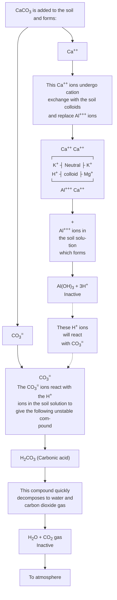

# MAIZE PRODUCTION MANUAL

VOLUME: I CHAPTERS 1-9

Manual Series No. 8


## VOLUME I CHAPTERS 1-9

## APRIL 1982

Published and printed at
International Institute of Tropical Agriculture
Oyo Road, PMB 5320
Ibadan, Nigeria

## Manual Series No. 8

- i -

# TABLE OF CONTENTS

Foreward ii
Chapter 1. History and Origin of Maize 1
Chapter 2. Importance of Maize in Africa 4
Chapter 3. Botany of Maize 13
Chapter 4. Physiology of Maize 20
Chapter 5. Maize Cultivation 36
(i) Climatic Requirements 36
(ii) Soils 44
Chapter 6. Soil Preparation and Planting 82
(i) Seed Preparation 82
(ii) Planting and Population Density 91
Chapter 7. Fertilizers and Manures 106
Chapter 8. (i) Weed Biology and Control in Maize 147
(ii) Maize Mechanization for the Small Farmer 158
Chapter 9. Maize Breeding Methods 192
Chapter 10. Seed Production, Testing and Handling 219
Chapter 11. Plant Diseases 254
Chapter 12. Insect Pests 312
Chapter 13. Nematodes as Pests of Economic Plants 334
Chapter 14. Integrated Pest Management in Maize Production 373
Chapter 15. Harvesting and Storage. 378

- ii -

# <u>Foreward</u>

This manual has been compiled to provide information and guidelines relating to all aspects of maize production in the humid and sub-humid tropics of Africa. It is designed to serve as a basic reference document for participants in IITA's maize training courses.

Our sincere thanks go to the following scientists who contributed chapters to the manual (by alphabetical order):

* Dr. I.O. Akobundu, Weed Scientist, IITA.
* Dr. V.L. Asnani, Maize Breeder, IITA/SAFGRAD, Upper Volta.
* Dr. P. Ay, Socio-economist, IITA.
* Dr. W.H. Boshoff, Head, Dept. of Agric. Engineering, Bunda College, Malawi.
* Dr. F.E. Caveness, Nematologist, IITA.
* Dr. J.M. Fajemisin, Maize Pathologist-Breeder, National Cereals Research Institute, Nigeria.
* Mr. C.F. Garman, Agricultural Engineer, IITA.
* Dr. A. Joshua, Director, National Seed Service, Nigeria.
* Dr. S.K. Kim, Maize Breeder, IITA.
* Dr. R. Lal, Soil Physicist, IITA.
* Dr. R. Markham, Storage Entomologist, Tropical Products Institute.
* Dr. S. Pandey, Extension Specialist, IITA/PRONAM, Zaire.
* Dr. A.P. Uriyo, Training Officer (Agronomist), IITA.

We also thank the following scientists who reviewed the materials that are included in the manual (by alphabetical order).

* Dr. M.S. Alam, Entomologist, IITA
* Dr. M.S. Bjarnason, Maize Breeder, CIMMYT Liaison at IITA.
* Dr. Y. Efron, Maize Breeder, IITA.
* Dr. F.N. Khadr, Maize Breeder, IITA/EEC.
* Dr. S.K. Kim, Maize Breeder, IITA.
* Dr. T. Lawson, Agroclimatologist, IITA.

- iii -

Special mention should be made of the efforts of Dr A.P. Uriyo, Training Officer (Agronomist) at IITA, who compiled this manual; of Mr J.P.C. Koroma, Assistant Agronomist, Integrated Agricultural Development Project, Ministry of Agriculture and Forestry, Northern Area-Makeni, Sierra Leone, who coordinated the editing and proofreading of the text, and to the secretarial and graphic art staff of the Institute for their contribution.

Mention in the text of trade names of certain products does not constitute approval by IITA to the exclusion of other products that may also be suitable.

It is our hope that this manual will be of assistance to the many research workers and extension supervisors who come to IITA for further training in maize production in tropical Africa.

Wade H. Reeves
Assistant Director
Head of Training.

# CHAPTER 1

## HISTORY AND ORIGIN OF MAIZE

Maize is thought to have originated at least 5000 years ago in the highlands of Mexico, Peru, Ecuador, and/or Bolivia because of the great density of native forms found in the region.

There have been four principal and several minor theories regarding the origin of maize: (1) the cultivated maize originated from pod corn, a form in which the individual kernels are enclosed in floral brackets as they are in other cereals and in the majority of grasses; (2) that maize originated from its closest relative, teosinte, by direct selection, by mutations, or by hybridization of teosinte with an unknown grass now extinct; (3) that maize teosinte, *Tripsacum* have descended along independent lines directly from a common ancestor; (4) the tripartite theory of Mangelsdorf and Reeves (1939, 1945) that (a) cultivated maize originated from pod corn (b) teosinte a derivative of a hybrid of maize and *Tripsacum*, (c) the majority of modern maize varieties are the product of admixture with teosinte or *Tripsacum* or both.

Other hypotheses called "minor" in the sense that they have had little effect upon the thinking and experimentation concerned with the origin of maize are: (1) that cultivated maize originated from papyrescent corn, a type superficially resembling a weak form of pod corn; (2) that maize is an allopolyploid hybrid originating in South-East Asia by the hybridization of two ten-chromosome species such as *Coix* and *Sorghum*. Despite these theories the origin of maize remains speculative and controversial as none of the theories is entirely satisfactory.

### 1.1 <u>Introduction of Maize in Africa:</u>

There is evidence that maize from Central and South America is introduced to Europe in 1492 by Columbus, and then spread to Africa (Van Faiinnton 1964).

- 2 -

Later in the 15th Century, the Caribbean Flint became the most predominant type of maize in Africa. It was introduced into East Africa by explorers from Portugal and the Persian Gulf, (Obilana and Asnani).

Maize became an important crop in Africa only after 1900 when different types were introduced by the Dutch in South Africa (Saunders, 1930). The most successful types, which eventually moved into East Africa, were Hickory King, White Horsetroth, Ladysmith White, Salisbury White, Champion White, Pearl and Iowa Silver Mine (Harrison, 1976).

Kenya Flat White was introduced by European settlers. Some admixture with the local Caribbean Flint must have taken place, which probably accounts for the proportion of yellow and purple kernels seen in small farmers' fields.

The local yellow maize in East Africa probably was derived from the early introductions of the Caribbean Flint and from later introductions of yellow dents from South Africa.

The last distinct type of maize to arrive in East Africa was the high altitude race Cuzco from Peru (Grobman *et al.*, 1961). It was brought by missionaries before the 1914-1918 war. Its soft flour kernel is the largest of any type of maize, and it is the only type of maize now grown at altitudes above 2500 metres.

Since its introduction into Africa, maize has been cultivated extensively in East and West Africa, and has spread to Senegal, Upper Volta and Niger Republic. In West Africa, two main types of maize can be identified, the Northern Flints and Southern Flours or Coastal Flours. The Northern Flint probably is related to the Caribbean Flint while the floury types probably are related to those of central and south America.

Because of its long-term cultivation in different parts of Africa, the crop has developed adaptations to many niches. Such diversity has formed land races called local varieties.

- 3 -

# REFERENCES

1. Grobman, A., W. Salhuana, R. Sevilla and P.C. Mangelsdorf (1961) Races of maize in Peru; their origins, evolution and classification. Nat. Acad. Sci. Washington Publ. No.915.

2. Harrison, E. (1976). Tour Notes. Mimeographed IITA.

3. Mangesdorf, P.C., and Reeves, R.G. (1939). The origin of Indian corn and relatives. Texas Agr. Expt. Sta. Bul. 574:: 1.315.

4. Mangelsdorf, P.C. and Reeves, R.G. (1945). The origin of maize; present status of the problem. Am. Anthropologist 47: 235-243.

5. Obilana, A.T. and V.L. Asnani (1980). Genetic resources of maize in Africa. In Proceedings of a workshop jointly organized by the Association for the Advancement of Agricultural Sciences in Africa and the International Institute of Tropical Agriculture, held at IITA 4-6 January, 1978.

6. Sanders, A.R. (1930). Maize in South Africa. South Africa Central News Agency Limited.

7. Van Eijinaten, C.L.M. (1965). Towards the improvement of maize in Nigeria. Wagenigen, H. Veeneman and Zonen, N.V.

- 4 -

# CHAPTER 2
# IMPORTANCE OF MAIZE IN AFRICA

## 2.1 <u>Production Trends.</u>

For the total world production, it is estimated that maize is grown on about 118 million hectares of which 19 million hectares are estimated to be cultivated in Africa. Exact figures on area cultivated for maize in Africa are not available because of lack of reliable statistical enumeration and also because maize is often cultivated in mixtures with other crops. A major part of the production is for own home consumption. The crop is often cultivated on small plots or even together with other backyard crops on the compound. On the other extreme there are some private and state owned farms of several hundred hectares where maize is grown as a single crop with highly mechanized technologies.

Published statistics of the area cultivated and planted with maize mostly ignore for example that maize is also grown as fodder or silage crop especially in countries where dairy production is developed. It should also be noted that there are preferences for the type of grain to be produced. For feed mills specific maize varieties are prefered which differ from varieties used for human consumption. In Nigeria, even small farmers have adopted yellow maize varieties which are grown as cash crop for animal feed market. The same farmer may grow his own local white varieties for home consumption or sale on the local market for human food. Even though the statistical estimates do not give specific data on the different uses and are not reliable on area and quantities produced, Table 2.1 gives the maize production trends in Africa for the period 1977 to 1979.

- 5 -

<u>Table 2.1: Maize Production in Africa (1000 mt)</u><sup>1/</sup>


<table>
  <thead>
    <tr>
        <th>Countries</th>
        <th><u>1977</u></th>
        <th><u>1978</u></th>
        <th><u>1979</u></th>
    </tr>
  </thead>
  <tbody>
    <tr>
        <td>Algeria</td>
        <td>2</td>
        <td>1</td>
        <td>6</td>
    </tr>
    <tr>
        <td>Angola</td>
        <td>350</td>
        <td>400</td>
        <td>300</td>
    </tr>
    <tr>
        <td>Benin</td>
        <td>242</td>
        <td>343</td>
        <td>230</td>
    </tr>
    <tr>
        <td>Botswana</td>
        <td>35</td>
        <td>52</td>
        <td>8</td>
    </tr>
    <tr>
        <td>Burundi</td>
        <td>140</td>
        <td>140</td>
        <td>140</td>
    </tr>
    <tr>
        <td>Cameroon</td>
        <td>477</td>
        <td>470</td>
        <td>480</td>
    </tr>
    <tr>
        <td>Cape Verde</td>
        <td>2</td>
        <td>9</td>
        <td>1</td>
    </tr>
    <tr>
        <td>Central African Republic</td>
        <td>33</td>
        <td>30</td>
        <td>40</td>
    </tr>
    <tr>
        <td>Chad</td>
        <td>10</td>
        <td>10</td>
        <td>15</td>
    </tr>
    <tr>
        <td>Comoros</td>
        <td>5</td>
        <td>5</td>
        <td>5</td>
    </tr>
    <tr>
        <td>Congo</td>
        <td>17</td>
        <td>10</td>
        <td>10</td>
    </tr>
    <tr>
        <td>Egypt</td>
        <td>2725</td>
        <td>3117</td>
        <td>2938</td>
    </tr>
    <tr>
        <td>Ethiopia</td>
        <td>929</td>
        <td>982</td>
        <td>1067</td>
    </tr>
    <tr>
        <td>Gabon</td>
        <td>9</td>
        <td>9</td>
        <td>8</td>
    </tr>
    <tr>
        <td>Gambia</td>
        <td>4</td>
        <td>9</td>
        <td>10</td>
    </tr>
    <tr>
        <td>Ghana</td>
        <td>309</td>
        <td>340</td>
        <td>380</td>
    </tr>
    <tr>
        <td>Guinea</td>
        <td>270</td>
        <td>320</td>
        <td>320</td>
    </tr>
    <tr>
        <td>Guines Bissau</td>
        <td>2</td>
        <td>3</td>
        <td>4</td>
    </tr>
    <tr>
        <td>Ivory Coast</td>
        <td>258</td>
        <td>264</td>
        <td>275</td>
    </tr>
    <tr>
        <td>Kenya</td>
        <td>2553</td>
        <td>2169</td>
        <td>1800</td>
    </tr>
    <tr>
        <td>Lesotho</td>
        <td>126</td>
        <td>143</td>
        <td>129</td>
    </tr>
    <tr>
        <td>Libya</td>
        <td>1</td>
        <td>1</td>
        <td>1</td>
    </tr>
    <tr>
        <td>Madagascar</td>
        <td>122</td>
        <td>115</td>
        <td>100</td>
    </tr>
    <tr>
        <td>Malawi</td>
        <td>1200</td>
        <td>1400</td>
        <td>1200</td>
    </tr>
    <tr>
        <td>Mali</td>
        <td>78</td>
        <td>80</td>
        <td>60</td>
    </tr>
    <tr>
        <td>Mauritania</td>
        <td>4</td>
        <td>5</td>
        <td>5</td>
    </tr>
    <tr>
        <td>Mauritius</td>
        <td>1</td>
        <td>1</td>
        <td>2</td>
    </tr>
    <tr>
        <td>Morocco</td>
        <td>184</td>
        <td>390</td>
        <td>312</td>
    </tr>
    <tr>
        <td>Mozambique</td>
        <td>350</td>
        <td>400</td>
        <td>350</td>
    </tr>
    <tr>
        <td>Namibia</td>
        <td>15</td>
        <td>15</td>
        <td>15</td>
    </tr>
    <tr>
        <td>Niger</td>
        <td>6</td>
        <td>9</td>
        <td>8</td>
    </tr>
    <tr>
        <td>Nigeria</td>
        <td>1350</td>
        <td>1480</td>
        <td>1500</td>
    </tr>
    <tr>
        <td>Reunion</td>
        <td>14</td>
        <td>15</td>
        <td>15</td>
    </tr>
    <tr>
        <td>Rwanda</td>
        <td>77</td>
        <td>70</td>
        <td>72</td>
    </tr>
    <tr>
        <td>Sao Tome</td>
        <td> </td>
        <td> </td>
        <td> </td>
    </tr>
    <tr>
        <td>Senegal</td>
        <td>33</td>
        <td>53</td>
        <td>50</td>
    </tr>
    <tr>
        <td>Sierra Leone</td>
        <td>14</td>
        <td>14</td>
        <td>14</td>
    </tr>
    <tr>
        <td>Somalia</td>
        <td>80</td>
        <td>100</td>
        <td>80</td>
    </tr>
    <tr>
        <td>South Africa</td>
        <td>9630</td>
        <td>9930</td>
        <td>8240</td>
    </tr>
    <tr>
        <td>Sudan</td>
        <td>43</td>
        <td>46</td>
        <td>50</td>
    </tr>
    <tr>
        <td>Swaziland</td>
        <td>85</td>
        <td>90</td>
        <td>55</td>
    </tr>
    <tr>
        <td>Tanzania</td>
        <td>968</td>
        <td>1041</td>
        <td>900</td>
    </tr>
    <tr>
        <td>Togo</td>
        <td>95</td>
        <td>173</td>
        <td>155</td>
    </tr>
    <tr>
        <td>Uganda</td>
        <td>515</td>
        <td>660</td>
        <td>500</td>
    </tr>
    <tr>
        <td>Upper Volta</td>
        <td>54</td>
        <td>137</td>
        <td>80</td>
    </tr>
    <tr>
        <td>Zaire</td>
        <td>510</td>
        <td>500</td>
        <td>350</td>
    </tr>
    <tr>
        <td>Zambia</td>
        <td>980</td>
        <td>800</td>
        <td>600</td>
    </tr>
    <tr>
        <td>Zimbabwe</td>
        <td>1300</td>
        <td>1400</td>
        <td>1000</td>
    </tr>
  </tbody>
</table>

1/ FAO (1980). FAO Production Yearbook for 1979. Volume 33 FAO Rome.

- 6 -

## 2.2 <u>Trade</u>.

Millions of individual and group maize producers exist in Africa with a wide range of different production and marketing systems. Therefore data on trade are hardly available and the few existing statistics have to be handled even with more care than the hectare estimates. From many small surveys it can however be said that a much larger part than generally assumed is marketed. Several reasons can be given: the food prepared from maize grains needs skilled treatment and therefore a specialization has taken place where larger quantities of food are prepared for sale. In the rain forest storage problems caused by the humidity exist and with increasing road networks maize from savanna areas is imported. This regional interchange allows room to overcome seasonal shortages as the time of maturity differs. Maize for feed mills is grown as cash crop and often sold in bulk directly to the feed producers.

Of major importance are traders on village level. They buy small quantities, even in the range of few kilogrammes until they have enough to sell (often together with their own smaller production) to a larger market.

These larger markets often have a long tradition. The traders are part of a socio economic system which is highly efficient as several studies on local and regional markets in Africa have shown. Traders and customers tend to get into longer lasting relationship in which forms of credit usually are the link. In Western Nigeria for example, it is common that food selling women pay the maize they get from their supplier after they have sold the food prepared from the maize.

The price they have to pay for the maize may be higher than the actual market price but the supplier usually guarantees that she can get another bag when she needs it. This means security for her own trade with food and also allows the supplier to calculate and arrange for long term deliveries.

- 7 -

Especially in the rain forest areas where humidity limits storage, this system is well adapted to the complex demand and supply conditions.

Besides maize buyers from their own villages, farmers sell also to traders from outside travelling during the harvest season through a potential supply area to find farmers willing to sell. Prices differ according to the specific conditions of the farmer. Needs for cash and lack of own transport possibilities may result in poor returns not reflected in statistical data. The need for cash by the farmers especially at peak periods when hired labour has to be employed has formed another system where the farmers sell their maize crop long before it is ripe. The harvesting and transport, sometimes even the weeding is done by the buyer, usually by specialized women.

Given this complex system - a large number of other examples could be added - it can easily be understood that outside interventions often have not produced the expected results, be it the introduction of other varieties or the import of maize because of lack of local production (for example the draught periods in several African countries in the last decade). It should also be added that within neighbouring countries there are often import - export trade taking place through black market channels and the quantities involved are not counted in official statistics. Continent wide only South Africa is a net exporter of maize to the neighbouring countries and there is great need for the countries neighbouring South Africa to increase their own production and become self sufficient.

## 2.3. <u>Consumption and Industrial Uses</u>.

Maize is used for three main purposes:

i) As a staple human food

ii) As feed for livestock and

iii) As raw material for many industrial products.

- 8 -

## <u>2.3.1. Food for man.</u>

Maize is widely used as food in the African countries where it is grown. The fresh grains are eaten roasted or boiled on the cob. The grains can be dried and cooked in combination with some edible leguminous crops like cowpeas or beans. The grains can also be milled and boiled as porridge with or without fermentation. It can be baked into a form of bread ("the famous unleavened bread"). The dough itself can be cooked or fried in oil. Locally the dry grains can be popped. Each country has its special maize dish, whether it be, as in Nigeria "Ogi" or "Akamu, and "tuwo"; in East Africa, "Ugali" and "Chenga"; in Zaire and Zambia, "nshima and fufu".

## <u>2.3.2. Beverages and alcholic drinks.</u>

There are various beverages and alcoholic drinks obtained from maize locally and industrially. Maize grains are steeped in water for 2-3 days and then left to germinate. On germination, the seeds are exposed to sunlight which stops the germination. The grains are then pounded. The mash is then cooked for some hours. The liquid portion is drained off and cooled rapidly. It could be drank as a mild beverage at this stage.

Furthermore it could be left to ferment naturally from moulds present in the air. After the surface has been covered by mould, the liquid is transfered to another pot and seated for some three days to obtain "beer". This "beer" may be further distilled in rudimentary stills to give alcohol. There are several modifications to this general method. Some add malt after the sprouting stage. Other flavourings may be added too according to the taste of the locality.

## <u>2.3.3. Livestock Feeds.</u>

Generally the bulk of the concentrates fed to farm animals consists of

grains, and maize is the most important one in the tropics. The dry grains are milled and other ingredients added to make the mash which vary in composition

- 9 -

for the different classes of livestock. Maize forms 40-75 percent of the ration of these animals. Thus this forms a good channel of converting maize grain into meat, eggs and dairy products. Maize supplies mainly the carbohydrates used for the release of energy for the various essential activities of farm animals. It also supplies protein of some lower quality.

### 2.3.4. <u>Industrial Uses</u>.

The industrial uses of maize may be divided into: Mixed feed manufacture, dry milling, wet milling, distillation and fermentation. The principal food outlets of the dry milling industry are maize meal, maize flour, grits and breakfast cereals. Grits consist of the coarsely ground endosperm of the kernel from which most of the bran and germ have been separated. Maize flakes are made by rolling grits after they have been flavoured.

The wet millers manufacture starch, feed, syrup, sugar, oil and dextrines. The distillation and fermentation industries manufacture ethyl alcohol, butyl alcohol, propyl alcohol, acetaldehyde, acetic acid, acetone, lactic acid, citric acid, glycerol, whisky etc.

### 2.4. <u>The Nutritive value of Maize</u>.

The waterfree portion of the kernel contains about 77 percent starch, 2 percent sugar, 9 percent protein, 5 percent fat, 5 percent pentosan, and 2 percent ash. There is great variation among different strains of maize in the content of protein and fat. The proportion of protein may be as high as 15 percent and as low as 6 percent. In the maize kernel about 80 percent of the protein is in the endosperm. The germ, though constituting only about 10 percent of the grain, contains about 20 percent of the total protein. The most important distinguishing factor in protein is the amino-acid make-up - which determines the quality of the protein. The range in normal maize is 8-12%.

- 10 -

The quality of protein however is poor due to low contents of 2 essential amino-acids needed for growth by young animals namely: lysine and tryptophan in normal maize. Unlike other vegetable seed proteins however, it is fair in cystine and methionine - 2 limiting sulphur amino-acids. Recent works by maize breeders have however resulted in the production of the "high-lysine" or "opaque-2" maize which has about twice the quantity of each of the 2 amino-acids in normal maize. Table 2.2. show the amino acid composition in normal and opaque-2 maize.

Table 2.2: <u>Amino-Acid Composition of Maize (g/100g. Protein):</u>


<table>
  <thead>
    <tr>
        <th> </th>
        <th><u>Normal Maize:</u></th>
        <th><u>Opaque-2 Maize:</u></th>
    </tr>
  </thead>
  <tbody>
    <tr>
        <td>Arginine</td>
        <td>4.8</td>
        <td>6.0</td>
    </tr>
    <tr>
        <td>Cystine</td>
        <td>1.6</td>
        <td>2.0</td>
    </tr>
    <tr>
        <td>Histidine</td>
        <td>2.5</td>
        <td>3.6</td>
    </tr>
    <tr>
        <td>Iso-leucine</td>
        <td>5.0</td>
        <td>5.0</td>
    </tr>
    <tr>
        <td>Leucine</td>
        <td>16.1</td>
        <td>11.6</td>
    </tr>
    <tr>
        <td>Lysine</td>
        <td>2.2</td>
        <td>4.5</td>
    </tr>
    <tr>
        <td>Methionine</td>
        <td>2.8</td>
        <td>2.8</td>
    </tr>
    <tr>
        <td>Phenylalinine</td>
        <td>5.4</td>
        <td>4.6</td>
    </tr>
    <tr>
        <td>Threonine</td>
        <td>3.5</td>
        <td>4.5</td>
    </tr>
    <tr>
        <td>Tyrosine</td>
        <td>4.4</td>
        <td>3.7</td>
    </tr>
    <tr>
        <td>Tryptaphan</td>
        <td>0.6</td>
        <td>1.0</td>
    </tr>
    <tr>
        <td>Valine</td>
        <td>5.4</td>
        <td>6.2</td>
    </tr>
  </tbody>
</table>

Maize is among the richest in oil among cereals. It is only excelled by oats (7.4%) and millet (5%). The oil content range is 3-4% with 35% of this contained in the germ layer whilst the rest is in the endosperm. The oil is the semi-dry type and highly unsaturated - as the built is made up of linoleic and oleic acids as shown in Table 2.3.

Table 2.3: <u>Component Fatty Acid of Maize (%)</u>


<table>
  <tbody>
    <tr>
        <td>Linoleic Acid</td>
        <td>53</td>
    </tr>
    <tr>
        <td>Oleic "</td>
        <td>36</td>
    </tr>
    <tr>
        <td>Palmitic "</td>
        <td>7.4</td>
    </tr>
    <tr>
        <td>Stearic "</td>
        <td>3.0</td>
    </tr>
    <tr>
        <td>Arachidic "</td>
        <td>0.4</td>
    </tr>
    <tr>
        <td>Lignoceric Acid</td>
        <td>0.2</td>
    </tr>
    <tr>
        <td>Iodine Value Acid</td>
        <td>100 - 140</td>
    </tr>
  </tbody>
</table>

- 11 -

More than 70 percent of the maize kernel is carbohydrates, which is present as starch, sugar and fibre (cellulose). The starch is mainly in the endosperm, the sugar in the germ, and the fibre in the bran. The fibrous framework of the kernel is composed of cellulose.

The vitamins in maize are located chiefly in the germ and in the outermost layer of the endosperm, which includes the aleurone layer situated immediately beneath the pericarp (Table 2.4). The remainder of the endosperm is poorer in vitamins than other portions of the grain. One of the best known facts about vitamins in maize is that yellow maize shows vitamin A activity, whereas white maize does not. This vitamin A potency of maize results primarily from the presence of one of the colouring substances, cryptoxanthin. Maize is fairly rich in thiamine, most of which is found in the germ. Somewhat more riboflavin is present in maize than in wheat or rice.

<u>Table 2.4: Vitamin Content of Maize</u>


<table>
  <tbody>
    <tr>
        <td>Vitamin A (i.u.)</td>
        <td>510.00</td>
    </tr>
    <tr>
        <td>Thiamine (mg/100 mg)</td>
        <td>0.38</td>
    </tr>
    <tr>
        <td>Riboflavin "</td>
        <td>0.11</td>
    </tr>
    <tr>
        <td>Niacin "</td>
        <td>2.00</td>
    </tr>
    <tr>
        <td>Pantothenic Acid (ppm)</td>
        <td>8.00</td>
    </tr>
    <tr>
        <td>Carotene (mg/100gm)</td>
        <td>0.54</td>
    </tr>
  </tbody>
</table>

About 75 percent of the total minerals are found in the germ and the rest in the outer endosperm; the amount present in the inner endosperm is very small. Maize is very poor in calcium but, like other cereals, rich in phosphorus and potassium (Table 2.5). The quantities of magnesium, sodium and chlorine are very small. Maize contains important quantities of iron in the whole grain .

- 12 -

<u>Table 2.5: Mineral Composition of Maize (mg/100g)</u>


<table>
  <tbody>
    <tr>
        <td>Calcium</td>
        <td>6.00</td>
    </tr>
    <tr>
        <td>Phosphorus</td>
        <td>300.00</td>
    </tr>
    <tr>
        <td>Magnesium</td>
        <td>160.00</td>
    </tr>
    <tr>
        <td>Sodium</td>
        <td>50.00</td>
    </tr>
    <tr>
        <td>Potassium</td>
        <td>400.00</td>
    </tr>
    <tr>
        <td>Chlorine</td>
        <td>70.00</td>
    </tr>
    <tr>
        <td>Sulphur</td>
        <td>140.00</td>
    </tr>
    <tr>
        <td>Iron</td>
        <td>2.50</td>
    </tr>
    <tr>
        <td>Manganese</td>
        <td>6.83</td>
    </tr>
    <tr>
        <td>Copper</td>
        <td>4.50</td>
    </tr>
  </tbody>
</table>

- 13 -

# CHAPTER 3

## THE BOTANY OF MAIZE

Maize is a grass and belongs to the large and important family, *Gramineae*.

### 3.1. <u>Root System</u>:

As with all gramineae, the root system contains no tap-root, and its feathery strands spread out in all directions, mainly in the top soil. In most varieties the form of the root system is characteristic. The four seminal roots may perhaps persist throughout the life of the plant, but the main adventitious fibrous system, developed from the lower nodes of the stem below ground level, spreads out in a lateral direction in the upper layers of the soil, after which the roots turn vertically downwards and tap the lower levels of the soil.

The extent to which the roots penetrate to the deeper layers depends largely upon the supply of nutrients and on the drainage of the top soil and subsoil. In soil which is rich in nutrients, the roots are comparatively strong and branch out in all directions. In dry soil they grow longer and in damp soil weaker. Individual roots may penetrate to a depth of 2.5 metres.

### 3.2 <u>Stem and Leaves</u>:

The stem is normally 2 to 3 metres high. Individual quick-ripening varieties mature at a height of only 90cm and certain varieties of popcorn (*Zea mays everta*) reach a height of only 30 to 50cm. In subtropical and tropical regions, on the other hand, plants can reach a height of 6 to 7 metres. As a rule, the stem grows to a thickness of 3 to 4cm and normally possess 14 (8 to 21) internodes. These stem internodes, which are short and fairly thick at the base of the plant become longer and thicker higher up the stem and then taper again to the male inflorescence which terminates the axis (Figure 1).

The number of leaves varies between 8 and 48 and averages 12 to 18. Quick ripening varieties have few leaves whereas late ripening varieties have many leaves. The leaf length varies between 30 and 150cm, and the leaf

14.


Figure 3.1: Maize (*Zea mays*). A = Male inflorescence or "tassel"

B = Female inflorescence, the cob or "ear", C = The stem is solid and the lower nodes produce prop roots, D = A pair of staminate spikelets, E = A maize cob partially dissected to show

- 15 -

width can be up to 15cm. Some varieties have a strong tendency to grow side-shoots. This tendency depends to a large extent on the variety, climatic conditions and soil type. Dent maize and small seeded flint maize are normally single stemmed, whilst in large seeded flint maize one finds all types from single stemmed and single cobbed to bushy forms.

## 3.3 <u>Flowering and Pollination:</u>

Like all other cereals, the maize plant bears its flowers in spikelets the characteristic units of the inflorescences of all grasses. The spikelets are of two types, male and female, the male being collected into a male inflorescence or "tassel" which is carried terminally on the main axis (Figure 1). The male spikelets can most easily be recognized before flowering just as the tassel emerges from the leaves at the top of the plant. The female spikelets are seldom seen as such because they are covered by the husks of the young ear. They can be located by the fact that each of them ordinarily produces one grain. The male inflorescence is a fairly compact, much-branched panicle varying in size with variety; it may have stiff branches producing an erect inflorescence or the axis and branches may be more flexuous, producing a drooping panicle.

The female inflorescence is known as the "cob" or "ear" (Figure 2). It consists of a modified lateral branch deriving from an axillary bud of the main stem. The internodes of this lateral branch have become so short that the overlapping sheaths of its leaves cover the terminal inflorescence, forming the well-known husk of the ear. These leaves show various degrees of modification in structure. Their blades may be well developed, variously reduced, or entirely lacking. The potential branches in the axils of the husks may, in different varieties and under different conditions, range all the way from meristematic rudiments to fully developed ear-bearing branches.

16.


Figure 3.2: Diagram of longitudinal section of ear branch attached to main stem showing structure of female inflorescence of *Zea mays*.

- 17 -

The ovary itself is surmounted by a long style, the silk, which grows rapidly and emerges from the top of the husk. The silk is bifurcated at the tip, but is stigmatic and receptive along most of its length. Pollination is by means of wind and gravity. Any movement of the plant helps to shake out the pollen and it is usually all discharged within a few hours at most. Pollen is produced in prodigious quantities from the opening flowers of the tassel. Counts and computations made on a commercial dent maize indicate that an individual plant produces probably 50,000 pollen grains for each one that becomes effective in producing a grain on maize. In some tropical varieties the ratio is probably much higher. The silks are receptive as soon as they emerge, and remain receptive for some time. When pollen grains fall on the moist surface of the style or the stigma hairs they adhere there and the moisture promotes germination. The pollen tube may penetrate the body of the style directly, but it usually enters by way of one of the stigmatic hairs. Once inside the tissues of the style it follows one of the strands of vascular tissue toward the ovary. After fertilization has been accomplished the styles wither away and the grains develop as broad, obovate wedge-sheped caryopsides. The grains are born in an even mumber of rows along the length of the cob, having been derived from the single fertile flower of each of a pair of spikelets. Individual ears of maize may have from 4, in even numbers, to 30 or more rows of grains. The mumber of rows on an ear is determined partly by heredity, but, especially in varieties with high numbers, the number may be affected by environment.

## 3.4 <u>Grain:</u>

The seeds (grains) are surrounded on the cob by the chaffy remains of the glumes and the lemmas and paleas of the two flowers, and are supported on very short, spongy pedicels. The length of the cob varies between 8 and 42 centimetres; in extreme cases between 2.5 and 50 centimetres. The diameter can be up to 7.5 centimetres in large cobs, but normally it lies between 3 and 5 centimetres.

- 18 -

Usually a maize cob contains between 300 and 1000 seeds. The seeds are rounded or dented, according to variety. The colour also varies greatly with variety, ranging from white through yellow, red and purple to almost black. Furthermore great fluctuations occur in the size of the seeds as well as in their chemical and physical properties, according to the variety.

The anatomy of the maize seed is not particularly different from that of other cereal crops (Figure 3.3). The wall of the grain (caryppsis) is a thin covering of several layers of cells, enclosing the seed which is firmly united with these layers. The nucellus consists of a single layer of cells bounding the endosperm, which makes up the main bulk of the seed. The outer layer of the endosperm is the aleuron layer, a layer of cells in which most of the stored protein of the seed is laid down, but the bulk of the endosperm consists of large cells packed with starch grains. The endosperm of the maize seed is of two types, hard flinty endosperm, opalescent in appearance and containing a higher proportion of protein than the other starchy type which is more floury and white in appearance and of much softer texture. The proportion and disposition of these two kinds of endosperm in the seed varies with the variety.

19.


Figure 3.3: Diagramatic section of the grain (Caryopsis) of *Zea mays*
per = pericarp, al = aleuron layer, end = endosperm
Sc = scutellum, col = coleoptile, pl = plumule, rad = radicle

The embryo occupies a small volume of the seed, lying at the base of the lower surface and in close contact with the endosperm. The scutellum encloses or enfolds to varying degrees the root apex protected by its sheath, the coleorhiza, and the stem apex which is also enclosed by a sheath, the coleoptile. The embryo itself is rich in fats, minerals and proteins and contains considerable quantities of sugars.

- 20 -

# CHAPTER 4

## PHYSIOLOGY OF MAIZE

### 4.1: <u>Growth and Development of the Maize Plant</u>:

The timing given in this section pertains to a variety or hybrid maturing in about 115 days from planting.

When the maize seed is planted, it usually is placed in soil moist and warm enough to allow germination to begin promptly. If the seed is in contact with moisture, water is absorbed through the seed coat and the kernel begins to swell. Chemical changes activate growth in the embryo axis and if conditions continue to be favourable, the radicle elongates and emerges from the seed coat within 2 or 3 days (Figure 4.1). Shortly thereafter, the plumule also begins to elongate and additional leaves begin to form inside this part of the developing seedling (called *Coleoptile* after it breaks out of the seed).

The first seedling root is soon followed by several other seminal or seed roots (Figure 4.2) which serve to anchor the developing seedling and play a role in water and nutrient uptake. However, these do not build a permanent root system - the main root system originates later from the crown of the developing plant <u>above</u> the first root system.

Between the point of attachment to the seed and the crown is a tubular, white, stemlike part, the *mesocotyl* (first internode). Elongation of this structure is very important to the emergence of the seedling with the average planting depth of 5 to 8cm, the mesocotyl will ordinarily elongate about half the distance to the surface. Lengthening of the coleoptile brings the leafy parts the rest of the way above the ground. The time taken between planting and emergence depends mainly on the temperature conditions and may vary from the normal four-five days to 15 days under cool conditions.

21.


Figure 4.1: The kernel has swelled and the radicle (root) has just broken through the seed coat. The plumule (shoot that will become the stalk) has not yet emerged but its presence is indicated by the ridge under the seedcoat.


Figure 4.2: The plumule (shoot) breaks through the seed coat one or two days after the radicle (figure 4.1). It is enclosed in the coleoptile which protects the leaves as the shoot pushes upward through the soil. The coleoptile in this seedling has ruptured and two leaves have begun to unfold. Two seminal roots have been added to the first root (radicle) and the total number may increase to 6 or 7 before this early root system has fulfilled its purpose and is supplanted by the main root system

- 22 -

The coleoptile is quite stiff and can push through normal soil but it may have difficulty if the surface is dry and has a hard crust, or if seed is sown too deep. As soon as the coleoptile reaches the light, it splits at the tip and two true leaves unfold in rapid succession. The next few leaves come out of the whorl and unfold at the rate of about one leaf every 3 days under good growing conditions. Seven days after emergence, the new seedling should be well established, with two leaves fully expanded and with its primary root system developed to the extent that it no longer depends on the nearly exhausted food supply in the kernel. Once the seedcoat is broken, the food-rich tissues of the kernel are open to attack by disease organisms unless the seed has been protected by treatment. Fertilizers applied in a band five to six centimetres from the seed are effectively taken up at this stage.

## <u>4.1.1 Vegetative Development.</u>

Once the seedling is established the maize plant begins to create the root system and leaf structure which will be used later to support ear and grain formation. Under normal conditions, all the leaves which a maize plant will have are formed during the first 28 to 35 days of the plant's development.

The new leaves are produced by a single growing point, at the tip of the stem. This region actually is underground or near the ground level for much of the first 3 to 4 weeks after planting. Starting with about 5 embryonic leaves in the seed, a normal corn plant developes 20 to 23 foliage leaves. The first 5 to 7 leaves never get very large. They break off and are likely to be overlooked as the base of the maize stalk enlarges.

The root system developes rapidly during this stage of growth. The seminal roots quickly lose their importance and the young plant is supported and nurished by the permanent root system which begins to develop from the crown. Depth of planting has only a slight influence on the depth at which the main

- 23 -

root system originates. The main root system continues to grow downward and to branch, and additional roots are produced in successive whorls from stem nodes above crown. By the time the maize plant has 8 leaves fully emerged or is about knee-high, the roots have reached the middle of the maize rows and penetrated to a depth of about 45cm. There are still few roots in the surface soil layer. But as the plants becomes larger, the entire plough layer becomes filled with a mass of roots which feed on the fertility that is concentrated there. To avoid root pruning, inter-row cultivation should have been completed before this occurs.

Later, usually after tasselling, whorls of brace roots thrust out from the lower joints and enter the soil. These brace roots can effectively absorb phosphorus and perhaps other nutrients.

### 4.1.2 <u>Tassel and Ear Initiation</u>

Tassel initiation starts between 25 and 35 days from planting when the plants are about knee-high and the eighth leaf is fully emerged. The growing point is then either at the soil surface or about five centimetres above the soil surface. Any excess soil moisture or flooding before this stage can kill the plants or reduce grain yields markedly.

Soon after tassel initiation, a period of rapid elongation starts and the plants accumulate dry matter and plant nutrients very rapidly, placing heavy demands on the root system to supply water and nutrients. The roots also grow rapidly and soon the entire surface soil is filled with root system. Ear development begins within a week of tassel initiation. The number of rows that would develop on the ear is reduced if nitrogen becomes limiting at this stage of growth. The potential number of ovules on the ear is also determined by six weeks after emergence. Pollen shedding takes place five to six weeks after tassel initiation. The leaves and tassels are then fully out and internode

- 24 -

elongation ceases. Just prior to pollen shedding, the requirements of water and nutrients (especially nitrogen) are very high and defficiency at this stage is likely to cause permanent damage to ear development and yield (Figure 4.3).

The tassel produces a large number of pollen grains which are shed over a period of five to eight days. The pollen shed begins from the middle of the central spike and spreads over the entire tassel. The time of pollen shedding is usually early morning or mid-morning after the dew has evaporated.

All silks emerge and are ready for pollination within three to five days and thus tassel stops shedding pollen. However, cross pollination is the rule and usually occurs to the extent of over 95 percent.

After pollination and ovule fertilization, the silks turn brown and within the next two weeks the kernels grow very rapidly. Within three weeks of pollination the kernels are milky and high in sugar. Subsequently the sugars disappear completely and dextrine followed by starch is deposited in the kernels. The embryo starts developing and the leaf initials are laid down. Seminal roots are also initiated and soon the embryo is mature and dry matter accumulation ceases. The stage when the kernels reach dry weight is called physiological maturity. The moisture content in the grain at this stage is usually about 35 percent. The plants could be harvested at this stage without any loss in the grain yield. If drying facilities are not available harvesting is delayed until the moisture content in the grain is reduced to 15 - 20 percent. The rate of drying on the plant depends upon the weather conditions.

## 4.2. Temperature Relationships.

Maize crop requires warmth all throughout its active life period and it is sensitive to frost at all stages. Its response to temperature varies with the stage of the crop. During germination, the optimum temperatures appears to

25


Figure 4.3: Growth of the maize plant.

- 26 -

be around 18°C; at temperatures below 13°C germination is slow. Cool wet weather encourages a large number of pathogens causing seedling diseases and kernel rots. The rate of development from planting to anthesis is a function of temperature, and while photosynthetic activity is influenced essentially by day temperature, growth rate is also determined by night temperature. Thus plants experiencing similar day temperatures but lower night temperatures have slower development and, therefore, more photosynthate is available for growth during any given developmental stage. In the highlands, falling temperatures after the onset of rains can limit yield. Lowland varieties are usually harvested within four months of planting, whereas in the highlands of Kenya, for example, the crop may take 8 or more months to reach maturity. It is therefore not unexpected that high altitude crops produce greater growth and yield than those in the warm night environment of the lowlands.

Grain yield is determined by the number of kernels pollinated and the supply of assimilate, either directly from crop photosynthesis or by mobilization during grain filling of previously stored stem reserves, or both. The physiological events determining potential ear and kernel numbers at anthesis are not fully understood.

Canopy characteristics are important in terms of achieving good penetration and distribution of light so that the efficient C<sub>4</sub> photosynthetic pathway may operate. A plant type having an erect upper leaf canopy without excessive mutual shading and a lower spreading canopy for maximum interception can be considered desirable, particularly in terms of agronomic plant spacing. Short plants with small tassels, are also advantageous for proper light interception. Other desirable agronomic features to be selected for are lodging resistance, ear placement, ability to respond to improved soil fertility and fertilizers, heat and drought tolerance, and ability to produce an ear at high plant densities. All of these characters need to be linked to satisfactory

- 27 -

yield and maturity suitable to the environment. Because much maize in the lowland tropics is grown in mixed stand with other species, suitability to such conditions is also required.

## <u>4.3: Rainfall and relative humidity:</u>

The amount, distribution and efficiency of rainfall are highly important factors in successful maize production. Pre-planting precipitation or initial soil moisture contributes a great deal towards meeting the crop requirements of several maize growing areas of tropical Africa. This is especially true in places where the rainfall during the growing season is less than the crop requirement and where the soil is capable of storing a large amount of rain water. The moisture requirement of the crop is small during the early stages of development but increases rapidly up to the flowering stage, before decreasing again as the crop matures. The maize crop is especially sensitive to moisture stress during flowering when a short spell of stress can reduce the crop yield by 30 - 50 percent. Requirement of water depends upon several factors but, in general, 480-800mm of rainfall, well distributed to meet the needs of the crop during the season, is adequate.

Hail storms can cause severe yield losses especially when leaves are torn off near tasseling stage. Winds with high speed can also damage the crop seriously if they cause stem breakage, lodging or leaf shredding. If the hail storm or wind storm occurs when the plants are young the crop usually recovers.

In drier regions increased intensity of radiation increases water losses and thus yields tend to be negatively correlated with radiation. However, in the regions of adequate soil moisture, decreased light intensity due to heavy cloud cover tends to limit the crop yield by reducing the rates of photosynthesis. With adequate soil moisture, plant nutrients and proper management, the light

- 28 -

intensity in the crop canopy seems to be the most important factor limiting plant populations and crop yields.

## 4.4 <u>Factors affecting growth and development of the Maize Plant:</u>

The factors limiting growth development of the maize plant are: temperature, rainfall, daylight, solar radiation, humidity and soil fertility and these interact with each other to varying extents.

(i) **Temperature** is of importance. In the lowland tropics, high soil temperatures damage the crop or depress the yield, especially when occuring during early growth. In the highlands, such as in Kenya low temperature though rarely killing, tend to retard growth.

Insulation, which determines the amount of radiation, is more favourable in the drier zones and, if other factors are equal, yield tends to be higher than in the more humid areas where cloud cover is usually heavy during the growing season.

Dry matter accumulation and growth depends on the relationship between photosynthesis which is a mainly light-controlled reaction and hence it should proceed at very similar rates at high and low elevations. On the other hand, maize does not have a photo-respiratory system, and the respiration rate is controlled by the temperature. Thus the amount of dry matter lost due to respiration in 24 hours depends largely on the mean daily temperature which depends on latitude and altitude.

(ii) **Rainfall** determines mostly the moisture conditions in the soil, unless water from an external source is available (e.g. irrigation) water requirements of maize are moderately high 400-600mm during the growing season and this total amount is met within most maize growing areas. The distribution, however, is most important and crop failures occur in areas with frequent dry spells during the growing season (e.g. Togo).

- 29 -

Availability of water to the plant is mainly related to climate, but also to water holding capacity of the soils.

For example, the deep, clayey red soils derived from basalt as in the Camerouns have more water available than the more sandy, shallow soils on basement complex as in Nigeria. Thus with the same rainfall, maize on the Cameroun soils suffer less from drought stress than maize in Nigeria. When too wet, maize suffer strongly, especially if wet conditions occur in the early growing season. Non-draining hydromorphic soils are hence not suitable for maize, unless it is grown when groundwater is still below about 50cm depth e.g. in the early part of the rainy season.

(iii) **Humidity and dew**: Humidity is important in two respects as far as maize growing is concerned. Firstly, the relative humidity determines to a certain extent the amount of water which is transpired by the leaves and therefore affects dry matter accumulation. Secondly, the "dew point" or temperature at which dew forms if the air is cooled is important because the presence of dew facilitates the germination and establishment of fungal spores on the leaves.

(iv) **Availability of nutrients**: Where maize is grown without fertilizers, the nutrients status of the soil is of extreme importance. In soils poor in nutrient, plant growth is deficient and yields are low. Continuous cultivation is hardly possible, and fallow is required to restore fertility. In the best soils, e.g. some soils in alluvial valleys and some soils on basic parent materials, more intensive maize cultivation can take place. Application of fertilizers can offset the low fertility, but even so it is usually found that the richer soils respond much better to fertilizers than the poorer ones.

- 30 -

(v) **Soil reaction:** Low pH is unfavourable for maize growth. especially because in many soils it goes together with high soluble aluminium content, which is toxic and yield depressing. These soils in high rainfall areas which are usually acid (pH of less than 5) are less suitable for maize. Frequently, maize can only be grown in the first year after clearing and burning, when the ash temporarily increases the surface soil pH. Continuous cultivation of such acid soils would require liming.

(vi) **Physical soil conditions:** Maize is not a strong rooting plant and roots tend to be easily hampered by less permeable layers. In many West African soils, such disturbance can be found, e.g. in the form of gravelly layers, iron pans or simply as densely packed sub-surface layers, as in the sandy soils in Senegal, Deficient root development in such soils leads to early drought stress if rains fail periodically, because the roots can not reach the moist deeper layers. Also, in such soils, the total volume from which roots can obtain their nutrients is less.

(vii) **Susceptibility to erosion:** Erosion is determined by the erosivity of the climate, which is high in most of the tropical regions soils, and by erodibility of the soils which also is high for many tropical soils. Most soils with impeded permeability either due to disturbing horizons or to instability of the surface structure, or both, erode readily when used for intensive agriculture. Such erosion, in a relatively short time, leads to unproductivity of the soils. There is considerable difference in erodibility among soils,. Thus, most soils on basement complex are highly erodable; while soils on rudementary formations are less erodible. Soils over basalt or other basic rock can be cultivated even on steep slopes without too much danger.

- 31 -

# <u>4.5 Soil temperature and Water requirement:</u>

## <u>4.5.1 Soil Temperature:</u>

Soil temperature is seldom considered a serious limiting factor in the tropics for maize production. There are two instances, however, in which soil temperatures can be limiting: excessively high temperatures in certain sandy soils, and cool temperatures in the tropical highlands.

Large areas of West Africa are covered with Alfisols having a high sand content and gravel in the topsoil. The thermal diffusivity of these horizons is much lower than that of loamy or clayey topsoils. Consequently they can retain large quantities of heat, particularly when dry. Studies at IITA have shown that soil temperatures can reach 42<sup>o</sup>C at 5cm depth and 38<sup>o</sup>C at 10cm depth in such soils when bare or recently planted (IITA, 1972; Lal, 1974; Lal et al 1975). Planting on the top of ridges or mounds increases soil temperature in the vicinity of the plants and can also cause reduction in yield of maize (Lal, 1973). Work at IITA showed that maize growth and leaf elongation were suppressed by high soil temperatures. Maximum soil temperatures of 41<sup>o</sup>C reduced leaf elongation rate by 22% and the reduction was 44% with maximum soil temperatures of 43<sup>o</sup>C (IITA, 1975).

The rate of root tip elongation was significantly affected by short-term exposure to high soil temperature (Table 4.1). Root tip elongation for most of the crops was negligible at 41<sup>o</sup>C soil temperature.

- 32 -

Table 4.1: Root tip elongation (mm/hr) as affected by high soil temperature
(After IITA, 1975 Annual Report)


<table>
  <thead>
    <tr>
        <th>Temperature °C</th>
        <th>Maize</th>
        <th>Soybean</th>
        <th>Cowpea</th>
    </tr>
  </thead>
  <tbody>
    <tr>
        <td>26</td>
        <td>1.5</td>
        <td>1.5</td>
        <td>1.40</td>
    </tr>
    <tr>
        <td>28</td>
        <td>1.2</td>
        <td>0.5</td>
        <td>0.15</td>
    </tr>
    <tr>
        <td>34</td>
        <td>0.75</td>
        <td>0.5</td>
        <td>0.25</td>
    </tr>
    <tr>
        <td>39</td>
        <td>0.50</td>
        <td>0.0</td>
        <td>0.00</td>
    </tr>
    <tr>
        <td>41</td>
        <td>0.25</td>
        <td>0.0</td>
        <td>0.00</td>
    </tr>
  </tbody>
</table>

It was further observed that nutrient uptake, nutrient translocation, and water uptake were severely affected by such high soil temperatures. Top soil temperatures decrease as crops grow and a canopy is established. The solution to this problem consists of mulching with straw or stover from a previous crop.

As a practical technique for use on a large scale, mulching is less attractive than zero-tillage, in which previous crop and weed residues remain on the surface to act as mulch for the succeeding crop. This techniques is receiving much attention from those concerned with the development of farming systems for sustained productivity from tropical soils.

Undoubtedly a soil under zero-tillage is in some ways less favourable for crop growth than a ploughed soil, and yet yields are often as great as from ploughed soil. It is possible that the benefits accruing from mulching may well be largely responsible for counteracting such adverse effects of zero tillage.

In the tropical highlands maize may suffer from low soil temperature limitations particularly during wet periods. When maize is grown close to their minimum temperatures, soil temperature becomes a limiting factor. The solution to this problem is early planting before it becomes too cold and breeding of

- 33 -

varieties that are tolerant to cold conditions. The use of clear plastic mulch which act as a vapour barrier that substantially increase soil temperatures through green house effect (Sanchez, 1976) has been suggested. Under African conditions this type of mulch is not economical. Low soil temperatures exert a negative influence on nutrient uptake and consequently result in longer growth duration and lower yields.

## 4.5.2 <u>Water requirement</u>:

Maize is an efficient crop so far as use of water is concerned. In Africa, moisture is one of the most important factors limiting the yield of maize crop on non-irrigated farms.

The moisture needs of the maize crop vary with the stages of crop growth, weather and soil conditions. Adequate moisture is needed for germination, and after germination the total rate of water use increases as the number of leaves increases. On the average, the crop uses about 2.5mm of water per day until the plants are about 25-30cm tall. The daily rate of use then increases to six to eight millimeters during the active period of growth from silking to dough stage of grain development. In the regions of high temperatures and low relative humidity, the rate may be considerably higher.

Most of the maize produced in Africa is grown under rainfed conditions. Where the economics permit and irrigation is considered necessary, it should be given without delay. The ratio of evapotranspiration from the maize field to open pan evaporation is about 0.35 in the seedling stage and increases up to 0.80 at the silking stage, before declining again. Evaporation accounts for the major part of evapotraspiration during early development. Later transpiration forms the major part of evapotranspiration.

The period from tasseling to dough stage of grain development is the most critical growth period so far as the availability of water to the maize crop is

- 34 -

Methods of increasing water use efficiency under rainfed conditions have been determined. If soil fertility is limiting the yield, fertilizers should be used. The water use by high yielding crops is slightly more than that used by low yielding crops. Higher fertility will improve the efficiency of water applied. It is important to get the water into the soil and reduce run off. Plant population may be adjusted to available water supply. Plant in narrower rows to reduce the evaporation losses. The increase in water use is usually much less than the increase in plant population. Plant at the earliest opportunity to make use of available moisture supply. But adjust date of planting in such a way as to avoid moisture stress at the critical stage of flowering. Weed control is highly important to avoid the loss of water through weeds. Mulches; if they are economical, may be used to conserve moisture and reduce evaporation losses.

The maize crop is highly sensitive to excess soil moisture conditions, and hence it is important that fields where maize is grown, are adequately drained. If the water table is higher, development of the maize crop is considerably hampered and the crop suffers due to inability of the root system to absorb adequate amount of moisture during the periods when moisture requirements are high and temperature is also high.

Excess soil moisture conditions produce differential effects on the maize crop at different stages of growth. Maize is highly sensitive to excess soil moisture conditions during the seedling stage. Plant stand is reduced considerably and the growth is retarded to such an extent that the reduction in yield, with excess soil moisture condition for a period of three to six days can amount to about 30 to 50 percent. However, when the plants are subjected to excess soil moisture conditions at flowering stage, the reduction

- 35 -

in yield is very small. Thus the critical period for excess moisture is different from the critical period for moisture stress for the maize crop. The higher sensivity of the seedlings to excess moisture condition is partly explained by the fact that the growing point of the plant is below the surface of the soil up to a period of three to four weeks from planting.

## <u>References</u>

IITA (1972): Farming systems program. Annual Report, International Institute of Tropical Agriculture, Ibadan, Nigeria.

IITA (1975): Farming systems program. Annual Report, International Institute of Tropical Agriculture, Ibadan, Nigeria.

Lal, R., B.T. Kang; F.R. Moorman; A.S.R. Juo and J.C. Moomaw (1975): Soil Management problems and possible solutions in Western Nigeria, pp 372-408. In E. Boenemisza and A. Alvarado (eds): <u>Soil Management in Tropical America.</u> North Carolina State University, Raleigh.

Lal, R. (1973): Effect of Seedbed preparation and time of planting on maize (*Zea mays*) in western Nigeria: Exptl. Agric. 9: 303 - 313.

Sanchez, P.A. (1976): Soil temperature. In: <u>Properties and Management of Soils in the Tropics.</u> John Wiley and Sons, N.Y.

- 36 -

# CHAPTER 5

## MAIZE CULTIVATION

<u>**Climatic requirements:**</u>

The study of climate deals with the analysis of average meteorological conditions prevailing at a given place over a given period of time. The short-term deviations from the expected climatic pattern are described as weather. In agriculture, a knowledge of both climate and weather is an essential basis for the adoption of any farming system and practical farmers all over the world have discovered, by trial and error over long periods of time, patterns of farming suited to their climatic areas.

<u>**5.1 The Tropical Environment:**</u>

To the physical geographer the "tropics" are those parts of the world lying within the limits of the tropics of Cancer and Capricorn latitude 23 1/2° N. and S. of the equator. The environment for plant growth is determined mainly by the amount and distribution of annual rainfall, and of solar radiation, which in turn determines temperature. It is convenient to discuss the tropical environment in terms of the main features of its climate, and to discuss each of these separately though they interact in a complex way to influence the growth, development and distribution of crop plants.

<u>**5.1.1 Solar Radiation:**</u>

Of all environmental factors solar radiation is the second most important in maize production. It is the source of energy used by plants for photosynthesis.

The amount of solar energy received at the earth's surface each day depends upon the intensity of the radiation, which varies with the sun's elevation and the amount of dust, water vapour and cloud cover, and upon the

- 37 -

length of the day which varies with latitude and with the seasons of the year. In Africa in the relatively long, cloud-free summer days of the subtropics (for example in the Mediterranean region) the amount of solar energy received may be as great as 750 cal/cm<sup>2</sup>/day. Within the tropics the amount received is greatest in semi-arid regions during the dry season just prior to the start of the rain. During the summer the amount of rain received varies greatly. Insolation is least variable in the wet, equatorial tropics where the amount received is 350-450 cal/cm<sup>2</sup>/day throughout the year.

Although the amount of solar energy received by crops is beyond the control of farmers (except of course that they can provide shade), the efficiency with which crops utilize it to produce dry matter, and especially the proportion of this dry matter which goes into economic yield, varies between the cultivars and between species, and may be influenced by aspects of crop husbandry such as sowing date, plant density and level of fertility.

### 5.1.2 Temperature:

The maize crop requires warmth throughout its active life and is sensitive to frost at all stages. Its response to temperature varies with the stage of the crop. Variation of temperature between places, and seasonal variation at any place, tend to follow variation in isolation. The tropical environment is hot throughout the year. Indeed, a major distinction between the environment for crop growth in high-latitude or temperate regions and the tropics is that the duration of the growing season is limited by winter cold in much of the temperate agriculture, but by winter drought (often accompanied by very hot days) in much of the tropics. In the lowland equatorial tropics there is little seasonal or diurnal (day/night) variation from a mean temperature of around 24-27°C, but in the regions of summer rainfall to the north and south of the equator both seasonal and diurnal variations of temperature are relatively large. In these

- 38 -

areas the coolest temperature of 15°C or less occurs at night in the early to mid-dry season, and the hottest (40°C or hotter) occur soon after mid-day in the weeks before the rains begin, when the sun is high and there is little or no cloud cover. In these seasonally dry regions there is least diurnal variation in temperature during the growing season when the mean commonly varies around 26°C.

Temperatures become cooler everywhere with increasing altitude, and so on high plateaux and mountains in the tropics, even near the equator as in East Africa, cool temperature are associated with tropical insolation regimes and day length.

## 5.1.3 Day-length.

The length of day (roughly from sunrise to sunset) varies with the seasons and with latitude. Seasonal variation is greatest at high latitudes and least at the equator, where day-light is constant all year.

Cultivars of photosensitive crops, whether they are temperate or tropical, have day-length requirements for inflorescence initiation and flowering which tend to ensure that they flower and produce fruits close to the end of the growing season in the place where they evolved.

Maize is a "short day" plant. Varieties from the tropics tend to mature later when grown in longer days with comparable temperature.

## 5.1.4 <u>Rainfall:</u>

Tropical rainfall depends largely upon global pressure and wind systems. A distinct belt of low atmospheric pressure called the "Doldrums" occurs around or slightly to the north of the equator in the northern hemisphere. Though they are deflected by the earth's rotation, winds blow towards this zone from areas of semi parmanent high atmospheric pressure centred around latitude 20°- 30°N. and S. of the equator where the world's great deserts occur.

- 39 -

In sections of the low-pressure belt around the equator large amounts of rainfall (2,000mm or more annually) are more or less evenly distributed throughout the year, and there is no time when plant growth is restricted by lack of water. These wet, lowland tropics, are hot and humid and may have little seasonal variation of rainfall, insolation, temperature or day length. Moving towards the poles from these hot, wet climates there is a general tendency for the amount of annual rainfall to decrease, and for it to be unevenly distributed with one or two distinct periods each year with little or no rainfall. Correlated with this change there is a gradual transition from rain forest, through woodland and increasingly sparse savanna vegetation to the semi-arid and eventually desert regions. In the wetter climates rain falls throughout most of the year, but it is unevenly distributed in a bimodal pattern with two peaks of rainfall intensity each year, separated by intervals when there may be insufficient rain for crop growth, though perennial crops do survive without irrigation particularly on deep soils with adequate water holding capacity. On the other hand, in the most arid seasonally dry climates with 500mm or less of rain each year falling in a 2-3 month period during the summer, no crop growth can occur during the rest of the year without irrigation.

### 5.1.5 <u>Climatic Requirements for Maize Production:</u>

Maize, because of its many divergent types, is grown over a wide range of climatic conditions. Some cultivars grow very short, others up to 6 metres in height; some require 60 to 70 days to mature the grain after emergence, others require up to 10 months.

Worldwide, the bulk of maize is produced between latitude 30 and 55°, with relatively little grown at latitudes higher than 47°.

- 40 -

Practically no maize is grown where the mean mid-summer temperature is less than 19<sup>o</sup>C or where the average night temperature during the summer months falls much below 13<sup>o</sup>C. The greatest production is where the warmest month isotherms range between 21<sup>o</sup>C and 27<sup>o</sup>C and the freeze-free season is 120 to 180 days duration. There seems to be no upper temperature limit specific for maize production, but yields usually decrease with higher temperatures. Maize is grown in areas where annual precipitation ranges from 250 to over 500cm.

As the temperate and subtropical climates give way into drier savanna climates in Africa, moisture demands of maize exceed available moisture and sorghum and millet become the important crops. Where maize is grown in the savanna region, yields fluctuate widely with the extreme variations in rainfall.

A summer rainfall of 15cm per month is about the lowest limit for maize production without irrigation, but yield responses to irrigation are obtained with much higher summer rainfall, the response depending upon rainfall distribution and soil moisture reserves. There seems to be no upper limit of rainfall under which maize does not grow, but excessive rainfall will decrease yields.

### <u>5.1.6 Effect of Weather on certain periods of Maize plant growth:</u>

**(i) <u>Before Planting:</u>** The influence of weather on the maize plant starts even before planting. Conditions before planting are especially important in determining soil moisture reserves. The lower the soil-moisture reserve, the greater is the crop-season rainfall requirement.

**(ii) <u>Planting to emergence:</u>** The period from planting to emergence depends on soil temperature, soil moisture, soil aeration, and seed vigour. Before germination, the seed absorbs water and swells. With warmer temperatures less water has to be absorbed so that germination will start earlier and proceed

- 41 -

faster at higher temperatures, assuming water is available. The time from planting to emergence varies widely with environmental conditions and, to a lesser degree, with planting depth. During this stage, development is affected directly by soil temperature and indirectly by air temperatures.

Weather is still a major factor in determining the time of planting. Relatively early planting in Africa generally shows higher yields than late planting. For example Dowker (Table 5.1) obtained yield decreases when planting was delayed a few days after the onset of the rains.

Cold, wet weather following planting favours the development of pathogens. Seed rots and seedling blights may become prevalent when corn is planted in a cold, wet soil. Germination of maize seedling is greatly retarded at 10°C or below, but at this temperature certain species of *Pythium* are active. However, seed rot and seedling blights occur relatively infrequently if good seed is planted and proper seed treatment is used.

(iii) <u>Early vegetative growth-from emergence to flower differentiation:</u>

During the early part of its life, the maize plant requires a limited amount of moisture for the small growth that takes place. Young maize plants are relatively resistant to cold weather, with an air temperature near 1°C, generally killing exposed above ground parts. The initiation of crown roots is retarded progressively as root temperatures decrease from 20°C to 5°C.

Maize growth during the vegetative stage has been found to be related to both air temperature and rainfall.

(iv) <u>Late Vegetative growth-from the beginning of rapid stem elongation to tasseling:</u>

In the late vegetative stage, the relationships between weather and yield have been more marked and significant. Maize plants grow very rapidly at this stage and moisture stress during this period will cause yield reductions.

- 42 -

Table 5.1: Yields of Taboran Maize Grain from different times of planting at Machakosi, Kenya <sup><u>1/</u></sup>


<table>
  <thead>
    <tr>
        <th>Season</th>
        <th>Seasonal rainfall (inches)</th>
        <th>Time of planting</th>
        <th>No. of rows</th>
        <th>Yield of cobs per row (lb)</th>
        <th>Shelling (%)</th>
        <th>Yield of grain per acre (lbs)</th>
        <th>Mean reduction in yield per day</th>
    </tr>
  </thead>
  <tbody>
    <tr>
        <td rowspan="3">November rains 1959-60</td>
        <td rowspan="3">8.25</td>
        <td>Dry</td>
        <td>33</td>
        <td>1.962</td>
        <td>62</td>
        <td>1,766</td>
        <td> </td>
    </tr>
    <tr>
        <td>4 days after rain</td>
        <td>33</td>
        <td>1.773</td>
        <td>54</td>
        <td>1,390</td>
        <td>5.3</td>
    </tr>
    <tr>
        <td>7 days after rain</td>
        <td>32</td>
        <td>1.563</td>
        <td>46</td>
        <td>1,044</td>
        <td>5.9</td>
    </tr>
    <tr>
        <td rowspan="2">November rains 1960-61</td>
        <td rowspan="2">11.45</td>
        <td>Dry</td>
        <td>242</td>
        <td>1.466</td>
        <td>64</td>
        <td>1,362</td>
        <td> </td>
    </tr>
    <tr>
        <td>6 days after rain</td>
        <td>241</td>
        <td>1.127</td>
        <td>52</td>
        <td>851</td>
        <td>6.3</td>
    </tr>
    <tr>
        <td rowspan="2">April rains 1962</td>
        <td rowspan="2">12.26</td>
        <td>Dry</td>
        <td>201</td>
        <td>4.078</td>
        <td>69</td>
        <td>4,086</td>
        <td> </td>
    </tr>
    <tr>
        <td>6 days after rain</td>
        <td>200</td>
        <td>3.255</td>
        <td>62</td>
        <td>2,930</td>
        <td>4.7</td>
    </tr>
  </tbody>
</table>

<u>1/</u> Dowker, B.D. (1965). A note on the reduction in yield of Taboran Maize by late planting.
East Afr. Agric. For. J. <u>30</u> p.33-34.

- 43 -

## (v) <u>Tasseling, Silking and Pollination</u>:

This is a very critical stage in the development of the maize plant. The number of ovules that will be fertilized is being determined. Both moisture and fertility stress that occur at this stage can have a serious effect on yield, with the exact stage at which it occurs also affecting the yield reduction.

Temperatures above 32°C around tasseling and pollination have been found to speed up the differentiation process of the reproductive parts and result in higher kernel abortion. If too many kernels are aborted, the total sink size may limit yield.

The time at which tasseling and silking occur also are very weather dependent. It has been shown that a so-called 115-day cultivar took 74 days from planting to tasseling with an average temperature of 20°C, but only 54 days with an average temperature near 23°C. Cool nights reduce the rapidity of growth before tasseling.

## (vi) <u>Grain Production-from fertilization to Physiological Maturity of the Grain</u>

During the ear-filling stage, significant reduction in yield can occur from moisture stress. In a dry year, with low-soil moisture reserves, increased rainfall during the ear-filling stage will increase maize yields, but in a wet year, too much rain at this stage may create some problems for harvesting. This may be particularly important on the more poorly drained soils in the wetter areas.

## (vii) <u>Maturation or Drying of the Grain</u>:

After physiological maturity, the grain must dry down to a harvestable moisture level. The rate of drying is affected by the weather and cultivar characteristics.

Rain is a major contributor to increases in moisture during the early part

- 44 -

of the drying stage, and condensation during periods of high humidity is important during later stages of maturity.

<u>**Soils:**</u>

Maize is an excellent example of crop adaptability to soil conditions. It is grown on a wide variety of soils and before looking at the specific soil requirements for maize production it is essential to look at those physical, chemical and biological properties of soils that affect the fertility of the soil. In Africa, by good management many soils ranging in colour through greys, browns, reds, and black, and ranging in texture from sandy to clay, can develop into maize soils that compete favourably with the best maize soils occuring anywhere in the world.

## 5.2 <u>Soil Physical Properties:</u>

Soil physical properties are those responsible for the transport of air, heat, water and solutes through the soil. They are widely variable in tropical soils. Oxisols and Andepts are generally considered to have excellent physical properties in their natural state. Many Ultisols and Alfisols are susceptible to erosion because of textural changes. In the tropics severe dessication and high temperatures at the soil surface may be followed by abrupt high intensity rainstorms. Many soil physical properties deteriorate with cultivation, rendering the soil less permeable and more susceptible to run-off and erosion losses.

### 5.2.1 <u>Soil Texture:</u>

Soil texture refers to the relative proportion of the various soil separates present. The rate and extent of many important physical and chemical reactions in soils are governed by texture because it determines the amount of surface on which the reactions can occur. The soil separates are divided into sand, silt and clay on the basis of their size as shown in Table 5.2.

- 45 -

**Table 5.2: <u>Size of Soil separates:</u>**


<table>
  <thead>
    <tr>
        <th> </th>
        <th colspan="2">Diameter limits (mm)</th>
    </tr>
    <tr>
        <th>Soil Separate</th>
        <th>USDA System</th>
        <th>International Soil Sci. Soc. System</th>
    </tr>
  </thead>
  <tbody>
    <tr>
        <td>Very Coarse Sand</td>
        <td>2.00-1.00</td>
        <td> </td>
    </tr>
    <tr>
        <td>Coarse Sand</td>
        <td>1.00-0.50</td>
        <td>2.00-0.20</td>
    </tr>
    <tr>
        <td>Medium Sand</td>
        <td>0.50-0.25</td>
        <td> </td>
    </tr>
    <tr>
        <td>Fine Sand</td>
        <td>0.25-0.10</td>
        <td>0.20-0.02</td>
    </tr>
    <tr>
        <td>Very fine Sand</td>
        <td>0.10-0.05</td>
        <td> </td>
    </tr>
    <tr>
        <td>Silt</td>
        <td>0.05-0.002</td>
        <td>0.02-0.002</td>
    </tr>
    <tr>
        <td>Clay</td>
        <td>&lt; 0.002</td>
        <td>&lt;0.002</td>
    </tr>
  </tbody>
</table>

## 5.2.2 <u>Soil Structure:</u>

Although soil structure has been recognized for many years, it is a physical property of soil which is not well understood. To envision soil structure consider soil particles (sand, silt, and clay) being cemented into clumps. These clumps are known as aggregates or peds. The way these aggregates are arranged in the soil profile may form patterns. Thus we say that soil structure is the arrangement of soil particles into aggregates and the subsequent arrangement of these aggregates in the soil profile. The shapes of the individual soil aggregates or peds are usually quite distinct and easy to recognize. Technically the shape of the aggregates is called structural type. There are basically four types of structural units i.e. Plate-like, prism-like, block-like and sphere-like.

## 5.2.3 <u>Importance of Soil Structure:</u>

Soil structure is very important in the topsoil because it increases permeability and thus cuts down runoff and decreases erosion. It enhances root growth by giving a more permeable soil through which roots can move. It gives better air relationships. By increasing the permeability to roots it may

- 46 -

increase the effective water-holding capacity. That is, it may cause roots to explore a larger volume of soil, which makes them capable of extracting more water. In the subsoil, structure can be even more important. It can enhance water movement and air permeability in heavy clay B horizons. Thus, it increases root penetration into these horizons. It also increases water percolation through these horizons and may cause better drainage of surface water and decrease erosion.

## 5.2.4 <u>Ways to Improve Soil Structure:</u>

Because of the complex nature of soil structure, it is not possible for man to build it directly. However, there are several things which can be done to enhance the development of soil structure naturally. The following list of dos and don'ts will tend to help the soil build better structure.

(i) Till soils only at the proper moisture contents. Never till when the soil is too wet. This causes the soil to become quite cloddy.

(ii) Add the proper amounts of lime. Without the proper amounts of lime present many beneficial soil organisms cannot grow and help to form soil structure.

(iii) Grow grasses and legumes whose top growth contributes organic matter and whose extensive root systems may form unstable aggregates. Grasses and legumes also furnish the organic matter to cement these unstable aggregates.

(iv) Grow legumes which give the soil more microorganisms and possibly enhance certain beneficial fungi to grow.

(v) Turn under crop residues. Crop residues are probably the cheapest source of organic matter and nutrients which the farmer has at his disposal.

- 47 -

### 5.2.5 <u>Soil Consistence:</u>

Soil consistence refers to the forces of cohesion and adhesion exhibited by the soil, i.e. it is the degree of plasticity and stickiness of the soil. Soil consistence is determined by the type of clay in the soil. Do not confuse soil consistence with soil texture. Soil texture refers to the relative amounts of sand, silt, and clay in the soil; whereas soil consistence refers to the type of clay in the soil.

### 5.2.6 <u>Determination of Soil Consistence:</u>

Usually, soil consistence is determined by observing soil feel when it is wet or moist. It can be determined in the laboratory by techniques called the Atterberg limits.

<u>Plasticity determination:</u> Determinations of plasticity can be made by pressing the soil between the thumb and the forefinger. If the soil is plastic it will be possible to press it into ribbons or various shapes.

<u>Stickiness determination:</u> Stickiness is usually determined by wetting the soil and seeing if it will stick to the finger. The degree of stickiness exhibited by a soil is related to the type of clay in the soil. Soils high in montmorillonite types of clay will be quite sticky, whereas soils high in kaolinite will not be nearly as sticky.

### 5.2.7 <u>Importance and Use of Soil Consistence:</u>

Soil consistence coupled with soil texture tells us both the type and amount of clay present in a soil. If we know the properties exhibited by various types of clay and the amounts of these clays that are present in the soil, we have a sound basis for making management decisions. The following are some of the inferences that can be made about various soils:

- 48 -

<u>Plastic soils</u>: These soils will hold water quite well, however, they may or may not hold excessive amounts of nutrients, depending on the amount of kaolinite types of clay present.

<u>Sticky soils</u>: These soils are high in montmorillonite clay and will tend to have high water-holding capacities and high nutrient-holding capacities.

### 5.2.8 <u>Soil colour</u>:

Soil colour has little actual effect on the soil, however, there are many things which we can tell about a soil by observing its colour:

(i) **Soil colour and organic matter**: Soils high in organic matter are black or dark coloured.

(ii) **Soil colour as related to soil temperature**: Dark-coloured soils absorb more heat, thus they warm up more quickly and tend to exhibit higher soil temperatures.

(iii) **Soil colour and parent materials**: Soils formed from mafic rocks will usually be darker in colour and higher in nutrients than soils formed from felsic parent materials. Be careful, however, for this is not always true. There are cases where mafic rocks will develop into light-coloured soils.

(iv) **Soil colour and drainage**: Many soils have enough iron in them to turn red if they are oxidized (rusted). Soils which are well drained are red and yellow in colour due to oxidized iron, while poorly drained soils have blue and grey colour due to reduced iron. Bright red and yellow soils are well drained while grey soils are poorly drained. Soil scientists actually classify soils into many different drainage classes. The four most common classes are well, moderately well, somewhat poorly, and poorly drained. These classes are distinguished in the field by the proportions of grey colours (mottles) in the soil profile. These grey mottles er splotches of grey colour,

- 49 -

indicate that during some period of the year the soil is saturated with water for a prolonged period of time. Table 5.3 summarizes the occurrence of grey colours and the four major drainage classes.

<u>Table 5.3: Occurrence of grey colours in the four major soil drainage classes:</u>


<table>
  <thead>
    <tr>
        <th>Soil Drainage Classes</th>
        <th>Occurrence of Grey Colours</th>
    </tr>
  </thead>
  <tbody>
    <tr>
        <td>Well drained</td>
        <td>No grey colours throughout the B<br/>horizon or to a depth of 150cm.</td>
    </tr>
    <tr>
        <td>Moderately well drained</td>
        <td>Grey colours in the B<sub>3</sub> horizon or at<br/>a depth of 100cm.</td>
    </tr>
    <tr>
        <td>Somewhat poorly drained</td>
        <td>Grey colours in the upper B horizon<br/>starting at 50cm.</td>
    </tr>
    <tr>
        <td>Poorly drained</td>
        <td>Grey colours throughout the soil profile</td>
    </tr>
  </tbody>
</table>

### 5.2.9 <u>Soil Permeability:</u>

Soil permeability refers to the movement of air and water through soils. This movement of air and water is dependent on the amount and type of pore space present. For a soil to be permeable, it must contain pores which are continuous and large enough for water and air to pass through them. Just because a soil contains a large amount of pore space, it doesn't necessarily mean it is permeable. The pores could be discontinuous or very small.

Unlike other physical properties, soil permeability is not a property which can be readily seen or felt. It is also a property that is rather hard to measure quantitatively. However, there are some measurements which can be used to infer permeability. Two common measurements of pore space are total soil porosity and bulk density.

### 5.2.10 <u>Soil Porosity or Pore Space.</u>

The pore space in a soil represents that part of a soil volume which can be

- 50 -

occupied by air and/or water. It can be measured by saturating a soil and measuring the volume of water held. Although this gives a measure of total pore space, it does not tell what type of pore is present, i.e. large, small, continuous, discontinuous, etc.

### 5.2.11 <u>Soil Bulk Density:</u>

The soil bulk density refers to the density of the soil in its natural state. It is the weight per unit volume of an undisturbed soil. Thus, soils high in pore space would have a low weight per unit volume (low bulk density). Likewise, soils low in pore space have high bulk densities.

Although both soil porosity and bulk density give a measure of pore space, they do not tell how fast water will move through the soil. To predict soil permeability we need to know the pore size and pore continuity.

The sum total of non-capillary pores is termed macro-porosity and that of capillary pores micro-porosity; the two together represent the total porosity of the soil. When expressed as percentage of total soil volume, it is called percentage pore space or soil porosity which is related to particle and bulk densities by the following expression:

$$ \text{Percentage Pore Space} = 100 \times (1 - \frac{\text{Bulk density}}{\text{Particle density}}) $$

### 5.2.12 <u>Soil Permeability as it relates to Soil Texture and Structure:</u>

Sands usually have high bulk densities (1.8 grams/cubic centimeter), low pore space (around 30 percent) but are quite permeable because the pores that are present are large and continuous. Conversely, clays have low bulk densities (1.2 to 1.3 grams/cubic centimeter), high pore space (around 50 percent), but are slowly permeable because the pores are small and often discontinuous.

Well-structured soils are more permeable than other soils of the same texture but lacking structure. This is due to larger pores around the soil

- 51 -

aggregates increasing permeability. Thus we see that soil permeability is related to pore size and pore continuity which in turn is related to soil texture and structure.

### 5.2.13 <u>Soil Permeability and Soil Drainage:</u>

Common points of confusion are the differences between the terms soil drainage and soil permeability. Technically soil drainage refers to the amount of oxidation which has taken place in the soil and permeability refers to water movement through soil. Thus, a sand could be very permeable but poorly drained if it is in a depression and a clay could be impermeable but well drained if on a ridge.

### 5.2.14 <u>Management of Soil Physical Properties:</u>

(i) The management of soil physical properties in the tropics is very specific.

(ii) The highly aggregated Oxisols, Andepts, and Oxidic families of other orders present tremendous advantages and serious disadvantages. The advantages lie in the very stable aggregates coated with oxides and organic matter, which extend the time period of tillage operations because they drain gravitational water much like sands. Strong aggregation also diminishes compaction and erosion problems. The disadvantages lie in the low range of available moisture of these soils in spite of their capability to hold large quantities of water at high tensions inside the aggregates. Many clayey oxisols are actually droughty soils, and leaching in these soils is considerable.

(iii) The large areas of Ultisols and Alfisols with sandy topsoil textures and similar soils present a completely different set of management problems. Exposure and cultivation can easily lead to serious soil compaction, runoff, and erosion. The moisture range suitable for tillage operations is less narrow than in the case of the first group.

- 52 -

On the positive side, many of these soils hold more available water in their profiles than do clayey oxisols, particularly when they have a clayey argillic horizon. Protecting the soil surface with mulches and/or a continuous crop canopy is the best management alternative. In steep areas, minimum or no tillage is almost essential. In certain exposed and compacted areas deeper plowing is required in order to increase porosity, promote root development, and increase crop yields.

(iv) The third large group of tropical soils consists of loamy to clayey soils with layer silicate mineralogy and other properties similar to those of temperate-region soils. These include orders Alfisols, Ultisols, and Inceptisols, as well as the other orders. Among them, Vertisols present special physical limitations due to severe shrinking and swelling and the narrower moisture range suitable for tillage operations. Management practices developed in the temperate region for such soils might be applicable with a minimum of adjustment to tropical soils with layer silicate mineralogy.

(v) Water stress during the rainy season or throughout the year in udic environment is common because of short-term droughts. When acid subsoils prevent deep root development, the attenuation of subsoil acidity may permit roots to tap the stored subsoil moisture.

(vi) Many traditional cropping systems show excellent synchronization between crop moisture requirements and available soil moisture supply. When attempting to increase yields through the introduction of high-yielding varieties of different growth duration, success will depend on the degree to which the new cultural practice mesh with the moisture regime.

- 53 -

(vii) Soil temperature, either too high or too low, is a limiting factor in certain areas of the tropics. The solution usually is to mulch with various materials, depending on whether temperatures should be decreased or increased. In soils recently cleared for cultivation, management of soil temperature via straw mulches or by keeping a crop canopy as long as possible is extremely important to neutralize the increases in topsoil temperatures with exposure and the correspondingly faster rate of organic matter decomposition, which can reduce in-filtration rates in soils low in iron and aluminum oxide coatings. In addition, mulching decreases water consumption and the need for weed control and often increases yields. This practice should receive serious consideration in most tropical soil management systems.

(viii) The managemet of soil physical properties is usually of lower priority than the management of chemical properties in traditional agricultural systems. Such farmers always prefer soils of higher native fertility because physical problems are of little concern when only a planting stick and the harvesting of root crops disturb the soil. As management systems become more intensive and mechanized and fertility problems are solved economically through fertilization and liming, soil physical properties that limit the efficient use of resources become a critical management concern.

## 5.3 <u>Soil Chemical Properties:</u>

These chemical properties give soils their ability to hold nutrients and create a desirable chemical environment for plant growth. When studying soil chemical properties we are concerned mainly with the soil clays and organic matter. More specifically we will be concerned with particles known as soil colloids. A soil colloid is a soil particle which is small enough to stay

- 54 -

suspended in water. This usually happens when the soil particle is less than 0.002mm in diameter. For a particle to stay suspended it usually carries an electrical charge. On most soil colloids, this charge is negative.

### <u>5.3.1 Types of Soil Colloids:</u>

There are numerous types of soil colloids, and only the most important agriculturally are discussed.

**<u>Sillicate or soil clay colloids:</u>** In general, there are two distinct types of soil clays with several subtypes within each type. These are the 1:1 clays (Kaolinite) and the 2:1 clays (Montmorillonite).

**<u>Kaolinite or 1:1 Type Clay:</u>** Schematically, 1:1 clays are depicted in Figure 5.1. The negative charges on the 1:1 clays come from broken chemical bonds along the edges of the clay particles. These broken chemical bonds occur when the kaolinite is broken into small pieces during weathering. The oxygen-hydrogen linkage holds the 1:1 plates apart at a fixed distance. There are two major 1:1 clay minerals present in the soil. They are known as Kaolinite and Halloysite. For most practical purposes they act quite similarly in the soil.


**Figure 5.1: Schematic diagram of a 1:1 clay mineral.**

**<u>Montmorillonite or 2:1 Type Clays:</u>** The 2:1 type clays are shown schematically in Figure 5.2. The negative charges on 2:1 clays come both from broken bonds on the particle edges and from molecular arrangements within the aluminum layer.

- 55 -

Often up to 20 percent iron and/or magnesium will substitute for aluminum in the aluminium layer. This means an ion with a valence of plus 2 is substituting for aluminium with a plus 3 valence. The effect is a need for additional positive charges. Thus, the overall net effect is for the colloid to carry a negative charge.

Negative charges on particle surfaces and broken edges.


Figure 5.2: Schematic diagram of a 2:1 clay mineral

There are several types of 2:1 clays. The differences in these clays are the molecular arrangements in the aluminum layer. For our purposes we will only be interested in four 2:1 types of clays. These are montmorillonite, illite or clay mica, vermiculite, and vermiculite-chlorite materials.

<u>Montmorillonite:</u> Contains water in the interlayer space. This allows it to expand when wet and shrink when dry. Trapped ions may also be found in the interlayer.

<u>Illite or Clay Mica:</u> Potassium is part of the clay structure. Illite has a different molecular arrangement in the aluminium layer which reduces the total negative charge. In soils where this type of clay is present, high levels of potassium may be found.

- 56 -

<u>Vermiculite:</u> This clay mineral is similar to illite except magnesium is present in the mineral structure. The negative charge is greater than in montmorillonite.

<u>Vermiculite-Chlorite Materials:</u> These are materials that are somewhere between vermiculite, a 2:1 mineral, and chlorite, a 2:2 mineral. In these materials the interlayer space is being filled with aluminum to give two silica and two aluminium layers or a 2:2 mineral called chlorite. The properties of these materials are quite variable depending on the amount of aluminium in the interlayer space.

<u>Hydrous Oxides or Hydroxy Iron and Aluminium:</u>

These form a second general type of inorganic colloids. They are important because this type of colloidal matter is often dominant in the soils of the tropics and semi-tropics. These oxides of iron and aluminium occur as coatings on soil particles and/or discrete clumps in the soil. These small particles may carry negative charges and act as a point around which cations are attracted. The cation adsorption capacity is less than for kaolinite. Their charge is quite dependent on soil acidity levels. As the soil acidity increases, the charges on these colloids usually decrease in number.

Most hydrous oxides are not as sticky, plastic, and cohesive as are the silicates. This helps to explain why soils dominated by these colloids possess superior physical properties than those strongly influenced by the silicate clays previously described.

These colloids often possess positive as well as negative charges and may contribute to the adsorption of negatively charged fertilizers. An example of this type of reaction is shown below involving phosphate ions being adsorbed on aluminium hydroxide surface.

- 57 -

$$ \text{Al} \begin{cases} \text{OH} \\ \text{OH} \\ \text{OH} \end{cases} + (\text{H}_2\text{PO}_4)^- \rightleftharpoons \text{Al} \begin{cases} \text{OH} \\ \text{OH} + \text{OH}^- \\ \text{H}_2\text{PO}_4 \end{cases} $$

This type of reaction is a component of "phosphate fixation" and accounts for the tie-up of a large part of fertilizer phosphorus when applied to highly weathered soils.

<u>Organic Colloids:</u>

Organic matter is of a colloidal nature when it decomposes. Unlike clay minerals, organic colloids seldom have a distinct structure. These colloids simply occur as coatings around soil particles in the Ap horizons of mineral soils or as the main colloid in organic soils.

5.3.2 <u>Cation Exchange:</u>

Because of the negative charge on soil colloids, they are able to attract positively charged cations. Schematically, this attraction of cations may be pictured as in Figure 5.3.


Figure 5.3: Schematic diagram of how both 1:1 and 2:1 clays might absorb and hold nutrients.

- 58 -

These cations are held very similar to the way a negative pole of a magnet holds the positive pole of another magnet. If we remember that in a soil system we also have water films around the soil particles, we might enlarge the previous diagram to the system depicted in Figure 5.4.

In Figure 5.4, we have four soil colloids with water films around them. There are cations attached to the soil colloids and other cations in the soil solution. These cations come from fertilizers and the breakdown of soil minerals and organic matter. The aluminium has weathered from the clay and the hydrogen has come from the water.

Cation exchange takes place when one of the soil solution cations replaces one of the cations on the soil colloids. This exchange only takes place when the soil solution is not in equilibrium with the soil colloids. However, the soil solution and the colloids are seldom in equilibrium because leaching and plant uptake of cations is a continual process. Pictorially, this exchange might be presented as in Figure 5.5. As the two potassium ions (K<sup>+</sup>) in the soil solution are taken up by the plant or leached deeper into the soil, the two K<sup>+</sup> ions on the soil colloid move into the soil solution. The void left on the soil colloid is satisfied by a calcium ion (Ca<sup>++</sup>) from the soil solution.

### 5.3.4 <u>Cation Exchange Capacity:</u>

Cation exchange capacity (CEC) is simply the ability or capacity of a soil colloid to hold cations. This capacity is directly dependent on the amount of charge on the soil colloid.

- 59 -


Figure 5.4: Four 2:1 colloids surrounded by a water film.

These colloids control the ions in the soil water


Figure 5.5: Cation exchange takes place because of leaching

and/or nutrient uptake removing ions from the soil solution.

- 60 -

# <u>5.3.5 Measurement of Cation Exchange Capacity:</u>

Cation exchange capacity (CEC) is measured in terms of milli-equivalents per 100 grams of soil. A milliequivalent of any cation is that amount of cation which is required to replace one milliequivalent (or one milligram) of hydrogen. A milliequivalent weight is 1/1000 of an equivalent weight. Thus, if the atomic weight of hydrogen is 1 then the milliequivalent weight must be 1 milligram. Therefore it would take 20 milligrams of calcium to replace 1 milligram of hydrogen.

# <u>5.3.6 Factors Affecting the Cation Exchange Capacity of Soils:</u>

There are three basic factors which affect the cation exchange capacity of a soil. These are the number of colloids present (soil texture), the type of colloids present (soil consistence), and organic matter content.

## <u>Soil Texture:</u>

Soil texture is defined as the relative amounts of sand, silt, and clay in a soil. We now know that the amount of clay is really the inorganic colloidal fraction of the soil. Thus, we can see that by knowing the soil texture we can estimate cation-holding capacity.

## <u>Type of Clay or Soil Consistence:</u>

From the soil texture we can determine the amount of inorganic colloidal material present in the soil. However, we cannot accurately estimate cation exchange capacity without knowing the types of colloids present, i.e. relative amounts of 1:1 and 2:1 colloids.

## <u>Amount of Organic Matter:</u>

For each percent humus in the soil the cation exchange capacity is increased by 2 meq/100g. Thus, we can see that in sandy soils where the cation exchange capacity is only 4 meq/100g, 1 percent organic matter present would contribute one-half of the cation exchange capacity.

- 61 -

In addition to regulating the chemical properties of a soil, the colloidal fraction also plays an important role in the physical properties of a soil. In table 5.4, the various physical and chemical properties of various soil colloids are summarized.

### 5.3.7 <u>Importance of Cation Exchange Capacity in Soil Management:</u>

(i) It indicates the nutrient-holding capacity of a soil.

(ii) It determines how often and how much lime must be applied

(iii) Cation exchange capacity determines how crop nutrients other than lime can be applied. On very low cation exchange capacity soils, potassium may need to be side dressed during the growing season; but on high and medium cation exchange capacity soils, it can be broadcast before planting.

(iv) On high cation exchange capacity soils, anhydrous ammonia is the cheapest form of fertilizer N, but on low CEC soils it may leach through the soil after heavy rains or escape to the atmosphere upon application.

### 5.3.8 <u>The Chemistry of Soil Acidity:</u>

As clay colloids weather and break down, the aluminium in the aluminium layer is freed and either attached to the colloidal charges (cation exchange complex) by replacing H<sup>+</sup> or released into the soil solution. If it is attached to the cation exchange complex, it is able to undergo cation exchange and enter the soil solution any time. Once the aluminium enters the soil solution it reacts with water to form hydroxy aluminium compounds and free hydrogen ions. The exact aluminium compounds formed will depend on the soil acidity at the time the aluminium enters the soil solution. The reactions that aluminium can undergo are as follows:

- 62 -

<u>Table 5.4: Properties of Selected Soil Colloids:</u>


<table>
  <thead>
    <tr>
        <th>Type of Colloid</th>
        <th>Particle Size</th>
        <th>Particle surface area</th>
        <th>Stickiness</th>
        <th>Plasticity</th>
        <th>Ability to Shrink &amp; Swell</th>
        <th>CEC meq/100g</th>
    </tr>
  </thead>
  <tbody>
    <tr>
        <td>Kaolinite</td>
        <td>Large<br/>.002 - .0002mm</td>
        <td>Small</td>
        <td>Slight,</td>
        <td>High</td>
        <td>None</td>
        <td>2-10</td>
    </tr>
    <tr>
        <td>Halloysite</td>
        <td>Medium</td>
        <td>Medium</td>
        <td>Slight</td>
        <td>High</td>
        <td>None</td>
        <td>2-10</td>
    </tr>
    <tr>
        <td>Montmorillonite</td>
        <td>Very fine<br/>.0002mm</td>
        <td>Very high</td>
        <td>Very high</td>
        <td>Very high</td>
        <td>Great</td>
        <td>80-120</td>
    </tr>
    <tr>
        <td>Illite</td>
        <td>Medium</td>
        <td>High</td>
        <td>Medium</td>
        <td>High</td>
        <td>Very slight</td>
        <td>10-40</td>
    </tr>
    <tr>
        <td>Vermiculite</td>
        <td>Fine</td>
        <td>High</td>
        <td>Medium</td>
        <td>Very high</td>
        <td>Medium</td>
        <td>80-100</td>
    </tr>
    <tr>
        <td>Vermiculite-Chlorite</td>
        <td>Fine</td>
        <td>High</td>
        <td>Medium</td>
        <td>High</td>
        <td>Medium to slight</td>
        <td>Variable</td>
    </tr>
    <tr>
        <td>Hydrous oxides</td>
        <td>Fine</td>
        <td>High</td>
        <td>-</td>
        <td>-</td>
        <td>None</td>
        <td>Low</td>
    </tr>
    <tr>
        <td>Organic</td>
        <td>Very fine</td>
        <td>Very high</td>
        <td>-</td>
        <td>-</td>
        <td>Very great</td>
        <td>100-300</td>
    </tr>
  </tbody>
</table>

- 63 -

$$ (i) \quad Al^{+++} + 3H_{2}O \rightarrow Al(OH)_{3} + 3H^{+} $$
$$ Al^{+++} + 2H_{2}O \rightarrow Al(OH)_{2}^{+} + 2H^{+} $$
$$ Al^{+++} + H_{2}O \rightarrow Al(OH)^{++} + H^{+} $$

If the soil solution is very acid at the time the $Al^{+++}$ is released, it

may simply stay in the soil solution as $Al^{+++}$. This is because there is a definite shortage of $OH^{-}$ groups to react with it. When this happens, the $Al^{+++}$ will compete for exchange sites and gradually reduce the cation exchange complex to nearly pure aluminium saturation. This only happens in rare situations where soils are very acid. The important point to remember is that soils are acid because of $H^{+}$ ions are the result of aluminium from the soil colloids reacting with water to give free hydrogen and hydroxyl aluminium compounds, as well as certain nitrogen and sulphur reactions.

### 5.3.9 <u>Types of soil Acidity</u>:

Soil acidity is due to hydrogen both on the soil colloids and in the soil solution. Because of this, the $H^{+}$ in the soil solution are called <u>active acidity</u> and the $H^{+}$ on the colloids <u>potential acidity</u>. The concepts are best described by Figure 5.6.

- 64 -


Figure 5.6: Potential and active acidity. A cation such as Ca<sup>++</sup> if added to the soil system releases the aluminium from the soil colloid. The aluminum in turn reacts to form hydroxy-aluminum compounds and H<sup>+</sup>.

### 5.3.10 <u>Soil Acidity and Soil Management:</u>

To better understand the practical implications of soil acidity, let us look at the harmful effects of high soil acidity and then later look at how soil acidity can be controlled.

### 5.3.11 <u>Harmful Effects of Soil Acidity:</u>

(i) Some plants simply do not grow well at low pH

(ii) The activity of many of the following organisms are reduced.

(a) Nitrogen-fixing bacteria

(b) Bacteria which convert ammonium to nitrate

(c) Organisms which break down organic matter.

(iii) Elements such as aluminium and manganese become so soluble that they are toxic to plant growth.

(iv) Phosphorus and molybdenum may become insoluble and unavailable.

(v) A low pH may indicate low levels of calcium and magnesium present.

- 65 -

### 5.3.12 <u>Reasons why Soils become Acid:</u>

(i) Leaching - percolating water removes nutrient elements which are replaced by hydrogen and aluminium

(ii) Nutrient removal by crops

(iii) Use of acid-forming fertilizers

(iv) The break down of organic matter releasing hydrogen

(v) Acids produced by growing roots.

### 5.4 <u>Liming:</u>

Liming is defined as the addition into the soil of any material containing calcium or calcium and magnesium capable of counteracting the harmful effects of soil acidity. To reduce the acidity one must remove the hydrogen (active acidity) from the soil solution and neutralize the aluminium (potential acidity) on the soil colloids. Schematically this reaction might be presented as in Figure 5.7

- 66 -


Figure 5.7: Genralized limestone reaction

### 5.4.1 <u>The Reactions of common Liming Materials:</u>

There are many liming materials available. The most common are:

1. Calcitic limestone

2. Dolomitic limestone

3. Burned lime

4. Hydroxide of lime

Other materials such as marl, basic slag, wood ashes and industrial sludges are used as lime to a much lesser extent. Of all liming materials available, the most common one is probably calcitic limestone. The chemical composition of it is (CaCO<sub>3</sub>) calcium carbonate and it is often quite pure even though it is a naturally occuring mineral. Because it is quite common, the reactions it undergoes in the soil will be used as a reference for the other materials. The chemical reactions are detailed in Figure 5.8. The reactions in Figure 5.8 take place because the Ca<sup>++</sup> and CO<sub>3</sub><sup>=</sup> ions are added in large quantities. If they were added in small amounts there would be little effect on the soil pH.

- 67 -



Figure 5.8: The reactions of calcitic limestone in the soil. The overall net effects of this reaction are neutral soil colloids and a reduction in the relative number of H<sup>+</sup> ions in the soil solution. As a consequence of this, the pH of the soil is raised.

- 68 -

## 5.4.2 <u>Factors that affect the action of lime in soils:</u>

(i) Particle size

(ii) Degree of mixing

(iii) Relative neutralizing value

(iv) Magnesium content, and

(v) Moisture in the soil.

## 5.4.3 <u>Relative neutralizing value of Limestone:</u>

The neutralizing value of lime is the amount of soil acidity it will neutralize as compared to pure calcium carbonate. The neutralizing value is often refered to as the calcium carbonate equivalent. For ease of understanding, pure CaCO<sub>3</sub> is assigned a value of 100 and all other limestone are ranked accordingly. The neutralizing values of selected limestones are given in Table 5.5.

### <u>Table 5.5: Neutralizing values for selected Liming Materials:</u>


<table>
  <thead>
    <tr>
        <th>Liming Material</th>
        <th>Neutralizing Power</th>
    </tr>
  </thead>
  <tbody>
    <tr>
        <td>Calcium carbonate</td>
        <td>100</td>
    </tr>
    <tr>
        <td>Dolomitic limestone</td>
        <td>100</td>
    </tr>
    <tr>
        <td>Calcitic lime</td>
        <td>95</td>
    </tr>
    <tr>
        <td>Hydrated lime</td>
        <td>125</td>
    </tr>
    <tr>
        <td>Burned lime</td>
        <td>160</td>
    </tr>
    <tr>
        <td>Marl</td>
        <td>70</td>
    </tr>
    <tr>
        <td>Basic slag</td>
        <td>60</td>
    </tr>
    <tr>
        <td>Wood ashes</td>
        <td>45</td>
    </tr>
  </tbody>
</table>

Intensive agriculture in the humid tropics has been primarily conducted on soils with a high level of native soil fertility. These soils generally have a reserve of weatherable minerals that provide calcium and

- 69 -

magnesium and prevent formation of highly acid soils. On the other hand the soils that are not being used intensively often have a low soil pH and are very low in exchangeable bases, which limit crop productivity. Attempts to lime the soils in the humid tropics close to neutrality according to the procedures used for soils in the temperate regions have very often ended in failures.

It is now widely accepted that the rate of liming should be based on the amount of lime required to neutralize the exchangeable aluminum. A question that will have to be answered is how frequently to apply lime to soils of the humid tropics. Rainfall, evapotranspiration, occurence and intensity of dry season, cation exchange characteristics of the soil - all will influence how fast calcium and magnesium are depleted from the soil.

## 5.5 <u>Organic Matter and Soil Organisms:</u>

When the subject of organic matter in tropical soils is mentioned, one commonly held view is that tropical soils have low organic matter contents because of the high temperatures and decomposition rates. Thus, every effort must be made to maintain what little organic matter exists, and therefore organic matter conservation is essential to the productivity of tropical soils.

Organic carbon values of randomly chosen Oxisols, Ultisols, and Alfisols from Brazil and Zaire are compared with those of Mollisols, Ultisols and Alfisols from the United States of America in Table 5.6. This Table indicates that the organic carbon content of the top metre of the Oxisols is not significantly different from that of the temperate region Mollisols and there is no difference in this respect between tropical and temperate Ultisols and Alfisols.

- 70 -

There are several explanations as to why tropical soils are higher in organic matter than generally believed. The most obvious one is the absence of a direct relation between colour and organic carbon content.

Table 5.6: Comparison of average organic carbon content of several soil orders in the United States, Brazil and Zaire. Each figure is the average of 16 randomly chosen profiles (%) 1/


<table>
  <thead>
    <tr>
        <th>Soils order</th>
        <th>United States</th>
        <th>Brazil</th>
        <th>Zaire</th>
        <th>Mean</th>
    </tr>
  </thead>
  <tbody>
    <tr>
        <td colspan="5">0 - 15cm depth:</td>
    </tr>
    <tr>
        <td>Mollisols</td>
        <td>2.44</td>
        <td>-</td>
        <td>-</td>
        <td>2.44</td>
    </tr>
    <tr>
        <td>Oxisols</td>
        <td>-</td>
        <td>2.01</td>
        <td>2.13</td>
        <td>2.07</td>
    </tr>
    <tr>
        <td>Ultisols</td>
        <td>1.58</td>
        <td>1.61</td>
        <td>0.98</td>
        <td>1.39</td>
    </tr>
    <tr>
        <td>Alfisols</td>
        <td>1.55</td>
        <td>1.06</td>
        <td>1.30</td>
        <td>1.30</td>
    </tr>
    <tr>
        <td colspan="5">0 - 100cm depth</td>
    </tr>
    <tr>
        <td>Mollisols</td>
        <td>1.11</td>
        <td>-</td>
        <td>-</td>
        <td>1.11</td>
    </tr>
    <tr>
        <td>Oxisols</td>
        <td>-</td>
        <td>1.07</td>
        <td>1.03</td>
        <td>1.05</td>
    </tr>
    <tr>
        <td>Ultisols</td>
        <td>0.49</td>
        <td>0.88</td>
        <td>0.45</td>
        <td>0.61</td>
    </tr>
    <tr>
        <td>Alfisols</td>
        <td>0.52</td>
        <td>0.53</td>
        <td>0.55</td>
        <td>0.53</td>
    </tr>
  </tbody>
</table>

### 5.5.1 : <u>Definition of Organic Matter and Humus:</u>

Soil organic matter may be defined as any living or dead plant or animal material in the soil. Organic matter is often confused with humus. Humus is the substance left after soil organisms have modified the original organic

1/ <u>Sanchez, P.A., (1976): Properties and Management of Soils in the</u>
<u>tropics: John Wiley & Sons, New York.</u>

- 71 -

matter to a rather stable group of decay products. Humus is the colloidal remains of organic matter.

## 5.5.2 <u>Composition of Organic Matter:</u>

Because organic matter consists of either living or dead plants and animals, it must contain all the nutrients needed for the growth of these organisms. The amounts and types of these nutrients are directly dependent on the original source.

In raw (undecomposed) organic matter there are four major groups of organic compounds contributed to the soil. These are carbohydrates; lignins; proteins; and fats, waxes, and resins. Of these four compounds, the carbohydrates and proteins are probably the most important and the most readily decomposed. These two constituents are also the greatest contributors of soil nutrients, such as nitrogen, sulfur, and phosphorus. Lignin is a very resistant compound which persists in the soil as one of the main components of humus. Fats, waxes, and resins are resistant compounds which contribute sulfur and phosphorus to the soil. Along with these four major compounds are a host of minor compounds. As the four major compounds decompose, several nutrients are released into the soil. Some of these nutrients are:

* (i) Carbon and carbon compounds such as carbon dioxide ($CO_2$) and carbonates ($CO_3^=$).
* (ii) Nitrogen - many forms
* (iii) Sulfur - many forms
* (iv) Phosphorus
* (v) Hydrogen
* (vi) Mineral elements such as potassium, magnesium, and calcium
* (vii) Microelements such as zinc, manganese, etc.

- 72 -

Unless the organic matter is decomposed, these nutrients will remain in the soil but in unavailable forms. The decomposition of organic matter is carried out by soil organisms.

## 5.5.3 <u>Soil Organisms:</u>

Organisms in the soil can be divided into two major groups. These are the animal organisms and the plant organisms. In both groups we find many different organisms varying in size from rather large to microscopic. The contributions of these organisms to the soil vary from very benefical to very harmful. Earthworms move through the soil providing aeration and excellent soil physical characteristics. Mice and moles, however, can move through the O and A horizons and cause havoc. Likewise, several microscopic organisms contribute greatly to the soil while several other organisms cause diseases, poor plant rooting, etc. Depending on the soil conditions present, organisms can range in numbers from a few to billions.

## 5.5.4 <u>Factors affecting the kinds and number of Organisms in the Soil:</u>

For any type of organism to grow and multiply in the soil, the following environmental conditions must exist. If these conditions are not present, the numbers of organisms will decrease and many beneficial reactions will slow down or cease.

(i) Adequate aeration - if soil aeration is not sufficient, many organisms will die or become dormant.

(ii) Sufficient moisture content - soil moisture must be adequate to meet the needs of the organism. If the soil is too dry, the organisms will fail to grow and reproduce. If the soil is too wet, aeration will be reduced.

(iii) Adequate temperature ranges - if the soil becomes too hot, the organisms may die. If it is too cold, they will become dormant

- 73 -

(iv) **Adequate food source** - for an organism to thrive and multiply, it must have the proper food source. This food source is organic matter of some type. The types of organic matter present will determine the types of organisms present.

(v) **Adequate soil pH** - certain organisms grow and operate only at certain soil acidity levels. If the soil becomes too acid, many beneficial organisms will stop operating.

(vi) **Proper competing organisms present** - most organisms are quite particular as to the other types of organisms around them. Certain organisms can be controlled by simply planting a crop which they cannot tolerate.

Many organisms carry out several beneficial reactions in soil. To take advantage of these reactions, the six factors previously listed must be adjusted properly.

### 5.5.5: <u>Reactions carried out by Soil Organisms</u>:

Of course, one of the prime functions of soil organisms is the decay or oxidation of organic matter by simply removing it from the surface of the earth. If general organic matter decay didn't take place, we would have long ago been buried under tons of waste materials. However, during the decay process, there are several highly beneficial reactions taking place.

The following group of reactions are quite important in soils:

(i) **Non-symbiotic nitrogen fixation** - Organisms living in the soil independent of other organisms fix nitrogen from the atmosphere and contribute it to the soil.

(ii) **Symbiotic nitrogen fixation** - Organisms living in the nodules of legumes fix nitrogen from the atmosphere and contribute it to the soil when the plant dies.

- 74 -

(iii) **Ammonification** - In the breakdown of organic matter, certain organisms free ammonium ($NH_{4}^{+}$) to the soil. This is quite an important reaction since it is the mechanism whereby all organic nitrogen is released to the soil.

(iv) **Nitrification** - Organisms convert ammonium ($NH_{4}^{+}$) to nitrate ($NO_{3}^{-}$). This reaction is also very important because excess ammonium in the soil can be quite harmful to plants such as tobacco. This reaction takes place rapidly in warm weather and is capable of converting large amounts of ammonium. As this conversion takes place, some of the $H^{+}$ ions from the $NH_{4}^{+}$ are left in the soil solution and reduce the soil pH. Because this conversion takes place so rapidly in warm weather, we should watch soil acidity levels very closely when applying large amounts of organic matter or ammonium fertilizers. The nitrification reaction is:

$$NH_{4}^{+} \quad + \quad 2O_{2} \quad \xrightarrow{\text{Organisms}} \quad NO_{3}^{-} \quad + H_{2}O \quad + 2H^{+}$$

(v) **Phosphorus mineralization** - Selected soil organisms convert organic phosphorus to orthophosphates.

(vi) **Sulfur conversions** - Most soil sulfur is held in complex organic forms. Organisms take this sulfur and convert it to sulphate ($SO_{4}^{=}$), which can be used by plants.

(vii) **Other reactions** - During the decay processes, the organisms release many other elements to the soil, such as calcium, magnesium, potassium, and micronutrients.

### 5.5.6: <u>Other Processes carried on by Organisms:</u>

A point that is commonly overlooked when discussing organisms is their food source during organic matter decay. For organisms to live and decay organic matter, they must have a food source. If this food source is not

- 75 -

available in the product being decayed, these nutrients will be taken from the soil during the decay process. When this happens, the organisms are competing with higher plants for nutrients. This can cause nutrient-deficiency to the soil. Because of this, it is necessary to add extra fertilizer nutrients if one wished to decay organic matter during a cropping season. Another beneficial effect of soil organisms is their ability to promote soil aggregation.

## 5.5.7 <u>The Carbon - Nitrogen Ratio:</u>

The carbon-nitrogen ratio simply refers to the ratio of carbon to nitrogen in soils and organic matter. For most stable soil systems, this ratio is around 12:1 (twelve parts carbon to one part nitrogen). The importance of this ratio lies in the fact that it is a measure of the speed with which organic materials will decay. Many soil organisms need quite a lot of nitrogen to break down organic matter. If a wide ratio organic matter, say 90:1 (Sawdust, tree bark, etc.), is added to the soil, then the organisms must take much nitrogen from the soil to be able to bring this ratio down to 12:1. This means that unless additional nitrogen is added with wide C:N ratio organic materials, they either will not decay or will cause severe nitrogen deficiencies. This is why it is often wise to plough additional nitrogen down with a heavy crop of maize stalks.

## 5.5.8 <u>Organic Matter Maintenance</u>

(i) Clearing and cultivation decrease the annual additions and at least double the decomposition rates of organic carbon. Organic matter depletion is quite rapid unless certain management practices are applied. In traditional shifting cultivation systems, organic matter depletion is small, practices aimed at keeping the soil covered and sustained fertilization decrease the organic matter

- 76 -

depletion to a level that ceases to be of concern.

(ii) **Application of animal manure can be effective.** The choice between animal manures and organic fertilizers is a matter of nutrient content, economics, transportation, and accessibility. Long-term manure applications improve physical soil properties.

(iii) **Mulching conserve organic matter by decreasing soil temperatures.** The use of mulches may be applicable to a wider area than animal or green manures.

(iv) **Return all crop residues to the field**

(v) **Cultivate no more than necessary** as it will greatly increase organic matter destruction.

(vi) **Control erosion** to avoid soil and organic colloids from washing or blowing away.

(viii) **Use cover crops whenever possible.**

## 5.6 <u>Maize Soils</u>:

Maize is the major cereal crop of the savanna. It is a demanding crop, yielding higher than any other cereals, (except rice) where climate and soil are favourable but suffering severe depression of yield on poor soils. For a good crop normal conditions for high soil fertility should exist. The various conditions contributing to high soil fertility are listed in Table 5.7. They may be summarized as a deep, freely-drained, medium to moderately heavy-textured soil, well structured, with adequate organic matter and some weatherable minerals within the rooting depth. Any one of the unfavourable conditions, or limitations, can cause a soil to have low fertility, whereas for the highest fertility all the favourable conditions should be present.

O

- 77 -

Table 5.7: General Conditions for Soil Fertility:


<table>
  <thead>
    <tr>
        <th>Soil Property</th>
        <th>Conditions for high soil fertility</th>
        <th>Conditions unfavourable to high soil fertility</th>
    </tr>
  </thead>
  <tbody>
    <tr>
        <td>Depth to limiting horizon</td>
        <td>&gt; 150cm</td>
        <td>&lt; 100cm</td>
    </tr>
    <tr>
        <td>Texture</td>
        <td>Loam, sandy clay loam, sandy clay; clay if structure and consistence favourable</td>
        <td>Sand, loamy sand; heavy clay</td>
    </tr>
    <tr>
        <td>Structure and consistence</td>
        <td>Moderate or strong, fine or medium structure; friable or labile consistence</td>
        <td>Massive, or coarsely structured, with very firm consistence.</td>
    </tr>
    <tr>
        <td>Moisture conditions</td>
        <td>Free drainage with good moisture retention</td>
        <td>Substantial drainage low moisture retention and rapid permeability</td>
    </tr>
    <tr>
        <td>Plant nutrients</td>
        <td>High levels</td>
        <td>Low levels</td>
    </tr>
    <tr>
        <td>Cation exchange capacity</td>
        <td>Medium to high levels<br/>&gt; 20 m.e/100g in topsoil<br/>&gt; 10 in lower horizons</td>
        <td>Low levels</td>
    </tr>
    <tr>
        <td>Weatherable minerals</td>
        <td>Present within 200cm</td>
        <td>Absent above 200cm</td>
    </tr>
    <tr>
        <td>Reaction</td>
        <td>Generally pH 5.0-8.0 but varies with crops</td>
        <td>pH less than 4 and above 8</td>
    </tr>
    <tr>
        <td>Salinity</td>
        <td>Soluble salts and exchangeable sodium low</td>
        <td>Soluble salts or exchangeable sodium high</td>
    </tr>
    <tr>
        <td>Organic matter</td>
        <td>Adequate in relation to levels under natural vegetation.</td>
        <td>Low levels</td>
    </tr>
  </tbody>
</table>

Sandy and shallow soils depress yields both because of increased drought hazard and lower nutrient supplies. Maize is not drought-resistant, hence where rainfall is marginal (600 - 800) a high available water capacity is particularly important. Sites with substantial drainage impedence i.e. mottled above 100 cm, should be avoided if possible. The preferred pH is 5.5-7.0, and strongly acid soil (pH < 5.0) are unsuitable. There is a high

- 78 -

nutrient demand, particularly for nitrogen, a crop of 1000 kg removes about 30-50 kg nitrogen. Inherent soil supplies cannot meet nutrient demands for more than 1-2 years, therefore rotation and nitrogen fertilizer is necessary. The practice of maize monoculture, although widespread, is highly undesirable as it exhausts nitrogen and organic matter. Maintenance of organic matter status is particularly important in maize cultivation, both to augment the nitrogen supply and to improve the structure of the soil thereby conferring erosion resistance. It is therefore beneficial to combine mineral fertilizers with organic manures. Provided that other management practices are good, maize responds very well to nitrogen fertilizer on most soils and to phosphorus on some. The Food and Agriculture Organization (FAO) Freedom from Hunger Campaign did some 65,000 demonstrations and simple trials on farmers' fields between 1961 and 1966 (FAO, 1968). In addition, many trials have been done by national organizations in most tropical countries. These experiments have generally confirmed the expectation that, where other conditions - weeds, pests, diseases, variety, and rainfall are not limiting, nitrogen and phosphorus increase yields of many crops on many soils. More than 90 percent of the Freedom from Hunger experiments have shown responses to nitrogen or phosphorus or both, and sometimes to potassium, although potassium has not always been included in the trials.

## 5.7 <u>Soil Management Systems:</u>

Very broadly, maize production in Africa can be divided into a modern sector and a traditional sector. The modern sector produces maize on both small and large scale enterprises and uses improved technology and inputs.

The traditional sector involves systems with traditional social structures that have not been greatly influenced by scientific advances.

- 79 -

It includes many types of farmers, from those in a society with virtually no cash income, to those with some innovation and cash cropping. Where the soils are very poor, nearly all the farmers efforts may go into providing the basic food requirements.

## 5.8 <u>Shifting Cultivation:</u>

Shifting cultivation, the system of farming on many of the soils in the humid tropics, relies on periodic reversion of the land to natural fallow for restoration of soil fertility. It supplies most of the food and many other necessities of life for much of the population of Africa south of the Sahara.

Although the term "shifting cultivation" is used to cover all the traditional forms of agriculture in which the land is not farmed continuously, intensities within the system vary greatly. In general, the cultivation period is shorter in forest areas than in savanna areas. Where villages do not shift, for example, there is an element of permanent cultivation in the form of compound or kitchen garden, which are fertilized by various forms of refuse. The fertility of these compounds is recognized by some farmers, who periodically shift their villages in order to make use of the residual fertility at the old village sites. Rapid urban growth has resulted in areas of permanent cultivation with very dense populations around the periphery of larger town. An often-quoted example is Kano, in Northern Nigeria, where the farming belt, extending for many miles around the town, has a population density of over 500/km<sup>2</sup>.

Because natural fallows are an extensive rather than an intensive way of exploiting soil resources, the system depends on relatively low densities of population. Such a system has been adequate in the past, but there is no doubt that rapidly expanding populations are bringing it under increasing pressure.

- 80 -

# 5.9 <u>Research Contribution:</u>

The principal objective of the Farming System Program at IITA is to improve traditional farming systems and enable the small farmers to make the transition from mainly subsistence, intermittent bush fallow systems to continuous, more productive systems with a minimum of purchased costly inputs.

Research results show that with some inputs of fertilizer, suitable crop combinations and some irrigation to make year-round cropping possible, 50 to 100 percent production increases can be obtained on a sustained basis. Further increases are possible as more adapted, high-yielding, disease and pest resistant varieties become available.

A major achievement so far has been the convincing demonstration that minimum tillage techniques, with mulches of plant residues and live legume cover crops can reduce erosion and high soil temperatures and substantially increase crop production. With mulches, maize yields on IITA plots were increased by 23 to 45 percent. Minimum tillage and mulches reduce heavy labour demands, especially for weeding which absorbs more hours of labour than any other farm operation.

In the future, the use of high-yielding varieties - a pre-requisite before farmers will adopt other improved production techniques - will justify the costs of applying fertilizers and plant protection.

Low input technology will be further developed, and research results will continue to be tested in actual farming situations under local conditions within the humid and sub-humid tropics of Africa, research will identify ecological zones in which specific techniques and plant materials may be used to best advantage. More farmers now practicing shifting cultivation and related bush fallow systems will move towards settled, continuous systems of land use.

- 81 -

# REFERENCES

Brady, N. (1979) <u>Nature and Properties of soils</u>: John Wiley, London

Cole, F.W. (1976) <u>Introduction to meteorology</u>. John Wiley, London

Donahue, R.L; J.S. Shickluna and L.S. Robertson (1973) <u>Soils - An introduction to soils and plant growth</u>. Prentice - Hall Inc. Englewood Cliffs, New Jersey.

FAO (1968) Freedom From Hunger Campaign Fertilizer Programme: Physical and economic summary of trial and demonstration results, 1961/62 - 1965/66 FAO Report LA: FFHC/68/14. FAO Rome.

Koeppe, C.F. and G.C. de Long (1958) <u>Weather and climate</u>. McGraw Hill Book Company, New York.

National Academy of Science (1972) Soils of the humid tropics, Washington, D.C.

Sanchez, P.A. (1976) <u>Properties and Management of soils in the tropics</u>. John Wiley, New York.

Yoshino, M.M. (1970) <u>Climate in a small area</u>. University of Tokyo Press.

- 82 -

# CHAPTER 6

# SOIL PREPARATION AND PLANTING

## 6.1 <u>Seedbed Preparation:</u>

Seed bed preparation or tillage is defined as physical, chemical or biological soil manipulation to optimize conditions for seed germination, emergence, and seedling establishment. The short-term objectives of seedbed preparation are: to optimize soil temperature and moisture conditions, to minimize weed competition, to stimulate root system proliferation and development, and to decrease the energy input. The long-term objectives, however, must keep in view maintenance of soil productivity over long periods of time through adequate soil and water conservation, by maintaining soil organic matter content at a high level, and by preserving soil structure and pore stability (Lal, 1979).

In the traditional methods of farming, based on bush fallow and related systems of replenishing soil fertility, a wide range of land preparation systems are used in different agro-ecological regions of tropical Africa. After slashing the weeds and bush regrowths farmers commonly use fire to dispose of the excess vegetation and perhaps to supply some meager elements. In many regions of West Africa, particularly in the region of Alfisols with gravel layers at shallow depth, farmers plant on small hillocks. These mounds are prepared by heaping the surface layer to increase the effective soil depth (Lal, 1979). In the semi-arid regions, bullock-driven implements are commonly used for mechanical seedbed preparation. Large scale maize production projects, based on mechanized tillage systems are rapidly spreading in tropical Africa where planting is sometimes done on the flat or on ridges.

- 83 -

In tropical Africa most of the seedbed preparation is done using conventional tillage using such equipment as a hand hoe, animal driven implements and tractor mounted tillage equipment.

Variations to conventional tillage such as reduced tillage which refers to the methods of seedbed preparation whereby the frequency of the use of various conventional tillage equipment is minimized are on the increase. In some parts of Africa zero tillage is gaining ground.

## 6.2 <u>Zero Tillage:</u>

### 6.2.1 <u>Definition:</u>
Zero tillage is a system of seedbed preparation without primary or secondary cultivation where mechanical soil disturbance and manipulation is limited to seedling and fertilizer placement. A continous cover of mulch with crop residue or dead weeds is an essential component of this concept.

### 6.2.2 <u>Relevance to Shifting Agriculture:</u>
Shifting agriculture is a system of land management under which food is produced by reliance on nature rather than on the use of modern technology to restore soil productivity. According to this system, land is cultivated until the yield can no longer sustain the farm family. The area is abandoned, temporarily, and another piece of land is cleared for cultivation. Approximately 5 to 6 billion hectares of land in the tropics are cultivated with this system of subsistence farming. With the increasing pressure of population and awareness to improve the standard of living, this system has to be replaced by a viable and stable system of land management. The essential components of soil management in the tropics include (i) a minimum disturbance of the soil surface, (ii) continous ground cover of dead crop residue, (iii) a mechanism for replenishing nitrogen by leguminous cover crops, and (iv) maintenance of soil structure through natural agencies such as earthworms and termites. The zero tillage system of soil management appears to meet most of these requirements.

- 84 -

6.2.3 <u>Form of zero tillage</u>: Though the possibilities of zero tillage are promising, its adaptation to specific soil conditions depends on the soil types, nature of the crop to be grown and financial resources of the farmer. Under shifting cultivation, where farm sizes are less than two hectares, chemical or manual weed control and planting, directly through mulch, is all that is required. For commercial large scale farms, the zero tillage concept may be applied with one of the following modifications:-

(i) <u>Zero till or no till</u> - is a system whereby a crop is planted directly into a seedbed untilled since the harvest of a previous crop. This system is also referred to as <u>sod plant, slot plant or slit plant</u>.

(ii) <u>Till planting</u> - is a strip tillage system in which a small strip is cut through the stubble ahead of the surface planters in one operation.

(iii) <u>Minimum tillage</u> - is the minimum soil manipulation necessary for crop production under given soil and climatic conditions.

(iv) <u>Stubble mulching or mulch tillage</u> - involves soil preparation in such a way that plant residues and other materials are left to cover the soil surface before and after crop establishment.

6.2.4 <u>Historical Background</u>: Zero tillage techniques have been extensively used since the last decade in the U.S., U.K. and European countries.

Realization of zero tillage became feasible with the availability of herbicides in the 1950's. With the aid of herbicides, a number of researchers worked on a reduced tillage system for corn production in the U.S.A. A till plant system was developed in the 1960's for row crops to prevent soil erosion and to minimize energy input. Herbicides became an essential input in this system. Because of the serious weed problems with reduced tillage, a

- 85 -

satisfactory herbicide should kill existing vegetation and prevent weed germination and establishment without harmful effects on crops. As a result, the total acreage cropped with various forms of zero tillage methods in the U.S. in 1972 reached nearly one million hectares. The acreage of cereals under direct drilling in the U.K. in 1971 was about 4000 hectares.

Even though the development of the zero tillage concept took place in temperate regions, those techniques have not been widely adapted because of delayed soil warming under mulch in the spring. This disadvantage, however, is a natural advantage in the tropics where soil temperature can be supra-optimal in the early stages of crop growth. Because soil erosion hazards and drought susceptibility of tropical soils are greater than in temperate regions, zero tillage techniques are more applicable to the tropics. Further reference here to zero tillage will be confined to tropical environments.

### 6.2.5 <u>Soil conditions under zero tillage and conventional tillage:</u>

(i) <u>Soil structure:</u> Soil structure, the pore size distribution as reflected in the infiltration rate and moisture retention characteristics, is adversely affected by mechanical manipulation of tropical soils. Zero tillage with mulch stimulates biological activity of earthworms which keep the soil porous and in good physical condition. The activity of earthworms is drastically reduced by soil exposure and lack of surface residue. On an Alfisol in Nigeria, for example, earthworms produced an equivalent of nine tons of cast per hectare per month as compared to only one ton in the conventionally ploughed plots (Table 6.1). Worm casts are soil particles cemented together and are quite resistant to raindrop impact. The worm channels also facilitate root penetration in the deeper layers. As a result of very high biological activity, soil under zero tillage remains porous with low bulk density and high porosity. The bulk density of surface

- 86 -

soil, 40 days after seeding, under zero tillage was 1.3g/cm<sup>3</sup> as compared to 1.4g/cm<sup>3</sup> with conventional seedbed preparation.

Table 6.1: Effects of tillage treatment on earthworm activity under different crop rotations as measured 70 days after planting during first cropping season 1973 (After Lal, R. 1976).


<table>
  <thead>
    <tr>
        <th>Cropping Sequence</th>
        <th colspan="2">Number of Casts/m2</th>
        <th colspan="2">Equivalent weight, metric tons/ha</th>
    </tr>
    <tr>
        <th> </th>
        <th>Not ploughed</th>
        <th>Ploughed</th>
        <th>Not Ploughed</th>
        <th>Ploughed</th>
    </tr>
  </thead>
  <tbody>
    <tr>
        <td>Maize - Maize</td>
        <td>1,060</td>
        <td>90</td>
        <td>41.34</td>
        <td>3.51</td>
    </tr>
    <tr>
        <td>Maize - cowpeas</td>
        <td>1,220</td>
        <td>372</td>
        <td>47.58</td>
        <td>14.50</td>
    </tr>
    <tr>
        <td>Pigeon peas - Maize</td>
        <td>464</td>
        <td>100</td>
        <td>18.09</td>
        <td>3.90</td>
    </tr>
    <tr>
        <td>Soyabeans - Soyabeans</td>
        <td>42</td>
        <td>3</td>
        <td>1.64</td>
        <td>0.12</td>
    </tr>
    <tr>
        <td>Cowpeas - Cowpeas</td>
        <td>28</td>
        <td>36</td>
        <td>1.09</td>
        <td>1.40</td>
    </tr>
    <tr>
        <td>Average</td>
        <td>563</td>
        <td>120</td>
        <td>21.96</td>
        <td>4.68</td>
    </tr>
  </tbody>
</table>

(ii) <u>Infiltration rate</u>: As a result of good soil structure with high porosity and minimal crustation, the infiltration rate of soil with zero tillage can be maintained at a very high rate. For example, four years affer forest clearing in Nigeria, the infiltration rate of soil with zero tillage declined from 315 to 1.1 cm min<sup>-1</sup> and from 3.5 to less than 0.1 cm min<sup>-1</sup> for ploughed bare ground surface. The zero tillage treatments without adequate crop residue will have a serious decline in the infiltration rate since the protective effect on the soil surface by mulch will be negligible. The infiltration rate of zero tillage plots without mulch was 0.5 cm min<sup>-1</sup> as compared with that of 0.8 cm min<sup>-1</sup> for zero tillage with mulch.

(iii) <u>Soil erosion</u>: Because zero tillage prevents soil erosion, conventional control measures are usually not required. The high infiltration rate, better

- 87 -

soil structure and pore space relationship minimizes runoff and soil loss with zero tillage. Mechanical cultivation of soil reduces the water stability of aggregates through puddling and sealing of the surface, thereby lessening the infiltration capacity and increasing runoff. The runoff and erosion loss from conventionally ploughed and zero till soyabeans at various slopes is shown in Table 6.2. Soil loss from zero tillage was negligible even on a 15 percent slope. Mean soil loss from ploughed plots was 2000 times greater than that of zero till plots. The exponential slope-soil loss relationship does not apply to mulched zero till plots. In the general slope-soil relation equation,

$$ \text{Soil Loss} = a \text{ s}^b $$

where S is slope gradient. The exponent "b" for ploughed plots varies between 1.1 and 1.3 as compared to 0.2 for zero till plots. Similarly, the coefficient "a" for ploughed plots may be 200 to 300 times greater compared to zero till treatments.

Table 6.2: Soil and water loss from Zero till and ploughed Soybeans
(Modified from Research and Training Activities at IITA 1979).


<table>
  <thead>
    <tr>
        <th rowspan="2">Slope %</th>
        <th colspan="2"><u>Runoff (% of Rainfall)</u></th>
        <th colspan="2"><u>Soil Loss (Kg/Ha)</u></th>
    </tr>
    <tr>
        <th><u>Zero till</u></th>
        <th><u>Ploughed</u></th>
        <th><u>Zero till</u></th>
        <th><u>Ploughed</u></th>
    </tr>
  </thead>
  <tbody>
    <tr>
        <td>1</td>
        <td>0.9</td>
        <td>8.8</td>
        <td>0.2</td>
        <td>40.0</td>
    </tr>
    <tr>
        <td>5</td>
        <td>2.1</td>
        <td>24.5</td>
        <td>5.0</td>
        <td>620.0</td>
    </tr>
    <tr>
        <td>10</td>
        <td>2.4</td>
        <td>13.6</td>
        <td>1.0</td>
        <td>7620.0</td>
    </tr>
    <tr>
        <td>15</td>
        <td>2.4</td>
        <td>21.4</td>
        <td>1.0</td>
        <td>6910.0</td>
    </tr>
    <tr>
        <td>Mean</td>
        <td>1.9</td>
        <td>17.1</td>
        <td>1.8</td>
        <td>3800.0</td>
    </tr>
  </tbody>
</table>

- 88 -

The significant implication of the zero till technique for tropical soils thus lies in its ability to prevent erosion on otherwise highly erodible soils.

(iv) <u>Soil moisture regime:</u> Zero till plots are less susceptible to drought than conventionally ploughed land. Soil moisture storage is greater in zero till plots because of minimal water runoff and because of changes in the moisture release characteristics of the soil, and to lesser evaporation losses due to the insulating effect of a mulch layer. Plants grown with a zero till system can, in general, withstand a short dry spell much better than conventionally ploughed unmulched plots. The lesser drought susceptibility of zero till plots may be attributed to differences in the rooting pattern and changes in pore size distribution and hydrological characteristics of the soil.

(v) <u>Soil temperature:</u> Supra-optimal soil temperature conditions in some tropical soils can seriously affect plant growth with an unmulched, conventionally ploughed system of soil management. The optimum soil temperature for maize and soybeans is 25 to 30<sup>o</sup>C. Soil temperature higher than 35<sup>o</sup>C can be injurious to crop yield. The maximum soil temperature measured at 5cm depth with conventional ploughing has been observed as high as 45, 43 and 41<sup>o</sup>C respectively, under maize, soybeans and cowpeas. The maximum soil temperature under similar conditions with zero till system was 34<sup>o</sup>C under all of the crops. The soil temperature difference even at 20cm depth can be as much as 4 to 5<sup>o</sup>C between two tillage systems.

In addition to the differences in the absolute maximum soil temperature, there are also phase differences in the propagation of temperature waves. The maxima in the surface layer of zero till plots can be two to three hours later than the conventionally tilled piece of land.

- 89 -

(vi) <u>Nutrient status and availability</u>: The organic matter content of the surface soil is maintained at a higher level with zero tillage techniques than with conventional ploughed. For the surface 0-10cm layer, the organic carbon content and total nitrogen in the zero tillage plots five years after forest clearing was 1.30 and 0.103 percent, respectively. The organic carbon and total nitrogen in the ploughed plots was only 0.86 and 0.07 percent, respectively. Because of the difference in organic matter content due to tillage systems, there can be significant differences in the cation exchange capacity of the surface soil and the nature of the cations on the exchange complex. There is strong evidence that phosphorus availability is enhanced in mulched layer of zero till soil. There may, however, be greater nitrogen requirements for zero till system, particularly in the first few seasons of crop growth.

6.2.6: <u>Crop response to zero tillage</u>:

Mulch farming techniques applied to Alfisols in Sri Lanka indicate that cotton yields can be improved by 32%. The plants were, however, less vigorous in the early stages of growth during wet years. Thick mulch during heavy rains acted as a sponge and cotton seedlings were adversely affected. In Ghana, it was reported that zero till techniques using *Pueraria phaseoloides* as a sod crop produced a satisfactory maize crop. Nigerian, experience indicate that maize grown with zero tillage can produce grain yields equivalent to those obtained with conventional ploughing in good season and better yields in seasons with frequent drought stress.

(i) <u>Germination and seedling establishment</u>: Under tropical conditions with well drained soil, germination and seedling establishment with a zero tillage system may be better than conventional ploughing, provided seeding is done with equipment capable of planting through crop residue or cover crop.

- 90 -

Soybean emergence in zero till plots at I.I.T.A. was, for example, significantly better than with conventional ploughing, probably because of better soil moisture and temperature regime and lack of surface crust formation. The time required for soybean emergence in conventionally ploughed plots was longer. No difficulties have been experienced with seedling establishment of maize, soybean, cowpeas, pigeon-peas and cassava with zero till techniques.

(ii) <u>Root growth</u>: Restricted root growth in zero till plots during the seedling stages could be related to the compacted surface layer, the inadequate amount of crop residue mulch, or to excessive wetness. Experiments conducted on Alfisols in Nigeria indicated that although root growth and development is restricted in the seedling stage, root proliferation in zero tillage plots is superior in terms of depth of penetration at later stages of growth. Thus, the superior yield potential of a zero till system during drought stress is attributed to a deeper root system.

(iii) <u>Plant growth and yield</u>: Crop response to tillage systems depends on various factors such as soil type and climatic conditions. If the initial soil conditions are favourable, zero tillage can provide a yield equal to that with conventional tillage. Under adverse conditions such as drought, zero tillage may actually outyield conventional ploughing.

Even though the initial crop growth under zero tillage is sometimes suppressed, it usually improves during the later stages of porosity. The annual grain yield obtained with zero tillage at I.I.T.A. in 1973 was, for example, 27% higher for maize-maize rotation, 50% for maize-cowpea, 3% higher for pigeon-peas-maize, 22% lower for soybean-soybean and 27% higher for cowpea-cowpea rotation than with conventional ploughing. The maize yield record with zero tillage has shown higher yields in three out of four years.

- 91 -

(iv) <u>Weed competition:</u> Weeds can be a serious problem with zero tillage, particularly for the first year or two. However, if carfully controlled in the initial stages of land development, weeds under zero tillage may be less of a problem than with conventional ploughing. Thick mulch layer in zero tillage helps suppress weed growth. Rhizomatus weeds such as *Imperata cylindrica* and *Talinum triangulare* may pose a more serious problem with zero tillage than with ploughed plots. Systemic herbicides can help eradicate such weeds. Weeds of graminae family have been observed to be more prevalent in conventionally ploughed land. With time, some weeds resistant to herbicides, may dominate the zero till plots. Adequate crop rotation may help solve this problem.

(v) <u>Insects, pests and diseases:</u> The incidence of insects, pests and diseases depends on many factors. Limited experiments conducted at IITA indicate that population of parastic nematodes in maize is five times greater in ploughed plots. Similarly, the insect infestation, i.e. stalk borer damage in maize, has been shown to be much higher with conventional ploughing. The parasitic insects and pests may be greater under mulch, but so will be the population of predators.

### 6.2.7. <u>Desired Improvements:</u>

If soil and water conservation is the objective, as it should be foremost for the tropics, zero tillage is one of the most desirable approaches. Under many circumstances, zero tillage is the only possible approach. Presently, however, the zero tillage technique is not perfected as it is still soil and crop specific. Its specificity calls for improvement towards versatility.

- 92 -

# 6.3 <u>Planting and population density: :</u>

Maize planting practices in tropical Africa have changed markedly in the last two decades because of the use of higher yielding synthetic or hybrid varieties, commercial fertilizers and, to some extent, the introduction of tractor drawn machinery into African agriculture. Nowadays planting rates are higher, row planting is fast replacing the stagger arrangement and in some of the large plantations fertilizer placement and/or herbicide application often accompany planting as is the common practice in the more technologically advanced countries. Reports from literature and our experience in Nigeria show that the yield performance of maize is strongly influenced by planting practices such as method, time, pattern, depth and rate of planting.

## 6.3.1 <u>Methods of Planting:</u>

Scarcely any other cereal has such a variety of methods of planting and planting distances as maize. In most of black Africa maize is still hand planted at very wide spacing with two to three stands per hill. The reasons for this method of planting of maize are not far fetched. In the first instance the farmer usually intercrops maize with other crops like melon, beans, okra and cassava. Secondly the productivity of the soils is usually so low that it cannot support high maize population. With the release of improved maize varieties, availability of fertilizers and farm machinery, large sole-crop maize farms are springing up and mechanical planting of maize is gradually replacing hand planting. The many types of maize planters may be divided into three classes as follows:

(i) Drill planters

(ii) Lister planters, and

(iii) Check-row planters.

- 93 -

The maize drill is the simplest of the three types. It plants the seeds at regular intervals along the row. The kernels drop from the hopper through the metal seed tube to the bottom of a furrow opened by a steel runner or shoe. With the development of better standing hybrids, there has been a shift to drilling maize. This takes advantage of the slight yield increases gained by spacing plants individually. The Lister maize planter like the drill planter plants the seed at regular intervals along the row. It is a combination of a double mouldboard plough, which throws the soil both right and left, leaving a V-shaped furrow, and a planter which plants the seeds at the bottom of the furrow. Listing has the advantage of preparing the seedbed and planting in one operation. The Lister planter has been found most useful in dry regions, where it brings certain advantages such as saving moisture, reduced erosion, seedbeds not overpacked and more effective weed control.

The check-row maize planter is more widely used than either the drill or lister types. It is adopted for three distinct styles of planting - drilling, hilling and check-rowing. It is called a check-row planter when, by the use of a wire, the hills are planted at equal distances apart in each direction. Hill planting consists of putting several seeds of maize in a hill at regular intervals along the row.

Regardless of the method of planting in the tropics, planting maize on the flat is preferred to ridges. Ridging for maize has been observed to remove the roots further from soil water table. Also, the soil temperature in the root zone on ridges are much higher than on the flat (Lal, 1974) particularly when the soil is sandy. No-till or zero-till planting is gaining acceptance rapidly. It consists of planting with no tillage except a furrow opener for

- 94 -

the seed. The goal is to thoroughly kill the grass sods so that it will not compete with the crop for moisture.

Paraquat has been the basic herbicide but it is usually combined with one or more chemicals depending upon the kind of sod and expected weed species.

Planting with the no-till systems on sod has advantages and disadvantages. It eliminates the risk of compaction and clods commonly experienced with ploughed ground. It allows the cultivation of maize on land that with conventional tillage would be too steep and thus cause an unacceptable amount of runoff and erosion. On the other hand, field mice are often a serious problem in sod planted fields. Also pesticide residues may be increased in the soil. For the purpose of information, it should be mentioned that farmers in the USA have been experimenting with aerial planting of maize since the late 1960's. If acceptable yields could be obtained, the advantages would be rapid planting and no need to own expensive equipment among others. However, several problems have turned up:

(i) Uneven distribution of plants - too thick in some places, too thin in others

(ii) Uneven plant size due to differences in time of germination likely due to variation in seed coverage

(iii) The maize cannot be cultivated for weed control, thus the herbicide must work nearly perfectly.

### 6.3.2 <u>Pattern of Planting:</u>

The pattern of planting has been observed to influence the performance of maize on the field. Kohnke and Moles (1951) observed that drilled maize gave about 8 bushels more yield per acre than hilled maize. Maize uniformly

- 95 -

spaced (equidistant planting) gave about 6 bushels more yield than hilled maize. The same workers however, observed that hilled maize lodged considerably less than drilled or uniformly spaced maize. On the other hand, suckering (tillering) occurred most in uniformly spaced maize, considerably less in drilled maize and least in hilled corn.

Narrow rows make more efficient use of available light and also shade the surface soil more completely thus preventing moisture evaporation and also effecting good weed control. Narrow rows have been found to be more efficient means of increasing plant population per hectare for higher yields than increasing the number of stands per hill.

### 6.3.4 Time of Planting:

In the temperate region the most important factor determining time of sowing maize during the growing season is the soil temperature. The day time temperature of the soil where the seed is to be placed should be 15°C or higher. Kernels exposed to soil temperature of 8 - 12°C in Wisconsin were susceptible to pythium attack. In the humid tropics the consistence of the rains determines when to plant. In both regions however, early planting in the season have been observed to be the best single opportunity to further increase yields. Lower yields and increasing injury by insects and diseases occur with delayed planting.

In the forest zone of Western Nigeria for instance, the optimum time forplanting early season maize is between the middle of March and first week in April. As planting is delayed beyond the first week in April, the severity of incidence of diseases like *C. pallescens*, *P. polysora* and *H. maydis* increases. The subsequent yield decreases may be up to 50% of the optimum.

- 96 -

Table 6.3 and 6.4 (Oyekan, 1976) unpublished data from the IAR & T<sup>\*</sup> have also indicated that the incidence of stem borer attack on late season maize crop can be minimized by planting in late August.

<u>Table 6.3: Disease severity indices and yields of maize planted on different in 1975 at Ikenne. (Oyekan, 1976)</u>


<table>
  <thead>
    <tr>
        <th rowspan="2">Planting date</th>
        <th colspan="2">C. Pallescens</th>
        <th colspan="2">P. polysora</th>
        <th colspan="2">H. maydis</th>
        <th colspan="2">Mean Grain yield Kg/ha</th>
    </tr>
    <tr>
        <th>WYI</th>
        <th>TZA X TZB</th>
        <th>WYI</th>
        <th>TZA X TZB</th>
        <th>WYI</th>
        <th>TZA X TZB</th>
        <th>WYI</th>
        <th>TZA X TZB</th>
    </tr>
  </thead>
  <tbody>
    <tr>
        <td>22/3/75</td>
        <td>2.0a</td>
        <td>1.0a</td>
        <td>1.0a</td>
        <td>1.0a</td>
        <td>0a</td>
        <td>0a</td>
        <td>4591a</td>
        <td>4766a</td>
    </tr>
    <tr>
        <td>5/4/75</td>
        <td>3.0b</td>
        <td>2.0b</td>
        <td>2.0b</td>
        <td>1.5ab</td>
        <td>2.0b</td>
        <td>2.0b</td>
        <td>4480a</td>
        <td>4555a</td>
    </tr>
    <tr>
        <td>19/4/75</td>
        <td>3.0b</td>
        <td>2.5b</td>
        <td>3.0c</td>
        <td>2.0b</td>
        <td>2.5ab</td>
        <td>2.5b</td>
        <td>2747b</td>
        <td>3443b</td>
    </tr>
    <tr>
        <td>3/5/75</td>
        <td>4.0c</td>
        <td>3.5c</td>
        <td>3.0c</td>
        <td>3.0c</td>
        <td>3.0c</td>
        <td>2.5b</td>
        <td>1721b</td>
        <td>2370b</td>
    </tr>
  </tbody>
</table>

<u>Table 6.4: Disease severity indices and yields of maize planted on different dates in 1974 at Ile-Ife. (Oyekan, 1976): Mean disease severity Index X<sub>1y</sub></u>


<table>
  <thead>
    <tr>
        <th rowspan="2">Planting date</th>
        <th colspan="2">C. Pallescens</th>
        <th colspan="2">P. polysora</th>
        <th colspan="2">H. maydis</th>
        <th colspan="2">Mean grain yield kg/ha</th>
    </tr>
    <tr>
        <th>WYI</th>
        <th>WWII</th>
        <th>WYI</th>
        <th>WWII</th>
        <th>WYI</th>
        <th>WWII</th>
        <th>WYI</th>
        <th>WWII</th>
    </tr>
  </thead>
  <tbody>
    <tr>
        <td>25/3/74</td>
        <td>0.5a</td>
        <td>1.0a</td>
        <td>1.0a</td>
        <td>2.0a</td>
        <td>0.0a</td>
        <td>0.0a</td>
        <td>3498a</td>
        <td>2338a</td>
    </tr>
    <tr>
        <td>3/4/74</td>
        <td>1.0a</td>
        <td>1.0a</td>
        <td>2.0b</td>
        <td>3.0b</td>
        <td>0.0a</td>
        <td>0.5a</td>
        <td>3172ab</td>
        <td>2548ab</td>
    </tr>
    <tr>
        <td>22/4/74</td>
        <td>1.5c</td>
        <td>2.0b</td>
        <td>2.0b</td>
        <td>3.0b</td>
        <td>0.5a</td>
        <td>1.0a</td>
        <td>2202bc</td>
        <td>1666bc</td>
    </tr>
    <tr>
        <td>6/5/74</td>
        <td>2.0c</td>
        <td>2.0b</td>
        <td>2.0b</td>
        <td>3.0b</td>
        <td>0.5a</td>
        <td>1.0a</td>
        <td>1319c</td>
        <td>1311c</td>
    </tr>
  </tbody>
</table>

X Disease severity Index at 12 weeks after planting

Y Means followed by the same letter in any vertical column are not significantly different from each other according to Duncan's multiple range test, P=0.05.

\* Institute of Agricultural Research and Training, University of Ife

- 97 -

## 6.3.5 <u>Depth of planting:</u>

The depth of planting maize is properly regulated by the requirements for placing the seed in intimate contact with warm moist soil and protecting it against rodents, birds and drying. Usually, 2.5cm under settled soil is considered shallow planting and 8cm as deep. The depth of the crown is determined by the moisture and air conditions of the soil, not by the depth of planting the seed. Also, the final depth of the root system is controlled by the heredity and the total environment, rather than by planting depth. The results of experiments performed by Dungen (1950) on the relationship between seedling emergence and depth of planting maize are presented in Table 6.5. Deep planting has a retarding effect on germination.

Table 6.5: <u>Emergence of Navajo Indian corn and US-13 yellow dent corn from various depths at Urbana, Illinois (Adapted from Dungen, 1959).</u>


<table>
  <thead>
    <tr>
        <th rowspan="2">Depths of planting (cm)</th>
        <th colspan="2">Seedling emergence, %</th>
    </tr>
    <tr>
        <th>Navajo</th>
        <th>US - 13</th>
    </tr>
  </thead>
  <tbody>
    <tr>
        <td>5</td>
        <td>100</td>
        <td>89</td>
    </tr>
    <tr>
        <td>10</td>
        <td>100</td>
        <td>89</td>
    </tr>
    <tr>
        <td>15</td>
        <td>89</td>
        <td>83</td>
    </tr>
    <tr>
        <td>20</td>
        <td>67</td>
        <td>56</td>
    </tr>
    <tr>
        <td>25</td>
        <td>61</td>
        <td>0</td>
    </tr>
    <tr>
        <td>30</td>
        <td>11</td>
        <td>0</td>
    </tr>
  </tbody>
</table>

## 6.4: <u>Population:</u>

The yield of a maize field depends to a great extent on the number of plants per unit area. With such an abundance of maize strains and their distribution over very different climatic conditions it is important to establish

- 98 -

the optimum rate of planting for the region concerned and the varieties being grown.

Most African farmers grow around 30,000 plants or less per hectare. If improved varieties are used a higher plant population can be achieved without the risk of lodging and having barren stalks. In general, hybrid maize shows better adaptability for high plant population than composites and local varieties.

In a well managed maize field, 35,000 plants/ha would be considered a very low plant population, whereas 45,000 to 50,000 plants/ha would be average. Optimum populations of well managed improved varieties vary from 40,000 to 100,000 plants/ha. Early and short season varieties such as TZE4 can be planted in 20 to 30% higher populations than the medium and late maturing varieties such as TZPB and TZB.

Several factors directly or indirectly influence the optimum maize plant population in a given locality. The variety, its maturity, the productivity of the soil and the water supply are key factors. The optimum stand of corn would be expected to be heavier as one proceeds from genetically larger to smaller plants, from low to high moisture and from low to high soil productivity. Other factors affecting optimum plant population are intercropping, the time of planting and the purpose for which the crop is grown.

<u>6.4.1: Variety:</u> Maize varieties, particularly the hybrids react differently to increased planting rate (Table 6.6). The cross (Hy 2 X Oh7) is more population tolerant than the cross (WF9 X C103) hybrid. At 24,000 plants per acre (59,304) (ha) over half of the plants in the latter cross may be

- 99 -

barren if moisture stress occurs (Aldrich *et al.* 1975).

Table 6.6: <u>Effect of stand population on different hybrid lines (After Aldrich *et al.* 1975).</u>


<table>
  <thead>
    <tr>
        <th rowspan="2">Hybrid</th>
        <th colspan="2">1962</th>
        <th colspan="2">1963</th>
    </tr>
    <tr>
        <th>16,000</th>
        <th>24,000</th>
        <th>16,000</th>
        <th>24,000</th>
    </tr>
  </thead>
  <tbody>
    <tr>
        <td>Hy2 X Oh7</td>
        <td>92</td>
        <td>100</td>
        <td>96</td>
        <td>100</td>
    </tr>
    <tr>
        <td>WF9 X C103</td>
        <td>94</td>
        <td>74</td>
        <td>72</td>
        <td>52</td>
    </tr>
  </tbody>
</table>

6.4.2: <u>Maturity:</u> The length of time required for maturity is an important factor affecting the optimum rate of planting for maximum yields. Most investigators agree that early-maturing varieties can be planted thicker than late-maturing varieties. Rossman (1955) found that there was a slight tendency for earlier hybrids to make a greater response than the later hybrids to rate of planting.

6.4.3: <u>Soil productivity:</u> Common observations show that widely spaced maize plants produce more grain per plant than those closely spaced. Thin planting is a way of giving maize plants access to extra plant food. As the number of plants increases, competition for materials in the soil becomes greater. The addition of fertilizers becomes necessary to alleviate the struggle for plant food and to enable a large number of plants to develop to the same size as a small number of plants did before fertilizers were added.

Results from numerous experiments under varying conditions have demonstrated the inter dependence of population and soil fertilization, Tables 6.7 and 6.8 (Jordan *et al.* 1946, and Thomas 1956).

- 100 -

The data presented by these workers emphasized the importance of properly balancing nitrogen applications and stand rates. It is obvious also that the effect of stand on grain yield is much greater at high than at low soil productivity levels. It is a generally accepted fact that yields of well fertilized maize do not fall off very sharply when plant population is above the optimum, even in dry years.

Table 6.7: Yields of corn, weight per ear, number of ears per plant and grain: Stover ratios in fertilizer - spacing experiment: Caladonia, Miss. (Jordan *et al.* 1946)


<table>
  <thead>
    <tr>
        <th colspan="6">Treatment</th>
    </tr>
    <tr>
        <th>N,<br/>lbs/A</th>
        <th>Plants/Acre</th>
        <th>Yield bu/A</th>
        <th>Wt/ear (lbs)</th>
        <th>Ear No/<br/>plant</th>
        <th>Grain: stover<br/>ratio</th>
    </tr>
  </thead>
  <tbody>
    <tr>
        <td>0</td>
        <td>4,000</td>
        <td>21.0</td>
        <td>0.31</td>
        <td>1.11</td>
        <td>1:1.57</td>
    </tr>
    <tr>
        <td>60</td>
        <td>4,000</td>
        <td>55.5</td>
        <td>0.40</td>
        <td>2.31</td>
        <td>1:1.15</td>
    </tr>
    <tr>
        <td>120</td>
        <td>4,000</td>
        <td>67.1</td>
        <td>0.44</td>
        <td>2.53</td>
        <td>1:0.84</td>
    </tr>
    <tr>
        <td>0</td>
        <td>12,000</td>
        <td>14.3</td>
        <td>0.12</td>
        <td>0.64</td>
        <td>1:4.67</td>
    </tr>
    <tr>
        <td>60</td>
        <td>12,000</td>
        <td>52.8</td>
        <td>0.29</td>
        <td>1.01</td>
        <td>1:1.42</td>
    </tr>
    <tr>
        <td>120</td>
        <td>12,000</td>
        <td>81.8</td>
        <td>0.35</td>
        <td>1.31</td>
        <td>1:0.97</td>
    </tr>
  </tbody>
</table>

- 101 -

Table 6.8 : Average ear weight (ounces) of corn under varying plant population and N rates (Thomas, W. 1956).


<table>
  <thead>
    <tr>
        <th>Plant population</th>
        <th colspan="5">N rate, lbs/A</th>
        <th>Mean</th>
        <th>Mean</th>
    </tr>
    <tr>
        <th> </th>
        <th>0</th>
        <th>40</th>
        <th>80</th>
        <th>120</th>
        <th>160</th>
        <th>ear weight</th>
        <th>yield, bu/A</th>
    </tr>
  </thead>
  <tbody>
    <tr>
        <td>6000</td>
        <td>7.6</td>
        <td>7.9</td>
        <td>7.3</td>
        <td>7.4</td>
        <td>7.7</td>
        <td>7.6</td>
        <td>86.4</td>
    </tr>
    <tr>
        <td>12000</td>
        <td>5.4</td>
        <td>6.8</td>
        <td>6.7</td>
        <td>6.9</td>
        <td>6.2</td>
        <td>6.4</td>
        <td>100.2</td>
    </tr>
    <tr>
        <td>18000</td>
        <td>4.7</td>
        <td>5.1</td>
        <td>5.0</td>
        <td>4.6</td>
        <td>4.8</td>
        <td>4.8</td>
        <td>89.9</td>
    </tr>
  </tbody>
</table>

<u>6.4.4: Water supply:</u>

Largest increases in yield of maize are likely to be with high populations when you are fertilizing and managing for top yield in the presence of plenty of water. When high population is attained by the use of narrow rows high yields are possible for as long as moisture is adequate. When the soil is dry at the surface more water is lost from narrow rows than from wide rows because transpiration is the main pathway by which water is lost from the soil. Narrow rows expose greater leaf area to radiant energy from the sun. Hence the greater water loss.

<u>6.4.5: Intercropping:</u>

Intercropping in maize is as old as the known history of the crop itself. Crops like legumes, okra, melons and cassava are often intercropped with maize. This practice necessitates planting maize in widely spaced rows to give the intercropped plants a chance to compete for food, water and sunlight.

<u>Time of Planting:</u> The time of planting plays a minor role in determining the optimum planting rate. The suggestion has been made that maize planted on the early date for a locality may show a good response to higher population than that planted rather late in the season. This point should be carefully noted when conducting optimum plant population trials from year to year.

- 102 -

## <u>6.4.6: Purpose for which the maize is grown:</u>

The purpose for which the crop is grown has some bearing on optimum rate of planting. The optimum planting rates for fodder or silage and grains differ somewhat. The optimum plant population for silage is at least 10 percent more than for grain.

## <u>6.4.7: Changes in plant characters associated with higher population rates:</u>

Many adjustments are made by the maize plants to an increase in population. On highly productive soil the net result of moderately high population rates is an increase in grain yield per hectare, but some other changes occur, some of which are not beneficial.

(i) <u>Size of ear:</u> The weight of ear and consequently the weight of grains per plant usually decreases with increased population (Tables 6.7 and 6.8) (Thomas 1956, Jordan *et al.* 1946). As long as the yield per hectare increased with mounting population, the reduction in weight of ears per plant decline linearly but when the population passed the optimum for maximum yield per hectare the grain production per plant dropped sharply.

(ii) <u>Number of ears per stalk:</u> The number of ears per stalk is determined by heredity and also by environment. Single-eared maize varieties vary widely in their tendency to produce more than one ear under high fertility and low population levels. Table 6.7 shows that there was greater tendency for multiple-ears at 4,000 plants per acre. It is also a common observation that stalk barrenness occur more under high population than under low population. Dungan *et al.*, (1958) reported the following relationships between stalk barrenness and plant population: 1.2% barrenness with 8,000 plants/acre, 9.3% with 12,000 plants, 15.7% with 16,000 plants and 23.6% with 20,000 plants per acre.

- 103 -

(iii) <u>**Composition of grain:**</u> Studies on the influence of stand on the composition of the grain showed that both the percentage of protein and the oil content decreased with population increase (Lang, 1956; Prince, 1954). Tryptophan was observed to decrease with heavier stands while the total amount of isolencine as well as the percentage of crude protein tended to increase.

(iv) <u>**Rate of development:**</u> Increasing the population density tends to delay plant development. It has been observed that very high population delays silking more than they do pollen shed especially when under moisture stress. This may lead to poorly pollinated ears.

(v) <u>**Production of suckers (tillers):**</u> Tillering is the response of the plant to environmental conditions which can support a larger population than is present. Tillers, therefore, are more numerous at low than high population levels on highly productive soils.

(vi) <u>**Ease of lodging:**</u> Increasing plant population on soil of the same productivity decreases the strength of stalks and increases the likelihood of lodging. High incidence of lodging is, therefore, one of the hazards of increasing population to get maximum yields. The most serious effect of heavier stands is the higher incidence of stalk breakage.

- 104 -

# <u>REFERENCES</u>

Aldrich, S.M., W.O. Scott; and E.R. Lang, 1975: Modern corn Production.

Berger, J. 1962: Maize Production and Manuring of Maize. Centre d'etude de l'azote. 5 Geneva.

Dungan, G.H., A.L. Allen, and J.W. Pendleton 1958: Corn Plant population in relation to soil productivity. <u>Advances in Agronomy X</u>, Academic Press.

IITA 1979 Farming Systems Program: Soil and Environments. Research And Training Activities at the International Institute of Tropical Agriculture, Ibadan, Nigeria.

Jordan, H.V., K.D. Laid, and D.D. Ferguson 1950: Growth rates and nutrient uptake by corn in fertilizer spacing experiment. <u>Agron. J.</u> 42: 261-268,

Kohnke, H., and S.R. Miles, 1951: Rates and patterns of seeding corn on high fertility land. <u>Agron. J.</u> 43: 488-493.

Lal, R. 1974: Soil temperature, Soil moisture and Maize yield from mulched and unmulched Tropical Soils. <u>Plant and Soil</u> 40: 129-143

Lal, R. 1976: No-tillage effects on soil properties under different crops in Western Nigeria. <u>Soil Sci. Soc. Am. J.</u> 40: 762-768

Lal, R. 1979: Importance of tillage systems in soil and water management in the tropics. <u>In Proceedings to Soil Tillage and Crop Production.</u> IITA, Ibadan. Nigeria.

Lang, A.L. 1956: Proc. Hybrid Corn In -Research Conf. 11,,62-67.

Oyekan, P.O. 1976: Effect of planting date on the incidence and severity of common fungal diseases of maize in Western State of Nigeria. J. Plant Protection 2.

- 105 -

Prince, A.B. 1954: Effect of nitrogen fertilization plant spacing and variety on protein composition of corn. <u>Agron J.</u> 47: 185-186

Rossman, E.C. 1955: As quoted by Dungan *et al.*, 1958.

Springfield and Thatcher, 1947: As quoted by Aldrich *et al.*, 1975.

Thomas, W. 1956: Effect of plant population and rates of fertilizer nitrogen on average weight of ears and yield of corn in the south. Agron. J. 48 : 228-230.

- 106 -

# CHAPTER 7

## FERTILIZERS AND MANURES

### 7.1 <u>Nutrition of the maize plant:</u>

The need for adequate and balanced nutrition of maize is important. Because of its fast growing nature, the maize plant has a relatively high demand for nutrients, particularly N, P and K for obtaining high yields. A maize crop producing 5 to 6 t/ha of grain will remove about 100-150kg N, 40-60kg $P_2$ $O_5$ and 100-150 kg $K_2O$ per hectare (Prasad, 1978). Most cultivated soils can not supply more than 20-25 percent of the NPK requirements, and thus adequate NPK is necessary if high yields are to be maintained.

The nutrient composition of the maize plants at maturity varies considerably, and is influenced by the nutrient and moisture status of the soil, the genetic constituents of the plant and the actual yield achieved. Because of these factors published data on NPK removal by maize from a number of countries vary considerably as illustrated in Table 7.1. (Kang 1979).

<u>Table 7.1: Total accumulation of nutrients by maize at different yield levels:</u>


<table>
  <thead>
    <tr>
        <th>Grain yield</th>
        <th rowspan="2">Location</th>
        <th colspan="3">Nutrient accumulation (kg/ha)</th>
        <th>References</th>
    </tr>
    <tr>
        <th>kg/ha</th>
        <th>N</th>
        <th>P2O5</th>
        <th colspan="2">K2O</th>
    </tr>
  </thead>
  <tbody>
    <tr>
        <td>1700-2600</td>
        <td rowspan="2">Kenya</td>
        <td>36-68</td>
        <td>13-22</td>
        <td>34-63</td>
        <td rowspan="2">Anon (1975)</td>
    </tr>
    <tr>
        <td>4400-5500</td>
        <td>130-140</td>
        <td>44-53</td>
        <td>130-162</td>
    </tr>
    <tr>
        <td>5600</td>
        <td rowspan="3">Zimbabwe</td>
        <td>100</td>
        <td>44</td>
        <td>77</td>
        <td rowspan="3">Anon (1975)</td>
    </tr>
    <tr>
        <td>5000</td>
        <td>125</td>
        <td>50</td>
        <td>75-100</td>
    </tr>
    <tr>
        <td>9200</td>
        <td>200</td>
        <td>80</td>
        <td>131</td>
    </tr>
    <tr>
        <td>6500</td>
        <td>Nigeria</td>
        <td>150</td>
        <td>33</td>
        <td>186</td>
        <td>Kang et al., (1977)</td>
    </tr>
  </tbody>
</table>

- 107 -

Besides the primary nutrients NPK, the maize plants also needs (Ca, Mg, S) and micronutrients (Fe, Mn, Zn, B, Cu, Mo and Cl). The ionic forms in which the different nutrients are taken up are given in Table 7.2.

Table 7.2: <u>Ionic forms in which nutrients are taken up by the maize crop</u>


<table>
  <thead>
    <tr>
        <th>Nutrient</th>
        <th>Cation</th>
        <th>Anion</th>
    </tr>
  </thead>
  <tbody>
    <tr>
        <td>Nitrogen</td>
        <td>NH<sub>4</sub><sup>+</sup></td>
        <td>NO<sub>3</sub><sup>-</sup></td>
    </tr>
    <tr>
        <td>Phosphorus</td>
        <td> </td>
        <td>H<sub>2</sub>PO<sub>4</sub><sup>-</sup>, HPO<sub>4</sub><sup>--</sup>, PO<sub>4</sub><sup>---</sup></td>
    </tr>
    <tr>
        <td>Potassium</td>
        <td>K<sup>+</sup></td>
        <td> </td>
    </tr>
    <tr>
        <td>Calcium</td>
        <td>Ca<sup>++</sup></td>
        <td> </td>
    </tr>
    <tr>
        <td>Magnesium</td>
        <td>Mg<sup>++</sup></td>
        <td> </td>
    </tr>
    <tr>
        <td>Sulphur</td>
        <td> </td>
        <td>SO<sub>4</sub><sup>--</sup></td>
    </tr>
    <tr>
        <td>Iron</td>
        <td>Fe<sup>++</sup></td>
        <td> </td>
    </tr>
    <tr>
        <td>Manganese</td>
        <td>Mn<sup>++</sup></td>
        <td> </td>
    </tr>
    <tr>
        <td>Zinc</td>
        <td>Zn<sup>++</sup></td>
        <td> </td>
    </tr>
    <tr>
        <td>Copper</td>
        <td>Cu<sup>++</sup></td>
        <td> </td>
    </tr>
    <tr>
        <td>Boron</td>
        <td> </td>
        <td>BO<sub>3</sub><sup>---</sup></td>
    </tr>
    <tr>
        <td>Molybdenum</td>
        <td> </td>
        <td>MoO<sub>4</sub><sup>--</sup></td>
    </tr>
    <tr>
        <td>Chlorine</td>
        <td> </td>
        <td>Cl<sup>-</sup></td>
    </tr>
  </tbody>
</table>

### 7.1.1 <u>Nutrient accumulation at various stages of growth:</u>

The nutrient accumulation at various stages of growth follow closely the accumulation of dry matter. Dry matter accumulation and thus nutrient accumulation is rather slow during the period immediately following sowing till about 3-4 weeks, then it increases rapidly up to flowering and then

- 108 -

Table 7.3: Total accumulation of dry matter and mineral elements in kg/ha by maize (Sayre, 1955)


<table>
  <thead>
    <tr>
        <th>Date</th>
        <th>Dry weight kg</th>
        <th>Nitrogen kg</th>
        <th>Phosphorus kg</th>
        <th>Potassium kg</th>
        <th>Calcium kg</th>
        <th>Magnesium kg</th>
    </tr>
  </thead>
  <tbody>
    <tr>
        <td>June 20</td>
        <td>132</td>
        <td>3.9</td>
        <td>0.3</td>
        <td>5.5</td>
        <td>0.6</td>
        <td>0.2</td>
    </tr>
    <tr>
        <td>ROW_SPAN_CONTINUE 26</td>
        <td>238</td>
        <td>7.4</td>
        <td>0.8</td>
        <td>10.3</td>
        <td>1.5</td>
        <td>0.7</td>
    </tr>
    <tr>
        <td>July 2</td>
        <td>633</td>
        <td>18.7</td>
        <td>1.9</td>
        <td>26.9</td>
        <td>2.9</td>
        <td>1.2</td>
    </tr>
    <tr>
        <td>ROW_SPAN_CONTINUE 8</td>
        <td>1,241</td>
        <td>31.2</td>
        <td>3.7</td>
        <td>46.7</td>
        <td>4.6</td>
        <td>2.2</td>
    </tr>
    <tr>
        <td>ROW_SPAN_CONTINUE 14</td>
        <td>2,192</td>
        <td>47.8</td>
        <td>6.2</td>
        <td>68.4</td>
        <td>5.9</td>
        <td>4.3</td>
    </tr>
    <tr>
        <td>ROW_SPAN_CONTINUE 20</td>
        <td>3,353</td>
        <td>65.7</td>
        <td>9.3</td>
        <td>89.5</td>
        <td>7.3</td>
        <td>6.6</td>
    </tr>
    <tr>
        <td>August 26</td>
        <td>4,541</td>
        <td>82.6</td>
        <td>12.6</td>
        <td>104.0</td>
        <td>8.9</td>
        <td>8.3</td>
    </tr>
    <tr>
        <td>ROW_SPAN_CONTINUE 1</td>
        <td>6,256</td>
        <td>107.4</td>
        <td>17.2</td>
        <td>118.0</td>
        <td>10.9</td>
        <td>11.2</td>
    </tr>
    <tr>
        <td>ROW_SPAN_CONTINUE 7</td>
        <td>7,365</td>
        <td>111.1</td>
        <td>19.6</td>
        <td>124.3</td>
        <td>11.5</td>
        <td>12.0</td>
    </tr>
    <tr>
        <td>ROW_SPAN_CONTINUE 13</td>
        <td>8,633</td>
        <td>129.9</td>
        <td>23.2</td>
        <td>127.2</td>
        <td>13.2</td>
        <td>12.6</td>
    </tr>
    <tr>
        <td>ROW_SPAN_CONTINUE 19</td>
        <td>9,768</td>
        <td>141.5</td>
        <td>25.1</td>
        <td>127.2</td>
        <td>13.2</td>
        <td>12.4</td>
    </tr>
    <tr>
        <td>ROW_SPAN_CONTINUE 25</td>
        <td>10,771</td>
        <td>155.7</td>
        <td>26.7</td>
        <td>127.4</td>
        <td>12.1</td>
        <td>12.9</td>
    </tr>
    <tr>
        <td>ROW_SPAN_CONTINUE 31</td>
        <td>11,668</td>
        <td>158.9</td>
        <td>29.7</td>
        <td>119.1</td>
        <td>11.9</td>
        <td>13.3</td>
    </tr>
    <tr>
        <td>September 6</td>
        <td>12,442</td>
        <td>156.6</td>
        <td>31.5</td>
        <td>112.0</td>
        <td>11.9</td>
        <td>13.2</td>
    </tr>
    <tr>
        <td>ROW_SPAN_CONTINUE 12</td>
        <td>13,279</td>
        <td>158.2</td>
        <td>31.5</td>
        <td>109.9</td>
        <td>12.1</td>
        <td>13.3</td>
    </tr>
    <tr>
        <td>ROW_SPAN_CONTINUE 18</td>
        <td>13,886</td>
        <td>161.5</td>
        <td>32.7</td>
        <td>110.3</td>
        <td>12.0</td>
        <td>13.8</td>
    </tr>
  </tbody>
</table>

### 7.1.2 <u>Nitrogen:</u>

In the maize crop, nitrogen is taken up at a slow rate during development but the rate of uptake picks up rapidly by tasseling stage when about 4kg of nitrogen is taken up per hectare per day. The rate of uptake, however, decreases after grain formation. By the tasseling stage, maize plants have accumulated over 40 percent of their total requirement during the season. The percentage of nitrogen in the plants decreases with the age of the crop and at harvest about two thirds of the total nitrogen should be in the grain. Deficiency of nitrogen even during early stages (up to 40 days from planting) may cause irrevocable reduction in the number of rows of grain on the maize ears.

Nitrogen is taken up in large amounts by the maize plants, and therefore the dominant form in which it is taken has a marked influence on the cation:

- 109 -

anion balance in the plants. When NH<sub>4</sub><sup>+</sup>- N is absorbed, the uptake of other cations such as Ca, Mg and K will decrease. On the contrary, the uptake of anions and in particular P, will be favoured. The opposite occurs with the NO<sub>3</sub><sup>-</sup> N uptake. The relative proportions of N taken up by the maize plants in the form of NH<sub>4</sub>-N and NO<sub>3</sub>-N, depend on the age of the plant. Young maize plants absorb NH<sub>4</sub>-N and NO<sub>3</sub> more rapidly than NO<sub>3</sub>-N, while older plants absorb for up to 90% of total N as NO<sub>3</sub><sup>-</sup>-N.

Nitrogen stimulates the developments of the leaves and absorption of other nutrient substances. When plant requirement for nitrogen is not adequately met the lower leaves start turning yellow. The yellowing starts from the tip and moves along the mid-rib in an inverted V-shape. The lower leaves turn yellow first, because the nitrogen, being a mobile nutrient in plants, moves from older to younger leaves. If the deficiency of nitrogen persists the whole plant turns pale yellow.

Most soils are deficient in nitrogen and hence an application of manures and fertilizers is nearly always necessary. In practice, the recommendation to the farmers should be based on the following:

(i) Experimental results from the nearest experimental station
(ii) Effect of previous crop
(iii) Fertilizer applied to the previous crop and their expected residual effect.
(iv) Level of yield expected
(v) Management level of the farmer
(vi) Previous experience of the farmer
(vii) Environmental conditions affecting the efficiency of nitrogen utilization.

- 110 -

In general, various sources of nitrogen are found to be nearly equally effective provided they are applied properly. However, some reports indicate that fertilizer containing ammonical nitrogen may be slightly better than those containing nitrate forms under conditions of heavy rainfall, by reducing leaching losses.

Nitrogen applied to the soil is likely to be lost due to leaching, denitrification or volatilization. The crop requires a continuous supply of nitrogen throughout its life and hence it has been observed that nitrogenous fertilizers given in two or three doses can increase the grain yield considerably by improving the efficiency of applied nitrogen. Experiments in Africa have indicated that nitrogen applied in three splits at planting, at knee-high stage, and at tasselling increased the grain yield as compared to the yield obtained when all the nitrogen was applied at planting.

On an average about 40-50 percent of the applied nitrogen is recovered in the maize crop using the conventional nitrogen fertilizers and only a small fraction of the rest is retained by the soil. The rest of the fertilizer nitrogen is lost. To overcome this a number of slow-release nitrogen fertilizers are being developed and also the use of chemicals inhibiting nitrification has been suggested for higher recovery of applied fertilizer nitrogen. The slow release nitrogen fertilizers release nitrogen slowly and the growing maize plants can use it before it is lost by leaching or other processes, while the nitrification inhibitors retard the formation of nitrates (from ammonium), which are easily leached.

### 7.1.3 Phosphorus:

Although the phosphorus requirement is only $\frac{1}{10}$ th of the nitrogen and $\frac{1}{5}$ th of the potassium, adequate supply of easily available P is essential, particularly during early stages of growth when the limited root system is not

- 111 -

yet capable of drawing sufficiently on the P reserves in the soil.

Phosphorus is taken up by maize continuously from the seedlings stage to maturity. The concentration in the plants should be much higher during the seedling stage but the capacity of the roots to obtain phosphorus is then low and any deficiency of phosphorus is usually seen before the crop is 60-75cm tall. Phosphorus uptake is maximum during the third and sixth weeks of growth (Syre, 1955). It is slightly ahead of dry matter accumulation early in the season and is then generally parallel to dry matter accumulation until the early dent stage after which P uptake practically ceases. At maturity about 75 per cent of the total phosphorus is present in the grain. The total uptake by the crop is reported to be between 35 to 90 kg P<sub>2</sub>0<sub>5</sub>/ha. Plants deficient in phosphorus have a purple colouration on the lower leaves. However, the purple colour is also observed when the temperature is low or when the soil is saline.

The ability of the soil to meet the phosphorus requirements of the crop varies with the amount of phosphorus in the soil and the pH value of the soil. Soil tests can determine the amount of phosphorus available to the crop, and these, together with field experiments for determining crop response to phosphorus provide a guide for recommending optimum rates of phosphorus application to the farmer.

In soils which fix very large quantities of phosphorus, application of phosphorus in a band 5cm to the side and 5cm deeper than the seed level is reported to be the best method. However, in other soils including those which are highly deficient in phosphorus, broadcasting and discing phosphorus into the surface soil is generally found satisfactory. In general, about 25 to 33 per cent phosphorus applied is recovered in the first crop.

- 112 -

## 7.1.4 <u>Potassium</u>:

Potassium is generally indispensable for all living organisms, and its concentration in the plant tissue exceeds that of any other cation. Though K is not a constituent of important plant components, it however plays an important role in physiological processes of the plant, and thereby directly determines the rate of growth and yields. Photosynthesis may be decreased and respiration increased under conditions of K deficiency: Potassium is important for increasing photosynthesis under conditions of low light intensity and also to make efficient use of light at higher intensities, which is of great significance with high plant population densities so common for modern maize production.

The rate of accumulation of potassium during the first 30 days of growth exceeds that of nitrogen and phosphorus (Arnon, 1975). During a period of 30 days beginning about two weeks before tasselling, the daily rate of uptake has been calculated by Sayre (1955) to be 4kg K<sub>2</sub>0/ha and according to Chandler (1960) may reach 7.3 kg/ha. K uptake follows a much different pattern from that of dry matter accumulation. Prior to silking, K uptake is faster than dry matter accumulation and by silking almost 90 percent of the K has accumulated. K uptake practically ceases 10-15 days after silking (Arnon, 1975). At maturity the total amount varies from 100 to 200kg K<sub>2</sub>0/ha. Only 30-33 percent of the total amount of K is found in the grain. Potassium deficiency is marked by yellowing and drying of the margins of the lower leaves.

The ability of the soil to supply potassium to the plants can be fairly accurately determined by soil tests. Only when the soil tests indicate low to medium levels of available potassium can a response to potassium be expected.

- 113 -

## 7.1.5 <u>Secondary and micronutrients:</u>

The amounts of secondary and micronutrients taken up by the maize crop are given in Table 7.4:

Table 7.4: <u>Uptake of Secondary and Micronutrients by Maize (Sauchelli: 1969).</u>


<table>
  <thead>
    <tr>
        <th>Nutrient</th>
        <th>Uptake<br/>(kg/ha)</th>
    </tr>
  </thead>
  <tbody>
    <tr>
        <td><u>Secondary Nutrients</u></td>
        <td> </td>
    </tr>
    <tr>
        <td>Sulphur</td>
        <td>24</td>
    </tr>
    <tr>
        <td>Magnesium</td>
        <td>37.5</td>
    </tr>
    <tr>
        <td>Calcium</td>
        <td>42</td>
    </tr>
    <tr>
        <td> </td>
        <td> </td>
    </tr>
    <tr>
        <td><u>Micronutrients:</u></td>
        <td> </td>
    </tr>
    <tr>
        <td>Iron</td>
        <td>2.24</td>
    </tr>
    <tr>
        <td>Manganese</td>
        <td>0.34</td>
    </tr>
    <tr>
        <td>Boron</td>
        <td>0.06</td>
    </tr>
    <tr>
        <td>Zinc</td>
        <td>Traces</td>
    </tr>
    <tr>
        <td>Copper</td>
        <td>Traces</td>
    </tr>
    <tr>
        <td>Molybdenum</td>
        <td>Traces</td>
    </tr>
    <tr>
        <td>Chlorine</td>
        <td>Enough in rainfall</td>
    </tr>
  </tbody>
</table>

More work need to be done in Africa to determine the effect of micro-nutrients on the yield of maize as well as other crops.

## 7.2: <u>Fertilization of Maize:</u>

Adequate and balanced fertilization is essential inorder to obtain high yields. It is roughly estimated, that for providing each 100kg grain, 2.43kg N, 0.53 kg P and 1.8 kg K are required. In fertilizing maize, information on the nutrient supplying power of the soil is essential before one can figure out how much mineral fertilizer should be added. The fertilizer requirement can be estimated from the net need (for certain yield level) less the amounts of nutrients that can be supplied by the soil; taking into account certain adjustments such as nutrient losses and nutrient retention in the soil.

- 114 -

Maize grows best on well drained and slightly acid soils. On strongly acid soils, maize may suffer from aluminium and sometimes also from manganese toxicity. Although the effect of aluminium and manganese toxicity can be eliminated by application of lime, at present this practice is not yet recommended because it is not economically viable. Thus for viable maize production, it is better to grow on the less acid upland soils. During the dry season the bottom land comprising the hydromorphic soils can also be used for maize production.

Among the various nutrients required by the maize crop, nitrogen, phosphorus, potassium, sulphur and zinc are often dificient for maize production. The use of these fertilizers has a number of practical problems which one needs to be familiar with.

### 7.2.1 <u>Nitrogen:</u>

Nitrogen is required for maize production in the savannah and forest zone in West Africa. In the forest zone the need for nitrogen depends on several factors: (i) preclearing vegetation-whether the land was recently cleared from fallow or whether it was recently cropped with legumes. Land recently cleared from forest fallow may not respond to N addition for the first 1-2 years while land recently cleared from thicket vegetation or after grain legume may respond immediately after clearing to lower rates of N, in the order of 60-90 kg/ha. With continuous cropping, the N requirement may increase from 90-150 kg N/ha depending on soil type, with sandy soils having a higher demand. (ii) Tillage method; with minimum tillage the N requirement generally tends to be higher: (iii) highlight intensity and (iv) variety of maize. To obtain high efficiency of applied N it is strongly recommended that the N fertilizer be applied in 2-3 instalments, the last N application being before 6 weeks after field establishment.

- 115 -

Studies in East and Central Africa (Burkersroda, 1964) recommended addition of the whole amount of nitrogen fertilizers to heavy soils in Zimbabwe before sowing because top dressing with nitrogen did not show better results. According to his recommendations, maize grown on light soils should receive half of the amount in the form of top dressing when the maize plants are knee-high. In other areas in East and Central Africa, nitrogen utilization is most efficient when applied in split doses.

## 7.2.2 <u>Phosphorus</u>:

On land recently cleared from forest fallow vegetation where the fallow vegetation is burnt during land preparation, this type of land normally will not respond to P addition due to the large quantity of P made available in the plant ash and also from the organic P that is mineralized during cropping. On continuously cropped land, in the savannah zone or on highly acid soils, phosphorus response for maize is very common. It is fortunate that most of the Alfisols and Entisols have relatively low P sorption capacity, so that the amount of P needed, to bring the soil to adequate P level is relatively low. The amount of P required for basal dressing amounts to between 20-40 kg P/ha and the amount needed for maintenance dressing about half of the basal dressing rate. Because of the large P requirement of the maize plant, P should be applied before or during planting. Depending on the production systems, P can be banded or broadcasted.

## 7.2.3 <u>Potassium</u>:

It is usually adequate in soils derived from basement complex rocks for 4-6 years of intensive cropping following clearing from forest vegetation. However, on soils derived from sedimentary rocks, deficiency symptoms may appear after 2-3 years of intensive cropping. The K requirement for intensive

- 116 -

maize cropping is estimated at 40-60 kg/ha/crop. As Leue (1963) and Drysdale (1965) have shown, the potassium demand of a 6000kg maize crop is at least 90 kg/ha, though a considerable amount of this may be returned to the field in the stalks and leaves.

## 7.2.4 <u>Sulphur</u>:

This nutrient is usually deficient in Savannah soils. Maize may require addition of between 10-20 kg S/ha. This amount is usually already present if single superphosphate is used as source of phosphorus.

## 7.2.5 <u>Zinc</u>:

This nutrient is usually deficient in sandy soils in the Savannah region. Application of high rates of phosphate or liming in strongly acid soils may induce zinc deficiency due to nutrient imbalance. In two Ultisols from Southern Nigeria, considerable reduction in yield and manganese and zinc uptake by maize was observed when the soils were limed to pH above 6.2 and 5.6 respectively (Juo and Uzu, 1977). Over liming of highly weathered, low CEC soils seems to have more deleterious than beneficial effects. The zinc requirement is normally low between 1-2 kg Zn/ha. Because of its high residual effect, in areas of zinc deficiency, biannual application of zinc is considered adequate.

## 7.2.6 <u>Iron</u>:

Calaerious soils from Africa have shown dramatic responses to iron fertilizers but few studies have compared sources and rates of iron or ways of controlling iron deficiency. In calcareous soils from Egypt, Abd Elnaim *et al.*, (1974) worked with different iron compounds (Fe-SO<sub>4</sub>, Fe-EDTA, Fe-EDDHA) with maize in the green house, either treating the soil or spraying plants at

- 117 -

a rate equivalent to 2.5 kg Fe/ha. They concluded that a spray was best for applying iron sulphate, and soil application was the best method for applying Fe-EDTA.

## 7.3 <u>Organic Manures</u>:

The main purpose of organic manuring is the addition of soil organic matter, often loosely termed "humus" or of material capable of being transformed into "humus" with the object of conserving and improving the biological and physio-chemical properties of the soil so as to obtain increased availability and utilization of plant nutrients, whether added or natural to the soil. Soil organic matter is a reservoir of chemical elements essential to the growth of plants. During the decay of organic matter in the soil, plant nutrients are gradually released and changed into forms available to the plant. This is especially true of carbon and nitrogen and to a lesser degree of phosphorus, iron, sulphur, and other elements. The availability of some of these elements held in the inorganic form is also influenced by humus through its interaction with the inorganic complexes. Apart from nutrient relationships, organic matter influences soil productivity indirectly. During its decomposition there is a profound influence on soil aggregation. Well decomposed organic matter increases the cohesion of sandy soils, and together with coarse raw organic matter, such as straw, decreases that of clay soils. Good soil structure and the organic matter itself, improve aeration, water holding capacity and permeability, as well as resistance to erosion. By organic manuring the quantity and efficiency of biological activities are strongly promoted, thus increasing the production of organic acids and also the loosening,

- 118 -

disintegration and intermixing of the soil. The farmer can add suitable quantities of humus forming materials to the soil either by applying animal manure or compost or by ploughing in green manure crops. A number of factors influence his choice of which manure to use.

## 7.3.1 <u>Animal Manures:</u>

Animal manures are an excellent form of valuable organic matter. In the manuring of maize they are a most important source of plant nutrients and of organic matter.

Animal manures differ widely in their composition, depending on such factors as type, age, and individual characteristics of animals, amount and digestibility of fodder and concentrates fed, type of storage, and method of handling.

The average composition of fresh cattle manure ranges from 20 to 25 percent dry matter, 0.30 to 0.60 percent nitrogen, 0.20 to 0.35 percent P<sub>2</sub>0<sub>5</sub> and 0.15 to 0.70 percent potash (K<sub>2</sub>0), besides significant amounts of other nutrients and minor elements. Compared with commercial fertilizers on a unit weight basis, animal manure is low in plant nutrients.

Both rates and methods of application of animal manure vary widely. In Africa, where large number of animals are kept maize production could be improved significantly by increasing the use of animal manure.

Animal manure can be spread at anytime after the preceding crop has been harvested, but before ploughing. It is desirable to mix the manure with the soil. They should be ploughed in as speedily as possible to avoid nutrient losses. Numerous trials have shown that considerably greater increases in yield can be obtained by ploughing in immediately after spreading than after manure has lain for several weeks on the surface.

- 119 -

### 7.3.2 <u>Green Manuring</u>:

In regions with little cattle farming, green manuring can provide a valuable organic supplement. A wide range of plants serve well as green manure crops. Legumes are to be preferred because they provide additional nitrogen for succeeding crops. The practice of green manuring in many maize growing areas in the tropics is governed almost entirely by the incidence of rainfall. Where there is rainfall in both winter and summer, green-manure plants can be grown in both seasons. In East Africa a green-manure crop is often sown in the lesser rainy season, followed by maize in the rainy season proper.

### 7.3.3 <u>Composts</u>:

Well-rotted compost with the addition of appropriate fertilizer elements, particularly nitrogen, has a fertilizer value similar to that of animal manures. Compost can be prepared from a variety of refuse materials available on farms, in village surroundings or in urban areas.

### 7.3.4 <u>Crop residues</u>:

Crop residues are a major source of organic matter, exceeding animal manures and green manures in total additions to the soil. They include the stubble and roots of grains, cowpeas, soyabeans, stalks of maize, cotton and remains from vegetable crops. All these residues can be ploughed back into the soil, or used as mulches, to save the plant nutrients which would otherwise be lost to succeeding crops. Crop residues serve as an adequate source of organic matter if properly returned to the soil and supplemented with fertilizer nitrogen.

### 7.4: <u>Methods of Fertilizer Placement</u>:

The correct placement or point of fertilizer application must provide the crops with an adequate supply of nutrients and still keep seedling and plant

- 120 -

injury at a minimum. The best method is determined by several factors, such as nature of crop to be grown, type of soil, soil fertility level, and the farmer's preference. Generally fertilizer may be banded, broadcast, placed in the seed row, and/or topdressed or sidedressed. One must always be aware of the possibility of injury to germinating seedlings from either too much fertilizer or fertilizer applied in the wrong place with respect to the seed's position in the soil. Nitrogen and potassium salts in fertilizers are mainly responsible for seedling injury. Nitrogen and potassium are also strongly influenced by soil water movement. This movement is largely vertical. If the soil is wet, the movement of water and nutrients will be downward. As the soil dries, water moves upward by capillary action. A rain immediately after planting, followed by a long dry period, promotes fertilizer injury. The dissolved salts move upward to a position near the roots of the germinating seedlings. If the concentration of dissolved fertilizer salts is high enough, water will be pulled out of the plant roots by osmosis. This causes a firing at the tips of the plant leaves. The plant may die if the damage is severe enough and if the weather remains dry. Death is due to a loss of cell water. There are several factors to consider when selecting broadcasting and/or banding fertilizer techniques.

### 7.4.1 <u>Broadcasting</u>:

This term is used to describe a uniform application of any fertilizer or nutrient on the soil surface. The nutrient may or may not be soil incorporated. Both dry and fluid fertilizer may be spread this way. There are some distinct advantages of this method namely that (a) large amounts of fertilizer can be applied without seedling injury, (b) labor and time are saved, (c) planting operations are speeded up because time spent in tending to band placement equipment at planting is eliminated.

- 121 -

Broadcasting fertilizer is not without some shortcomings. Broadcast phosphorus, whether a component of mixed fertilizer or a single element material, may be fixed to a high degree by certain soils. This would be more likely to occur if the soil was low in phosphorus and relatively high in clay content. Also, early crop growth may be slower since there would not be a concentration of phosphorus near the young roots. Broadcast fertilizer may also increase weeds in the middle of the rows.

## 7.4.2 <u>Banding</u>:

This method of fertilizer application is that of banding or concentrating fertilizer near the seed or small transplant. An advantage of this method is that it may encourage more vigorous, uniform, early grow-off of small seedlings. This method may cut down on the possible fixation of the phosphorus. One must be aware that band placement may cause seedling injury if too much fertilizer is used, or it is placed too close to the plant. For most crops a band that is 5 to 8cm to the side and 5 to 8cm below the seed is quite safe. Banding of fertilizer at planting generally slows down the planting speed.

A slight modification of banding is to place a small amount of mixed fertilizer right in the seed row to speed up emergence. This effect will seldom give greater yields but may stimulate early growth.

To reduce the likelihood of fertilizer band injury, always check the position of the band when planting is started. Also, the sum of nitrogen (N) and/or potash (K<sub>2</sub>O) in the band should be noted. This is known as the amount of salt. This amount of salt should not exceed about 70-80kg/ha on sandy soils with not more than about 100-110 kg/ha on clayey soils. If the amount to be applied exceeds this, some of the fertilizer should be broadcasted.

- 122 -

### 7.4.3 <u>Broadcasting versus banding</u>:

Generally where soil phosphorus and potassium levels are medium to high there is no advantage of one method over another with respect to yield increases. Even on high-fertility soils one may still expect to see some early season advantage from a band. On low-fertility soils and on heavier, clay-type soils, it may be advisable to bank a portion of the fertilizer to assure an adequate supply for early growth.

### 7.5 <u>Fertilizer Calculations</u>:

Fertilizer recommendations are given in kilograms of nutrient elements per hectare in the order NPK. If only nitrogen is needed the rate is given in kilograms of nitrogen per hectare. When given the recommended rate of fertilizer and the fertilizer materials one can obtain locally, one should be able to weigh exactly the amount of the appropriate fertilizer materials to apply to individual plots whose area is known.

Fertilizers are available in the form of single element fertilizer, incomplete fertilizers and complete fertilizers. Single element fertilizers contain only one fertilizer element. Such examples are ammonium sulphate, Urea, superphosphates and muriate of potash. On the other hand, incomplete fertilizers contain two fertilizer elements e.g. ammonium phosphate. Compound fertilizers contain two or more elements. Fertilizers containing all the three elements are designated as complete fertilizers.

The composition of a fertilizer element in a fertilizer formulation is expressed in percent. If ammonium sulphate has a formulation of 21 percent N, it means that in every 100kg of ammonium sulphate there is 21kg of available nitrogen. The analysis of most fertilizer materials available commercially is

- 123 -

expressed by a numbering system showing the percentage of composition of each element in the order N - P - K. These numbers are printed on the label of each fertilizer container.

The chemical composition of some of the commonly used fertilizers in maize production is shown in Table 7.5.

<u>Table 7.5: Some common fertilizers used in Maize Production:</u>


<table>
  <thead>
    <tr>
        <th>Fertilizer</th>
        <th colspan="3">Available (%)</th>
        <th>Chemical formula</th>
    </tr>
    <tr>
        <th> </th>
        <th>N</th>
        <th>P<sub>2</sub>O<sub>5</sub></th>
        <th colspan="2">K<sub>2</sub>O</th>
    </tr>
  </thead>
  <tbody>
    <tr>
        <td>Urea</td>
        <td>46</td>
        <td>0</td>
        <td>0</td>
        <td>CO(NH<sub>2</sub>)<sub>2</sub></td>
    </tr>
    <tr>
        <td>Ammonium sulphate (24%S)</td>
        <td>21</td>
        <td>0</td>
        <td>0</td>
        <td>(NH<sub>4</sub>)<sub>2</sub>SO<sub>4</sub></td>
    </tr>
    <tr>
        <td>Ammonium chloride (68% Cl)</td>
        <td>26</td>
        <td>0</td>
        <td>0</td>
        <td>NH<sub>4</sub>Cl</td>
    </tr>
    <tr>
        <td>Ammonium nitrate</td>
        <td>33</td>
        <td>0</td>
        <td>0</td>
        <td>NH<sub>4</sub>NO<sub>3</sub></td>
    </tr>
    <tr>
        <td>Ordinary superphosphate (12% S)</td>
        <td>0</td>
        <td>20</td>
        <td>0</td>
        <td>1-3Ca(H<sub>2</sub>PO<sub>4</sub>)<sub>2</sub><br/>2-3CaSO<sub>4</sub></td>
    </tr>
    <tr>
        <td>Triple superphosphate</td>
        <td>0</td>
        <td>46</td>
        <td>0</td>
        <td>Ca(H<sub>2</sub>PO<sub>4</sub>)<sub>2</sub></td>
    </tr>
    <tr>
        <td>Ammonium phosphate</td>
        <td>11</td>
        <td>46</td>
        <td>0</td>
        <td>1-2NH<sub>4</sub>H<sub>2</sub>PO<sub>4</sub></td>
    </tr>
    <tr>
        <td>Diammonium phosphate</td>
        <td>21</td>
        <td>53</td>
        <td>0</td>
        <td>(NH<sub>4</sub>)<sub>2</sub>PO<sub>4</sub></td>
    </tr>
    <tr>
        <td>Muriate of potash (46% Cl)</td>
        <td>0</td>
        <td>0</td>
        <td>62</td>
        <td>KCl</td>
    </tr>
    <tr>
        <td>Compound fertilizers</td>
        <td>14</td>
        <td>14</td>
        <td>14</td>
        <td>Mixture of above</td>
    </tr>
  </tbody>
</table>

A few examples have been calculated, Pandey (1981) to assist in understanding the basic principles involved in fertilizer calculations.

<u>Example No.1:</u>

You plan to grow maize on a plot of land measuring 50 meters long and 40 meters wide. Recommended fertilizer rate is 72-30-30kg of N, P<sub>2</sub>O<sub>5</sub> and K<sub>2</sub>O per ha (ha = hectare) respectively. You have a compound fertilizer 15-15-15 and urea.

- 124 -

Make a decision (a) what would be your rate of basal application of N, P<sub>2</sub>O<sub>5</sub> and K<sub>2</sub>O per ha? (b) How much of compound fertilizer do you need for basal application at the rate decided in that plot? and (c) How much urea do you need for top dressing in your plot?

<u>Solutions:</u>

This can be considered as a typical fertilizer calculation problem. In all such problems, one must ask the following questions:

(i) What is the area of the plot?

(ii) What crop has to be grown and what is the recommended fertilizer rate?

(iii) What products are available as our fertilizer source materials?
What is their nutrient content?

<u>Area of the Plot:</u>

$$ 50m \times 40m = 2,000m^2 $$

Since, $1 \text{ ha} = 10,000m^2$, therefore $2,000m^2$ divided by $10,000m^2$ gives the

area in ha. or $\frac{2,000m^2}{10,000m^2} = 1/5 \text{ ha or } 0.2 \text{ ha}$

<u>Crop and Fertilizer Recommendation:</u>

Crop is maize, fertilizer recommendation is given and should be rewritten in a tabular form for ease in understanding:

$$ N - P_2O_5 - K_2O $$
$$ 72 - 30 - 30 $$

<u>Resource material:</u> 15 - 15 - 15 compound and urea.

<u>Nutrient content of resource fertilizers:</u>

$$ N - P_2O_5 - K_2O $$

i. 15-15-15 compound

ii. 46-0-0 Urea

- 125 -

<u>**Additional points:**</u>

Before starting doing anything, please appreciate that the nutrient content of fertilizers is always given in percentage. Also the nutrient content is listed on the fertilizer bags in sequential order of nitrogen first, phosphorus second and potassium as the third. If any other nutrient element for example magnesium is also present in the fertilizer, its content in percentage is normally listed after these first three elements. In single element fertilizer carriers, like urea, muriate of potash, etc. the manufacturer may declare on the bag the nutrient content in one of the two following ways:


<table>
  <thead>
    <tr>
        <th>A.</th>
        <th>N</th>
        <th>P<sub>2</sub>O<sub>5</sub></th>
        <th>K<sub>2</sub>O</th>
    </tr>
  </thead>
  <tbody>
    <tr>
        <td>Urea</td>
        <td>46</td>
        <td>0</td>
        <td>0</td>
    </tr>
    <tr>
        <td>Muriate of potash</td>
        <td>0</td>
        <td>0</td>
        <td>60</td>
    </tr>
  </tbody>
</table>

Sometimes the symbols N, P<sub>2</sub>O<sub>5</sub> and K<sub>2</sub>O may not be present on the bag, yet 46-0-0 means a fertilizer carrying 46%N.

B. The bag may have listed on it 46% N or 60% K<sub>2</sub>O only according to the fertilizer in question.

<u>**What is in the bag**</u>

A related additional point should be ~~dissused~~ here, does the fertilizer bag contain what it says? A true answer to this question would depend upon chemical analysis of a sample and weighing the bag.

<u>**A bag of Urea:**</u>

**Weight:** Most of the urea comes in 50kg bags though 100kg bags are not uncommon.

**Content:** It reads 46% N, sometimes 45% N. Chemical formula of urea is CO (NH<sub>2</sub>)<sub>2</sub> :

- 126 -

<table>
  <thead>
    <tr>
        <th><u>Atomic weight (Approx.)</u></th>
        <th><u>Formula weight of Urea</u></th>
    </tr>
  </thead>
  <tbody>
    <tr>
        <td>C = 12.00</td>
        <td>C X 1 = 12.00 X 1 = 12.00</td>
    </tr>
    <tr>
        <td>O = 16.00</td>
        <td>O X 1 = 16.00 X 1 = 16.00</td>
    </tr>
    <tr>
        <td>N = 14.00</td>
        <td>N X 2 = 14.00 X 2 = 28.00</td>
    </tr>
    <tr>
        <td>H = 1.00</td>
        <td>H X 4 = 1.00 X 4 = 4.00</td>
    </tr>
    <tr>
        <td> </td>
        <td>Total = 60.00</td>
    </tr>
  </tbody>
</table>

Since 60 parts urea contains 28 parts N, therefore 100 parts urea contains?

$$ Or \frac{100}{60} \times 28 = 46.6 $$

46.6 parts N in 100 parts = 46.6% N.

The fertilizer does not contain exactly 46.6% N because of economic and technical efficiency of factory production, hence it normally has 46% N. Similarly it can be shown that in urea, 100 - 46 = 54% of the material other than nitrogen is composed of carbon, oxygen and hydrogen. It would help to examine a few more examples.

<u>A bag of muriate of potash (MOP):</u> Its chemical formula is KCl


<table>
  <thead>
    <tr>
        <th><u>Atomic weight (Approx.)</u></th>
        <th><u>Formula weight of MOP</u></th>
    </tr>
  </thead>
  <tbody>
    <tr>
        <td>K = 39.10</td>
        <td>K X 1 = 39.10 X 1 = 39.10</td>
    </tr>
    <tr>
        <td>Cl = 35.45</td>
        <td>Cl X 1 = 35.45 X 1 = 35.45</td>
    </tr>
    <tr>
        <td> </td>
        <td>Total = 74.55</td>
    </tr>
  </tbody>
</table>

Since, 74.55 parts MOP contain 39.10 parts K, therefore, 100 parts MOP contain?

$$ Or \frac{100}{74.55} \times 39.10 = 52.45\% K $$

Or 52.45 parts K in 100 parts = 52.45% K

Or muriate of potash has 52.45% K

The bag of muriate of potash declares 60% K<sub>2</sub>O. Our calculation shows a value for percent K. The fractional relationship between K<sub>2</sub>O and K is simple.

- 127 -

<table>
    <tr>
        <th><u>Atomic weight</u></th>
        <th><u>Formula weight of K<sub>2</sub>O</u></th>
    </tr>
    <tr>
        <td>K = 39.10</td>
        <td>K X 2 = 39.10 X 2 = 78.20</td>
    </tr>
    <tr>
        <td>O = 16.00</td>
        <td>O X 1 = 16.00 X 1 = 16.00</td>
    </tr>
</table>$$ \frac{K_2O}{2K} = \frac{94.20}{78.20} = 1.20 \text{ approx.} $$

$$ \text{and } \frac{2K}{K_2O} = \frac{78.20}{94.20} = 0.83 \text{ approx.} $$

Therefore, % K<sub>2</sub>O = % K X 1.2

and % K = % K<sub>2</sub>O X 0.83

hence, 52.45% K X 1.2 = 62.94% K<sub>2</sub>O

The factory produced KCl or muriate of potash fertilizer has only 60% K<sub>2</sub>O due to manufacturing efficiency.

## <u>What is in a bag of single superphosphate</u>

Acidulation of phosphate rock with sulfuric acid to form superphosphate give the following reaction:-

$$ \underbrace{(Ca_3(PO_4)_2)\ 3CaF_2}_{\text{Fluorapatite}} + \underbrace{7H_2\ SO_4}_{\text{Sulfuric Acid}} \longrightarrow $$

$$ \longrightarrow \underbrace{3Ca\ (H_2PO_4)_2}_{\text{monocalcium phosphate}} + \underbrace{7Ca\ SO_4}_{\text{calcium sulfate}} + \underbrace{2HF}_{\substack{\text{hydrogen} \\ \text{Flouride}}} \qquad (1) $$

<description>
A bracket labeled "materials in single superphosphate" encompasses the monocalcium phosphate and calcium sulfate products of the reaction.
</description>

Single superphosphate normally has 30 to 35% monocalcium phosphate, 60-70% calcium sulfate (which is gypsum) and 1 to 2% various impurities which often contain small amounts of certain trace elements. HF (hydrogen flouride), a toxic gas, is separately recovered as a valuable by-product.

- 128 -

A point of interest is that the solubility of phosphates in water goes down as one progresses from monocalcium phosphate to dicalcium phosphate (CaHPO<sub>4</sub>) and tricalcium phosphate (Ca<sub>3</sub>(PO<sub>4</sub>)<sub>2</sub>)


<table>
  <thead>
    <tr>
        <th><u>st. wt.</u></th>
        <th><u>Formula wt. of monocalcium phosphate</u></th>
    </tr>
  </thead>
  <tbody>
    <tr>
        <td>Ca = 40.08</td>
        <td>Ca X 1 = 40.08 X 1 = 40.08</td>
    </tr>
    <tr>
        <td>H = 1.00</td>
        <td>H X 4 = 1.00 X 4 = 4.00</td>
    </tr>
    <tr>
        <td>P = 30.97</td>
        <td>P X 2 = 30.97 X 2 = 61.94</td>
    </tr>
    <tr>
        <td>0 = 16.00</td>
        <td>0 X 8 = 16.00 X 8 = 128.00</td>
    </tr>
    <tr>
        <td> </td>
        <td>Total = 234.02</td>
    </tr>
  </tbody>
</table>

Since 234.02 parts MCP has 61.94 parts P, therefore 100 parts MCP has?

$$ Or \frac{100}{234.02} \times 61.94 = 26.47 \text{ parts P} $$

Or 8.74% P in single superphosphate.

That is, in the single superphosphate you have only 33% MCP and this fraction of MCP has only 8.74 parts P or in the end you have only 8.74 P in the single superphosphate. The same conclusion can be arrived at by tackling the problem in another way.

Single superphosphate (SSP)
Monocalcium phosphate (MCP)

SSP is a phosphate fertilizer, but it is an intimate mixture of MCP and gypsum. The portion of SSP which carries the phosphate is only MCP


* **100kg SSP contain**: 33kg MCP
* **100kg MCP contain**: 26.47kg P
* **hence, the 33kg MCP in SSP contain**: 8.74kg P
* **hence, 100kg SSP contain**: 8.74kg P
* **or single superphosphate has 8.74% P.**

- 129 -

Once again, you find that you have arrived at % P value but the SSP bag declares % P<sub>2</sub>O<sub>5</sub>. To resolve this we follow this:


<table>
  <thead>
    <tr>
        <th><u>atomic weight</u></th>
        <th><u>Formula weight of P<sub>2</sub>O<sub>5</sub></u></th>
    </tr>
  </thead>
  <tbody>
    <tr>
        <td>P = 30.97</td>
        <td>P X 2 = 30.97 X 2 = 61.94</td>
    </tr>
    <tr>
        <td>O = 16.00</td>
        <td>O X 5 = 16.00 X 5 = 80.00</td>
    </tr>
    <tr>
        <td> </td>
        <td>Total = 141.94</td>
    </tr>
  </tbody>
</table>

$$\frac{P_2O_5}{2P} = \frac{141.94}{61.94} = 2.29 \text{ approx.}$$

$$\frac{2P}{P_2O_5} = \frac{61.94}{141.94} = 0.42 \text{ approx.}$$

**therefore, % P<sub>2</sub>O<sub>5</sub> = % P X 2.29**

**and % P = % P<sub>2</sub>O<sub>5</sub> X 0.43**

hence, 8.74 X 2.29 = 20.01 % P<sub>2</sub>O<sub>5</sub>

or single superphosphate has 20.01 % P<sub>2</sub>O<sub>5</sub>

In practice, you may get a SSP fertilizer containing about 18% P<sub>2</sub>O<sub>5</sub>.

Single superphosphate was first chemically manufactured by treating bones with sulphuric acid in 1842 by John B. Lawes who patented the product under the patent name "Superphosphate". Now it is almost entirely manufactured by treating ground rock phosphate with sulphuric acid.

<u>Another method of finding out % P in Equation 1:</u>

Equation 1 which gives the chemical reaction in the manufacture of single superphosphate, can be used to arrive at the value of % P in SSP:

- 130 -

SSP contains 3 molecules of MCP and 7 molecules of calcium sulfate.


<table>
  <thead>
    <tr>
        <th><u>Atomic weight</u></th>
        <th colspan="3"><u>Formula weifht</u></th>
    </tr>
  </thead>
  <tbody>
    <tr>
        <td>Ca = 40.08</td>
        <td>Ca X 10 =</td>
        <td>40.08 X 10</td>
        <td>= 400.80</td>
    </tr>
    <tr>
        <td>H = 1.00</td>
        <td>H X 12 =</td>
        <td>1.00 X 12</td>
        <td>= 12.00</td>
    </tr>
    <tr>
        <td>P = 30.97</td>
        <td>P X 6 =</td>
        <td>30.97 X 6</td>
        <td>= 185.82</td>
    </tr>
    <tr>
        <td>O = 16.00</td>
        <td>O X 52 =</td>
        <td>16.00 X 52</td>
        <td>= 832.00</td>
    </tr>
    <tr>
        <td>S = 32.06</td>
        <td>S X 7 =</td>
        <td>32.06 X 7</td>
        <td>= 224.42</td>
    </tr>
    <tr>
        <td> </td>
        <td colspan="2">Total</td>
        <td>= 1655.04</td>
    </tr>
  </tbody>
</table>

Since 1655.04 parts have 185.82 parts P, therefore 100 parts have?

$$\text{Or } \frac{100}{1655.04} \times 185.82 = 11.227 \text{ parts P or } 11.227\% \text{ P.}$$

and we know as shown earlier, $11.227 \times 2.29 = 25.71\% \text{ P}_2\text{O}_5$

This gives a slightly higher value of % $\text{P}_2\text{O}_5$ in the fertilizer. However, as mentioned earlier, we are not accounting for the impurities present and technical manufacturing efficiency of the factory in our calculations, hence, in practice single superphosphate may carry 16 - 22% $\text{P}_2\text{O}_5$ depending upon several factors. Also you should note that in this case we are calculating on the basis of 30% MCP in SSP and in the previous case we had assumed 33% MCP in the SSP.

Single superphosphate (SSP) is also a carrier of Ca and S and one or both are often needed in several of our soils in Africa for efficient crop production. In fact, the popularity of SSP with the groundnut farmers in the Savanna areas rests on its ability to supply both P and S to the groundnut crop and in addition, the Ca helps to reduce the soil acidifying effects of such N carriers as ammonium sulfate. In order to figure out the % Ca and % S content in SSP in addition to the % $\text{P}_2\text{O}_5$ content two methods can be used and the steps used are similar to that used to arrive at % $\text{P}_2\text{O}_5$. Hence:

- 132 -

and as we know, if the ashing is done painstakingly the resulting ash is completely white. In this state the P and K of the plant tissue are completely oxidised to P<sub>2</sub>O<sub>5</sub> and K<sub>2</sub>O respectively. The early agricultural chemists in their efforts to discover the scientific basis of plant nutrition followed this path of ashing the plant tissue and reporting the results in oxide forms. The oxides of course, are unstable and change into H<sub>3</sub>PO<sub>4</sub> and KOH as soon as they come in contact with the moisture from the atmosphere. However, this practice continued for a long time and when the fertilizer industry developed, the industry taking a cue from the agricultural chemists adopted the practice of reporting their products on the basis of per cent oxides of P or K.

Later, when other scientists demonstrated that plants absorb their P from the soil eitheir as H<sub>2</sub>PO<sup>-</sup><sub>4</sub> or HPO<sup>2-</sup><sub>4</sub> and K as K<sup>+</sup> the idea of reporting these nutrients in fertilizer as P<sub>2</sub>O<sub>5</sub> and K<sub>2</sub>O became unnecessary. However, the practice has continued. In recent years, scientific societies and journals have adopted the practice of reporting their data on % P and % K basis. But the industry has not switched over to this practice. There are several reasons for this, among them the commercially profit oriented attractive ideas that if you sell your single superphosphate declaring that it has 18% P<sub>2</sub>O<sub>5</sub> instead of mere 7.74% P you are likely to sell more.

A logical question is 'why then N continues to be reported both by the scientists and fertilizer industry as N? The answer to this question is that N forms five oxides; if you start from N<sub>2</sub>, its oxidation state is zero. As you proceed sequentially, you would obtain N<sup>1</sup><sub>2</sub>+O at stage 1, N<sup>2</sup>+O at stage 2, N<sup>3</sup><sub>2</sub>+O<sub>3</sub> at stage 3, N<sup>4</sup>+O<sub>2</sub> at stage 4, and N<sup>5</sup><sub>2</sub>+O<sub>5</sub> at stage 5 of the oxidation state of N. With five oxides of N the selection of a particular one for

- 133 -

reporting results could not be decided. Hence N has always been reported as N.

<u>Solution of the numerical problem.</u>

With that simple introduction, one should proceed to solve the numerical problem. All decisions and calculations should be done first on per hectare basis and then at the last stage should be reduced for the plot area (in ha).

**A. <u>Basal rate of fertilizer:</u>**

Since all P and K with some starting N should be given in the basal dose, first check what is the recommendation for P and K. It is 30kg/ha of each of P<sub>2</sub>O<sub>5</sub> and K<sub>2</sub>O. This must come from the compound fertilizer (15-15-15) which is the only P and K source available. Naturally, when we use 15-15-15 for P and K we are going to get the same amount of N as that of P and K. The basal rate of P<sub>2</sub>O<sub>5</sub> and K<sub>2</sub>O is 30kg/ha so our decision for basal application is 30-30-30kg/ha of N - P<sub>2</sub>O<sub>5</sub> - K<sub>2</sub>O, respectively.

**B. <u>Amount of fertilizer for basal dose for the plot:</u>**

At this stage, as decided earlier, we shall calculate only the amount for one hectare. As 100kg of compound (15-15-15) contains 15kg N, 15kg P<sub>2</sub>O<sub>5</sub> and 15kg K<sub>2</sub>O, obviously for 30kg of each of N, P<sub>2</sub>O<sub>5</sub> and K<sub>2</sub>O, we need 200kg of the compound,

> or since 15kg N is available from 100kg
>
> therefore, 1kg N is available from?

> or $\frac{1}{15}$ X 100 or 30kg N is available from?

> or $30 \times \frac{1}{15} \times 100 = 200\text{kg}$

Similarly, we can solve for P<sub>2</sub>O<sub>5</sub> and K<sub>2</sub>O. Remember, 200kg of compound is for 1 ha and not for the plot which is smaller.

- 134 -

## C. Top Dressing:

Top dressing is normally done with N fertilizers. The question has already hinted by asking how much N is needed for top dressing. Let us figure this out:

$$ \begin{array}{lccc} & & \text{(kg/ha)} \\ & \text{N} & - \text{P}_2\text{O}_5 & - \text{K}_2\text{O} \\ \text{Recommendation is} & 72 & - \quad 30 & - \quad 30 \\ \text{We already have in the basal dose} & 30 & - \quad 30 & - \quad 30 \\ \hline \text{Remainder} & 42 & - \quad 0 & - \quad 0 \end{array} $$

So we need 42kg N/ha for top dressing, and urea is 46% N.

or since, 46kg N is available from 100kg urea; therefore, 1kg N is available from? Therefore, 42kg N is available from?

$$ = \frac{42 \times 1 \times 100}{46} $$

or 91.30kg urea is required for 1 ha.

Write down the requirements on per ha basis of fertilizers.

**Basal**: 200kg compound (15-15-15)

**Top dressing**: 91.30kg urea (46-0-0)

Requirement for the plot:

Plot size is $\frac{1}{5}$ ha (or 0.2)

So the amount required of the two fertilizers is also $\frac{1}{5}$ th of the amount required for 1 ha.

(a) <u>Basal for the plot</u>

$$ \frac{1}{5} \text{ of 200kg } = 40\text{kg of compound (15-15-15)} $$

(b) <u>Top dressing for the plot</u>

$$ \frac{1}{5} \text{ of 91.30kg urea } = 18.26 \text{ kg Urea} $$

- 135 -

The figure of 18.26kg can be rounded off to 18.30kg. In actual farm situation, you would find it easier and more convenient to round it off to 18.5kg for practical purposes.

<u>Example No.2:</u>

850kg of fertilizer mixture is comprised of 150kg of ammonium sulphate, 600kg single superphosphate and 100kg of potassium chloride.

(a) what is the amount of available nitrogen, phosphorus and potassium in the above mixture?

(b) what is the percentage of N, available P<sub>2</sub>O<sub>5</sub> and K<sub>2</sub>O in the mixture?

<u>Solution:</u>

(a) what is the amount of available nitrogen, phosphorus and potash?

$$ 150 \times \frac{20}{100} = 30\text{kg nitrogen} $$

$$ 600 \times \frac{20}{100} = 120\text{kg phosphorus pentoxide} $$
$$ 100 \times \frac{60}{100} = 60\text{kg K}_2\text{O (Potash)} $$

(b) What is the percentage of N, available P<sub>2</sub>O<sub>5</sub> and K<sub>2</sub>O?

$$ \frac{30}{850} \times 100 = 3.5\% \text{ N} $$

$$ \frac{120}{850} \times 100 = 14.1\% \text{ P}_2\text{O}_5 $$

$$ \frac{60}{850} \times 100 = 7\% \text{ K}_2\text{O} $$

<u>Example number 3:</u>

Given the following fertilizer materials, urea, double superphosphate and muriate of potash. Calculate how much of the plant nutrient is required for making 2000kg of the fertilizer with a grade of 14-14-14, and how much of each of the fertilizing materials will be needed to make the mixture?

- 136 -

**(a) 14% of the total fertilizeng combination is nitrogen.**

therefore the quantity of N is:

$$ 2000 \times \frac{14}{100} = 280\text{kg N} $$

Similarly the quantity of P is:

$$ 2000 \times \frac{14}{100} = 280\text{kg P}_2\text{O}_5 $$

and the quantity of K is $2000 \times \frac{14}{100} = 280\text{kg K}_2\text{O}$

(b) The number of kilograms of each of the fertilizer materials needed is:

$$ 280 \times \frac{100}{45} = 622\text{kg Urea} $$

$$ 280 \times \frac{100}{44} = 636\text{kg double superphosphate} $$

$$ 280 \times \frac{100}{60} = 466\text{kg muriate of potash} $$

Therefore the total fertilizer material in the mixture of 2000kg is:


<table>
  <tbody>
    <tr>
        <td>Urea</td>
        <td>622kg</td>
    </tr>
    <tr>
        <td>Double superphosphate</td>
        <td>636kg</td>
    </tr>
    <tr>
        <td>Muriate of potash</td>
        <td>466kg</td>
    </tr>
    <tr>
        <td> </td>
        <td>1724kg</td>
    </tr>
  </tbody>
</table>

Therefore the balance 276kg should be made up in some other inert material like sand and it is called a filler.

<u>Fertilizer calculation involving volume of soil rather than area of land.</u>

This is important especially when working in a green house where plants are grown in pots. Here the important point is the weight of the soil which can be easily obtained by weighing it on a suitable balance. The weight of the soil in the pot is then taken as a fraction of the weight of soil that is present in one hectare furrow slice of soil.

- 137 -

One hectare furrow slice of normal agricultural soil weighs about 2,240,000kg of soil. So if one has soil weighing 10kg in a pot (the weight of the pot is excluded), it can be computed as follows on a per hectare basis:

$$\frac{10}{2,240,000} = 0.000004464\text{ha}$$

From here one can follow the same procedure as in example one bearing in mind that the final weight to be weighed will be in grams or miligrams so that one can have figures which are manageable.

## <u>7.6 Mixing of Fertilizers:</u>

When a fertilizer treatment requires material containing more than one element, it is likely that an incomplete or a complete fertilizer will be used. These materials may be weighed and applied separately, or they may be blended and the mixture applied to the soil. The latter procedure is more convenient and facilitates field application, especially in large mechanized farms. However, not all fertilizer materials can be mixed. For example, strong basic materials, such as lime, should not be mixed with urea or the nitrogen may be lost as ammonia. It should also be understood that fertilizers of greatly different particle size should not be mixed as these tend to separate during handling.

### <u>7.6.1 Procedure:</u>

If mixture weighs more than 75kg, it should be prepared in two or more batches, as it is difficult to achieve uniform blending of large quantity. Spread out the materials in thin layers, one above the other, over a smooth, clean surface. Two men with shovels will take positions facing one another on either side of the fertilizer. Each simultaneously raises a shovel full of materials and pass the contents to meet the content of the shovel. This mixing action is continued, and the two men occasionally change their positions,

- 138 -

until it is impossible to distinguish streak of individual materials in the mixture.

For less than 10kg, one man can easily accomplish the above mixing procedure with his hands or by shaking the materials in a bag.

Micronutrients which are required in very small amounts need special treatment to ensure uniform spread. In such circumstances they should be mixed with a major fertilizer. Where this is not possible, the small quantity of fertilizer should be mixed with sand so that enough volume is obtained which can then be spread in the field uniformly.

With pot experiments in the green house, uniform spread of the fertilizer ca be achieved by dissolving the fertilizer in water and then spray the dissolved fertilizer into a rotary mixer containing the soil or apply it through the irrigation water.

## 7.7 <u>Diagnosis of nutrient deficiency symptoms</u>:

Each one of the essential plant nutrients has a definite and specific function to perform in the growth and development of plants. Plants show characteristic deficiency symptoms when any essential element is seriously lacking. Symptoms that can be detected visually relate to the type of growth and the colouring and marking developed by various plant parts.

### 7.7.1 <u>Deficiency symptoms of primary nutrients</u>:

**<u>Nitrogen</u>:** Deficiency symptoms are fairly easy to note. The plants show stunted growth and a pale yellow appearance. The lower leaves turn yellow and are prematurely shed. The cobs/ears are also small and poorly filled.

**<u>Phosphorus</u>:** The plants show reduced growth with deep green foliage. In acute deficiency, purpling at the base of the leaves can be seen. Phosphorus deficiency results in delayed maturity (Yawalkar *et al.*, 1977).

- 139 -

<u>Potassium</u>: Marginal scorching of leaves and browning of tips starting with older leaves are distinct symptoms of potassium deficiency. Potassium deficiency plants have weaker stalks and lodge easily (Arnon, 1975).

## 7.7.2 <u>Deficiency symptoms of secondary nutrients</u>:

<u>Calcium</u>: Under severe deficiency, the growing points (terminal buds) dry and there is a tendency to shed buds and blossoms prematurely. Some curling of young leaves may be seen. Stalks are weak.

<u>Magnesium</u>: A striped leaf is a clear indication of Mg deficiency. The veins remain green, while the inter-veinous tissue turns yellow. Older leaves show these symptoms first. Leaves are also generally smaller and tend to curl upwards.

<u>Sulphur</u>: Sulphur deficiency symptoms are similar to those of nitrogen deficiency; however the yellowing of the leaves is milder - a yellowish green. Also this colour of the foliage is seen in the entire plant and is not intense in the older leaves as in the case of nitrogen. The plant, in general, looks droopy and weak.

## 7.8 <u>Micro-nutrients</u>.

The situation of each micronutrient in the soil in relation to the nutrition of the maize plant is complex. Most generalizations regarding them are faulty because of differences in reactions with soil components and genetic effects on plant metabolism. One, however, that holds true in most cases is the relationship of micronutrient availability and soil pH level.

- 140 -

Figure 7.1 illustrates that the availability of boron, copper, iron, manganese and zinc decreases as pH increases from 5 to 7. The reverse is true for molybdenum - its availability increases as pH increases.


<table>
  <tbody>
    <tr>
        <td>Soil pH</td>
        <td>Zn, Fe, B, Mn, Cu</td>
        <td>Mo</td>
    </tr>
    <tr>
        <td>5</td>
        <td>High</td>
        <td>Low</td>
    </tr>
    <tr>
        <td>6</td>
        <td>Medium-High</td>
        <td>Medium-Low</td>
    </tr>
    <tr>
        <td>7</td>
        <td>Low</td>
        <td>Medium-High</td>
    </tr>
    <tr>
        <td>8</td>
        <td>Very Low</td>
        <td>High</td>
    </tr>
  </tbody>
</table>

Figure 7.1: Relative availability of micronutrients and soil pH

Micronutrients deficiencies should be corrected as early as possible, even before symptoms of nutrient starvation are seen. For maximum soil application response, early application of needed micronutrients in combination with nitrogen source give the best results (White and Collins, 1976).

7.8.1 <u>Boron</u>: The first symptoms of boron deficiency occur in the cells and can not be seen by the naked eye. In maize, boron deficiency causes disintegration of corn ear buds and affects pollen grains in the very early stages of growth. The tassels are also affected when they are in the primary stage in the plant (30cm height) before they emerge.

Low soil moisture levels reduce boron availability. For this reason, boron deficiency is most frequent under drought conditions and can be corrected by the application of a suitable quantity of sodium borate.

- 141 -

Figure 7.1 illustrates that the availability of boron, copper, iron manganese and zinc decreases as pH increases from 5 to 7. The reverse is true of molybdenum - its availability increases as pH increases.

Micronutrients deficiencies should be corrected as early as possible, even before symptoms of nutrient starvation are seen. For maximum soil application response, early application of needed micronutrients in combination with nitrogen source give the best results (White and Collins 1976).

7.8.1 Boron: The first symptoms of boron deficiency occur in the cells and can not be seen by the naked eye. In maize, boron deficiency causes disintegration of corn ear buds and affects pollen grains in the very early stages of growth. The tassels are also affected when they are in the primary stage in the plant (30cm heigth) before they emerge.

Low soil moisture levels reduce boron availability. For this reason, boron deficiency is most frequent under drought conditions and can be corrected by the application of a suitable quantity of sodium borate.

- 142 -

7.8.2 <u>Copper:</u> In maize, copper deficiency causes yellowing between leaf veins, the youngest turn yellow, particularly at the base and curl and twist at the tip. These tips, which can extend to half the length of the leaf, die and finally break off. In cases of mild deficiency, the edges of the upper leaf turn brown and dry and the leaves are lightly coloured.

Application rates to correct copper deficiencies increase with decreasing solubility of the source and increasing soil organic matter. These applications can be made to the foliage or soil. Copper reacts with organic matter forming compounds which may not be immediately available to plants. For this reason annual applications are usually necessary on muck soils. On mineral soils, copper toxicity to plants can be a problem if applications in fertilizer or fungicide are excessive.

Chelated copper sources may be about five times as effective as inorganic salts such as copper sulphate. Information on individual sources and local conditions is necessary to determine proper application rates.

There are complications in mixing. Copper may or may not be improved when incorporated into granulated fertilizers; soluble copper sulphate reacts to form insoluble phosphates in ammonium phosphate fluids; and some organic sources form sludge - like precipitates in ammonium polyphosphate solutions. Instructions from suppliers of the materials used should be followed carefully.

7.8.3 <u>Iron:</u> In mild iron deficiency the leaves become pale. In severe deficiency there is yellowing between veins of the leaves. If the deficiency continues, the entire leaf may turn white. Iron deficiency always occurs in the youngest growing parts.

Low levels of available iron in the soils result in decreased plant chlorophyll formation and impair respiration process. Total iron content of plants and soils is a poor indicator of need. It is the small fraction of

- 143 -

chemically active iron that counts. This fraction varies in quantity depending on many variables.

Iron deficiency, up to recent times, has been difficult to correct with soil applications. However, new organic complexed materials are now available which are effective. Foliar sprays have been the principal means of applying iron to crops especially those with spraying schedules.

7.8.4 <u>Manganese</u>: Maize plants are sensitive to low manganese levels.

Symptoms of manganese deficiency are similar to those of iron - yellow colouring between green veins. If a manganese deficiency occurs, early correction gives the greatest yield response. Application before or at the time of planting is best as it prevents deficiency from developing in plants. Results from foliar applications are faster than from soil applications for established, or young, deficient crops.

7.8.5 <u>Molybdenum</u>: It is essential for nitrogen fixation by bacteria in legume nodules and in plant nitrogen metabolism. The typical symptom of yellow leaves is similar to that of nitrogen deficiency.

Molybdenum deficiency occurs most frequently in leached, acid soils and is easily corrected by liming. Molybdenum application is usually in varied amounts. Foliar sprays and seed treatment with sodium or ammonium molybdate are very effective. Row application with fertilizer (the only recommended use of molybdenum trioxide) also is satisfactory. Solution or suspension fertilizers are ideal for getting an even distribution of small quantities of micronutrients.

7.8.6 <u>Zinc</u>: Land levelling or shaping, erosion, high soil pH levels, cool and wet weather or soil compaction contribute to zinc deficiency. Even the method of phosphate application can be a factor in zinc availability. In fields low

- 144-

in available zinc, row or band applications of phosphate materials have induced zinc deficiency when broadcast applications did not.

Zinc deficiency shows up very clearly in maize and in fact maize is used as an index plant for zinc deficiency. Under severe deficiency symptoms, the upper leaves turn white at the base of the leaf, and the white progresses upward. Later the whole uppler plant may turn white, leading to the name white bud. Under these conditions the stem is very short and the plant has a bushy appearance. When the deficiency is severe, many of the maize plants die on reaching a heigth of 30-40cm.

In cases of milder deficiency the base of the upper leaves becomes whitish green and there are white stripes between margins on the upper leaves. Frequently the lower leaves turn purple and die.

Early soil and foliage applications of zinc can give large yield increases where deficiencies occur. Pre-plant applications of zinc are effective for crops such as corn or beans where deficiency exists. In severe deficiency cases, both soil and foliar applications may be needed.

## 7.9 <u>Multiple Deficiencies and Nutrient Interactions:</u>

Soil variability often results in deficiencies of several essential macro and micronutrients for plant growth in a given field. This multiple deficiency may be aggravated by the application of one nutrient which can accentuate or induce deficiency of another. Some examples:

<u>Excess copper:</u> Adversely affects iron nutrition

<u>Phosphorus:</u> High levels may induce zinc deficiency.

<u>Potassium and Calcium:</u> High levels depress boron absorption conversely,

application of one nutrient often increases the uptake and use of another. Examples:

- 145 -

<u>Nitrogen</u>: Usually enhances micromutrient uptake and utilization.

<u>Magnessium</u>: May increase phosphorus uptake.

<u>Phosphorus</u>: High levels favour molybdenum uptake.

Multiple nutrient deficiencies complicate diagnosis and correction.

These complications indicate that accurate diagnosis and correction of multiple deficiencies is not a simple matter. Close observation of crops, field trials to measure responses to individual nutrients or their combination, backed by the analytical tools of good laboratories for plant analysis and soil testing are essential.

- 146 -

# REFERENCES

Abd Elnaim, E., Eldien, S.M. Elbasion and A.E. Elgala (1974): Effect of iron chelated compounds on corn plants in highly calcareous soils. Agric. Res. Rev. (Egypt) 52: 161-167.

Arnon, L (1975): Mineral nutrition of maize. Int. Potash Inst., Berne, Switzerland. pp 452.

Bukersroda, K.W. (1964): Fertilizing maize in Zimbabwe. World crops <u>17</u>

Chandler, W.W. (1960): Nutrient uptake by corn in North Carolina. North Carolina Agric. Expt. Sta. Tech. Bull. 143

Drysdale, V.M. (1965): Removal of nutrients by the maize crop. East Afr. Agric For. J. <u>31</u>: 189-190.

Juo, A.S.R. and F.O. Uzu (1977): Liming and nutrient interactions in two Ultisols from Southern Nigeria. Plant and Soil <u>47</u>: 419-430.

Kang, B.T., F. Donkoh and K. Moody (1977): Soil fertility management investigations on benchmark soils in the humid low altitude tropics of West Africa. Investigations on Egbeda soil series. Agron J. <u>69</u>: 651-656.

Kang, B.T. (1979): Lecture notes for rice, maize and extension training course 197.

Loue, A. (1963): Maize nutriction, cation requirement and potash demand. World Crops <u>15</u>: 373-384.

Pandey, S.J. (1981): Fertilizer calculations. In Agronomy Training Manual for Agro-Service Agronomists IITA and NAFPP.

Prasad, R. (1978): Management practices for improving maize yields. In technology for increasing food production (ed. J.C. Holmes) FAO, Rome. 554-558.

Sauchell, V. (1969): Trace elements in agriculture. Van Nostrand Reinhold Co. New York

Sayre, J.D. (1955): Mineral nutrition of crops in corn and corn improvement (ed. G.F. Sprague) Academic Press, New York. pp 293-314.

White, C.W. and D.N. Collins (eds) (1976): The fertilizer Handbook. Published by the Fertilizer Institute, Washington D.C.

- 147 -

# CHAPTER 8

## WEED BIOLOGY AND CONTROL IN MAIZE

### <u>8.1 Weed biology:</u>

Weeds can multiply and reproduce in the face of many obstacles. In order to develop an effective control method, one must understand the growth characteristics and adaptations that enable weeds to exploit such disturbed and altered environments as croplands. Persistence is a measure of potential that enables a weed to grow in croplands that are continuously disturbed from one growing season to another. Factors that relate to this persistence are climatic, edaphic and biotic.

Among climatic factors are water, light, temperature, and humidity. These factors affect the distribution, germination, growth, and adaptation of a given weed to a given habitat. For example, weeds that are tolerant of shade are able to germinate and establish even when the crop has partially shaded the ground.

Soil factors influencing weed persistence include soil water, aeration, temperature, pH, fertility level, and the effect of the cropping system. Tillage operation also affect weed distribution and persistence.

Major biotic effect on weeds are those exerted by crops as they compere with weeds for available resources.

### <u>Survival mechanism of weeds:</u>

The primary survival mechanisms of weeds are seeds, and perennating structures like buds, bulbs, tubers, and rhizomes. For those weeds that depend entirely on seed production as a survival mechanism (annuals and simple perennials), one or more of the following conditions must obtain:

(i) The seeds must be produced in large numbers e.g. *Digitaria horizontalis* produces about 11,953 seeds/plant.

- 148 -

(ii) The weed must have an efficient seed dispersal mechanism. Members of the compositae family produce a large quantity of seeds with hairs (pappus) that adapt them to wind dispersal. Seeds of *Boerhaavia decumbens* Vahl. stick onto furs of animals and clothings and are carried to locations far removed from the parent plant by animals and man alike.

(iii) Seed dormancy: this is another characteristic that enables weeds to survive adverse environments and persist despite efforts directed towards their control. Weed seeds have been known to remain dormant but viable for over twenty years.

Simple perennial weeds depend mainly on seeds to survive in their environments but can grow vegetatively if injured or cut e.g. *Eupatorium odoratum* L. Creeping perennials on the other hand rely mainly on the vegetative structures (tubers, rhizomes, stolons) for survival. The perennials are the most difficult weeds to control because of one or more of the following reasons:

(a) ability of dominant axillary buds to grow into new plant,

(b) apical dominance,

(c) presence of food storage organs,

(d) resistance to dessication, and

(e) dormancy of lateral buds.

Other survival mechanisms include the adaptation of many weeds to crop habitat competition. For example many annual weeds like *Rottboellia exaltata*, have adjusted to the germination requirements of the maize crop plants.

### 8.1.1 Methods of Weed Control:

Weed control methods that are applicable to maize are:

1. <u>Land Preparation.</u>

There are two main objectives in land preparation. The first is to

- 149 -

provide good physical conditions for the germination and subsequent establishment of the crop. The second is to provide weed-free conditions at the time of planting.

An alternative to conventional land preparation in maize is no-tillage. Effective no-tillage practice assumes that the farmer will use a non-selective, non-residual herbicide along with a residual herbicide that is selective for the maize crop.

2. <u>Hand weeding (Hand pulling):</u>

This method is a practical and efficient method of eliminating weeds within the row and hills of crops in which weeds will be difficult to reach with the hoe or other cultivation implements. It is best for annual and simple perennials. This weed control method usually requires that the farmer waits until the weeds are large enough so that they can be firmly held and pulled out. The disadvantage of this method is that the weeds may have caused damage to the crop through competition by the time they are old enough to be hand-pulled. Only limited areas can be weeded by this method.

3. <u>Hoeing:</u>

This is the most widely used method of weed control in the developing countries. It is a faster operation than hand weeding. Like hand weeding however, its use is most economical in small hectarage only. The risk of mechanical damage to crop roots is high with hoeing. Hoe weeding twice, 14 and 28 days after planting will produce yields as high as those that can be obtained by weeding throughout the life cycle of the crop.

4. <u>Preventive weed control:</u>

This method of weed control comprises all measures taken to hinder the introduction and spread of weeds. It is often the most practical means of

- 150 -

controlling weeds. Preventive weed control involves: (1) making sure that weeds are not carried into an area along with contaminated seed or machinery, (2) preventing weeds in an area from going to seed, and (3) preventing the spread of perennial weeds which reproduce vegetatively.

5. <u>**Crop rotation:**</u>

Each crop has its own characteristic weeds and by growing the same crop in the same piece of land every year, these weeds tend to increase in number. By rotating the crops, the possibility of a build up of a certain weed species is greatly reduced and the rotation should be planned so that no group of weeds has a possibility of undisturbed development. In addition, the correct sequence of crops may result in an increased vigour of the different crops in the cycle.

6. <u>**Planting density:**</u>

Maize should be planted at optimum inter- and intra-row spacing in order to give maximum competition to weeds. The effect of plant density on weed growth will depend to a great extent on the crop variety and its growth habit.

7. <u>**Chemical weed control:**</u>

Herbicides are now used for weed control in some countries. Only a limited area is presently treated with herbicides in Nigeria. Chemical weed control offers the most practical, effective, and economic means of reducing crop losses and production costs.

The trend in world consumption of herbicides is shown in Table 8.1

- 151 -

Table 8.1: Estimated 1968 World Consumption of Herbicides at the consumer level (Furtick, 1970)


<table>
  <thead>
    <tr>
        <th>Area</th>
        <th>Consumption<br/>$ million</th>
    </tr>
  </thead>
  <tbody>
    <tr>
        <td>North America</td>
        <td>$ 550,000</td>
    </tr>
    <tr>
        <td>Japan</td>
        <td>70,000</td>
    </tr>
    <tr>
        <td>Latin America</td>
        <td>80,000</td>
    </tr>
    <tr>
        <td>Near East, Southeast Asia, and Oceania</td>
        <td>80,000</td>
    </tr>
    <tr>
        <td>Western Europe</td>
        <td>60,000</td>
    </tr>
    <tr>
        <td>Africa</td>
        <td>40,000</td>
    </tr>
    <tr>
        <td>Total</td>
        <td>880,000</td>
    </tr>
  </tbody>
</table>

The physical, chemical, and biological properties of herbicides determine the choice of a herbicide for a given problem. Herbicides are grouped, based on use, into selective and non-selective; based on mode of action, into contact, translocated, and sterilant chemicals; and based on time of application, into preplant, preemergence, and postemergence.

### 8.1.2 <u>Classification of herbicides based on use:</u>

#### (i) <u>Selective herbicides</u>

These herbicides will kill or stunt certain plant species when applied to mixed population with little or no injury to plant. For example 2,4-D is very effective against annual broadleaved weeds but practically ineffective against mature grasses.

**(ii) Non-selective herbicides:** These herbicides will indiscriminately kill all vegetation to which they are applied. They are also known as total herbicides e.g. amitrol.

- 152 -

<u>**Classification based on mode of action:**</u>

**(i) <u>Contact herbicides:</u>**

These herbicides kill plant tissues that come in direct contact with them. Whether the treated plant recovers or dies depends on whether it has a protected growing point or not. Contact herbicides are more effective on annual than on perennial weeds. A widely used contact herbicide is Paraquat (Grammoxone).

**(ii) <u>Translocated herbicides:</u>**

These herbicides are also referred to as systemic herbicides. They are absorbed by the leaves and stems, or by roots of treated plants and move through the vascular systems to organs where they exert their lethal or toxic actions. Those that are absorbed through the roots and stems generally move with the food materials manufactured in the leaves while those that are absorved through the roots move with water to other parts of the plant. An example of herbicides that move with plant food is glyphosat while atrazine represents herbicides that move with water through the roots

**8.1.3 <u>Classification of herbicides based on time of application:</u>**

**(i) <u>Preplant:</u>** A preplant treatment is any treatment that is made before the crop is planted, e.g. paraquat, MSMA, glyphosate etc.

**(ii) <u>Preemergence:</u>** The herbicide is applied prior to the emergence of the crop and/or weeds

Most herbicides used in maize are applied at this time, e.g. Primextra.

**(iii) <u>Postemergence:</u>** The herbicide is applied after the emergence of the crop and/or weeds.

At this timing, herbicides may be applied early postemergence when weeds are at the 2-3 leaf-stage (e.g. atrazine in oil) or late postemergence when weeds and crop are much older (e.g. 2,4-D).

- 153 -

### <u>8.1.4. Herbicide formulations:</u>

Herbicides are usually applied at such low dosages that they must be combined with a liquid or solid carrier in order to be evenly distributed during application. The common formulations are:

1. <u>Water soluble herbicides:</u> These are inorganic herbicides and salts of some organic herbicides that are soluble in water. They are sold as water soluble concentrates e.g. amitrol or as water soluble powder e.g. dalapon.

2. <u>Emulsifiable concentrate (EC)</u>

Some herbicides which are insoluble in water may be dissolved in oil, or other organic solvent together with a suitable emulsifying agent to form an emulsifiable concentrate. When added to water they form emulsions commonly of the oil-in-water type e.g. alachlor (Lasso), and metelachlor (Dual).

3. <u>Wettable powder (WP):</u>

These materials consist of a finely divided solid herbicide, an inert diluent such as clay, and dispersing agents. These form suspensions when mixed with water. For some wettable powders, constant agitation of the suspension is necessary to prevent the particles from settling out. This type of formulation is used when the herbicide is almost insoluble in water, oil, or other organic solvents, e.g. atrazine (Gesaprim 80 WP).

4. <u>Granules:</u> Granular formulations vary in shape and size and are usually prepared by spraying a solution of the herbicide onto a pre-formed granular carrier. They have the advantage of not requiring water for application. They are however not adapted to foliage treatment and some materials are easily moved by wind or water e.g. Atrazine/Lasso 4G.

- 154 -

5. <u>Flowable liquid</u>: These consist of a finely divided powder suspended in an oil base. They have advantage over wettable powder in that there is little or no risk of the solid herbicide particles settling out, e.g. Atrazine (Astrex 4L).

## 8.1.5: <u>Herbicides used for weed control in maize</u>:

Several herbicides have over the years been identified for weed control in maize on a range of ecologies. Those that have consistently given good weed control under the humid and sub-humid tropical conditions are as follows:

(1) Paraquat (Grammoxone): This is a non-selective herbicide with fast-acting action applied postmergence to weeds. It has no residual action. Applying the herbicide at sunset appears to improve its activity. It can be used with a shield as a directed spray for post-emergence weed control in maize. Average to good weed control should be obtained with two applications during the first month of crop growth. Weeds within the row will have to be removed by hand or hoe. By far, its most important use in maize is for no-tillage weed control. However, perennials are not controlled.

(2) <u>Glyphosate (Roundup)</u>: It is a translocated, non-selective herbicide with practically no residual problem. It is best used for no-tillage weed control especially for control of a wide range of perennial weeds.

(3) <u>Atrazine</u> (GESAPRIM, AATREX): It is a preemergence, selective herbicide used for weed control in maize formulations containing non-phytotoxic oils and effective as early postemergence herbicides. Atrazine is more effective on annual broadleaf weeds than an annual grasses.

- 155 -

(4) <u>**Primextra**</u>: A formulated mixture of atrazine and metolachlor is effective against a wide spectrum of annual grasses and broad-leaf weeds. It is applied preemergence to weeds, and mostly used for weed control in maize/cassava or maize/yam intercrop. It is not very effective in sole maize.

(5) <u>**Primagram**</u>: A formulated mixture of atrazine and metolachlor in a 1:1 ratio used for preemergence weed control in sole cropped maize.

(6) <u>**Alachlor (LASSO)**</u>: A preemergence, selective herbicide that is more effective on grasses than on broadleaves. It is mostly used as a component of a mixture involving atrazine.

(7) <u>**Pendimethalin (Stomp, Prowl)**</u>: A preemergence selective herbicide that is more effective against grasses than broadleaves. It is one of the few herbicides that control *Rottboellia exaltata*.

(8) <u>**Butylate (Sutan)**</u>: This is a preplant incorporated herbicide used for selective weed control in maize. It is also very effective for control of sedges. EPTC (EPTAM) is another maize herbicide that is similar in action to butylate.

(9) <u>**Metolachlor (DUAL)**</u>: A preemergence herbicide used for selective control of annual grasses in maize.

(10) <u>**2, 4-D**</u>: A postemergence herbicide used for control of broadleaf weeds in maize. Do not apply if maize is over 8 weeks old or after prop roots have appeared.

### 8.1.6 <u>Safe handling of herbicides</u>:

Herbicides are poisonous substances and as such can be injurious to persons who apply them. Accidents usually result from one or more of the following situations:

- 156 -

(a) Carelessness or ignorance on the part of the applicator

(b) Failure to read the label or heed the label information

(c) Transfering herbicides from original containers without proper labelling or identification marking.

(d) Storing herbicides carelessly where they are within reach of children and unauthorized users.

(e) Ingestion of herbicides resulting from eating or smoking while applying herbicides.

Herbicides are generally safe to use if label information is followed and where the applicator has received proper training on herbicide handling.

Crop injury and/or poor weed control can occur if:

(i) Rates other than recommended rates are used on a recommended crop

(ii) Recommended rates are used on non-recommended crops.

(iii) Sprayers are not properly calibrated

(iv) Crops and weeds are at wrong stage of growth

(v) Weather conditions are unfavourable

(vi) Application is made to the wrong soil type and soil condition

(vii) Label information is ignored

It is therefore important that label information on any herbicide be strictly followed in order to ensure the safety of the crop and applicator.

- 157 -

# REFERENCES

Akobundu, I.O. (1977): Advances in Weed Control in conventional and no-tillage maize. Proceedings 7th Annual Conference of the Weed Science Society of Nigeria 7: 10-18.

Akobundu, I.O. (Ed.) 1980: Weeds and their control in the humid and sub-humid tropics. IITA Proceeding series No3. IITA, Ibadan. 421p.

Anon. (1972): Production requirement costs and returns of crops. Western State of Nigeria. Agriculture Project Planning Marketing Division, M.A.N.R. Ibadan, Nigeria.

Ashton, F.M., and A.S. Crafts. (1973): Mode of Action of Herbicides Wiley & Sons, New York. 504p.

Crafts, A.S. and W.W. Robbins (1962): Weed control. Third Ed. McGraw-Hill Book Co. Inc. New York. 660p.

Furtick, W.R. (1970): Present and potential contribution of weed control to solution of problems of meeting world food needs. Technical Papers of the FAO International Conference on Weed Control., pp 1-6 Davis, Calif.

Moolani, H.K., E.L. Knake, and F.W. Slife, (1964)::Competition of smooth pigweed with corn and soybeans. Weeds 12(2): 126-128.

Stainford, D.W. (1962): Responses of soybean varieties to weed competition. Agron. J. 54: 11-13

- 158 -

# 8.2 MAIZE MECHANIZATION FOR THE SMALL FARMER

## 8.2.1 <u>Pre-requisites for change</u>: What is necessary to get the small farmer to be in a position to become a small commercial farmer?

(i) <u>Incentives</u>: If the farmer can make money with an alternative method, he will put in the additional effort to change his system.

(ii) <u>New agronomic inputs</u>: The farmer requires guaranteed inputs such as herbicides and fertilizers. He needs to be well informed through local demonstrations of the correct procedures for use of these practices and inputs. It is possible but not likely, to make hand tools significantly better for weeding than the already existing ones which have been designed over many years to achieve the maximum results within the existing system.

(iii) <u>A new farming system</u>: In order to mechanize, farming systems must be changed. The new system designed for mechanization, must be well proved as a new small commercial farmer can not afford a crop failure.

## 8.2.2 <u>Constraints in tool development</u>:

Many new tools for manipulating the soil for tillage and weed control have run into the following types of problems:

(i) New tools developed require more human and natural energy to use than presently existing methods.

(ii) The new tools may not be designed to do the job the way the farmer wants it done.

(iii) Some new tools don't interact with the conditions met by the farmer i.e. a hand pushed cultivator needs a smooth even surface to work on. Old weed stubbles will interfere with its use.

(iv) Some tools are designed to dig deeply but not shallowly.

- 159 -

(v) The farmer is accustomed to bending down and will continue to do so until a better method is presented to him (it must require less energy).

Simple hand tools such as the hoe are effective and cheap for the farmer and are easily integrated into his farming system. Other tools such as planters and mechanized tillers are usually very costly to the farmer. We have to look for a large increase in a man's production when using a new tool. (The higher investment cost requires a greater increase in production).

### 8.2.3 <u>Problems of tools under-going testing at IITA</u>:

(i) <u>Introduction of herbicide spraying to control weeds</u>: The farmer will accept this very rapidly if (a) he can use it in his present system of cropping. This becomes very difficult as the selective herbicides are not available to allow him to continue his present intercropping system or to follow one crop with another, (b) it is economical, (c) varying rates of application are not going to adversely affect his production.

(ii) <u>The introduction of a mechanical hand pushed planter</u>: This is not acceptable to the present system of farming as a mechanically pushed planter is going to plant crops more closely together in the row than is traditionally practiced. Developing the planter to have wide spacing will be more costly. Hand planting at wide spacing may be as fast as the machine and use less human energy. A new planter should only be designed to fit into a new system which adapts itself to mechanical planting.

### 8.2.4 <u>No-till system</u>:

The present system of no-tillage as practiced at IITA is a new system for the small farmer. Farmers in the humid and sub-humid tropics have practiced no-tillage for many years. However, the methods of achieving no-tillage are

- 160 -

very different because there is no weeding; planting is done in rows with 25cm spacing; herbicides are used to kill weeds and fertilizers are used. The advantages for no-tillage for the small farmer are:

(i) Conservation of human energy

(ii) Increase the hectares operated by the farmer

(iii) Conservation of the soil

<u>What is No-tillage:</u>

With the system of no-tillage, the soil is not disturbed at all. Weeds are controlled with herbicides; seeds are planted in small holes in the ground. If weed growth is heavy before planting it may need to be cut down. Good maize germination can be achieved through 6 tons of dry maize stovers per hectare. With good weed control no hand weeding is usually necessary except for occasional pulling of a few weeds which are not controlled by the herbicides. If the herbicide is the wrong one or applied at the wrong time or is applied at the wrong rate then a lot of hand weeding will have to be done and the system is partially defeated as to reduction of human energy and increased hectares operated.

<u>Tools for no-tillage:</u>

(i) Sprayers to apply herbicide and insecticides

(ii) Knife for clearing bush and planting if on a very small scale

(iii) Planters (a) stick to poke holes for seed (1/2 ha)

(b) knife to lift soil to plant (1/2 ha)

(c) rolling injection planter (single row 3 - 5 ha)

(iv) Fertilizer

(a) bucket and hand (1 ha)
(b) bag (1 ha)

(c) fertilizer band applicator (3 - 5 ha)

- 161

## 8.2.5 <u>Herbicide application:</u>

The present methods of applying herbicides available to the small scale farmer are:

(i) Knapsack sprayer, two types (a) pressurized tank, (Pnuematic) the type required to be pumped up and then used and (b) pressurized dome (Hydraulic) which is pumped with one hand as you spray.

(ii) Controlled Droplet Applicator (CDA)

The advantage of the knapsack sprayer is that it is widely used and its application and maintenance are understood better than the controlled droplet applicator.

The pressurized tank type of knapsack sprayer is less likely to contaminate the operator than the pressurized dome type. This is because the pressurized tank is sealed when in use and chemicals will not spill out on the operator whereas with the pressurized dome type chemicals will spill out of the filling cap as it is not sealed. Due to this, the operator's back may be continuously wet with chemicals. This problem may have already been solved, if not then it needs attention. A pressure regulator is important to keep even application rates. Both the pressurized dome and peassurized tank type sprayers can be found with regulators. The regulator on the pressurized dome is probably less complex in relation to maintenance. Some pressurized tank sprayers are designed so they can be pumped up once and completely empty the tank with only 4 atmospheres of pressure (60 psi).

The Controlled Droplet Applicator (CDA) has the advantage of a low liquid application rate per hectare. It works well on pre-emergence herbicides and systemic herbicides. Its effectiveness with some contact herbicides seems to be questionable under conditions which will exist on the small scale farm.

- 162 -

These sprayers are electrically operated which gives a new dimension to maintenance which is not understood in the rural areas. Motor corrosion and bad electrical contacts are very common due mostly to poor cleaning of equipment.

All of these sprayers have one problem in common: the feet of the operator are constantly in the chemical. All but one of the sprayers spray in front of the operator and he immediately walks through the sprayed vegetation with his bare feet. One CDA sprayer is held behind the operator but if he has a reasonable walking stride the back of his foot will be sprayed.

It is necessary to develop a boom sprayer for the small scale farmer, as it increases his rate of work as well as reduces the number of his spray misses due to insufficient overlaping. This could be a 4 meter boom carried behind the operator attached to the sprayer eliminating walking through sprayed surface. A long boom carried by two men could also be used. This does not eliminate contamination of the feet. The advantage of this type of boom is that a more constant height above the surface being sprayed can be achieved whereas a boom sprayer at the back of the operator will vary in height depending on the position the operator takes. If he leans forward the boom becomes higher, if he leans backward it will become lower. The operator's position will vary with the fullness of the sprayer on his back.

## 8.2.6 Small spraying equipment:

Irrespective of design, most spray units have the following parts in common: nozzles, a container (tank) to hold the spray, and a pump to force the spray through the nozzle. Other accessories usually found in sprayers are filters or strainers, pressure guage, pressure regulator, shut-off valve, and connecting hoses.

- 163 -

The nozzle is probably the most important part of the sprayer. Other parts exist only to help the nozzles operate properly. Nozzles determine uniformity of spray application, rate of application, and spray drift. Most commonly used nozzles are the flat-fan, tapered nozzles, and wide-angle hollow-cone nozzles (for broadcast spraying), the flat-fan, even-edge, and the hollow cone nozzles (for band application) and the flooding nozzles (Figure 8.1).


<u>Figure 8.1: Sprayer component and types of nozzles used for weed control:</u>

* **1 & 3 :** Used for broadcast spraying (preemergence or post-emergence)

- 164 -

The purpose of spraying is to control pests and diseases. In order to control pests and diseases with a sprayer a certain amount of accuracy is necessary.

(i) <u>Correct rate</u>: The correct rate of application is necessary. The correct rate will save money, save time, control pests, increase revenue from the crop and minimize pollution.

(ii) <u>Even application</u>: The spray needs to be applied evenly to the target.

For example uneven applications of herbicide will cause weeds to be controlled only where enough herbicide was applied. To do accurate work the spraying equipment needs to be maintained in good condition in order that (a) the operator dosen't get contaminated (b) work gets done when it is needed (c) the life of equipment is increased.

(iii) <u>Factors responsible for incorrect rate and uneven application</u>: The major problem in the field is applying a chemical at a wrong rate. The reasons for this are:

(a) wrong chemical:water ratio
(b) wrong walking speed
(c) wrong equipment - wrong nozzle, insect sprayer for herbicides
(d) defective equipment - (i) dirty screen, (ii) plugged nozzle (iii) over sized nozzle
(e) wrong pressure setting
(f) wrong chemicals for sprayer
(g) too high wind speed
(h) wrong height above surface receiving spray

### 8.2.7 <u>Sprayer calibration</u>:

(i) <u>Calibration</u>: is the most important thing. Even wrong equipment will often work reasonably well if calibrated correctly.

(ii) <u>How much chemical to put in tank</u>: The following information is necessary

- 165 -

before starting to calibrate a sprayer:

(a) <u>Walking speed</u>: - 0.75m/sec. (45m/min, 2.7 kph) is a reasonable speed for normal field conditions. One can use any speed but the operator must be able to keep going at that speed in the field all the time he is spraying. If you choose to use 0.75m/sec. then you have to practice:

Set out 2 poles 45m apart on conditions similar to the field to be sprayed. It takes one minute to walk between these two poles when walking at 0.75m/sec. If operating at another speed walk for one minute and measure the distance. This measurement is meters per min ($\frac{m}{min}$).

(b) <u>Width of nozzle coverage</u>:- Hold nozzle at the height recommended by its manufacturer - 0.30m to 0.75m above top surface to be treated. A string this length with a small stone tied at its end helps tremendously to maintain the correct height above the surface being sprayed (see Figure 8.2). To check width, hold nozzle at the operation height over concrete or bare dirt path, operate sprayer, measure width on the surface in meters. This should be done carefully with the correct amount of chemical in the water being used as this effects the pattern width. 2ml of liquid detergent usually will work instead of chemical. A overlap of spray is necessary. It is usually 20-50% of the total width. This must be subtracted from the above measured width to get the effective width for calculation purpose as well as the width used in the field.

(c) <u>Measure sprayer output liter/min.</u>:

(i) operate sprayer at the correct pressure with chemical or liquid detergent as mentioned; (ii) collect all liquid for one minute coming from the nozzle; (iii) measure this liquid in liters = $\frac{liters}{min.}$

- 166 -


Figure 8.2 Knapsack sprayer (Adapted from Ray wijewardene)

- 167 -

With the above information the sprayer can now be calibrated mathematically.

(d) <u>Calculation</u>: The liters of liquid (water + chemical) to be applied per hectare can be calculated using the following formula:

## Equation No. 1:

$$ \frac{\text{Liters}}{\text{ha}} = \frac{\text{Nozzle (liters)}}{\text{output (min.)}} \div \frac{\text{spray pattern}}{\text{width (meters)}} \div \frac{\text{forward walking}}{\text{speed}} \frac{(\text{m})}{\text{(min)}} \times \frac{10000\text{m}^2}{\text{m}} $$

Calculation of the amount of chemical to put in the sprayer tank:

## Equation No. 2:

$$ \text{Amount of chemical to put in tank (liters/kg)} = \text{spray tank capacity (liters)} \div \frac{\text{liters}}{\text{ha from equation No. 1}} \times \text{amount of chemical to be applied per ha*} $$

\* This may be in liters if a liquid or in kg if a powder

(e) <u>Example</u>:

Chemical to be applied = Gramoxone

Rate of application = 2.5 liter per hectare

Walking speed = 45m/min.

Total nozzle width of coverage = 1.5m

Overlap 20%

Nozzle output at 1 bar or 14 psi is 0.4 liters/min

Sprayer = CP3, 20 liter tank.

Using Equation No. 1:
The first thing to do is to check the units

The nozzle width of coverage is not the effective width.

$$ \text{Effective width} = \text{Total width of coverage} - \text{Total width of coverage} \times \frac{20}{100} $$
$$ = 1.5\text{m} - 1.5 \times \frac{20}{100} $$

Effective width = 1.2m

- 168 -

$$ \frac{\text{Liter}}{\text{ha}} = \frac{\text{Nozzle output (liter/min.)}}{\text{Effective spray pattern width (meters)}} \div \text{forward walking speed } (\frac{\text{m}}{\text{min}}) \times \frac{10000 \text{ m}^2}{\text{ha}} $$

All units check, put the figures into the equation:

$$ \frac{\text{Liter}}{\text{ha}} = \frac{0.4 \text{ liter}}{\text{min}} \div 1.2\text{m} \div 45\text{m/min.} \times \frac{10,000\text{m}^2}{\text{ha}} $$

$$ \frac{\text{liter}}{\text{ha}} = 74 \frac{\text{liter}}{\text{ha}} $$

**Amount of chemical to put in tank** = Spray tank capacity (liters) $\div \frac{\text{liters}}{\text{ha}} \times$ amount of chemical to be applied per hectare

$$ = 20 \text{ liters} \div \frac{74 \text{ liters}}{\text{ha}} \times 2.5 \text{ liters} $$

**Amount of Gramoxone to put in tank** = 0.68 liters

## (f) Practical Calibration:

(i) Put a small amount of water into the spray tank and spray it out. There will be some water left in the bottom of most sprayers.

(ii) Now add 5 liters of water to the tank (You may wish to fill the tank, this is actually a better way).

(iii) Start spraying at a marked spot, walk at the pace to be used when actually spraying, keep walking until the total 5 liters or full tank is used up.

(iv) Measure distance walked (step 3 and 4 can be done by placing 2 stakes 50m apart and walking back and forth until the water is all used up. The last distance can be estimated as to what part of 50m it is.

(v) Multiply this distance by the effective spray width. This will give you the $\text{m}^2$ covered. If you have used only 5 liters, multiply the $\text{m}^2$ covered by tank capacity (liters) and divide by 5. This will give you the area covered by one tank.

$$ \text{area covered by one tank} = \frac{\text{m}^2}{5 \text{ liters}} \times \text{tank capacity in liters} $$

= Area full tank will cover.

- 169 -

(vi) Divide this figure into $\frac{1000\text{m}^2}{\text{ha}}$ the answer is how many tankfuls will be necessary to spray one hectare.

(vii) Divide the total amount of chemical to be applied per hectare by the number of tanks per hectare. This will give the amount of chemical to put in each tank $\frac{\text{chemical}}{\text{tank}} = \frac{\text{chemical per hectare}}{\text{tankful per hectare}}$ (liters or kg) $\div$ tankful per hectare (of chemical)

(g) <u>Example for practical calibration:</u>

Chemical to be applied - Gramoxone at 2.5 liters per hectare.

Spray holds 20 liters

(i) Area sprayed with 20 liters of water, sprayed back and forth between 2 stakes 50m apart $26\ 2/3$ times. Distance travelled is $50 \times 26\ 2/3 = 1333\text{m}$.

The effective width of spray pattern is 0.9m

Area sprayed is $1333\text{m} \times 0.9 = 1200\text{m}^2$

(ii) Number of times to fill spray tank per hectare

$\frac{\text{Spray tank fills}}{\text{hectare}} = \frac{10000\text{m}^2}{\text{ha}} \div 1200\text{m}^2$

$\frac{\text{Spray tank}}{\text{hectare}} = 8.33\text{ spray tanks}$

(iii) How much chemical to put in each tank when it is filled.

$\frac{\text{Chemical}}{\text{tank}} = \text{Chemical per hectare (liters or kg)} \div \text{tank fills per hectare}$

$= 2.5\text{ liters} \div 8.33\text{ spray tanks}$

$\frac{\text{Chemical}}{\text{tank}} = 0.3\text{ liters per spray tank}$

**Caution:** Be sure the chemical recommendation used for calculating in all the above calibrations is actual product and <u>not</u> active ingredient.

- 170 -

# <u>Controlled Droplet Applicator:</u>

The CDA sprayers for the small farmer all work on a principle of a spinning disc powered by batteries. This disc has a nozzle above it which meters a flow of spray solution into the disc. The centrifugal force placed on the liquid by the fact that the disc is spinning causes the solution to flow to the edge of the disc where it is broken up into droplets as it leaves the edge of the disc. The droplets are very uniform in size. The size depends to a large extent on the speed of the disc - a faster speed gives smaller droplets and vice versa. Too high a flow rate through the nozzle (over 100ml per min) will cause overloading of the disc which will cause large droplets.

The uniform droplet size allows a more uniform coverage with less liquid. The CDA herbicide sprayers all break up the spray solution into droplets mostly in the range of 200μm to 300μm. With a conventional sprayer the droplet size will vary from 60μm - 600μm with most of the spray volume in the 400μm - 500μm range.

The elimination of the droplet below 200μm with the CDA sprayer reduces the amount of drift due to wind. A droplet of 80μm is going to be blown more easily by wind than a droplet of 200μm. This means that the CDA sprayer can be used at wind speeds slightly higher than a high volume sprayer like the knapsack sprayer. The CDA sprayer should not be used when the wind is over 7 kph.

When a spray droplet leaves a spray nozzle it starts to evaporate. (Water-carried chemicals evaporate faster than oil-carried). If the droplet is small to start with (60 - 70μm) it may be reduced in size sufficiently so it will become suspended in the air and will now travel to somewhere else. The lower the humidity the greater the problem of airborne chemicals due to evaporation. The CDA sprayer reduces this problem.

- 171 -

The reason the CDA sprayer is important to the small farmer is that it is able to apply lower volumes of liquid and still get effective pest control. This is made possible by having the droplet size kept constant thus the chemical is distributed evenly over total surface. With a conventional high volume sprayer most of the volume of liquid is in droplets of around 500μm. When 40 litre per hectare is applied there will be one droplet for every two cm<sup>2</sup> of the hectare while with a 200μm droplet with the same application rate there will be 9.5 droplets per cm<sup>2</sup> of the hectare. Both will be applying the same amount of active ingredients but the 200μm droplet will have a better distribution of chemical over the surface. Table 8.2 shows the number of droplets per cm<sup>2</sup> for different droplet sizes with both a 40 litre per hectare and 20 liter per hectare application rate.

<u>Table 8.2: Number of droplets per cm<sup>2</sup> for different droplet sizes:</u>


<table>
  <thead>
    <tr>
        <th> </th>
        <th>40 litre/ha</th>
        <th>20 liter/ha</th>
    </tr>
    <tr>
        <th>Droplet size<br/>μm</th>
        <th>Droplet/cm²</th>
        <th>Droplet/cm²</th>
    </tr>
  </thead>
  <tbody>
    <tr>
        <td>500</td>
        <td>0.6</td>
        <td>0.3</td>
    </tr>
    <tr>
        <td>400</td>
        <td>1.2</td>
        <td>0.6</td>
    </tr>
    <tr>
        <td>250</td>
        <td>4.9</td>
        <td>2.5</td>
    </tr>
    <tr>
        <td>200</td>
        <td>9.5</td>
        <td>4.8</td>
    </tr>
  </tbody>
</table>

For higher volume application the plastic poly jet nozzles can also be used. These are available from Cooper Pegler. The CDA sprayers give a very good control of droplet sizes but batteries are required, electrical problems do occur, and it is not recommended that Paraquat be applied in concentrates less than 50 parts of water to one part of chemical. This low volume does not seem to give a good results with contact herbicides but works very well with systemic herbicides.

- 172 -

The Knapsack sprayers with the low volume flood jet has not been as widely tested as the CDA sprayer. They do work, but their effectiveness has not been fully tested. They do not give the droplet size control that the spinning disk control droplet applicator gives. There are more fine droplets which do drift easily. A pressure regulator is necessary for the nozzle.

## 8.2.8 <u>Sprayer problems:</u>

All sprayers give their users problems as well as create problems for people living in areas of spraying. Some of these are:

(i) Plugged nozzles due to dirty water or undisolved chemicals

(ii) Incorrect application rate due to:

(a) wrong calibration

(b) wrong amount of chemical put into the spray tank

(c) plugged screen or nozzles

(d) incorrect pressure

(e) incorrect walking speeds

(iii) Contamination of operator from leaks or not washing hands after mixing chemicals.

(iv) Contamination of water supply with chemicals

(v) Contamination of operator due to walking through freshly sprayed weeds or from drift from the spray nozzle. The knapsack sprayer with the low volume flood jet is more subject to drift thus getting the operator wet with spray.

- 173 -

# 8.2.9 <u>Procedure for spraying</u>:

## (i) <u>Straight lines</u>:

It is important to be able to walk in straight lines (Fig. 8.3). If the operator does not walk in straight lines there will be places where there is too much overlap of spray as well as places where there is no spray at all as illustrated in Figure 8.4.

In Figure 8.4 the areas marked with too much chemical application due to too much overlap will have no weeds while the area marked as having no chemical, weeds will grow. From the diagram the importance of walking in a straight line and at a constant distance from the previous line can be seen. There are several methods which can be used to assist in walking in straight lines. These are:

(i) Using a string

(ii) Using range poles

- 174 -


Figure 8.3 Picture of even overlap


Figure 8.4 Picture of uneven overlop

- 175 -

(a) <u>**The String method:**</u> This method is not good for field over 20m as the longer length of string gets unmanagable by one person.


Figure 8.5 Diagram of moving 2 ropes across the field for purpose of spraying or planting

**Figure 8.5: Diagram of moving 2 ropes across the field for purpose of spraying or planting.**

Figure 8.5 shows the method of string movement. The two solid lines from position P<sub>1</sub> to position P<sub>2</sub> and from position P<sub>4</sub> are the original position of the ropes before starting spraying. This is the only time the ropes are parallel.

- 176 -

(i) When spray man reaches position $P_2$ he moves stake C to position $P_6$ leaving the string loose and at an angle across the field and returns to stake D at $P_3$ to spray path $P_3 - P_4$.

(ii) When spray man reaches position $P_4$ he moves stake A to $P_5$ and pulls the string straight so there is a straight line between $P_5$ and $P_6$ then he moves stake B to $P_8$ leaving the string loose then he returns to $P_5$ and sprays $P_5 - P_6$.

(iii) When spray man reaches $P_6$ he moves stake D at position $P_3$ to $P_7$, pulls the string straight between $P_7$ and $P_8$ and then moves stake at $P_6$ to $P_{10}$ leaving it loose.

After the sprayer has reached stake C there will always be one rope crossed over the other. When the ropes are lined up for spraying they must be pulled into a straight line between the two stakes. When the string is left at an angle across the field it does not matter whether it is straight or not. All stakes need to be pressed into the ground firmly enough so they won't be pulled out when moving the string and pulling it into a straight line from the opposite end of the field. This procedure is time consuming but is the most accurate procedure to follow.

(b) <u>The ranging rod method:</u>

This method allows longer fields to be done. Stakes should be placed down the field at regular intervals of approximately 30m or less (see Figure 8.6). Each stake should have a mark on it indicating the space between stakes from one row to the next. This marked length should be equal to the effective spray width (see Figure 8.3 for effective spray width).

- 177 -

All stakes should be lined up in a line. As the person spraying advances down the field he must keep his eyes on the poles making sure he dosen't go out of line. When he reaches a pole he must stop and move the pole over to the next row using the mark on the stake to measure the position of the new row. When he reaches the second but last pole he must select something off in the distance which is in line with the line of sight he has been using, so that he can continue to walk in a straight line and sight on that distant object as if it were a stake. If this is not done the operator can continue to walk towards the correct stake and yet be off the correct path (see Figure 3.7)

- 178 -


Figure 8.6 Ranging rod methode


Figure 8.7: Incorrect sighting.

In Figure 8.6 the stakes are moved as sprayer moves across the field. ⛝ indicates stakes have been moved from their position. Before sprayer moves stake No. 3 he must pick a distant object to sight on, in this case a tree.

If no object is picked in the distance and there is only one stake left the sprayer as shown in Figure 8.7 can move to his right and always be heading for the stake. The solid lines show the path he should have taken. The dotted line shows the path he took. He has missed his target and the weeds will grow there.

- 179 -

Fewer misses will occur in a field when the sprayer (width) is made wider. A field sprayed with a 3 meter hand carried boom would have 1/3 as many misses as a one meter boom. It would probably cut the time to spray a hectare to almost 1/3 that of a one meter boom sprayer.

## 8.2.10 <u>Mixing Chemicals</u>:

It is best to make a habit of putting most of the required water in the spray tank before adding the chemical and then finish filling the last little bit with water. This avoids getting the concentrated chemical in the pump. If the first spray to come out of the nozzle after filling is highly concentrated chemical, the first area sprayed will be over dosed as well as leaving the rest of the tank with an improper amount of chemical in it. Any spilled chemical should be washed off hands outside of sprayer and outside of chemical bottle (do not wash up near a water supply).

## 8.2.11 <u>Granular Applicator</u>:

Granular applicators or spreaders are used for applying granular herbicide formulations. All granular applicators consist essentially of a hopper (tank), a granular dispensing mechanism (distributor), and a spout (nozzle). In hand-operated models, the distributor is hand cranked while a set of gears operate the tractor mounted models. The hand operated applicators are generally light weight with a hand crank to activate the spreader. The hopper is made of corrosion-proof materials.

## 8.2.12 <u>Maintenance of sprayers</u>:

The most important part of sprayer maintenance is cleaning the sprayer after each use and before storage. Both the inside and exposed parts of the sprayer should be thoroughly cleaned after each use of the sprayer.

- 180 -

As a rule, first rinse the sprayer with a material which acts as a solvent for the herbicide. Kerosene and fuel oil carry away oil-soluble herbicides e.g. 2, 4-D esters. Remove the oil by rinsing with a detergent in water and finally, rinse with water. Wettable powders and solutions are easily cleaned from sprayers by rinsing thoroughly with water. The following steps are suggested for thorough cleaning of sprayers.

(i) Fill the tank half full with clean water and shake vigorously to loosen out herbicide particles adhering to the sides of tank. Then flush out the cleaning water through the nozzle by operating the sprayer.

(ii) Repeat the procedure in step 1.

(iii) Remove nozzle tips and screens. Clean them in kerosene or detergent solution using a soft brush. Do not use knife, wire or any hard material to clean nozzle tips.

(iv) Fill the tank about half full of water and add about 1/2 - 1 cup of any household detergent.

(v) Operate the pump to circulate the detergent solution through the sprayer, then flush it out through the spray nozzle.

When the season's operation is over, follow through with the cleaning operations listed above and finally rinse sprayer with a light oil to protect the metal parts from corrosion. Remove and store nozzle tips, strainers and screens in light oil. A sprayer will give many years of trouble-free service if properly handled and maintained.

Phenoxy herbicides e.g. 2, 4-D are difficult to clean from sprayers. Ideally, use a separate sprayer for spraying them but when this is not possible, rinse the sprayer thoroughly following the procedure outlined above.

- 181 -

Fill the sprayer with a mixture of water and a strong detergent (use household ammonia if available). Circulate this solution throughout the sprayer and let stand overnight. Then drain completely and rinse with water. To ensure that the phenoxy herbicide is completely removed from sprayer, fill the spray tank with water and spray a few seedlings of tomato or beans. If no injury (epinasty) develops within two days, the equipment is safe for further use.

## 8.2.13 <u>Disposal of empty containers:</u>

Empty herbicide containers should be safely disposed of immediately in a way that will not pose any hazard to man, animals or valuable plants. Container disposal is accomplished by fire or burial.

Do not leave empty paper containers lying about as they may be blown away and end up in the wrong locations. Burn empty paper packages and cartons unless an instruction not to do so is stated on the package. Bury the ashes. Fumes from burning pesticides could be poisonous. Inhalation should therefore be avoided. Punch holes in other containers, flatten and then bury them deep in locations where the possibility of contaminating a water supply is minimal. Glass containers should be broken and then buried.

## 8.2.14 <u>Safety:</u>

(i) Wear boots while spraying

(ii) Be sure there are no leaks in the sprayer (hose pipe, nozzle, tank, valve, filling cover etc.)

(iii) Do not smoke or eat while spraying., wait until you have washed your hands.

- 182 -

(iv) Always wash hands with soap and water after mixing chemicals

(v) If a concentrated chemical gets on your clothes, they should be immediately taken off and washed. The man should also wash himself with soap and water where the chemical came into contact with him.

(vi) After spraying, the operator's clothes should be taken off. They should not be worn again until they are washed; be careful not to wash near a water supply.

(vii) Always keep the sprayer clean.

(viii) Always have clean water in the field when spraying. This is to wash out the eyes if chemical gets splashed into them by accident.

(ix) Always store chemicals in clearly marked containers out of reach of children including while working in the field.

(x) Do not spray when the wind speed is over 8 kph. (Excessive drift will occur).

(xi) Wash the sprayer with soap and water after use.

(xii) Do not use pesticide containers to store any food or drink. Some pesticides are very difficult to clean out completely.

It is not recommended to spray insecticides on crops with a sprayer which has been used for herbicides. Often the residual herbicide in the tank and pump will damage the crop.

## 8.3 <u>Planting</u>:

The objective of a planter is to place good seed in the ground, at a correct depth and spacing, with soil placed around the seed in such a fashion that the seeds will germinate. Planting for the small farmer has not generally been a problem. He has been able to get this job done in a

- 183 -

relatively short time in comparison to land preparation and weeding.

To achieve successful planting, farmers have developed many simple methods which work under their conditions. The most common are the stick and machette. The stick or machette are used to punch a hole in the ground, then the seeds are dropped into the hole and covered by pushing soil with the foot. When using these tools the farmers are planting at wide spacing, about 0.75m, in the row and the planting operation moves along rapidly. Often this planting is done on ridges or heaps along with other crops.

The No-tillage mono-cropping package for maize requires that maize be planted in rows more closely spaced - approximately 25cm in the row. This slows down the rate of planting when using the stick or machette. So a planter has been developed to plant maize and other crops such as rice and cowpeas which lend themselves to a seed spacing of 25cm on no-tillage at a 25cm spacing in the rows. This planter - the Rolling Injection Planter (RIP) was concieved by Mr George Banbury (Appropriate Technology) in England and brought to IITA. IITA has made modifications in Mr Banbury's planter. The planter is now felt to be ready for farmer testing. The Nigerian Ministry of Agriculture has ordered more than 1,300 of these planters in 1981 to be tested at a local level. The "RIP" is also very effective in planting on conventional tillage. One man can plant a hectare in 5 to 12 hours when the row spacing is 0.75m (depending on the man and the field conditions).

### <u>8.3.1 Operation of the "RIP"</u>

The RIP is a simple machine but yet it may be a complicated machine for a small farmer. Figure 8.8 shows the IITA Rolling Injection Planter.

- 184 -

(i) The main wheel which holds the 6 openers on its outside edge and has guides inside it to direct the seeds to the openers (actually the guides are extensions of the openers). It also has a bushing on it which drives the seed metering device.

(ii) The openers, 6 in number, consist of a stationary jaw and a moving jaw. The moving jaw has an extension on it which hits the ground as the planter moves forward and forces the jaws to separate from the stationary jaws while it is on the ground. This movement makes a hole in which the seed is dropped.

(iii) Hopper, this holds the seeds while planting.

(iv) Metering devices. This is in the bottom of the hopper and consists of (a) metering roller, (b) a cut-off and (c) a metering roll cover plate.

(a) <u>The metering Roll</u>: has 6 holes in it to collect seeds from the hopper and drop them into the openers at the right time. Metering rollers are easily exchanged with other rollers which have different size holes in them to accommodate different size of seeds.

(b) <u>The Cut-off</u> is a brush or piece of rubber set at a 90° angle with the outside surface of the metering roller which keeps the seeds in the hopper which have not been picked up by the holes in the metering roller in the hopper. The cut-off fills the space between the metering roller and the hopper keeping the seeds in the hopper from pouring out.

(c) <u>The metering roll cover plate</u> is used when planting maize. It keeps the seed in the holes on the metering roll until they are ready to be released into the opener. When planting one to 2 seeds the plate is necessary but if planting 2 or more seeds it is not necessary.

- 185 -


Figure 8.8 The IITA 'Rolling-Injection-Planter'—RIP Single row model

(Adapted from Ray wijewardene)

- 186 -

This plate should not be used on cowpeas as it damages the seed and more than 2 seeds are planted per hole.

(d) <u>Press wheel</u>: This wheel follows directly behind the openers pressing the soil on the seeds. On no-tillage it is not as effective as the mulch on the ground surface many times raises the wheel off the ground thus the soil is not firmed well. The press wheel also acts as a transport wheel for the planter.

<u>Adjustments</u>: There are only two adjustments:

(a) Changing the metering roll for different diameter of seeds or to increase or decrease the number of seeds. This is done by pulling 2 pins in the handle and on the press wheel then separating the handles and the press wheel supporter, then the hopper can be pulled off of the bushing on main wheel which drives the metering roller. The metering roller can now be slipped out of the hopper bottom and a new one put in its place. It is important to note the groove in one side of the metering roller. It should be placed in a position so it is the first side to go onto the bushing on the main wheel when replacing the hopper. Replacing the hopper is done in reverse order. New handles have simplified this procedure, it is now only necessary to pull one pin out of the axle which the main wheel rotates on and then put off the hopper.

(b) The second adjustment is the position of the cut-off. It should be positioned so it just touches the metering roller when starting. After operating for a short time it should be checked to see if very many seeds are coming out under it which are not in the metering roll holes. If this is happening then the cut-off needs to be moved closer to the metering roll.

- 187 -

When the planter is first received, the press wheel should be checked to be sure the pipe ring follows exactly on the line of the openers. It can be assembled with the pipe ring on the wrong side.

<u>Operation:</u>

Place seed in the hopper and use either ranging rods or a string to make straight lines. Use the same procedure as for spraying. The planter should never be pulled backwards (not even 3cm) when it is on the ground. This causes the openers to plug. While operating, the operator should watch for openers which are plugged with soil. It does happen and it is easy to clean. If one opener continues to plug all the time it probably is not moving freely due to small stones or soil up inside. Check that all openers are moving freely, if not, clean them. If they still do not move freely then it is probably bent. Tap lightly with a hammer to straighten.

Be sure the openers are penetrating the soil and the right number of seeds are being placed in the holes. The number of seeds will not be exact. With ungraded seeds it is impossible to get good seed metering. It will be necessary to plant more than is needed with ungraded seeds. Check the metering roll periodically to see if any hole has seeds stuck in it that won't drop out.

To turn at the end of the row, put the planter in transport position. The forward speed of operation should not exceed 3.5 kph (54m/min - 0.9 m/sec.). If higher speeds are used the seeds will be left on the surface of the ground.

8.4 <u>Fertilizer Applicator:</u>

Fertilizer is placed in a narrow band along the plant row about 5cm from the plant. This can be done (i) by hand (taking a handful of fertilizer

- 188 -

from a bucket which is carried and placing it in a band along the row), (ii) it can be done with some kind of small container where the container is filled with fertilizer and then the fertilizer is poured along the row, (iii) the fertilizer can be placed in a bag, the bag placed under the arm with the top held down and closed with the hand, the hand pressure can be varied to allow the fertilizer to trickle out as it is placed along the row. None of these methods are very accurate but they can be used very effectively if a farmer understands about quantity.

The Fertilizer Band Applicator is a machine to do the same operation much more accurately (see Figure 8.9). As the metering of flow in this applicator is related to the number of revolutions made by the wheel, it is not very sensitive to speed. Fertilizer can thus be applied, very quickly and accurately, at any walking pace.

Fertilizers vary in consistency. Thus the applicator should be calibrated before use. A cup is suspended below the outlet snout and the quantity of fertilizer flowing into it when the applicator is pushed over exactly 10 meters can be measured and the metering slide adjusted until the required rate is obtained. The following formula and examples will help calculate this:

When:
**Q** = Application rate required in kilograms per hectare (kg/ha)
**S** = Inter-row plant spacing in metres
**R** = Rate of flow required in grammes per metre (g/m)

Then:
$$ R = \frac{Q \times S}{10} $$

- 189 -


Figure 8.9 Fertilizer band applicator

(Adapted from Ray wijewardene)

- 190 -

Example:

$$ \text{If } Q = 50 \text{ kg/ha} $$
$$ S = 0.75\text{m} $$
$$ R = \frac{50 \times 0.75}{10} = 3.75 \text{ gm/metre} $$

When calibrating, push the applicator for exactly 10 metres. The quantity of fertilizer flowing into the cup should be adjusted on the metering plate to be as near as possible to 37.5 grammes. In the field this rate of application will be maintained as long as the consistency of the fertilizer does not vary. The farmer may not be able to do this. He probably can calibrate by looking at the amount of fertilizer on the ground (From experience).

**Precautions:**

ALWAYS wash the applicator, thoroughly and immediately after use

ALWAYS apply some oil on the axle, bearings, and onto the helical coil to prevent these parts rusting.

## 8.5 Harvesting:

Hand harvesting of maize has been done since the beginning of time. During the early 1900's in the United State one man could husk and pick around 2500kg of maize on the cob a day. To do this he had a hook in the palm of his hand which opened the husks so he could snap the ear out of the husk leaving the husk on the corn stalk. The husked ears were thrown into a wagon which moved along with the picking team.

These husking palm hooks are still used in the United States in picking competitions and on experiment stations and breeding plots. IITA staff, in a 30 minute competition in December, 1981 harvested at the rate of 160kg per hour using a bag hung from a belt to hold the picked maize and a finger

- 191 -

hook to help in husking. This rate of work could not be sustained throughout the day. The rate of hand harvest in West Africa can be increased. Simple devices to aid husking maize and control of stem borers can help in increasing the rate of maize harvest.

## 8.6 Maize shelling:

Much work has been done on the design of different maize shelling machines. The small farmers have designed their own systems which have little or no capital investment such as hand shelling and beating maize in a bag. For shelling large quantities of maize, mechanical shellers have been designed. The rate of maize shelling range from very small 20kg/hr by hand machines to larger power driven shellers which will shell many tons per hour.

The FAO Grain Storage Unit at IITA has given the following figures for shelling:

<!-- 1. Semantically a table: Yes. 2. Side-by-side check: No. 3. Row sampling: 4 columns. 4. Columns: 1: Method, 2: kg/hr, 3: kg/day, 4: Cost/ton. 5. Merge candidates: "Machine hand fed:" spans 4 columns. "$ 5-40" and ")" span 3 rows. 6. Header structure: Row 1: "Hand methods:" [colspan=1], "kg/hr" [colspan=1], "kg/day" [colspan=1], "Cost/ton" [colspan=1]. 7. Column count: 4. 8. Header TSV sanity check: [thead]Hand methods:	kg/hr	kg/day	Cost/ton. -->
<table>
  <thead>
    <tr>
        <th>Hand methods:</th>
        <th>kg/hr</th>
        <th>kg/day</th>
        <th>Cost/ton</th>
    </tr>
  </thead>
  <tbody>
    <tr>
        <td>Hand shelling</td>
        <td>7-12kg/hr</td>
        <td>50kg/day</td>
        <td>$40/ton</td>
    </tr>
    <tr>
        <td>Hand and Ring</td>
        <td>20kg/hr</td>
        <td>150kg/day</td>
        <td>$13/ton</td>
    </tr>
    <tr>
        <td>Beating in bag with a stick</td>
        <td>40kg/hr</td>
        <td>300kg/day</td>
        <td>$ 9/ton</td>
    </tr>
    <tr>
        <td colspan="4">Machine hand fed:</td>
    </tr>
    <tr>
        <td>Double intake disc</td>
        <td>200kg/hr</td>
        <td>1000kg/day)</td>
        <td>)</td>
    </tr>
    <tr>
        <td>Hand operated</td>
        <td>200kg/hr</td>
        <td>1000kg/day)</td>
        <td>$ 5-40 )</td>
    </tr>
    <tr>
        <td>Pedal operated</td>
        <td>250kg/hr</td>
        <td>2500kg/day)</td>
        <td>)</td>
    </tr>
  </tbody>
</table>

This data shows that the bag and stick is the least expensive method of shelling with low capital investment. The machines increase in cost if they are not utilized sufficiently. The amount of human energy to shell 200kg per hour with a hand cranked sheller is high, at least two men will be needed to operate the sheller at this rate. It has been found that with the bag and stick, shelling can be doubled if a sieve is added to separate the cobs from the maize after beating. A small bench sheller has been developed at IITA which is simple to manufacture. This sheller can replace hand shelling when small quantities of maize are to be shelled.

**Reference:**
Ray Wijewardene(1981): Techniques and tools: Conservation Farming for small farmers

in the humid tropics.

- 192 -

# CHAPTER 9.

## MAIZE BREEDING METHODS

Many recurrent selection methods and techniques have been proposed to improve breeding populations. They require the selection of plants with superior phenotypes in the breeding population and the intermating of these selected individuals to form a new population. These recurrent selection procedures will gradually increase the frequency of favourable alleles. Selection can be based on the phenotype of an individual (mass selection) or on the mean phenotype of families. When families are used, three phases are involved:

(1) forming families

(2) evaluating these families and selecting those that are superior and

(3) intercrossing plants produced from ~~remnant~~ seed of the selected families (or selfed seed of the parents) to form the improved breeding population for the next cycle of improvement.

The recurrent selection methods can be divided into two main categories depending on the objective of the population improvement programs. Intrapopulation improvement will tend to maximize improvement of the population itself and the inbred lines derived from it, whereas interpopulation improvement will maximize improvement in the population cross and hybrids between lines from the two different populations for characters controlled by genes with a relatively high level of dominance. Rapid improvement of a population formed from the advanced generation of the population cross also can be expected with interpopulation selection.

- 193 -

# 9.1 <u>Intrapopulation Improvement</u>:

Several alternative procedures have been developed and studied in detail. These include (i) mass selection (ii) half-sib family testing and selection, (iii) full-sib family testing and selection and S<sub>1</sub> family testing and selection.

## 9.1.1 <u>Mass selection</u>

In mass selection, desirable individual plants are chosen, harvested and the seed composited without progeny test to produce the following generation. The purpose of mass selection is to increase the proportion of superior genotypes in the population.

Mass selection has been effective in increasing the gene frequency for characters which are easily seen or measured. In maize, it has been possible by mass selection to develop varieties differing in colour of grain, plant height, size of ear, placement of ear on the stalk, date of maturity, and percentage of oil and protein. Mass selection has been useful in developing varieties for special purposes and in changing the adaptation of varieties to fit them to new production areas.

Mass selection operates primarily on additive and additive X additive components of genetic variance, and interest has been revived recently following the accumulation of evidence suggesting sizeable additive genetic variance in maize varieties. Gardner (1961), Lonnquist (1967) and Johnson (1963) have reported over 2.5 per cent grain per cycle per year. The selection procedure of these workers differed from previous work in that: (1) the selected population was grown under isolation to make full use of the selection differential; (2) a stratified, or grid system, of selection was followed in order to minimize environmental and soil variability; and

- 194 -

(3) sufficient seed of the original population was served for measuring the grains through selection. In modified mass selection, or grid selection 7500 to 10,000 plants are grown, in isolation, on a uniform plot at a relatively low density of three to four plants/m<sup>2</sup> to maximize differences between individual plants. Four to six border rows are grown on all sides of the plot, and special attention is given to crop management. The area is subdivided into grids or sub-plots of 40 to 60 plants, depending upon selection intensity. A selection intensity of five to ten percent is usual. From the selected ears three sets of balanced composites are developed, one for planting the selection block for the next cycle of selection, the second for estimating the gains achieved, and one as a reserve. A balanced composite is built by bulking equal numbers (not weight) of seeds from each of the selected ears. Table 9.1 records the gains reported in mass selection.

<u>Table 9.1: Gains through mass selection:</u>


<table>
  <thead>
    <tr>
        <th>Generations</th>
        <th>Gain/Cycle (%)</th>
        <th>Reference</th>
    </tr>
  </thead>
  <tbody>
    <tr>
        <td>4 generations</td>
        <td>3.93</td>
        <td>Gardner (1961)</td>
    </tr>
    <tr>
        <td>10 generations</td>
        <td>2.68</td>
        <td>Lonnquist (1967)</td>
    </tr>
    <tr>
        <td>14 generations</td>
        <td>2.93</td>
        <td>Gardner (1969)</td>
    </tr>
  </tbody>
</table>

Mass selection operates primarily on additive and additive X additive components of genetic variance, with continued selection it is expected that total variance, and in particular, the additive component, will be greatly reduced making any further improvement by mass selection unlikely.

- 195 -

From a recent FAO review (1980), it is apparent that the requirements for success with a mass selection programme include;

(i) The base population should have high genetic variability for the character under selection.

(ii) The major part of the variance should be due to additive genetic variance.

(iii) The character under selection should have a high heritability and should be amenable to ready classification.

(iv) The mass selection plot should be grown at a relatively low plant population density.

(v) The choice of a suitable selection intensity to provide continued grains is necessary.

(vi) The use of proper field plot techniques, with a large number of replications to assess accurately the gains achieved.

(vii) An adequate quantity of seed of the original population should be saved in the cold room or multiplied.

(viii) Selection of one character at a time is likely to give better results.

A serious drawback in mass selection schemes is that the selected populations are invariably later in maturity; and at least part of the improvement reported is through later maturing genotypes. This can be avoided if late plants are rogued out at flowering. Lonnquist (1967) observed, however, that five cycles of selection for prolificacy had resulted in a much smaller shift in maturity than selection for ear weight.

The advantages of the mass selection approach depend somewhat upon the situation (genetically and objectively) in which the breeder finds himself.

- 196 -

Lack of adequate genetic variability can be rather easily handled. From the breeding standpoint the system may not appeal to those fully occupied with standard methods of developing hybrids, but it would be of value under any program of long range planning. The more obvious advantages are as follows:

(i) Simplest possible techniques are involved. The most important point relative to the field operations is an appreciation of what constitutes good experimental procedures, but these are important in any breeding and evaluation program.

(ii) The generation interval is minimized. The realization of a relatively small gain per generation of mass selection requires a surprisingly large increase for other systems requiring 3 to 5 years per cycle if gain per year is to be comparable to that obtained through mass selection.

(iii) Better utilization of the germplasm pool. Systems requiring test-cross evaluation of individual plants are restrictive because of the relatively small numbers of plants (usually 100-200) that can be handled from the population. If say, 5 to 10% of those evaluated are used to synthesize the new cycle population, only a very limited segment of the genetically superior material in the population sampled will have been retained. The effect will also be some loss of genetic variability through inbreeding and drift before selection has been effective in fixing the desirable genes or gene blocks. It would seem better to make maximum utilization of the additive genetic variability present in the population through mass selection prior to extraction of inbred lines for hybridization.

- 197 -

(iv) In those areas where endosperm types are important, effective improvement of the population can be realized without fear of drastically changing the endosperm characteristics desired by the farmer.

<u>Limitations of mass selection procedures</u>: The most obvious limitation of mass selection as a method of population improvement is that it is based upon phenotypic selection of plants in a single-location planting. The observed yield of a plant in such a planting is usually thought of simply as $P_1 = \mu + G_1 + e_1$, where the genotype X environment interactions and measurement are included in e.

A more realistic model would be, $P_{ijk} = \mu + G_i + L_j + Y_k + GL_{ij} + GY_{ik} + GLY_{ijk} + e_{ijk}$ where


<table>
  <tbody>
    <tr>
        <td>where μ</td>
        <td>= Population mean.</td>
    </tr>
    <tr>
        <td>G_i</td>
        <td>= Genotypic value of ith genotype</td>
    </tr>
    <tr>
        <td>L_j</td>
        <td>= Effect of jth location</td>
    </tr>
    <tr>
        <td>Y_k</td>
        <td>= Effect of kth year</td>
    </tr>
    <tr>
        <td>GL_{ij}</td>
        <td>= Interaction of ith genotype and jth location</td>
    </tr>
    <tr>
        <td>GY_{ik}</td>
        <td>= Interaction of ith genotype and kth year</td>
    </tr>
    <tr>
        <td>LY_{jk}</td>
        <td>= Interaction effect on jth location and kth year</td>
    </tr>
    <tr>
        <td>GLY_{ijk}</td>
        <td>= Interaction effect of ith genotype in jth location and kth year</td>
    </tr>
    <tr>
        <td>e_{ijk}</td>
        <td>= Unaccountable effect of random variables encountered during the particular growing season.</td>
    </tr>
  </tbody>
</table>

The genetic effect ($G_i$) is made up of additive, dominance, and epistatic gene complexes. Progress from mass selection will be based mainly on the additive portion of the genetic variance. The location effect (L) although

- 198 -

treated as a major influence may also be considered to consist of a complex of submacroenvironmental effects at a given location. Some control over these latter variations can be realized by subdividing the area into a series of subblocks and practicing selection within each unit.

As shown in the model, the phenotypic differences on which selections are made are likely to be the result of interaction effects of environment with particular genotypes selected as much as that due to genetic differences of the type and degree sought. In other words, phenotypic differences are no garantee of genotypic differences. This would be particularly true after a few generations of effective selection or in a population where additive genetic variance is somewhat limited. The problems associated with differentiation of genotype differences can be overcome in varying degrees depending partly on the breeder's willingness to lengthen the generation interval through the use of progeny evaluation.

### 9.1.2 <u>Half-sib family testing and selection:</u>

This selection scheme is relatively less expensive than the full-sib family selection since it does not require controlled hand pollination. The selection scheme involves the growing of ear to row progenies in an isolation block similar to the nursery plots of modified ear to row selection. The pollinator rows are developed as a balanced composite of all the progenies. Sometimes only selected progenies are used to generate the pollinator. Half-sib progenies are grown in isolation at 1 to 6 locations and the female rows are detasselled. The male and female rows are sown in the ratio of 4:2 or preferably 2:1. The latter ratio is better since it provides for direct comparison between the progenies and the balanced composite being used as the male parent. Any one of the locations may be used as a disease or insect nurse

- 199 -

Generally half the row is inoculated while the other half is left to natural infection with appropriate chemical control. Such an arrangement would help in selecting for better disease resistance.

The selection intensity may be varied depending on the specific trait under selection. Selection may be practised between the progenies as well as within the progenies. Moreover where selection is practised at more than one location, selected materials can be brought together to ensure better adaptability.

<u>Ear-to-row selection</u>

The use of ear-to-row procedures offers a means of increasing the accuracy of intrapopulation selection. The method is essentially a between and within family selection program. The family choice is dependent upon average performance in locations and the choice of individuals within selected families is based upon visual selection at a location.

A single replication is planted in each of the locations representing the area for which adaptation is sought. One generation each year is the goal which on the basis of the model provides for a limited separation of genotype and environmental interactions. This however, precludes the estimation of interaction with years. The operational model might be expressed as:

$$ Pijk = \mu + (Gi + GYik) + (Lj + LYjk) + Gij + (GLYijk) + eijk $$

The selected phenotypes based upon progeny means are, therefore, those reflected by the genotype together with any genotype x year interactions. Should further refinement in the testing procedure be needed, and as selection progresses, the planting of the ear-row progenies in several locations in more than one year can be done. Such a testing procedure will permit the separation location and year and their interaction effects. Lonnquist (1964) proposed a "modified ear to row" selection scheme. The procedure is as follows:

- 200 -

(i) A sample of ears from an open pollinated variety is selected for test evaluation. (Any variety, varietal composite or synthetic providing a reasonable amount of genetic variability would be appropriate original material). The number of ears selected for testing may be more or less than the number indicated although there are obvious disadvantages in reducing the number much below this.

(ii) Seed from each ear is held separately. A 14 X 14 triple lattice design with 1 X 8 hill plots is used. The original parental variety and several double-cross hybrids, a total of six entries are used as checks. These are included each year to provide a basis for measuring progress from selection. The usual plot techniques are employed, including the planting of excess seed and thinning, to provide reliable test information. Each of the three replicates is planted in a separate location.

(iii) The location used at the primary station is planted in an isolated area with a crossing block structure (four rows of female, two rows of male) superimposed on the lattice arrangement. The male rows are planted with a composite made up of equal number of seeds from each of the 190 ears. The female rows (ear rows) are detasseled in this replication. Special care is given to the detasselling of the check entries. This procedure provides a high degree of recombination among the progenies grown each year. It consists essentially of a poly-cross testing procedure used in forage breeding. Prior to harvest at this location the best five phenotypes in each of the 90 ear rows are marked. An aerosol paint (red) is sprayed on the tip

- 201 -

of the ear of these plants. As each row is harvested and weighed, the five marked ears are placed in a bag.

(iv) When data from all replications are summarized the top 20 percent of rows (based upon yield and other important attributes) are selected. The five ears from the selected plants in these 20 percent of the better ear row progenies constitute the entries for the next season's trial. The modified ear-to-row selection has a number of advantages over mass selection. It provides a progeny test, and since progenies are tested at three or more locations it includes the advantages associated with multi-location testing. The provision of an additional nursery provides an opportunity for inter- and intra-population selection, and it is the latter which accounts for nearly half the gain recorded.

<u>Testcross selection:</u>

Testcross selection is a form of half-sib selection. Three seasons are required per cycle, because each phase requires a separate season. In testcross selection, a plant is selfed and crossed to several random plants from the population as tester. Alternatively plants can be selfed one season, and the S<sub>1</sub> lines can be interplanted with the tester the next season and detasseled to obtain the testcross seed. But four, rather than three, seasons per cycle are required with the latter procedure. After testcross performance is evaluated and the superior families are selected, remnant selfed seed of the corresponding male plant is used for recombination.

9.1.3 <u>Full-sib family testing and selection:</u>

This selection scheme basically involves three steps:

(i) development of full-sib progenies

(ii) evaluation of progenies and

- 202 -

(iii) development of improved varieties from selected full-sib families.

As for other selection schemes it is desirable to initiate the selection programme in a population which has a wide genetic base and the additive genetic variance is in high proportion for the characters under selection. In areas where there are facilities to grow two crops per year one

should ensure that the detailed evaluation of full-sib progenies for yield and other traits of economic importance can be made in the main growing rainy season. The progenies can be synthesized during the short rainy season growing period.

The full-sib families are established by crossing one plant with another. Reciprocal crosses can be made between the two plants included in a cross and the seed bulked for evaluation trials. The number of full-sib families considered sufficient for adequate sampling (200) of the population under improvement would be produced.

Full-sib families are evaluated in replicated trials and superior full-sib families identified. Remnant full-sib seed of superior families are recombined to initiate the next cycle of selection.

Evaluation of the full-sib progenies should be carried out in the main cropping season in which the improved variety is ultimately to be grown. The progenies are evaluated for yield maturity and other desirable agronomic traits at 4-6 locations and for the major diseases and pests under artificial inoculation in the disease and pest nurseries which are conducted specially in areas where the disease and pest incidence is relatively high. Following the harvest of trials and nurseries, and collection of data for yield, maturity, disease and pest reaction, progenies are selected to develop:

- 203 -

(i) progenies for the next cycle of selection and

(ii) improved varieties.

Generally two types of improved varieties are developed from each year's data, those based on an individual station and those selected over the locations. To develop improved varieties which are likely to be used in commerce about four percent selection intensity is applied. The selection inttensity may be varied depending on the improvement desired and character under selection.

### <u>9.1.4 S<sub>1</sub> Family selection and testing:</u>

Under this scheme, S<sub>0</sub> plants in a heterozygous population are self polinated, The S<sub>1</sub> lines are evaluated for the specific characters under improvement For characters like resistance to insect pests or diseases, evaluation of lines in a 5 metre row in a single replication would suffice while for other characters like grain yield which are greatly influenced by environmental factors, the evaluation should be replicated and preferably conducted at several locations. Progress is expected to be particularly good for characters which can be identified with assurance before pollination. A selection intensity of 5-10 percent is used to reconstitute the population.

S<sub>2</sub> progenies have also been evaluated with a certain degree of success at Iowa State University. While developing the S<sub>2</sub> progenies only a single ear from S<sub>1</sub> is used. The material in S<sub>2</sub> is also evaluated at more than one location.

### <u>9.1.5 Multi-location testing:</u>

Multi-location testing is an important tool in increasing the stability of maize populations over a reasonable range of environments. Adaptation to diverse environmental conditions can be gradually achieved through succesive recombinations of superior genotypes identified at each of a series of sites

- 204 -

representing the area for which adaptation is sought. When genotypes are tested over a range of locations, it is possible to select those which have high average performance across the locations, and to partition genotype X environmental interaction into meaningful parameters that describe crop yield stability.

## <u>9.1.6 Development of experimental varieties:</u>

When progenies of a population are tested at different sites, the best proportion of the progenies (approximately 10) can be selected at each site and across sites for the development of experimental varieties. Since the best fraction of each population is used to form an experimental variety, it is expected that these varieties will show considerably higher performance as compared to the population mean. In addition to high yield, uniformity for maturity and plant and ear height are important considerations in the selection of the ten best families so that the resultant variety is uniform in appearance. Studies at Iowa State University have shown that S<sub>1</sub> selection is superior to other selection schemes when three crops per year or one crop per year can be grown while S<sub>2</sub> selection is superior in situations where two crops per year are possible.

## <u>9.2 Interpopulation improvement:</u>

Interpopulation improvement will maximize improvement in the population cross and hybrids between lines from the two different populations for characters controlled by genes with a relatively high level of dominance.

## <u>9.2.1 Reciprocal recurrent selection:</u>

Reciprocal recurrent selection is a procedure that is useful in selecting simultaneously for both general combining ability and for specific combining ability. The scheme outlined in Figure 9.1 is a diagramatic representation

- 205 -

of reciprocal recurrent selection and involves two heterozygous source populations, A and B, which should preferably be genetically unrelated. A number of plants from source A are self-pollinated and crossed with a sample of plants from source B. In similar fashion, a number of plants from source B are selfed and crossed with a sample of plants from source A. Selection is based on the experimental comparison of test-cross progenies in replicated yield trials. The plants selected are then interbred from S<sub>1</sub> progenies derived from the selfed seed of the S<sub>0</sub> plants. The two resulting populations A' and B' serve as source populations to initiate the next cycle.

Sufficient plants should be selected in each generation to hold in-breeding within the two sources to an acceptable level. Otherwise the within-group variability on which selection operates may be reduced to the point where progress will be adversely affected. For the same reason, all the plants selected in any generation should not trace back to a few matings made in a previous cycle. Populations developed by reciprocal recurrent selection would be utilized by producing commercial seed from crosses between the A and B source groups.

206

```mermaid
graph TD
    subgraph Original_Selection_Cycle [Original Selection Cycle]
        direction TB
        Year1[First year] --> Year2[Second year]
        Year2 --> Year3[Third year]
    end

    subgraph Second_Selection_Cycle [Second Selection Cycle]
        direction TB
        Year4[Fourth year] --> Year5[Fifth year]
        Year5 --> Year6[Sixth year]
    end

    Year3 --> Year4

    %% Year 1 Details
    Y1_A[Source population A<br/>(Grid of plants)]
    Y1_B[Source population B<br/>(Grid of plants)]

    %% Year 2 Details
    Y2_A[Field evaluation trial A<br/>(Progeny rows)]
    Y2_B[Field evaluation trial B<br/>(Progeny rows)]

    %% Year 3 Details
    Y3_A[Intercross blocks A<br/>(Selected plants)]
    Y3_B[Intercross blocks B<br/>(Selected plants)]

    %% Year 4 Details
    Y4_A[Composite of seeds from intercrosses A]
    Y4_B[Composite of seeds from intercrosses B]

    %% Connections
    Y1_A --> Y2_A
    Y1_B --> Y2_B
    Y2_A --> Y3_A
    Y2_B --> Y3_B
    Y3_A --> Y4_A
    Y3_B --> Y4_B
```

Outcross each of a group of plants selected for desirable characteristics from source A with several randomly chosen plants from source B and vice versa. Self-pollinate the selected plants from sources A and B.

Conduct two field-trial comparisons of the progeny of all crosses made in first year, one for plants from source A and one for plants from source B.

Plant seed produced by self-fertilization in first year using only seed from those plants in sources A and B that were superior in evaluation trials of second year. Within each source group make all possible intercrosses among progenies.

**Same as FIRST YEAR**

**same as second year**

**same as third year**

Figure 9-1 Diagrammatic representation of reciprocal recurrent selection (After Allard 1966)

- 207 -

## <u>9.2.2 Full-sib reciprocal recurrent selection:</u>

To use full-sib reciprocal recurrent selection in maize breeding it is necessary to have populations that produce seed on two or more ears on each plant. The most desirable populations would be improved synthetic varieties that have a strong prolific tendency. A brief description of the procedure is as follows:

<u>Phase 1:</u> Crosses are made between individual S<sub>0</sub> plants. The plants used in the crosses are also self-pollinated to maintain the plant's genotype. The hybrids produced by crossing the S<sub>0</sub> plants are evaluated in yield trials and the selfed seed (or S<sub>1</sub>) of each S<sub>0</sub> plant is stored for future use. From the results of the yield tests, the top 30 to 50% high yielding crosses are selected. Since the crosses cannot be tested extensively because of insufficient seed, a mild selection intensity is suggested.

<u>Phase 2:</u> The pairs of S<sub>1</sub> lines which represent the selected S<sub>0</sub> plant crosses are planted ear-to-row. The same procedures outlined for making the crosses and selfs between S<sub>0</sub> plants are used between plants of the pairs of S<sub>1</sub> progenies. Since segregation occurs upon selfing an S<sub>0</sub> plant, it is suggested that four to six crosses be produced within each pair of S<sub>1</sub> progenies. This affords selection for yield within S<sub>1</sub> progenies, some of which may be due to favourable epistatic combinations. A relatively low selection intensity (30 to 50%) is recommended.

<u>Phase 3:</u> The S<sub>2</sub> of the selected entries is planted ear-to-row in pairs that correspond to the original S<sub>0</sub> plant crosses. Crossing and selfing between S<sub>2</sub> plants is continued. Yield evaluations of the crosses are made, and selections are made for continued crossing and selfing between plants of the S<sub>3</sub> progenies.

- 208 -

<u>Phase 4</u>: The procedure is repeated until the selfed progenies of the plants used in the selected crosses are homozygous and homogeneous. At this time, one will have a group of selected single crosses that have been tested for yield in each generation of inbreeding. If favourable epistatic combinations for yield were present, there would have been an optimum opportunity for their selection.

The procedure is applicable to any multiflowered crop species. Its use depends on the case in which self- and cross-pollinated seed can be obtained from one plant and whether sufficient heterosis is obtained to warrant a hybridization program.

**Methods of breeding hybrid maize:**

The following stages are involved in the breeding of hybrid maize:

(i) Development of inbred lines (pure) by controlled self-pollination of open pollinated varieties of maize.

(ii) Determination of the specific combination of inbred lines that will give the most desirable progeny.

(iii) The best combinations of the inbred lines are repeated on a large scale for commercial hybrid seed production.

9.2.3 <u>Inbred line development</u>:

The ear of an open pollinated maize plant is fertilized with the pollen from the same plant. The seeds resulting from this are grown in the field. This first generation progeny is of reduced vigour and low yield. The heterozygosity is reduced to 50 percent. The plants possessing the desirable agronomic characters are selected and selfed again. The heterozygosity is further reduced in each successive generation as shown in Table 9.2.

- 200 -

Table 9.2: Rate of increase at homozygosity and decrease of heterozygosity during repeated inbreeding of an open pollinated maize plant<sup>1/</sup>


<table>
  <thead>
    <tr>
        <th><u>Generation selfed</u></th>
        <th><u>Heterozygosity(%)</u></th>
        <th><u>Homozygosity (%)</u></th>
    </tr>
  </thead>
  <tbody>
    <tr>
        <td>0</td>
        <td>100</td>
        <td>0</td>
    </tr>
    <tr>
        <td>1</td>
        <td>50</td>
        <td>50</td>
    </tr>
    <tr>
        <td>2</td>
        <td>25</td>
        <td>75</td>
    </tr>
    <tr>
        <td>3</td>
        <td>12</td>
        <td>88</td>
    </tr>
    <tr>
        <td>4</td>
        <td>6</td>
        <td>94</td>
    </tr>
    <tr>
        <td>5</td>
        <td>3</td>
        <td>97</td>
    </tr>
    <tr>
        <td>6</td>
        <td>1</td>
        <td>99</td>
    </tr>
  </tbody>
</table>

<u>1/</u> Source: Maize - An intercrop for small holders 1975. Rubber Research Institute of Malaysia.

**<u>Techniques of selfing:</u>**

The ear of the plant selected for selfing is covered with a small paper bag. This will prevent any rogue pollen from reaching the silks. When the silks come out of the husks the bag is removed and pollen obtained from the tassel of the same plant is dusted on the silks. After dusting the ear is covered with the paper bag.

**<u>Determination of the specific combination of inbred lines:</u>**

First general combining ability is tested. The inbred lines are crossed in all possible single-cross combinations noted. The inbred lines possessing high specific combining ability are multiplied further for use in commercial seed production. Choice of inbred lines as pollinator (male parent) will depend on which inbred produces the most supply of pollen

- 210 -

Similarly, the choice of inbred as seeder (female parent) will denend on which inbred produces the best ear and seed characteristics.

Several kinds of hybrids are possible, depending upon the number and arrangement of the parent inbred lines. These include single double, three-way, multiple, top and back crosses.

<u>Single-cross hybrid</u>: A single-cross hybrid is the first generation progeny of two inbred lines which are known to possess high specific combining ability. A superior single-cross retains the vigour and productiveness that are lost during inbreeding and will be more vigorous and productive than the original open pollinated parent from which the inbred are derived. Not all combinations will produce superior single-crosses. Whether two particular inbreds will combine to produce a high yielding single-cross will depend upon the extent to which favourable genes for yield from one inbred supplement those contributed by the second inbred. The increase in vigour and productiveness of a single-cross is a phenomenon called hybrid vigour (Heterosis).

<u>Hetorosis</u>:

Heterosis is the phenomenon in which the cross of two stocks produces a hybrid which is superior in size, yield or general vigour. It is a widespread phenomenon in the plant and animal world, and has been observed both in self-fertilized and cross-fertilized plants. Heterosis results in a general stimulus to the hybrid plant and affect it in a variety of ways. It often results in increased yield, earlier maturity, greater resistance to disease and insect attack, taller plants, large number and weight of fruit or in other external or internal characteristics.

- 211 -

<u>Double-cross hybrid</u>: This type of hybrid seeds are produced by crossing two promising single-cross varieties. It combines in one hybrid the gene combinations of four different parents. The double-cross hybrid usually yield more seeds than single-cross hybrids. They also have a wider environmental adaptability.

<u>Three-way cross hybrid</u>: A three-way hybrid is produced by combining a single-cross and an inbred line. The seed of three-way crosses is less expensive to produce than that of single crosses, but more than that of double crosses. In most cases, three-way crosses are produced where three lines are available which combine well, but where a suitable fourth inbred line is lacking, or where extreme uniformity is desired.

<u>Top-cross hybrid</u>: A top-cross hybrid is produced by combining an inbred line and an open-pollinated variety or a single cross and an open-pollinated variety. Top crosses are simple to produce and are often useful hybrids for use in early stages of breeding programs.

The term "Synthetic variety" is used to designate the advanced generations of a multiple hybrid increased by open pollination. Synthetics are proving very useful reserviors of desirable gene combination for the development of superior inbred lines.

### 9.2.4 <u>Development of hybrid maize:</u>

The proven hybrid maize seeds have to be produced separately every year for the farmers. Seeds obtained directly from the field planted with hybrid maize should not be used as they would yield about 15-20 percent less.

For successful production of pure hybrid seed on a commercial scale, the field should be in an isolated site or be about 220 meters away from other maize growing areas which do not have frequent dry winds. The steps required for hybrid seed production are shown in Figure 9.2.

- 212 -

![Diagram illustrating the process of inbreeding and crossing to produce hybrid corn. The top row shows seven generations of inbreeding (Selfed 1st through 7th). The middle section shows two single crosses: (A X B) where inbred A is detasseled and receives pollen from inbred B, and (C X D) where inbred C is detasseled and receives pollen from inbred D. The bottom section shows the double cross: a single cross plant (A X B) is detasseled and receives pollen from a single cross plant (C X D) to produce double cross seed (A X B) X (C X D).](page_216_image_1_v2.jpg)

This seed is sold to the farmer and is planted to produce high-yielding double cross corn.

Figure 9.2: Method of producing single-crosses and double-crosses of hybrid

- 213 -

<u>Planting pattern:</u>

In order to ensure maximum cross pollination, the male and female parent lines are planted in alternate strips of rows in a crossing block. In the case of single-cross seed production the proportion of seed to pollen parent should be 2:1 or 3:1. Thus, the recommendation is that for every two or three rows of seed parent there should be one row of pollen parent. For double-cross seed production there should be four rows of seed parents for one row of pollen parents. This will give a proportion of 4:1.

<u>Controlled pollination:</u>

Unlike in experimental crossing and selfing of maize the commercial hybrid maize seed production does not require bagging of inflorescence. Maize being cross pollinated emasculation of the seed parent by detasselling would suffice. The removal of the tassel could be carried out by pulling it away from its seat or clipping it with a pair of shears. The time of detasselling is important in that it has to be removed before the pollen is dispersed. As a rule, the detasselling could be carried out at intervals of three days starting from the first sign of tasselling.

In certain places in order to avoid the process of emasculation of the seed parent, the plant breeders have developed male sterile lines which are used as seed parents.

## 9.3 Backcross methods for improvement of maize:

The backcross method of breeding provides a precise way of improving varieties that excel in a large number of attributes but are deficient in a few characteristics. As the name suggests the F<sub>1</sub> is crossed to one of the parents rather than selfing it. Backcrossing has distinct advantages over the pedigree method. They are:

- 214 -

(i) The frequency of the desired homozygotes is much higher in backcrossing than under selfing. For instance, in a selfing series in $F_2$ (1AA : 2Aa : 1aa) only 1/4 of the progeny will be of the desired homozygous type (aa). In the backcross procedure (Aa X aa) 1/2 of the progeny will be of the desired homozygote.

(ii) In instances where the desired gene (under transfer) in one parent is linked with an undesired one, the chances of breaking the linkage under backcrossing are higher than those obtained in the pedigree method. This is so because repeated crosses are made with the desired parent.

(iii) In the backcross programme the rate of homozygosity attained is similar to selfing:

$$ \text{Proportion of homozygosity} = \frac{(2^m - 1)^n}{2^{mn}} $$

Where m is number of generations of selfing or backcrossing and n is the number of gene pairs.

For the successful execution of a backcross programme, the following requirements should be met:

(i) A suitable line or variety (recurrent parent) which has most of the desired characters.

(ii) It should be possible to retain a worthwhile intensity of the characters under transfer through several backcrosses.

(iii) The genotype of the recurrent parent must be reconstituted by a reasonable number of backcrosses with populations of manageable size, and

(iv) A suitable parent which can donate (non-recurrent parent) the desired character(s) to the recurrent parent.

- 215 -

In the backcross programme, it is necessary to fully recover the recurrent parent. The level of recovery is dependent on the number of backcrosses. Selection for the characters of the recurrent parent would greatly help in faster recovery of the genotype of the recurrent parent; generally, 5 to 6 back-crosses are condidered adequate. Following the back-cross programme, the recovered population is selfed to obtain the gene(s) transferred from the non-recurrent parent in homozygous form. It should be recognized that recurrent parent is not composed of a single pure line but is likely to be made up of many closely related pure lines. Hence, enough plants of the recurrent parent must be used to recapture the variability of the recurrent parent. The back-cross scheme may be used in maize to transfer resistance to leaf blight or the incorporation of the opaque-2 and floury-2 genes for protein quality etc. without altering the combining ability of the lines.

<u>Convergent improvement:</u>

Convergent improvement is a method for increasing the productivity of lines without interfering with their combining ability. Basically, convergent improvement involves the reciprocal improvement of two lines involved in a single cross and the procedure in essence is a double-back-cross programme. Under this scheme the F<sub>1</sub> is crossed to each of the parental lines separately. Following 3 to 4 backcrosses the lines are selfed to obtain the recurrent parent. Through this procedure an adequate number of dominant favourable genes are accumulated to provide additional vigour to the lines. The major steps involved in a convergent improvement program are:

* (i) Selection of a high-yielding desirable F<sub>1</sub> cross.
* (ii) Backcrossing the F<sub>1</sub> to both parents and then further backcrossing in successive generations in two series of the respective parent.

- 216 -

(iii) During the period of backcrossing, selection of vigorous plants that have other desirable characters and the use of these in making the backcrosses.

(iv) Selection within selfed lines after several generations of back-crossing.

(v) Repetition of four steps with the better recovery inbred lines in order to obtain further improvement.

<u>Multiple convergence</u>: Multiple convergence has been defined as the convergence of several small streams of germplasm as tributaries to one large stream for the improvement of inbred lines and their use in crosses. This method utilizes various divergent sources to improve the lines, such as (C X A<sup>5</sup>) X (D X A<sup>5</sup>) etc. where C and D are new sources available to improve the inbred line A.

<u>Improvement of early generation lines</u>: Inbred lines in early generations still possess considerable variability. Careful selection in advanced generation even though it would improve uniformity may lead to loss of vigour. Maintenance of lines through sib-pollination would help to retain adequate vigour.

<u>Sister line crosses</u>: In the production of single cross hybrids, each line (particularly the female parent) is mated with a closely related sister line to improve its vigour and productivity.

<u>Backcrossing breeding procedures</u>:

The general plan for a backcross breeding program can be outlined as follows: (i) Selection of parents: The recurrent parent (A) is generally a dormant variety in the area. The donor parent (B) is selected because it possess in high degree some character in which A is deficient.

- 217 -

(ii) The F<sub>1</sub> of A X B is backcrossed to A: Selection is practiced for the desirable character of parent B and for the general features of parent A. The selected plants are used to produce F<sub>3</sub> lines, among and within which further selection is practiced for the type of the recurrent parent.

(iii) The selected plants are backcrossed to parent A to produce second backcross seeds (A<sup>3</sup> X B). The second backcross plants are again back-crossed to parent A to produce third backcross seeds (A<sup>4</sup> X B). Procedure (ii) is repeated.

(iv) The fourth, fifth, and sixth backcrosses are made in succession, with an F<sub>2</sub> and F<sub>3</sub> being grown after the sixth backcross and intensive selection being practiced for the character being transfered and for the plant type of the recurrent parent.

(v) A number of lines, homozygous for the character from parent B and as similar as possible to the recurrent parent, are bulked, increased and released for commercial production.

- 218 -

# REFERENCES

Allard, R.W. (1966): Principles of Plant Breeding. John Wiley, New York.

Gardner, C.O. (1961): An evaluation of effects of mass selection and seed irradiation with thermal neutrons on yield of corn: Crop Sci. 1 241 - 245.

Gardner, C.O. (1969): The role of mass selection and mutagenic treatment in modern corn breeding. Proc. 24th Corn Res. Conf. 15-21. Amer. Seed Trade Assce.

Lonnquist, J.H. (1964): A modification of the ear-to-row procedure for the improvement of maize production. Crop Sci. <u>4</u> : 227-228.

Lonnquist, J.H. (1967); Mass selection for prolificacy in corn: Der Zuchter <u>37</u> : 185-188.

FAO (1980): Improvement and production of maize, sorghum and millet. FAO Rome, Italy.

Rubber Research Institute of Malaysia (1975): Maize an intercrop for <u>small-holders</u>. Published and Printed by the Rubber Research Institute of Malaysia.