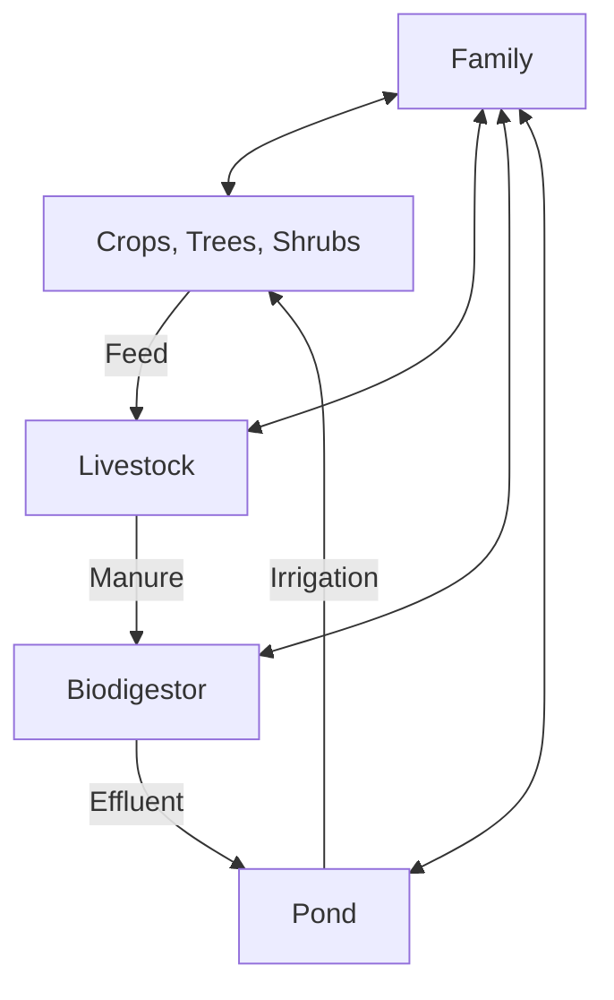
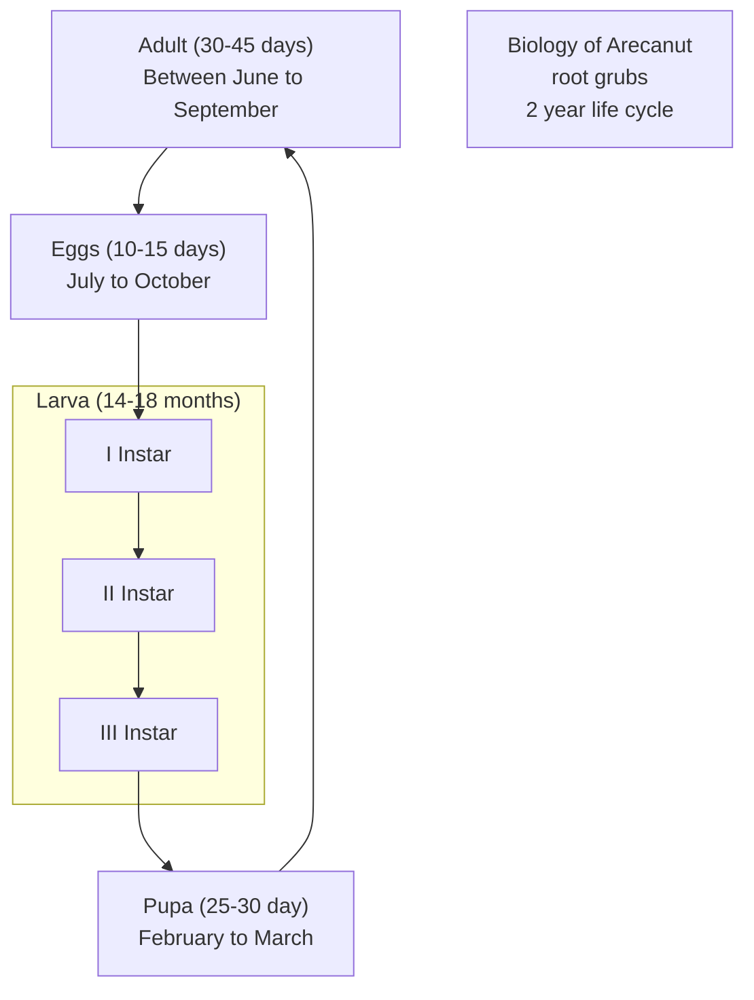

# FARMER’S HANDBOOK ON BASIC AGRICULTURE


## A holistic perspective of scientific agriculture


A joint initiative to impart farmers with technical knowledge on basic agriculture.


**Disclaimer:**

The opinions expressed provided in this publication are those of the authors and do not necessarily reflect those of GIZ. The designations employed and the presentation of material in this publication do not imply the expression of any opinion whatsoever on the part of GIZ concerning the legal status of any country, territory, city or area, or concerning the delimitation of its frontiers or boundaries.

# FARMER’S HANDBOOK ON BASIC AGRICULTURE

## Prepared & compiled by

**Dr. P. Chandra Shekara**
National Institute of Agricultural Extension
Management (MANAGE)
Ministry of Agriculture, GoI
Hyderabad, Andhra Pradesh
India

**Dr. N. Balasubramani**
National Institute of Agricultural Extension
Management (MANAGE)
Ministry of Agriculture, GoI
Hyderabad, Andhra Pradesh
India

**Dr. Rajeev Sharma**

**Dr. Chitra Shukla**
Desai Fruits & Vegetables Pvt. Ltd.
Navsari, Gujarat
India

**Dr. Ajit Kumar**
Desai Fruits & Vegetables Pvt. Ltd.
Navsari, Gujarat
India

**Bakul C. Chaudhary**
Desai Fruits & Vegetables Pvt. Ltd.
Navsari, Gujarat
India

**Mr. Max Baumann**
Planning Officer
Section “Agricultural Production & Resource Use”
Division 45 - Rural Development and Agriculture
Deutsche Gesellschaft für Internationale Zusammenarbeit (GIZ) GmbH
Germany
Max.Baumann@giz.de

### Financed by
**Desai Fruits & Vegetables Pvt. Ltd.**
Navsari, Gujarat, India

**German Federal Ministry for Economic Cooperation and Development (BMZ)**

### Published by
**Desai Fruits & Vegetables Pvt. Ltd.**
Navsari, Gujarat
India

Second Edition: August 2016

Farmer’s Handbook on Basic Agriculture

**The Authors acknowledge the contribution of following experts/professionals in developing the Handbook.**

Mr. Max Baumann, Planning Officer, GIZ, Germany

Mr. Fredrick Oberthur, Planning Officer, GIZ, Germany

Mr. Ajit Kumar Desai, Chairman, DFV, Navsari, Gujarat

Dr. Sashidhar, Professor, University of Agriculture and Horticultural Sciences, Shimoga, Karnataka

Dr. Syed Ahmed Hussain, Professor, ANGRAU, Hyderabad, Telangana

Mr. V.Gunasekaran, Agricultural Officer, Pesticide Testing Laboratory, Dharmapuri, Tamilnadu

Dr. M.V.Shantharam, Former Dean, ANGRAU, Hyderabad, Telangana

Dr. K. Kareemulla, Principal Scientist, NAARM, Hyderabad, Telangana

Dr. K.V. Jayaraghavendra Rao, Principal Scientist, NAARM, Hyderabad, Telangana

Mr. Thomas A Vivian, Assistant Professor, College of Agriculture, Dhule, Maharastra

Prof. T. M. Bahale, Professor of Agronomy, College of Agriculture, Dhule, Maharastra

Dr. R. K Rahane, Professor of Agricultural Economics, College of Agriculture, Dhule, Maharastra

**Dr. G. D. Patil**, Professor of Soil Science & Agricultural Chemistry, College of Agriculture, Dhule, Maharastra

Dr. D. N. Padule, Professor of Plant Pathology, College of Agriculture, Dhule, Maharastra

Dr. A. R. Pathak, Vice Chancellor, Navsari Agricultural University, Navsari, Gujarat

Dr. J. B. Patel, Professor, Anand Agricultural University, Anand, Gujarat

**Dr. Bhaskar Gaikwad**, Programme Coordinator, KVK, Babhaleshwar, Maharashtra

Mr. Mahendra Dhaibar, CEO, Sustainable Agricultural Development Foundation, Pune, Maharashtra

Dr. R. M. Pankhaniya, Associate Professor, Department of Agronomy, NM College of Agriculture, Navsari Agricultural University, Navsari, Gujarat

Dr A. M. Bafna, Principal & Dean, Aspee Agri-Business Management Institute, Navsari Agricultural University, Navsari, Gujarat

Dr G. G. Radadia, Professor & Head, Department of Entomology, NM College of Agriculture, Navsari Agricultural University, Navsari, Gujarat

Dr B. P. Mehta, Professor, Department of Plant Pathology, Aspee College of Horticulture and Forestry, Navsari Agricultural University, Navsari, Gujarat

Dr. L. J. Desai, Associate Professor, Department of Agronomy, NM College of Agriculture

Navsari Agricultural University, Navsari, Gujarat

Dr. N. S. Manohar, Associate Professor, Department of Agricultural Economics, Aspee College of Horticulture and Forestry, Navsari Agricultural University, Navsari, Gujarat

Dr O P Sharma, Associate Professor & Head, Department of Extension Education, College of Veterinary Science & AH, Navsari Agricultural University, Navsari, Gujarat

Dr. Bruno Schuler, Advisor and Planning Officer, Sustainable Agriculture-Rural Development, GIZ, Germany

Mr. Rajiv Ahuja, Technical Expert, Natural Resource Management, GIZ, India

Mr. Akhil Dev, Junior Technical Expert, Natural Resource Management, GIZ, India

# Acknowledgement

Higher demand for agricultural raw material is now anticipated and agriculture is not any more about producing farm products and selling them exclusively at the local market. Instead farmers today have a world market to serve. But the new chances bring new challenges. Farmers and agricultural enterprises, willing to be part of the new expanding world market, not only have to take into consideration customers’ preferences whom they want to serve, but also adhere to international trade regulations set by WTO and comply with high production and quality standards required by the importing countries.

Agriculture contributes around 17% to GDP and continues to be among the most important and successful sectors in India. Around 58% of the Indian population depend on agriculture for their livelihood. Apart from delivering the local industries with top quality raw materials for processing, agriculture provides almost 10% of total export earnings. However, to support the impressive Indian economic growth in the coming years, agriculture will have to contribute more towards value addition, productivity enhancement, high quality products and trained manpower to successfully tackle these challenges.

The states of Gujarat and Maharashtra have competitive advantages for the production of several commodities. However, productivity and competitiveness remains low. Rising quality requirements of export and domestic markets require an up-scaling of the production which is only feasible with educated farmers and skilled workers.

Desai Fruits and Vegetables (DFV)in cooperation with the Deutsche Gesellschaft für Internationale Zusammenarbeit(GIZ) GmbH on behalf of the German Federal Ministry for Economic Cooperation and Development (BMZ) takes up the existing education gap by implementing a development partnership called “Partnership Farming India”.

The goal of Partnership Farming India (PFI) is to enable farmers to be self-sufficient decision-makers, “agripreneurs”, which allows for a more flexible production system and highlights farming as profession by choice and not by inheritance.

Furthermore, PFI strengthens farmers’ and farm workers’ management skills to adopt modern agricultural practices and concepts and enhance the international competitiveness of smallholders’ agricultural produce by giving farmers and workers in Gujarat and Maharashtra access to practical agricultural education. Therefore, DFV and GIZ in close cooperation with the National Institute of Agricultural Extension Management (MANAGE, an organization of Ministry of Agriculture, Government of India) developed the training material on basic agricultural knowledge and skills.

The states of Gujarat and Maharashtra will serve as an example on how to establish long term successful and trustful business relationships by combining small scale production in the field with large scale processing and marketing. I am confident that this effort will serve the Indian agriculture as a replicable model make lasting contributions towards sustainable agriculture and prosperous farmers.

I would like to express my sincere gratitude to the people and institutions namely MANAGE, DFV and GIZ,which supported this project and enabled making information available. This is a useful source of information for farmers, trainers, and other interested persons to improve not only the agriculture but also the livelihood of the farming community.

<p align="right">
**Mrs. Sabine Preuss**
GIZ-India Programme Director
Natural Resource Management
</p>

Farmer’s Handbook on Basic Agriculture

# Preface

**A**griculture is an important sector of Indian Economy as more than half of its population relies on Agriculture as principle source of income. Research and Extension systems play major role in generation and dissemination of Agricultural technologies aiming at enhancing the income of farmers. The extension system adopts series of extension methods such as Training, demonstration, exposure visit to transfer the technologies from lab to land. Majority of these extension efforts mainly focus on location and crop specific technologies, and mostly on solution to problem basis. However, there is a need for equipping the farmers with Basic knowledge of Agriculture in order to create a better knowledge platform at farmer level for taking appropriate farm management decisions and to absorb modern technologies.

In view of this, Desai Fruits and Vegetables Pvt. Ltd. (DFV), India, in cooperation with the Deutsche Gesellschaſt für Internationale Zusammenarbeit (GIZ) GmbH on behalf of the German Federal Ministry for Economic Cooperation and Development (BMZ) in close cooperation with National Institute of Ag- ricultural Extension Management (MANAGE- An Organization of Ministry of Agriculture, Government of India) brought out Farmer’s Handbook on Basic Agriculture to impart technical knowledge on Basic Agriculture to farmers to provide holistic perspective of scientific Agriculture.

This handbook is a product of series of brainstorming workshops and consultative meetings with various stakeholders such as Researchers, Academicians, Extension Functionaries, Agripreneurs, Master Trainers and Farmers. Based on the identified needs, the topics were prioritized and contents were developed with the help of experts. The farmer-friendly content has been written in simple language, using more pictures with practical examples for the benefit of farmers.

The book contains six chapters, each focusing on a particular topic. The first chapter, “General conditions for cultivation of crops”, talks about the basic needs of farmers and farming sector, by providing basic knowledge on Good Agricultural Practices (GAP), enhancing the awareness of farmers on critical factors in selection of crops and cropping patterns, judicious use of natural resources such as soil and water, and emphasizing the importance of mechanization in the field of agriculture.

The second chapter “Soil and Plant Nutrition” is aimed at increasing the awareness and understanding of farmers about soil, it’s structure, physical, chemical, biological properties, soil fertility and managing the soil fertility in an economically and environmentally sustainable manner. It also focuses on the need for soil testing, plant nutrition requirement, organic & inorganic fertilizers, and Integrated Nutrient Manage- ment (INM) for efficient, economic and sustainable production of crops.

The third chapter of the book is about Pest Management, and focuses on enhancing the awareness of and understanding among farmers about the crop pests, diseases and weed management through Integrated Pest Management. It also aims at sensitizing farmers on safe handling of chemicals and plant protection equipments as also elaborated further in the fifth chapter on "Occupational health and safety of farmers". It creates awareness about causes, preventive measures of health hazards, risks & fatalities in agriculture, and use of first aid in emergencies. It further includes safety tips and care to reduce the risk of injuries and fatalities while handling machineries and pesticides by farmers.

Time and resources management is an integral part of each and every activity, be it service sector, business or day-to-day activities of life. Farming sector too has not remained untouched by it. Therefore, the fourth chapter of the book is devoted to "Farm Management". It is to educate and equip the farmers to make proper plans, take appropriate decisions and also to take advantage of the improved technologies to increase production, assure food security for the family and market opportunities to increase income considering available resources, anticipated risks, including market fluctuations.

“Farmer’s access to services”, the last chapter of the book, aims at enhancing awareness among farmers about sources of extension, information and services, public and private extension services, agricultural credit, insurance and legal aspects through Information & Communication Technologies. The content is useful not only for farmers but also for other stakeholders involved in farm advisory services such as Agri input dealers, Agripreneurs, Kisan Call Centers and extension functionaries working at grass roots level.

We trust that this Handbook will benefit maximum number of farmers to make farming economically and environmentally more sustainable.

**B. Srinivas, IAS**
Director General
MANAGE

Farmer's Handbook on Basic Agriculture

# Contents

<table>
  <tbody>
    <tr>
        <td>1.</td>
        <td>General Conditions for Cultivation of Crops</td>
        <td>1-32</td>
    </tr>
    <tr>
        <td>2.</td>
        <td>Soil and Plant Nutrition</td>
        <td>33-70</td>
    </tr>
    <tr>
        <td>3.</td>
        <td>Plant Protection</td>
        <td>71-96</td>
    </tr>
    <tr>
        <td>4.</td>
        <td>Categories of Pesticides and Precautions</td>
        <td>97-98</td>
    </tr>
    <tr>
        <td>5.</td>
        <td>Farm Management</td>
        <td>99-120</td>
    </tr>
    <tr>
        <td>6.</td>
        <td>Occupational Health and Safety</td>
        <td>121-130</td>
    </tr>
    <tr>
        <td>7.</td>
        <td>Farmer’s Access to Service</td>
        <td>131-136</td>
    </tr>
  </tbody>
</table>

Farmer’s Handbook on Basic Agriculture

General Conditions for Cultivation of Crops

# 1. General Conditions for Cultivation of Crops

## 1.1. Objectives of the session

* To enhance awareness of farmers on critical factors in selection of crops and cropping patterns.
* To create an understanding on judicious use of natural resources such as soil and water.
* To provide basic knowledge on seed and cropping systems.
* To emphasize the importance of mechanization.
* To sensitize the farmers on Good Agricultural Practices (GAP).

## 1.2. What do we know at the end of the session

* Critical factors in selection of crops and cropping patterns
* Judicious use of natural resources such as soil and water
* Basic knowledge on seed
* Cropping systems
* Mechanization
* Good Agricultural Practices (GAP)

Agricultural Universities, Research Institutes, Krishi Vigyan Kendras have been generating ample technologies to improve the productivity and profitability of the farmers. How many of these technologies are reaching the farmers? Baseline Situation Assessment conducted by Partnership farming in India, in Gujarat and Maharashtra, clearly indicated that farmers with access to technical knowledge on agriculture realized better income compared to others. Fifty one percent of sample farmers who were part of partnership farming India had knowledge of soil testing compared to only 28% of control group. Mulching and intercropping as a practice were not widely adopted by control group of farmers. They were less aware about other organic fertilizers. Fertigation as a method of application of fertilizers was not widely practiced by control group. Farmers who accessed information from agricultural universities and magazines were less in number in the control group. The treatment farmers had an average yield of 35.65 tons and control farmers had yield of 22.36 tons of banana per acre. The average net income of the treatment farmers was Rs 93,822 and for the control farmers Rs.81,659. More than 85% of the farmers wanted basic education on agriculture and crop production and ready to pay for undergoing such basic education and training. There was a clear interest in the farmers to improve their skill and knowledge and they were ready to pay for the service.

The above study clearly indicates that the knowledge gap is prevailing among farmers and those who have access to knowledge harvested better profits.

Increase in productivity and profitability can be achieved through:

* Blending practical knowledge with scientific technologies
* Efficient use of natural resources
* Adopting time specific management practices
* Giving priority for quality driven production
* Adopting suitable farming systems
* Adoption of location specific technology
* Market demand driven production
* Adopting low cost and no cost technologies

Farmer’s Handbook on Basic Agriculture
1

General Conditions for Cultivation of Crops

**Factors influencing decisions on the selection of crops and cropping system**


<table>
  <caption>Factors influencing decisions on the selection of crops and cropping system</caption>
  <thead>
    <tr>
      <th>Central Decision Node</th>
      <th>Influencing Factors</th>
    </tr>
  </thead>
  <tbody>
    <tr>
      <td rowspan="14">SELECTION OF CROPS AND CROPPING SYSTEM</td>
      <td>CLIMATIC FACTORS</td>
    </tr>
    <tr>
      <td>SOIL CONSERVATIONS</td>
    </tr>
    <tr>
      <td>WATER</td>
    </tr>
    <tr>
      <td>CROPPING SYSTEM OPTIONS</td>
    </tr>
    <tr>
      <td>PAST AND PRESENT EXPERIENCES OF FARMERS</td>
    </tr>
    <tr>
      <td>EXPECTED PROFIT AND RISK</td>
    </tr>
    <tr>
      <td>ECONOMIC CONDITIONS OF FARMERS INCLUDING LAND HOLDING</td>
    </tr>
    <tr>
      <td>LABOUR AVAILABILITY AND MECHANIZATION POTENTIAL</td>
    </tr>
    <tr>
      <td>TECHNOLOGY AVAILABILITY AND SUITABILITY</td>
    </tr>
    <tr>
      <td>MARKET DEMAND AND AVAILABILITY OF MARKET INFRASTRUCTURE</td>
    </tr>
    <tr>
      <td>POLICIES AND SCHEMES</td>
    </tr>
    <tr>
      <td>PUBLIC AND PRIVATE EXTENSION INFLUENCE</td>
    </tr>
    <tr>
      <td>AVAILABILITY OF REQUIRED AGRICULTURAL INPUTS INCLUDING AGRICULTURAL CREDIT</td>
    </tr>
    <tr>
      <td>POST HARVEST STORAGE AND PROCESSING TECHNOLOGIES</td>
    </tr>
  </tbody>
</table>

2
Farmer’s Handbook on Basic Agriculture

General Conditions for Cultivation of Crops

# 1.3. Factors influencing decisions on the selection of crops and cropping system

## Climatic factors

Is the crop/cropping system suitable for local weather parameters such as temperature, rainfall, sunshine hours, relative humidity, wind velocity, wind direction, seasons and agro-ecological situations?

## Soil conditions

Is the crop/cropping system suitable for local soil type, pH and soil fertility?

## Water

* Do you have adequate water source like a tanks, wells, dams, etc.?

* Do you receive adequate rainfall?

* Is the distribution of rainfall suitable to grow identified crops?

* Is the water quality suitable?

* Is electricity available for lifting the water?

* Do you have pump sets, micro irrigation systems?

## Cropping system options

* Do you have the opportunity to go for intercropping, mixed cropping, multi-storeyed cropping, relay cropping, crop rotation, etc.?

* Do you have the knowledge on cropping systems management?

## Past and present experiences of farmers

* What were your previous experiences with regard to the crop/cropping systems that you are planning to choose?

* What is the opinion of your friends, relatives and neighbours on proposed crop/cropping systems?

## Expected profit and risk

* How much profit are you expecting from the proposed crop/cropping system?

* Whether this profit is better than the existing crop/cropping system?

* What are the risks you are anticipating in the proposed crop/cropping system?

* Do you have the solution? Can you manage the risks?

* Is it worth to take the risks for anticipated profits?

## Economic conditions of farmers including land holding

* Are the proposed crop/cropping systems suitable for your size of land holding?

* Are your financial resources adequate to manage the proposed crop/cropping system?

* If not, can you mobilize financial resources through alternative routes?

## Labour availability and mechanization potential

* Can you manage the proposed crop/cropping system through your family labour?

* If not, do you have adequate labours to manage the same?

* Is family/hired labour equipped to handle the proposed crop/cropping system?

* Are there any mechanization options to substitute the labour?

* Is machinery available? Affordable? Cost effective?

* Is family/hired labour equipped to handle the machinery?

## Technology availability and suitability

* Is the proposed crop/cropping system suitable?

* Do you have technologies for the proposed crop/cropping system?

* Do you have extension access to get the technologies?

* Are technologies economically feasible and technically viable?

* Are technologies complex or user-friendly?

## Market demand and availability of market infrastructure

* Are the crops proposed in market demand?

* Do you have market infrastructure to sell your produce?

* Do you have organized marketing system to reduce the intermediaries?

* Do you have answers for questions such as

Farmer’s Handbook on Basic Agriculture
3

General Conditions for Cultivation of Crops

where to sell? When to sell? Whom to sell to? What form to sell in? What price to sell for?

* Do you get real time market information and market intelligence on proposed crops?

## Policies and schemes

* Do Government policies favour your crops?

* Is there any existing scheme which incentivises your crop?

* Are you eligible to avail those benefits?

## Public and private extension influence

Do you have access to Agricultural Technology Management Agency (ATMA)/ Departmental extension functionaries to get advisory?

* Do you know Kissan Call Center?

* Do you have access to KVKs, Agricultural Universities and ICAR organizations?

* Do you subscribe agricultural magazines?

* Do you read agricultural articles in newspapers?

* Do you get any support from input dealers, Agribusiness Companies, NGOs, Agriclinics and Agribusiness Centers?

## Availability of required agricultural inputs including agricultural credit

* Do you get adequate agricultural inputs such as seeds, fertilizers, pesticides, and implements in time?

* Do you have access to institutional credit?

## Post harvest storage and processing technologies

* Do you have your own storage facility?

* If not, do you have access to such facility?

* Do you have access to primary processing facility?

* Do you know technologies for value addition of your crop?

* Do you have market linkage for value added products?

* Are you aware about required quality standards of value added products of proposed crops?

**F**armers need to answer all the above questions while making decisions for choosing a crop/ cropping pattern. During this decision making process, farmer cross check the suitability of proposed

crop/cropping systems with his existing resources and other conditions. Thereby, they justify choosing or rejecting a crop/cropping systems. This process enables the farmers to undertake a SWOT analysis internally which in turn guides them to take an appropriate decision.

# 1.4. Climatic factors

## Climate and agriculture

* Monsoon is a key source of water in agriculture

* Most of our rivers are seasonal fed by the monsoon; even irrigated agriculture depends on monsoon.

* Cropping pattern has evolved over years based on climate.

* Market forces influence cropping patterns in recent times.

## Climatic factors and crops

* Rainfall drives water availability and determines sowing time (rainfed crops).

* Temperature drives crop growth, duration and influences milk production in animals.

* Temperature and relative humidity influence pest and diseases incidence on crops, livestock and poultry.

* Wet and dry spells cause significant impact on standing crops, physiology, loss of economic products (e.g. fruit drop).

* Extreme events (e.g. high rainfall, floods, heat / cold wave, cyclone, hail, frost) cause enormous losses of standing crops, livestock and fisheries.

## Climate and seasons

* Rainy (June-September) season also known as Kharif, supports most of the rainfed crops (coarse cereals, pulses, oilseeds, etc.).

* Post-rainy (October-February) season also known as Rabi, supports the irrigated or stored moisture grown crops (wheat, mustard, chickpea, etc.).

* Summer season (March-May) supports short duration pulses and vegetables.

* Rabi production is more assured, has a higher yield and reduces pest and disease related problems.

* Over time, with irrigation development, the contribution of Kharif is declining and Rabi is increasing.

4
Farmer’s Handbook on Basic Agriculture

General Conditions for Cultivation of Crops

## Climate, cropping pattern and agricultural production issues

* Cropping patterns based on climate and land capability are sustainable but market forces and farmers’ aspirations are forcing unsustainable systems.

* Farmers must innovate in producing more even from less endowed areas by adopting suitable technologies to cope with changing climate.

* Climate change will likely to cause further problems in our crop production and is likely to become the most important environmental issue in the 21st century.


Impact of Drought

## Important agricultural related factors responsible for climate change

* Deforestation and forest degradation

* Burning of fuel and farm waste

* Water logged condition

* Excessive use of external input

* Large-scale conversion of land for non-agricultural purpose


Impact of Flood

## Impact of climate change in India

* **Rainfall:** No long-term trend noted. However, regional variations seen, increased summer rainfall and less number of rainy days.

* **Temperature:** About 0.6 ºC rise in surface temperature during 100 years. Projected to increase 3.5 to 5 ºC by 2100.

* **Carbon dioxide:** Increasing at the rate of 1.9 ppm per year and expected to reach 550 ppm by 2050 and 700 ppm by 2100.

* **Extreme events:** Increased frequency of heat wave, cold wave, droughts and floods observed during last decade.

* **Rising sea level:** Rise of 2.5 mm/year since 1950.

* **Glaciers:** Rapid melting of the glaciers in the Himalayas.

* **Rainfall distribution:** Shift in peak rainfall distribution also noticed in some parts of country.


Heat Wave on Maize

## Expected impact of climate change on agriculture

* Due to increase in temperature, crop may require more water.

* Yield may be reduced in cereal crops especially in Rabi; i.e. wheat.


Cold wave damage to chana harvest

Farmer’s Handbook on Basic Agriculture
5

General Conditions for Cultivation of Crops

## Change in pest and disease scenario due to climate change

*   **Due to increase in rainfall:** Pests like bollworm, red hairy caterpillar and leaf spot diseases may increase. Due to increase in temperature: Sucking pests such as mites and leaf miner may increase.

*   **Due to variation in rainfall and temperature:** Pest and diseases of crops to be altered because of more enhanced pathogen and vector development, rapid pathogen transmission and increased host susceptibility. Sometimes a minor pest may become a major pest.

*   Agricultural biodiversity is also threatened by decreased rainfall and increased temperature, sea level rise and increased frequency and severity of drought, cyclone and flood. Quality of farm products such as fruits, vegetables, tea, coffee, aromatic and medicinal plants may be affected.

### Water

*   Demand for irrigation to increase with increased temperature and higher amount of evapo-transpiration. This may result in lowering of groundwater table at some places.

*   The melting of glaciers in the Himalayas will increase water availability in the Ganga, Brahmaputra and their tributaries in the short-run but in the long-run the availability of water will decrease considerably.

*   A significant increase in runoff is projected in the rainy season, however, may not be very beneficial unless storage infrastructure could be vastly expanded. This extra water in the rainy season, on the other hand, may lead to increase in frequency and duration of floods.

*   The water balance in different parts of India will be disturbed and the quality of ground water along costal track will be more affected due to intrusion of sea water.

### Soil

*   Organic matter content, which is already quite low in Indian soil, would become even lower. Quality of soil organic matter may be affected.

*   Reduction in rate of decomposition and nutrient supply.

*   Increase in soil temperature may reduce Nitrogen availability due to volatilization and denitrification.

*   Change in rainfall volume and frequency as well as wind may alter the severity, frequency and extent of soil erosion.

*   Rise in sea level may lead to salt water entry in the coastal lands turning them less suitable for conventional agriculture.

### Livestock

*   Affect feed production and nutrition of livestock. Increased temperature would reduce digestibility. Increased water scarcity would also decrease the food and fodder production.

*   Major impacts on vector-borne diseases through expansion of vector populations during rainy years, leading to large outbreaks of diseases.

*   Increase water, shelter, and energy requirement of livestock for meeting projected milk demands.

*   Climate change is likely to aggravate heat stress in dairy animals, adversely affecting their reproductive performance.

### Fishery

*   Increased sea and river water temperature is likely to affect fish breeding, migration and harvest.

*   Impacts of increased temperature and tropical cyclonic activity would affect capture, production and marketing costs of the marine fish.

## Coping options for farmers

### Access to information

*   Progressive Farmers

*   ATMA extension functionaries – Block Technology Manager, SMS, farmer friend, Farm School

*   Trained input dealers

*   Agri Clinics and Agribusiness Centers

*   KVK

*   Agricultural Research Stations

*   Agricultural Universities

*   ICAR Organisations

*   Kissan Call Centers (Toll free no.1551 or 1800 – 180 – 1551)

*   Concerned NGOs

*   Agribusiness Companies

*   Radio, TV, Agricultural Magzines, Community Radio, Newspapers, Agricultural Websites etc.

6
Farmer’s Handbook on Basic Agriculture

General Conditions for Cultivation of Crops

# Coping options for farmers

---


## Enlarging the Food Basket

* Diversifying the livelihood sources.
* Changing cropping patterns.
* Increased traditional coping strategies.
* Change to a mixed cropping pattern.
E.g: Crop Mixture-Nutri Millets, Pulses and Oilseed

---

## Integrated Farming System

* Increased share of non-agricultural activities
**E.g: Type of Integrated Farming Systems**
Agriculture +vegetable cultivation
Agriculture + animal husbandry


---


## Neem, Mulberry & Cowpea

* Planting more drought tolerant crops and increased agro-forestry practices.
* Agro-forestry systems to provide more stable incomes during years of extreme weather events.

---

## Mango, Pumpkin, maize mixed cropping


---


## Mixed farming/Multi level farming

Farmer’s Handbook on Basic Agriculture
7

General Conditions for Cultivation of Crops

# Coping options for farmers continued....


### Lucerne & Sunhemp for green manuring & fodder

### Farm Pond


### Conservation Furrow

* Improved on-farm soil & water conservation.

* Adopting scientific water management, nutrient management and cultural practices.

### Vegetative Barriers


### Percolation Tanks

8
Farmer’s Handbook on Basic Agriculture

General Conditions for Cultivation of Crops

# Coping options for farmers continued....


## Contour trenching for runoff collection

## Conventional Raised Bed Planting

* 20-25% Saving in irrigation water


## Shelterbelts

* Shelterbelts reduce wind velocity.

* Moderate temperature.

* Reduce evaporative loss and conserve soil moisture.

## Straw Thatching

* Protecting young seedlings against cold by covering with straw thatching.


## Frost Protection

Farmer’s Handbook on Basic Agriculture
9

General Conditions for Cultivation of Crops

## 1.5. Soil and Water Conservation

**S**oil and water are our precious heritage. Hence, it is obligatory on our part to protect and hand over these resources to further generations. It is estimated that about 50% of the cultivated area in India suffers from severe soil erosion and requires remedial measures.

*   Water resources are essential for increasing and stabilizing crop production.

*   Wind erosion has been responsible for destroying the valuable top soil.

### 1.5.1. Degradation of soil and water takes place with water and wind erosion

*   The main cause of water erosion is unmanaged runoff.

*   Runoff is the portion of the rainfall or irrigation water applied which leaves a field either as surface or as subsurface flow.

#### Several factors are responsible for runoff

*   Climatic factors: Precipitation characteristics - duration, intensity, distribution, direction, temperature, humidity, wind velocity.

*   Watershed characteristics: Geological shape of the catchments, size and shape of the catchments, topography, drainage pattern.

*   Barren land without vegetation

*   Soil types:

*   **Sandy soil:** Average rain – no problem of erosion. High intensity – More serious of less binding material i.e. fine soil particle.

*   **Clay soil:** Ordinary rain – more runoff in moderate and steep slopes but high water holding capacity.

*   **Silt loam, loamy and fine sandy loam:** More desirable soils from the point of view of minimizing soil erosion.

#### How vegetation reduces runoff

*   Interception of rainfall

*   Root structure

*   Biological influences

*   Transpiration effects

*   Intercept, absorb the impact of raindrop

*   Hindrance to runoff water slows down the rate at which travels down the slope

*   Knitting and binding effect aggregates the soil

into granules

*   Die and decay increase pore space and water holding capacity

*   One cubic meter of soil has several kilometres of root fibre

*   More vegetative cover, most active soil fauna, channels of earth worm, beetles and other life

*   Vegetation increases the storage capacity of the soil for rainfall by the transpiration of large quantities of moistures from the soil

### Soil erosion

Soil erosion is the detachment and transportation of soil material from one place to another through the action of wind, water in motion or by the hitting action of the rain drops.

*   When the vegetation is removed and land is put under cultivation the natural equilibrium between soil building and soil removal is disturbed.

*   The removal of surface soil takes place at a much faster rate than it can be built up by the soil forming process.

**Erosion by water:** Known as water erosion, is the removal of soil from the lands surface by water in motion.

**Sheet erosion:** The removal of a thin relatively uniform layer of soil particles by the action of rainfall and runoff.

*   Extremely harmful

*   Usually so slow that the farmer is not conscious of its existence

*   Common on lands having a gentle uniform slope

*   Results in the uniform removal of the cream of the top soil with every heavy rain

*   Shallow top soil overlies a tight sub soil are most susceptible to sheet erosion

*   Movement of soil by rain drop splash is the primary cause of sheet erosion

*   Sheet erosion has damaged millions of hectares of slopping land throughout the India

**Rill erosion** is the removal of soil by running water with the formation of shallow channels that can be smoothed out completely by normal cultivation.

*   There is no sharp lines of demarcation where sheet erosion and rill erosion begins but rill erosion is more readily apparent than sheet erosion.

10
Farmer’s Handbook on Basic Agriculture

General Conditions for Cultivation of Crops


Sheet and Rill Erosion


Gully Erosion


Landslide


Shelterbelts for Moderating microclimate

* Rills develop when there is a concentration of runoff water which, if neglected, grow into large gullies.

* More serious in soils having a loose shallow top soil.

* Transition stage between sheet erosion and gullying.

**Gully erosion:** Removal of soil by running water with the formation of channels that cannot be smoothed out completely by cultivation.

* Advance stage of rill erosion.

* Any concentration of surface runoff is a potential source of gullying.

* Cattle paths, cart tracks, dead furrows, tillage furrows or other small depression down a slope favour concentration of flow.

* Unattended rills deepen and widen every year and begin to attain the form of gullies.

* Unattended gullies may result over a few years for an entire landscape to be filled with a network of gullies.

* More spectacular than other type of erosions.

**Stream channel erosion:** Erosion caused by stream flow.

* Closely resembles rill erosion.

* Intensive channel erosion areas are on the outside of lands where flow shear stresses are high.

**Mass movement:** Enmass movement of soil.

* Landslides, land slips, soil and mudflows are various forms of mass movement.

**Wind erosion:** Movement of soil particles is caused by wind force exerted against or parallel to surface of the ground.

### 1.5.2. Conservation

Conservation is the utilization without wastage of resources is required to ensure a high level of pro- duction.

#### Important soil conservation measures are

* Conservation Tillage

* Minimum tillage

* Zero tillage

* Stubble mulching

* Trash farming

Farmer’s Handbook on Basic Agriculture
11

General Conditions for Cultivation of Crops

### Conservation farming

* Farming across the slope

* Strip cropping

* Rotations

* Mixed cropping and intercropping

* Surface mulching

* Timely farm operations

* Improved water user efficiency

* Land levelling

* Providing safe drainage

* Intermittent terraces

* Growing vegetation on the bunds

* Bench terrace

* Water harvesting and recycling

### Vegetation and vegetative management

* Strip cropping

* Stubble mulching

* Mulching

### Wind erosion management

* Protect the soil surface with a cover of vegetation or vegetative residues.

* Produce or bring to the surface soil aggregates or clods which are large enough to resist the wind force.

* Roughen the land surface to reduce wind velocity and trap drifting soil.

* Establish barriers or trap strips at intervals to reduce wind velocity and soil drifting.

#### Best practices to control soil blowing

* Deep ploughing

* Summer ploughing

* Surface roughness

* Conserving moisture

* Wind breaks and shelterbelts

* Mechanical or vegetative barriers

#### For instance: Shelterbelts for moderating micro-climate

* Shelterbelts reduce wind velocity

* Moderate temperature

* Reduce evaporative loss and conserve soil moisture

### Water erosion can be managed by

* In situ water harvesting

* Summer ploughing

### Overland flow management

* Contour bund

* Graded bund

* Broad based bund

### Zero tillage

* Several practices are in use such as zero tillage, minimum tillage and direct seeding.

* Planting crops in previously untilled soil by opening a narrow slot, trench or band only of sufficient width and depth to obtain seed coverage. No other soil tillage is done.

#### Advantages of zero tillage farming

* **Erosion control:** Retained stubble and crop residue reduces soil erosion and enhances soil fertility

* **Moisture conservation:** Stubble traps water, reduce runoff water, better infiltration leading to improved soil moisture condition

* Higher nitrogen availability

* **Seedling protection:** Stubbles protects young seedling from wind and heat

* Crop yields will be on par with traditional tillage system. However good yield can be harvested during dry years

* Reduce labour and save time

* Savings on equipment cost

* Savings on oil/fuel cost

### Mulching: Benefits of crop residue mulching are

* Increased availability of water and organic matter

* Less erosion

* Environment protection

#### Additional benefit to farmers

* Less drought susceptibility

* Improved soil quality and fertilizer efficiency

* Minimises long term dependency on external inputs

12
Farmer’s Handbook on Basic Agriculture

General Conditions for Cultivation of Crops

# 1.6. Irrigation

An adequate water supply is important for plant growth. When rainfall is not sufficient, the plants must receive additional water from irrigation.

## Points consider for irrigation decisions

*   Land suitability for irrigation like slope

*   Effective rainfall: Part of the total rain is useful for crop production

*   When to irrigate: Decide based on soil, crop and climatic condition

*   How much to irrigate: Decide based on crop water requirement

*   How to irrigate: Select appropriate method for irrigation

*   Quality of irrigation water

## 1.6.1. Various methods can be used to supply irrigation water to the plants

*   Surface irrigation:

*   Basin irrigation

*   Furrow irrigation

*   Sprinkler irrigation

*   Drip irrigation

## Surface Irrigation

Surface irrigation is the application of water by gravity flow to the surface of the field.

*   Either the entire field is flooded (Basin Irrigation) or the water is fed into small channels (furrows) or strips of land (borders).

### Basin Irrigation

*   Basins are flat areas of land, surrounded by low bunds.

*   The bunds prevent the water from flowing to the adjacent fields.

*   Basin irrigation is commonly used for rice grown on flat lands or in terraces on hillsides. Paddy grows best when its roots are submerged in water. Hence, basin irrigation is the best method to use for this kind of crop.

*   Trees can also be grown in basins, where one tree is usually located in the middle of a small basin.

*   In general, the basin method is suitable for crops that are no affected by standing in

water for longer periods.

*   Basin irrigation is suitable for many field crops.

*   Crops suitable for basin irrigation include pastures, citrus, banana and crops that are broadcasted such as cereals and to some extent row crops such as tobacco.

*   Basin irrigation is generally not suited to crops, which cannot stand in wet or waterlogged conditions for periods longer than 24 hours; eg: potatoes, beet root and carrots

*   The flatter the land surface, the easier it is to construct basins.

*   It is also possible to construct basins on sloping land, even when the slope is quite steep. Level basins, called terraces, can be constructed like the steps of a staircase.

*   Soils suitable for basin irrigation depend on the crop grown.

### Basin should be small if the:

*   Slope of the land is steep

*   Soil is sandy

*   Stream size to the basin is small

*   Required depth of the irrigation application is small

*   Field preparation is done by hand or animal power

### Basin can be large if the:

*   Slope of the land is gentle or flat

*   Soil is clay

*   Stream size to the basin is large

*   Required depth of the irrigation application is large

*   Field preparation is mechanized

*   The land slope, the soil type, the available stream size, the required depth of the irrigation application and farming practices mainly determine the shape and size of basins

*   If the land slope is steep, the basin should be narrow; otherwise too much earth movement will be needed to obtain level basins.

*   Three other factors, which may affect basin width, are depth of fertile soil, method of basin construction, agricultural practices.

*   There are two methods to supply irrigation water to basins: (i) The direct method: Irrigation water is led directly from the field channel into the basin through siphons,

Farmer’s Handbook on Basic Agriculture
13

General Conditions for Cultivation of Crops

or bund breaks. (ii) The cascade method: irrigation water is supplied to the highest terrace, and then allowed to flow to a lower terrace and so on.

## Maintenance of basins

* Bunds are susceptible to erosion. This may be caused by, for example, rainfall, flood or the passing of people when used as footpaths.

* Rats may dig holes in the sides of the bunds.

* Therefore, it is important to check the bunds regularly, notice defects and repair them instantly, before greater damage is done.

## Advantages of basin irrigation

* Conservation of rainfall and reduction in soil erosion.

* High water application and distribution efficiencies.

* Useful in leaching of salts.

* Suitable to all close growing crops, row crops and orchards.


<center>
Basin Irrigation
</center>

## Furrow irrigation

* Furrows are small channels, which carry water down the land slope between the crop rows.

* Water infiltrates into the soil as it moves along the slope.

* The crop is usually grown on the ridges between the furrows.

* This method is suitable for all row crops and for crops that cannot stand in water for long periods. Crops such as maize, sunflower, sugarcane, and soybean can be irrigated by furrow irrigation.

* Crops that would be damaged by inundation, such as tomatoes, vegetables, potatoes, beans; fruit trees like citrus and grape as well as broadcasted crops like wheat.

* Irrigation water flows from the field channel into the furrows by opening up the bank of the channel or by means of siphons or spiles.

* Furrows must be on consonance with the slope, soil type, stream size, irrigation depth, cultivation practice and field length.

* Uniform flat or gentle slopes are preferred for furrow irrigation.

* On undulating land, furrows should follow the land contours.

## Advantages of furrow irrigation

* Suitable for row crops and vegetables.

* Suitable for soils in which the infiltration rates vary between 0.5 and 2.5 cm/hr.

* Ideal for slopes varying from 0.2 to 0.5 per cent and a stream size of 1-2 liters/sec.

* In areas requiring surface drainage or prone to temporary water logging, furrows are very effective.

* In areas where water for irrigation purposes is scarce, the practice of alternate or skip furrow irrigation can save considerable quantity of water without significantly affecting yields.


<center>
Furrow Irrigation
</center>

## Sprinkler irrigation

Water is pumped through a pipe system and then sprayed onto the crops through sprinkler heads.

### Advantages

* Water conservation

* Soil conservation

* Efficient use of water

* Saving of labour

* Early seed germination

* Fertigations

* Soil amendments

* Frost protection

14
Farmer’s Handbook on Basic Agriculture

General Conditions for Cultivation of Crops

* Cooling of crops
* Higher productivity of crops


<table>
  <caption>Drip Irrigation</caption>
  <thead>
    <tr>
      <th>Water is applied</th>
    </tr>
  </thead>
  <tbody>
    <tr>
      <td>At low rate</td>
    </tr>
    <tr>
      <td>Over a long period of time.</td>
    </tr>
    <tr>
      <td>At frequent intervals</td>
    </tr>
    <tr>
      <td>Directly into the plant’s root zone</td>
    </tr>
  </tbody>
</table>


Drip Irrigation

## Response of different crops to sprinkler irrigation

<table>
  <thead>
    <tr>
        <th>Crop</th>
        <th>Water<br/>saving (%)</th>
        <th>Yield<br/>increase (%)</th>
    </tr>
  </thead>
  <tbody>
    <tr>
        <td>Bajra</td>
        <td>56</td>
        <td>19</td>
    </tr>
    <tr>
        <td>Barley</td>
        <td>56</td>
        <td>16</td>
    </tr>
    <tr>
        <td>Bhendi</td>
        <td>28</td>
        <td>23</td>
    </tr>
    <tr>
        <td>Cabbage</td>
        <td>40</td>
        <td>3</td>
    </tr>
    <tr>
        <td>Cauliflower</td>
        <td>35</td>
        <td>12</td>
    </tr>
    <tr>
        <td>Chillies</td>
        <td>33</td>
        <td>24</td>
    </tr>
    <tr>
        <td>Cotton</td>
        <td>36</td>
        <td>50</td>
    </tr>
    <tr>
        <td>Cowpea</td>
        <td>19</td>
        <td>3</td>
    </tr>
    <tr>
        <td>Fenugreek</td>
        <td>29</td>
        <td>25</td>
    </tr>
    <tr>
        <td>Garlic</td>
        <td>28</td>
        <td>6</td>
    </tr>
    <tr>
        <td>Gram</td>
        <td>69</td>
        <td>57</td>
    </tr>
    <tr>
        <td>Groundnut</td>
        <td>20</td>
        <td>40</td>
    </tr>
    <tr>
        <td>Jowar</td>
        <td>55</td>
        <td>34</td>
    </tr>
    <tr>
        <td>Lucerne</td>
        <td>16</td>
        <td>27</td>
    </tr>
    <tr>
        <td>Maize</td>
        <td>41</td>
        <td>36</td>
    </tr>
    <tr>
        <td>Onion</td>
        <td>33</td>
        <td>23</td>
    </tr>
    <tr>
        <td>Potato</td>
        <td>46</td>
        <td>4</td>
    </tr>
    <tr>
        <td>Sunflower</td>
        <td>33</td>
        <td>20</td>
    </tr>
    <tr>
        <td>Wheat</td>
        <td>35</td>
        <td>24</td>
    </tr>
  </tbody>
</table>

## Use of Sprinklers for different crops

<table>
  <thead>
    <tr>
        <th>Crop Type</th>
        <th>Crop Example</th>
    </tr>
  </thead>
  <tbody>
    <tr>
        <td>Cereals</td>
        <td>Maize, Sorghum, Wheat, Jowar</td>
    </tr>
    <tr>
        <td>Flowers</td>
        <td>Carnation, Jasmine, Marigold</td>
    </tr>
    <tr>
        <td>Oilseeds</td>
        <td>Groundnut, Mustard, Sunflower</td>
    </tr>
    <tr>
        <td>Vegetables</td>
        <td>Onion, Potato, Radish, Carrot</td>
    </tr>
    <tr>
        <td>Fodders</td>
        <td>Asparagus, Pastures</td>
    </tr>
    <tr>
        <td>Pulses</td>
        <td>Gram, Pigeon pea, Beans</td>
    </tr>
    <tr>
        <td>Plantation</td>
        <td>Coffee, Rubber, Tamarind</td>
    </tr>
    <tr>
        <td>Fibre</td>
        <td>Cotton, Sesame</td>
    </tr>
    <tr>
        <td>Spices</td>
        <td>Cardamom</td>
    </tr>
  </tbody>
</table>


Lay out of Sprinkler Irrigation System

Farmer’s Handbook on Basic Agriculture
15

General Conditions for Cultivation of Crops

## Drip irrigation

A typical drip irrigation system consists of the following components:

Water is conveyed under pressure through a pipe system to the fields, from where it is discharged slowly or at a pre designed rate. The latter can be matched to the soil infiltration capacity through emitters or drippers that are located close to the root zone of the plants.

* Pump unit

* Control unit

* Filtering unit

* Mainline and sub mainlines

* Laterals

* Emitters


Head Control Unit

## Critical stages for irrigation in different crops

<table>
  <thead>
    <tr>
        <th>Name of the Crop</th>
        <th>Critical Stages</th>
    </tr>
  </thead>
  <tbody>
    <tr>
        <td colspan="2">Cereals</td>
    </tr>
    <tr>
        <td>Rice/Paddy</td>
        <td>Tillering, Panicle Initiation, Heading and Flowering</td>
    </tr>
    <tr>
        <td>Wheat</td>
        <td>Crown Root Initiation, Tillering to Booting</td>
    </tr>
    <tr>
        <td>Sorghum</td>
        <td>Booting, Blooming and Milky Dough Stage</td>
    </tr>
    <tr>
        <td>Maize</td>
        <td>Silking and Tasseling to Dough Stage</td>
    </tr>
    <tr>
        <td>Pearl millet</td>
        <td>Heading and Flowering</td>
    </tr>
    <tr>
        <td>Finger millet</td>
        <td>Primordial Initiation and Flowering</td>
    </tr>
    <tr>
        <td colspan="2">Pulses</td>
    </tr>
    <tr>
        <td>Chickpea</td>
        <td>Late Vegetative Phase</td>
    </tr>
    <tr>
        <td>Black gram</td>
        <td>Flowering and Pod Setting</td>
    </tr>
    <tr>
        <td>Green gram</td>
        <td>Flowering and Pod Setting</td>
    </tr>
    <tr>
        <td>Beans</td>
        <td>Flowering and Pod Setting</td>
    </tr>
    <tr>
        <td>Peas</td>
        <td>Flowering and Early Pod Formation</td>
    </tr>
    <tr>
        <td>Alfalfa</td>
        <td>After Cutting and Flowering</td>
    </tr>
  </tbody>
</table>

16
Farmer’s Handbook on Basic Agriculture

General Conditions for Cultivation of Crops

<table>
  <thead>
    <tr>
        <th>Name of the Crop</th>
        <th>Critical Stages</th>
    </tr>
  </thead>
  <tbody>
    <tr>
        <td colspan="2">Oil Seeds</td>
    </tr>
    <tr>
        <td>Ground nut</td>
        <td>Flowering, Peg Formation and Pod Development</td>
    </tr>
    <tr>
        <td>Sesame</td>
        <td>Blooming to Maturity</td>
    </tr>
    <tr>
        <td>Sunflower</td>
        <td>Pre-flowering to Post-flowering</td>
    </tr>
    <tr>
        <td>Soybean</td>
        <td>Blooming and Seed Formation</td>
    </tr>
    <tr>
        <td colspan="2">Vegetables</td>
    </tr>
    <tr>
        <td>Onion</td>
        <td>Bulb Formation and Pre-maturity</td>
    </tr>
    <tr>
        <td>Tomato</td>
        <td>Flowering and Fruit Setting</td>
    </tr>
    <tr>
        <td>Chilies</td>
        <td>Flowering and Fruit Setting</td>
    </tr>
    <tr>
        <td>Cabbage</td>
        <td>Head Formation</td>
    </tr>
    <tr>
        <td>Potato</td>
        <td>Tuber Initiation to Maturity</td>
    </tr>
    <tr>
        <td>Carrot</td>
        <td>Root Enlargement</td>
    </tr>
    <tr>
        <td colspan="2">Others</td>
    </tr>
    <tr>
        <td>Cotton</td>
        <td>Flowering and Boll Formation</td>
    </tr>
    <tr>
        <td>Citrus</td>
        <td>Flowering, Fruit Setting and Fruit Enlargement</td>
    </tr>
    <tr>
        <td>Mango</td>
        <td>Pre-flowering and Fruit Setting</td>
    </tr>
  </tbody>
</table>

## Layout of micro irrigation system


**LEGEND**
1. Water source
2. Pumpset
3. Fertilizer applicator
4. Filter
5. Watermeter
6. Mainline
7. Flow control valve
8. Submain
9. Lateral pipe
10. Emitter/dripper
11. Endcap

## Benefits of drip irrigation over surface irrigation

<table>
  <thead>
    <tr>
        <th>Crop</th>
        <th>Yield increase (%)</th>
        <th>Water saving (%)</th>
        <th>Crop</th>
        <th>Yield increase (%)</th>
        <th>Water saving (%)</th>
    </tr>
  </thead>
  <tbody>
    <tr>
        <td>Mango</td>
        <td>80.0</td>
        <td>34.8</td>
        <td>Pomegranate</td>
        <td>98.0</td>
        <td>45.0</td>
    </tr>
    <tr>
        <td>Banana</td>
        <td>52.0</td>
        <td>45.0</td>
        <td>Tomato</td>
        <td>50.0</td>
        <td>39.0</td>
    </tr>
    <tr>
        <td>Grapevine</td>
        <td>23.0</td>
        <td>48.0</td>
        <td>Watermelon</td>
        <td>88.0</td>
        <td>36.0</td>
    </tr>
  </tbody>
</table>

Farmer’s Handbook on Basic Agriculture
17

General Conditions for Cultivation of Crops

## Benefits of drip irrigation over surface irrigation continued....

<table>
  <thead>
    <tr>
        <th>Crop</th>
        <th>Yield increase (%)</th>
        <th>Water saving (%)</th>
        <th>Crop</th>
        <th>Yield increase (%)</th>
        <th>Water saving (%)</th>
    </tr>
  </thead>
  <tbody>
    <tr>
        <td>Lady’s finger</td>
        <td>16.0</td>
        <td>40.0</td>
        <td>Sugarcane</td>
        <td>133.3</td>
        <td>49.3</td>
    </tr>
    <tr>
        <td>Brinjal</td>
        <td>14.0</td>
        <td>53.0</td>
        <td>Cotton</td>
        <td>88.0</td>
        <td>46.6</td>
    </tr>
    <tr>
        <td>Chillies</td>
        <td>44.0</td>
        <td>62.0</td>
        <td>Onion</td>
        <td>53.8</td>
        <td>46.1</td>
    </tr>
    <tr>
        <td>Papaya</td>
        <td>75.0</td>
        <td>68.0</td>
        <td>Potato</td>
        <td>79.5</td>
        <td>54.1</td>
    </tr>
  </tbody>
</table>

### On-farm irrigation efficiency of different irrigation methods


<table>
  <thead>
    <tr>
        <th>Irrigation Method</th>
        <th>Efficiency %</th>
    </tr>
  </thead>
  <tbody>
    <tr>
        <td>Flood</td>
        <td>30%-60%</td>
    </tr>
    <tr>
        <td>Level Furrow</td>
        <td>50%-70%</td>
    </tr>
    <tr>
        <td>Sprinkler</td>
        <td>70%-85%</td>
    </tr>
    <tr>
        <td>Center Pivot</td>
        <td>70%-90%</td>
    </tr>
    <tr>
        <td>Drip</td>
        <td>90%-95%</td>
    </tr>
  </tbody>
</table>

### 1.6.2. Centrally sponsored micro irrigation scheme

It is clear from the above diagram that drip irrigation is the most efficient irrigation in terms of water use efficiency compared to all other methods. Flood irrigation method is found to be the most uneconomical irrigation method in terms of water use efficiency when compared to all other methods.

In order to popularize micro irrigation, the Govt. of India is implementing the Micro Irrigation Scheme through which interested farmers be supported. The farmers can approach nearest extension functionary. The details are as follows:

<table>
  <tbody>
    <tr>
        <td>Name of Scheme</td>
        <td>Micro Irrigation</td>
    </tr>
    <tr>
        <td>Type</td>
        <td>Centrally Sponsored Scheme (CSS)</td>
    </tr>
    <tr>
        <td>Year of Commencement</td>
        <td>2005-06</td>
    </tr>
    <tr>
        <td>Objectives</td>
        <td>To increase the area under efficient methods of irrigation viz. drip and sprinkler irrigation as these methods have been recognized as the only alternative for efficient use of surface as well as ground water resources.</td>
    </tr>
  </tbody>
</table>

18
Farmer’s Handbook on Basic Agriculture

General Conditions for Cultivation of Crops

### Salient Features

*   Out of the total cost of the Micro Irrigation (MI) System, 40% will be borne by the Central Government, 10% by the State Government and the remaining 50% will be borne by the beneficiary either through his/her own resources or soft loan from financial institutions.

*   Assistance to farmers will be for covering a maximum area of 5 hectare per beneficiary family.

*   Assistance for drip and sprinkler demonstration will be 75% of the cost for a maximum area of 0.5 ha per beneficiary, which will be met entirely by the Central Government.

*   The Panchayati Raj Institutions (PRIs) will be involved in selecting the beneficiaries.

*   All categories of farmers are covered under the Scheme. However, it needs to be ensured that at least 25% of the beneficiaries are small and marginal farmers.

*   The scheme includes both drip and sprinkler irrigation. However, sprinkler irrigation will be applicable only for those crops where drip irrigation is uneconomical.

*   There will be a strong HRD input for the farmers, field functionaries and other stakeholders at different levels.

*   Moreover, there will be publicity campaigns, seminars/workshops at extensive locations to develop skills and improve awareness among farmers about importance of water conservation and management.

*   The Precision Farming Development Centres (PFDCs) will provide research and technical support for implementing the scheme.

*   Supply of good quality system both for drip and sprinkler irrigation having BIS marking, proper after sales services to the satisfaction of the farmer is paramount.

**Subsidy Pattern:** Assistance is provided @ 50% (40% by the Government of India and 10% by the State Government) for drip/sprinkler Irrigation System. Assistance to the extent of 75% of the cost of demonstration is provided up to a limit of 0.5 ha.

### Structure of Scheme

*   At the National level, National Committee on Plasticulture Application in Horticulture (NCPAH) will be responsible for coordinating the Scheme, while the Executive Committee of NCPAH will approve the Action Plan. At the State level the State Micro Irrigation Committee will coordinate the programme, while at the District level the District Micro Irrigation Committee will oversee the programme.

*   The Scheme will be implemented by an Implementing Agency (IA), appointed by the State Government, which will be the District Rural Development Agencies (DRDAs) or any identified Agency, to whom funds will be released to directly on the basis of approved district plans for each year.

*   The IA shall prepare Annual Action Plan for the District which will be forwarded by the DMIC and SMIC for approval by the Executive Committee (EC) of NCPAH.

### Funding Pattern

80:20 by the Centre and States

Farmer’s Handbook on Basic Agriculture
19

General Conditions for Cultivation of Crops

**Eligibility** As indicated in column 5 above.

**Area of Operation** The focus will be on horticultural crops being covered under the National Horticulture Mission in 24 States/UTs. A cluster approach will be adopted. The focus has also been extended to non horticultural crops.

**Procedure to Apply** Project proposals are submitted through the State Government for release of assistance.

## 1.6.3. Drainage

Drainage it is a removal of water from the field as a moisture control mechanism.

* Drainage and irrigation are important aspects to be understood by the farmers

* Drainage provides desirable environment in the crop root zone

* Necessity of drainage is felt when there is excess water in root zone

* Source of excess water are

* Uncontrolled irrigation

* Seepage loss from an unlined channel

* Ground water moving from a shallow aquifers

* Non maintenance of natural drainage system

Generally two types of drainage systems are adopted based on techno-economic feasibility:

**Surface drainage:** Can be achieved by following any one of the below method based on the need and intensity of the problem.

* Land forming

* Land smoothening

* Land grading or levelling

* Bedding system

* Open ditches

**Sub surface drainage:** Can be achieved by following any one of the below method based on the need and intensity of problem.

* Horizontal sub surface drains

* Vertical drainage

* Other methods like

* Mole drainage

* Seepage intercepting farm pond

* Bio drains

Diagram showing a subsurface drainage system with labeled components including header tile, subsurface drainage system, water flow, open ditch, and tile outlet. The illustration depicts a cross-section of agricultural land with drainage infrastructure beneath the surface.

20 Farmer's Handbook on Basic Agriculture

General Conditions for Cultivation of Crops

# 1.7. Seed

A ’seed’ (in some plants, referred to as a ‘kernel’) is a small embryonic ’plant’ enclosed in a covering called the seed coat, usually with some ‘stored food’. Seeds fundamentally are a means of reproduction and most seeds are the product of ‘sexual reproduction’, which remixes genetic material and ‘phenotype variability’ that ‘natural selection’ acts upon.

The seed is the basic input in agriculture upon which other inputs are applied. A good vigorous seed utilizes all the resources and realizes a reasonable output to the grower. It is wealth to the farmer since yesterday’s harvest is tomorrow’s hope. Good seed in good soil realizes a good yield. Moreover, it is the link between two generations.

## Functions of seeds

*   Nourishment of the embryo

*   Dispersal to a new location

*   Dormancy during unfavourable conditions

## Characteristics of good seed

*   Genetically pure

*   Breeder /Nucleus - 100%
    *   Foundation seed - 99.5%
    *   Certified seed - 99.0%

*   Required level of physical purity for certification

*   All crops - 98%

*   Carrot - 95%

*   High pure seed percentage

*   Bhendi - 99.0 %

*   Sesame, soybean & jute - 97.0 %

*   Ground nut - 96.0 %

*   Free from other crop seeds

*   Free from designated diseases like loose smut in wheat

*   Free from objectionable weed seed like wild paddy in paddy

*   Have good shape, size, colour, etc. according to specifications of variety

*   Have high physical soundness and weight

*   Posses high physiological vigour and stamina

*   Posses high longevity and shelf life

*   Have optimum moisture content for storage

*   Long term storage: 8% and below

*   Short term storage: 10-13%

*   Have high market value

## Seed types and characteristics

<table>
  <thead>
    <tr>
        <th>Seed Type</th>
        <th>Characteristics</th>
        <th>Genetic Purity</th>
        <th>Tag Colour</th>
    </tr>
  </thead>
  <tbody>
    <tr>
        <td>Nucleus Seed</td>
        <td>Produced by the breeder and it is genetically pure seed</td>
        <td>100%</td>
        <td>-</td>
    </tr>
    <tr>
        <td>Breeder Seed</td>
        <td>Produced by the breeder from nucleus seed</td>
        <td>100%</td>
        <td>Yellow</td>
    </tr>
    <tr>
        <td>Foundation Seed</td>
        <td>Produced by the breeder seed under the supervision of the concerned seed certification agency</td>
        <td>99.5%</td>
        <td>White</td>
    </tr>
    <tr>
        <td>Certified Seed</td>
        <td>Certified seed is the progeny of foundation seed and its production is supervised and approved by certification agency.<br/><br/>The seed of this class is normally produced by the State and National Seeds Corporation and Private Seed Companies on the farms of progressive growers.<br/><br/>This is the commercial seed which is available to the farmers.</td>
        <td>99.0%</td>
        <td>Azar Blue</td>
    </tr>
  </tbody>
</table>

Farmer’s Handbook on Basic Agriculture
21

General Conditions for Cultivation of Crops

# Seed treatment

Seed treatment is usages of specific products and spe- cific techniques to improve the growth environment for the seed, seedlings and young plants. It ranges from a basic dressing to coating and pelleting.

**Seed dressing:** This is the most common method of seed treatment. The seed is dressed with either a dry formulation or wet treated with a slurry or liquid formulation. Dressings can be applied at both, the farm and industries. Low cost earthen pots can be used for mixing pesticides with seed or seed can be spread on a polythene sheet. The required quantity of chemical can be sprinkled on the seed lot and mixed mechanically by the farmers.

**Seed coating:** A special binder is used with a formulation to enhance adherence to the seed.

**Seed pelleting:** The most sophisticated Seed Treatment Technology changes the physical shape of a seed to enhance pelletability and handling. Pelleting requires specialized application machinery and techniques and is the most expensive application.

## The farmer must take care of the following while buying the seeds

* When purchasing the seed farmer should obtain a bill/cash memo wherein the lot number and seed tag number is mentioned.

* After purchasing the seed, empty bag/packet (pouches) and receipt should be kept safely.

* Out of purchased seed, 100 seeds are taken from each purchased variety to test them for germination before sowing in the field. Knowing the germination percentage, the farmer can decide the seed rate when sowing in the field.


Seed Dressing

Pelleted Onion Seed

### Recommendation of seed treatment for different crops contiued...

<table>
  <thead>
    <tr>
        <th>Name of Crop</th>
        <th>Pest / Disease</th>
        <th>Seed Treatment</th>
        <th>Remarks</th>
    </tr>
  </thead>
  <tbody>
    <tr>
        <td>Sugarcane</td>
        <td>Root rot, wilt</td>
        <td>Trichoderma spp. 4-6 gm/kg seed</td>
        <td>For seed dressing metal seed dresser/earthen pots or polythene bags are used.</td>
    </tr>
    <tr>
        <td rowspan="3">Rice</td>
        <td>Root rot disease</td>
        <td>Trichoderma 5-10 gm/kg seed (before transplanting)</td>
        <td rowspan="3">For seed dressing metal seed dresser/earthen pots or polythene bags are used.</td>
    </tr>
    <tr>
        <td>other insects /pests</td>
        <td>Pseudomonas flourescens 0.5% W.P. 10 gm/kg.</td>
    </tr>
    <tr>
        <td>Bacterial sheath blight</td>
        <td> </td>
    </tr>
  </tbody>
</table>

22
Farmer’s Handbook on Basic Agriculture

General Conditions for Cultivation of Crops

## Recommendation of seed treatment for different crops contiued...

<table>
  <thead>
    <tr>
        <th>Name of Crop</th>
        <th>Pest / Disease</th>
        <th>Seed Treatment</th>
        <th>Remarks</th>
    </tr>
  </thead>
  <tbody>
    <tr>
        <td rowspan="3">Chillies</td>
        <td>Anthracnose spp.<br/>Damping off</td>
        <td>Seed treatment with Trichoderma viride 4g/kg</td>
        <td rowspan="3">For seed dressing metal seed dresser/earthern pots or polythene bags are used.</td>
    </tr>
    <tr>
        <td>Soil borne infection of fungal disease</td>
        <td>Trichoderma viride @ 2 gm/kg. seed and Pseudomonas flourescens@10gm/kg Captan 75 WS @ 1.5 to 2.5 gm a.i./litre for soil drenching.</td>
    </tr>
    <tr>
        <td>Jassid, aphid, thrips</td>
        <td>Imidacloprid 70 WS @ 10-15 gm a.i./kg seed (To be used in proper doses under guidance of an agriculture expert)</td>
    </tr>
    <tr>
        <td>Pigeon pea</td>
        <td>Wilt, Blight and Root rot</td>
        <td>Trichoderma spp. @ 4 gm/kg. Seed</td>
        <td>For seed dressing metal seed dresser/earthern pots or polythene bags are used.</td>
    </tr>
    <tr>
        <td rowspan="2">Pea</td>
        <td>Root rot</td>
        <td>Seed treatment with<br/>1. Bacillus subtilis<br/>2. Pseudomonas fluorescens</td>
        <td rowspan="2">For seed dressing metal seed dresser/earthern pots or polythene bags are used.</td>
    </tr>
    <tr>
        <td>White rot</td>
        <td>Soil application @ 2.5 – 5 kg in 100kg FYM</td>
    </tr>
    <tr>
        <td>Bhendi</td>
        <td>Root knot nematode</td>
        <td>Paecilomyces lilacinus and Pseudomonas fluorescens @ 10 gm/kg as seed dresser.</td>
        <td>For seed dressing metal seed dresser/earthern pots or polythene bags are used.</td>
    </tr>
    <tr>
        <td rowspan="2">Tomato</td>
        <td>Soil borne infection of fungal disease</td>
        <td>T. viride @ 2 gm/100gm seed.</td>
        <td rowspan="2">For seed dressing metal seed dresser/earthern pots or polythene bags are used.</td>
    </tr>
    <tr>
        <td>Early blight<br/>Damping off<br/>Wilt</td>
        <td>Pseudomonas fluorescens and V. chlamydosporium @ 10gm/kg as seed dresser.</td>
    </tr>
    <tr>
        <td rowspan="3">Sunflower</td>
        <td>Seed rot</td>
        <td>Trichoderma viride @ 6 gm/kg seed.</td>
        <td rowspan="3">For seed dressing metal seed dresser/earthern pots or polythene bags are used.</td>
    </tr>
    <tr>
        <td>Jassids,</td>
        <td>Imidacloprid 48FS @ 5-9 gm a.i. per kg. Seed (To be used in proper doses under guidance of an agriculture expert)</td>
    </tr>
    <tr>
        <td>Whitefly</td>
        <td>Imidacloprid 70WS @ 7 gm a.i. per kg. Seed (To be used in proper doses under guidance of an agriculture expert)</td>
    </tr>
  </tbody>
</table>

Farmer’s Handbook on Basic Agriculture
23

General Conditions for Cultivation of Crops

## 1.8. Cropping systems

Farmers resort to cultivation of a number of crops and rotate particular crop combinations. More than 250 cropping systems are being followed in India, of which 30 cropping systems are more prevalent. Some of the important cropping systems are:

### 1. Sequential cropping system:

Growing crops in sequence within a crop year, one crop being sown after the harvest of the other. For example, rice followed by pigeonpea, pigeonpea followed by wheat.

### 2. Intercropping System:

Growing more than one crop in the same area in rows of definite proportion and pattern.


Cereals + Legumes

The following intercropping practices were found to be remunerative in India’s groundnut growing states.

<table>
  <thead>
    <tr>
        <th>State</th>
        <th>Crop combination</th>
    </tr>
  </thead>
  <tbody>
    <tr>
        <td rowspan="3">Maharashtra</td>
        <td>Groundnut + Red gram (6:1/4:1)</td>
    </tr>
    <tr>
        <td>Groundnut + Soybean (6:2)</td>
    </tr>
    <tr>
        <td>Groundnut + Sunflower (6:2/3:1)</td>
    </tr>
    <tr>
        <td rowspan="3">Gujarat</td>
        <td>Groundnut + Castor (9:2/3:1)</td>
    </tr>
    <tr>
        <td>Groundnut + Sunflower (3:1/2:1)</td>
    </tr>
    <tr>
        <td>Groundnut + Red gram (4:1)</td>
    </tr>
  </tbody>
</table>

## Alley cropping

Is an agroforestry practice in which perennial, preferably leguminous, trees or shrubs are grown simultaneously with an arable crop. The trees, managed as hedgerows, are grown in wide rows and the crop is planted in the interspace or ‘alley’ between the tree rows.

During the cropping phase, the trees are pruned. Prunings are used as green manure or mulch on the crop to improve the organic matter status of the soil and to provide nutrients, particularly nitrogen, to the crop.


Alley Cropping and Silvipasture

### a. Season based cropping system

i. Kharif rice based cropping system

ii. Kharif maize based cropping system

iii. Kharif sorghum based cropping system

iv. Kharif millet based cropping system

v. Kharif groundnut based cropping system

vi. Winter wheat and chickpea based cropping system

vii. Rabi sorghum based cropping system

### b. Mixed cropping

In order to minimise the risk and uncertainty of mono cropping and to have sustainable yield and income, farmers are advised to go for mixed cropping.


Mixed Cropping

24 Farmer’s Handbook on Basic Agriculture

General Conditions for Cultivation of Crops

# Integrated farming System (IFS)

To feed ever-increasing population of the country, extensive cropping system give ways to intensive cropping which are exploiting natural resources. Therefore in future more thrust will be on efficient natural resource management and sustainable production system. This encompasses an animal component, an perennial and annual crop component, aqua culture, agro based production and processing units. Integrated farming system typically involves:

* Many enterprises including animal component

* Planning is based on resource available

* It is purely location specific/farmer/holding specific activity plan

* Very high resource use efficiency

* Sustainable farming


IFS - Duck & Fish rearing

## Objectives of IFS

* To compliment and maximize use of by products

* To provide useful employment to all the family members

* Maximizing land use

* Value addition

* Self sustainability

* Less dependence on external resources

## Crop production in IFS

* Food crop should find a place

* Family food requirement should be planned

* Fodder production to meet the demand of animal component

* Specific enterprise based crops; e.g. mulberry/sunflower linked to honey

* Infrastructure based cropping

* Sufficient employment to family members

## Animal component in IFS

* One or more animal components or combination of animal component may be planned

* Complimentary enterprises should be identified

* Composting should be the interface between animal and crop enterprises

* Market should be considered before hand

* Need based demand driven enterprises should be prioritized

## Allocation of resource in IFS

* List the resources available and required

* Prioritize the resources based on scarcity

* Resource demand will be prioritized based on economic impact and sustainability

* Scares resource on the farm should be allocated for the most important activity

* Recycling of resources should be planned

* Resource based contingent plan should be prepared in advance. This will serve as a security and sustainable alternative in case of crisis




Farmer’s Handbook on Basic Agriculture
25

General Conditions for Cultivation of Crops

## 1.9. Mechanization

Modernization of agriculture requires appropriate machinery for ensuring timely field operations, effective application of agricultural inputs and reducing drudgery in agriculture.

## Selection of farm machinery

### Advantages of mechanization

* Increase cropping intensity

* Ensure large area coverage and timeliness

* Increasing farm labour productivity

* Increases crop productivity and profitability

* Select based on holding size

* Economic feasibility

* Availability of skilled labour to operate

* Workout the feasibility of hiring v/s owning

* Decide between universal equipment v/s crop specific equipment when multiple crops are grown

* If the initial investment is huge, think of community ownership/custom hire centres, etc.

### First step in mechanization

* Get good hands on training

* Read manufacturer information

* Give attention to maintenance

* Understand do’s and don’ts with respect to equipments and machinery used

* Take utmost care in following safety tips given in the manufacture information booklet.

### Benefits of Agricultural Mechanization

<table>
  <thead>
    <tr>
        <th>Benefits</th>
        <th>Value, %</th>
    </tr>
  </thead>
  <tbody>
    <tr>
        <td>Saving in seed</td>
        <td>15-20</td>
    </tr>
    <tr>
        <td>Saving in fertilizer</td>
        <td>15-20</td>
    </tr>
    <tr>
        <td>Saving in time</td>
        <td>20-30</td>
    </tr>
    <tr>
        <td>Reduction in labours</td>
        <td>20-30</td>
    </tr>
    <tr>
        <td>Increase in cropping intensity</td>
        <td>5-20</td>
    </tr>
    <tr>
        <td>Higher productivity</td>
        <td>10-15</td>
    </tr>
    <tr>
        <td colspan="2">Substantial reduction in drudgery of farm workers especially that of women</td>
    </tr>
  </tbody>
</table>

## Farm Mechanisation Potential

### Land Preparation


Wooden Plunk

Bullock Drawn Country Plough


Laser Guided Land Leveller

Field Operation of Tractor Drawn Disc Plough

26
Farmer’s Handbook on Basic Agriculture

General Conditions for Cultivation of Crops

# Seeding and Planting Machinery


CRIDA 2 Row Planter


Seed Treating Drum


Field of Operation of Yanji Transplanter for SRI


Tractor Drawn CRIDA 9 Row Planter

# Inter-Cultivation Equipments


Grubber Weeder
Cost savings of up to 60% are possible at the early stages of crop growth.


Cono Weeder
Weeding under wetland paddy cultivation


Tractor – Operated Cotton Weeder


Wheel Hoe
Reduces the cost of weeding up to 50%


B.D. 3 Tyne Cultivator

Farmer’s Handbook on Basic Agriculture
27

General Conditions for Cultivation of Crops

# Plant Protection Equipments


Knapsack Power Sprayer

Tree Sprayer


Blower Sprayer

Power Tiller Mounted Sprayer

# Harvesting Equipments


Coconut Tree Climber

Groundnut Digger

* Used for picking of coconuts

* Average time taken for climbing up and down is about 6.30 min for a 13 m tree and time for fixing and removing the device on the tree is 4 minutes.


Banana Clump Remover


Austoft Chopper Harvester

Cotton Stalk Puller

28

Farmer’s Handbook on Basic Agriculture

General Conditions for Cultivation of Crops

# Threshing Equipments


Groundnut Pod Stripper


Castor Sheller

# Winnowing and Clearing Equipments


Winnowing Fan


Seed Cleaner

Farmer’s Handbook on Basic Agriculture
29

General Conditions for Cultivation of Crops

## 1.10. Good Agricultural Practices (GAP)

Good Agricultural Practices (GAP) are "practices that address environmental, economic and social sustainability for on-farm processes, and which result in safe and quality food and non-food agricultural products".

### What are GAP codes, standards and regulations?

Good Agricultural Practices (GAP) codes, standards and regulations are guidelines which have been developed in recent years by the food industry, producers' organizations, governments and NGOs aiming to codify agricultural practices at farm level for a range of commodities.

### Why do GAP codes, standards and regulations exist?

These GAP codes, programmes or standards exist because of:

* Growing concerns about food quality and safety worldwide.

* Fulfilment of trade and government regulatory requirements.

* Specific requirements especially for niche markets.

### Objectives

* Ensuring safety and quality of produce in the food chain.

* Capturing new market advantages by modifying supply chain governance.

* Improving natural resources used, workers' health and working conditions to creating new market opportunities for farmers and exporters in developing countries.

### The benefits of GAP codes

* Standards and regulations are numerous, including food quality and safety improvement.

* Facilitation of market access.

* Reduction in non-compliance risks regarding permitted pesticides, Maximum Residue Limits (MRLs) and other contamination hazards.

### GAP related to crop protection

* Use resistant cultivars and varieties.

* Crop sequences, associations and cultural practices.

* Biological prevention of pests and diseases.

* Maintain regular and quantitative assessment of the balance status between pests and diseases and beneficial organisms of all crops.

* Adopt organic control practices where and when applicable.

* Apply pest and disease forecasting techniques where available.

* Determine interventions following consideration of all possible methods and their short and long-term effects on farm productivity and environmental implications. This will allow the minimizing of agrochemicals, in particular, to promote Integrated Pest Management (IPM).

* Store and use agrochemicals according to legal requirements of registration for individual crops, rates, timings, and pre-harvest intervals.

* Ensure that agrochemicals are only applied by specially trained and knowledgeable persons.

* Ensure that equipment used for the handling and application of agrochemicals complies with established safety and maintenance standards.

* Maintain accurate records of agrochemical use.

* Identify the GAP in each protection method.

### Crop rotation systems

* Sequence crops by selecting pest host relation.

* Selected crop for rotation in order to break the life cycle of pest (Jowar should be rotated with pulses to combat striga weed).

* The selected crop for rotation should not be the food of previous crop pest.

* To select appropriate crops for rotation:

- Analyze the pest habitat

- Follow forecasts

- Monitor pest and natural enemies

### Privilege resistant species

* Cultivate plant varieties which are less prone to pest attack.

* The resistant varieties reduce production cost.

* Pest resistant transgenic crops developed for specific pest can be used. This is new avenue for reducing pesticide load.

30
Farmer’s Handbook on Basic Agriculture

General Conditions for Cultivation of Crops

### Seeding techniques

* Depth of placement

* Method of placement

* Time of placement

* Seed treatments

* Managing the above based on pest nature will give good results

### Promote useful animals

* Keep good predator population.

* Promote growth of beneficial insects.

* Create an environment congenial for predators; e.g. keeping bird perch in the field.

* Identify the useful animals and study their habitat for providing the required environment.

### Observe and control populations

* Follow forecast-short term and long term.

* Study habitat of pest and congenial weather.

* Accordingly take necessary precautions to manage pest.

### Give priority to mechanical and biological measures (instead of chemical)

* Get the full knowledge about botanical pesticides.

* Get the knowledge on available parasites and predator/friendly insects and pests.

* Accordingly develop action plan for mechanical and biological measures.

* **Use non cash inputs:** Saves money.

* **Use information on plant protection:** Analyze spatial and temporal distribution and trend analysis.

### Monitoring of performance through taking notes each year/season.

* Keep the pest management record along with season, weather and other agriculture activity.

* Document the pest load and control achieved

* Use this experience for future planning.

### Precision farming:
Use precision farming modules and apply Information Technology (IT) to economize and for effective monitoring.

**Good Agriculture Practices** help the farmers to make use of the opportunities available in International Markets for selling their products and realising better farm profits.

## 1.10. Lessons Learnt

1. Critical factors to be considered while deciding the crops and cropping pattern are climatic factors, soil conservation, water, cropping system options, past and present experiences of farmers, expected profit and risk, economic conditions of farmers including land holding, labour availability, mechanization potential technology availability and suitability, demand and availability of market policies and schemes, public and private extension influence, availability of required agricultural inputs including agricultural credit and post harvest storage and processing technologies.

2. Soil, water and wind erosion may be managed through various recommended practices.

3. Method of irrigation has to be decided considering the quantity of water available and crop to be grown.

4. Recommended certified seeds may be used.

5. Mechanisation enhances quality of agricultural operations and minimises the cost and dependence on labour.

6. Good Agricultural Practices (GAP) may be considered essentials to enhance the price and market competitiveness of the produce.

Farmer’s Handbook on Basic Agriculture
31

Soil and Plant Nutrition

# 2. Soil and Plant Nutrition

## 2.1. Objectives of the session

* To increase the awareness and understanding about the soil, its structure, physical, chemical and biological properties and soil fertility.

* To strengthen the farmer’s knowledge to manage the soil fertility in an economically and environmentally sustainable manner.

## 2.2. What we know at the end of the session

* Soil composition

* Physical, chemical and biological characteristics of soil

* Soil testing

* Plant nutrition requirement

* Organic and inorganic fertilizers

* Integrated Nutrient Management (INM) for efficient, economic and sustainable production

### Know your Soil

## 2.3. What is Soil?

**S**oil is a thin layer of earth’s crust, which serves as natural medium for the growth of plants. Rocks are the important sources for the parent materials over which soils are developed.

### Soil Constituents


Rocks, the source of parent matererial

Soil is a dynamic medium made up of minerals, organic matter, water, air and living creatures including bacteria and earthworms.

It was formed and is forever changing due to 5 major

physical factors: parent material, time, climate, organisms present and topography. The way in which we manage soil is another major factor influencing the character of the soil.


<table>
  <caption>Soil Constituents</caption>
  <thead>
    <tr>
      <th>Category</th>
      <th>Percentage</th>
    </tr>
  </thead>
  <tbody>
    <tr>
      <td>Air</td>
      <td>25</td>
    </tr>
    <tr>
      <td>Mineral</td>
      <td>45</td>
    </tr>
    <tr>
      <td>Water</td>
      <td>25</td>
    </tr>
    <tr>
      <td>OM</td>
      <td>5</td>
    </tr>
    <tr>
      <td>Total</td>
      <td>100</td>
    </tr>
  </tbody>
</table>


### Soil features, properties and their importance


Soil features and properties

Farmer’s Handbook on Basic Agriculture

33

Soil and Plant Nutrition

## Soil colour


Soil

* Dark colour indicates usually medium to high fertility due to high amount of organic matter. These soils have usually high amount of nutrients, good water holding capacity and structure and are well aerated.

* Light colour indicates medium to low fertility. These soils may have leaching issue (water makes organic matter and other nutrients move downward faster).


## Soil depth

## Soil texture

* The depth of soil to which the roots of a plant can readily penetrate to in order to reach water and nutrients.

* Texture refers to relative proportion of mineral particles (sand, silt, and clay) in soil. Many properties of soils; e.g. drainage, water holding capacity, aeration and the nutrient availability; depend largely on soil texture.

* Minimum of 3-5 feet is desirable, deeper soils are better because they can hold more nutrients and water.

* **Sandy:** Low fertility and water holding capacity but good aeration.

* **Loamy:** Medium fertility and good aeration.

* **Clayey:** High fertility and poor aeration, hard to plough.


Soil Depth


Soil Constituents

* Farmers may refer to their soil as heavy or light, illustrating the ease of working. The heavy soils are usually hard to plough and require much more effort than light soils. Organic matter may be added to improve the soil texture.

34
Farmer’s Handbook on Basic Agriculture

Soil and Plant Nutrition

# Land slope

* Soil gradient is the angle of inclination of the soil surface from the soil.

* It is expressed in percentage, which is the number of feet raise or fall in 100 feet from the horizontal distance.

* Mild gradient up to 1% is desirable.

* Higher gradients are not desirable as it leads to soil and water erosion.

* Perfect levelling is required only for paddy crop.


<p align="center">Land Slope</p>

## Soil pH

* Soil pH is of utmost importance in plant growth as it influences nutrient availability, toxicities and the activity of soil organisms.

## Tips for soil pH management

* Acid soils are to be corrected by using lime, quantity of lime application is as per soil test report.

<table>
  <thead>
    <tr>
        <th>PH Range</th>
        <th>Soil Reaction Rating</th>
    </tr>
  </thead>
  <tbody>
    <tr>
        <td>&lt;4.6</td>
        <td>Extremely acid</td>
    </tr>
    <tr>
        <td>4.6-5.5</td>
        <td>Strongly acid</td>
    </tr>
    <tr>
        <td>5.6-6.5</td>
        <td>Moderately acid</td>
    </tr>
    <tr>
        <td>6.6-6.9</td>
        <td>Slightly acid</td>
    </tr>
    <tr>
        <td>7.0</td>
        <td>Neutral</td>
    </tr>
    <tr>
        <td>7.1-8.5</td>
        <td>Moderately alkaline</td>
    </tr>
    <tr>
        <td>8.5</td>
        <td>Strongly alkaline</td>
    </tr>
  </tbody>
</table>

* Alkali soils are to be corrected by gypsum/sulphur, quantity of application is as per soil test report.

* Saline – alkali soils should be treated with gypsum and improved drainage.

## Soil organic matter

* Soil organic matter is the mix of plant and animal matter in different stages of decay.

* Soil organic matter plays a key role in biological, physical, and chemical function in soil.

### Soil organic matter helps by:

* Providing nutrients for soil organisms

* Acting as major reservoir of plant nutrients

* Making nutrient exchange between soil and root of the plants easier

* Improving soil structure

* Influencing soil temperature

* Reducing the risk of soil erosion

* Increasing water holding capacity


<table>
  <caption>Relationship between pH levels and H+/OH- ion concentrations</caption>
  <thead>
    <tr>
      <th>pH Category</th>
      <th>H+ Concentration</th>
      <th>OH- Concentration</th>
      <th>Estimated pH Value (0-14 Scale)</th>
    </tr>
  </thead>
  <tbody>
    <tr>
      <td>Acid pH</td>
      <td>High</td>
      <td>Low</td>
      <td>4</td>
    </tr>
    <tr>
      <td>Acid pH</td>
      <td>High</td>
      <td>Low</td>
      <td>6</td>
    </tr>
    <tr>
      <td>Neutral pH</td>
      <td>Equal</td>
      <td>Equal</td>
      <td>7</td>
    </tr>
    <tr>
      <td>Basic pH</td>
      <td>Low</td>
      <td>High</td>
      <td>8</td>
    </tr>
    <tr>
      <td>Basic pH</td>
      <td>Low</td>
      <td>High</td>
      <td>11</td>
    </tr>
  </tbody>
</table>


### Soil organic matter can be improved through:

* Recycling the crop residue back to field without wasting and burning

* Applying compost

Farmer’s Handbook on Basic Agriculture
35

Soil and Plant Nutrition

<table>
  <caption>Effect of Soil pH on Nutrient Availability</caption>
  <thead>
    <tr>
      <th rowspan="2">Nutrient</th>
      <th colspan="3">Strongly acid</th>
      <th>Medium acid</th>
      <th>Slightly acid</th>
      <th>Very slightly acid</th>
      <th>Very slightly alkaline</th>
      <th>Slightly alkaline</th>
      <th>Medium alkaline</th>
      <th colspan="3">Strongly alkaline</th>
    </tr>
    <tr>
      <th>4.0</th>
      <th>4.5</th>
      <th>5.0</th>
      <th>5.5</th>
      <th>6.0</th>
      <th>6.5</th>
      <th>7.0</th>
      <th>7.5</th>
      <th>8.0</th>
      <th>8.5</th>
      <th>9.0</th>
      <th>9.5</th>
      <th>10.0</th>
    </tr>
  </thead>
  <tbody>
    <tr>
      <th>nitrogen</th>
      <td>2.0</td>
      <td>3.0</td>
      <td>4.0</td>
      <td>6.0</td>
      <td>8.0</td>
      <td>10.0</td>
      <td>10.0</td>
      <td>10.0</td>
      <td>8.0</td>
      <td>6.0</td>
      <td>4.0</td>
      <td>3.0</td>
      <td>2.0</td>
    </tr>
    <tr>
      <th>phosphorus</th>
      <td>2.0</td>
      <td>2.5</td>
      <td>3.0</td>
      <td>4.0</td>
      <td>6.0</td>
      <td>10.0</td>
      <td>10.0</td>
      <td>6.0</td>
      <td>4.0</td>
      <td>6.0</td>
      <td>8.0</td>
      <td>10.0</td>
      <td>10.0</td>
    </tr>
    <tr>
      <th>potassium</th>
      <td>3.0</td>
      <td>4.0</td>
      <td>5.0</td>
      <td>7.0</td>
      <td>10.0</td>
      <td>10.0</td>
      <td>10.0</td>
      <td>10.0</td>
      <td>10.0</td>
      <td>10.0</td>
      <td>10.0</td>
      <td>10.0</td>
      <td>10.0</td>
    </tr>
    <tr>
      <th>sulphur</th>
      <td>3.0</td>
      <td>4.0</td>
      <td>5.0</td>
      <td>7.0</td>
      <td>10.0</td>
      <td>10.0</td>
      <td>10.0</td>
      <td>10.0</td>
      <td>10.0</td>
      <td>10.0</td>
      <td>10.0</td>
      <td>10.0</td>
      <td>10.0</td>
    </tr>
    <tr>
      <th>calcium</th>
      <td>1.0</td>
      <td>2.0</td>
      <td>3.0</td>
      <td>5.0</td>
      <td>7.0</td>
      <td>9.0</td>
      <td>10.0</td>
      <td>10.0</td>
      <td>10.0</td>
      <td>10.0</td>
      <td>9.0</td>
      <td>7.0</td>
      <td>5.0</td>
    </tr>
    <tr>
      <th>magnesium</th>
      <td>1.0</td>
      <td>2.0</td>
      <td>3.0</td>
      <td>5.0</td>
      <td>7.0</td>
      <td>9.0</td>
      <td>10.0</td>
      <td>10.0</td>
      <td>10.0</td>
      <td>10.0</td>
      <td>9.0</td>
      <td>7.0</td>
      <td>5.0</td>
    </tr>
    <tr>
      <th>iron</th>
      <td>10.0</td>
      <td>10.0</td>
      <td>10.0</td>
      <td>9.0</td>
      <td>7.0</td>
      <td>5.0</td>
      <td>3.0</td>
      <td>2.0</td>
      <td>1.5</td>
      <td>1.0</td>
      <td>1.0</td>
      <td>1.0</td>
      <td>1.0</td>
    </tr>
    <tr>
      <th>manganese</th>
      <td>8.0</td>
      <td>9.0</td>
      <td>10.0</td>
      <td>8.0</td>
      <td>6.0</td>
      <td>4.0</td>
      <td>2.0</td>
      <td>1.5</td>
      <td>1.5</td>
      <td>1.5</td>
      <td>1.5</td>
      <td>1.5</td>
      <td>1.5</td>
    </tr>
    <tr>
      <th>boron</th>
      <td>2.0</td>
      <td>3.0</td>
      <td>4.0</td>
      <td>6.0</td>
      <td>8.0</td>
      <td>10.0</td>
      <td>8.0</td>
      <td>5.0</td>
      <td>3.0</td>
      <td>4.0</td>
      <td>6.0</td>
      <td>8.0</td>
      <td>10.0</td>
    </tr>
    <tr>
      <th>copper &amp; zinc</th>
      <td>2.0</td>
      <td>3.0</td>
      <td>5.0</td>
      <td>8.0</td>
      <td>10.0</td>
      <td>8.0</td>
      <td>6.0</td>
      <td>4.0</td>
      <td>3.0</td>
      <td>3.0</td>
      <td>3.0</td>
      <td>3.0</td>
      <td>3.0</td>
    </tr>
    <tr>
      <th>molybdenum</th>
      <td>0.5</td>
      <td>0.5</td>
      <td>1.0</td>
      <td>1.5</td>
      <td>2.0</td>
      <td>3.0</td>
      <td>5.0</td>
      <td>7.0</td>
      <td>9.0</td>
      <td>10.0</td>
      <td>10.0</td>
      <td>10.0</td>
      <td>10.0</td>
    </tr>
  </tbody>
</table>


* Applying various organic manures
* Mulching organic wastes
* Using green manures and cover crops
* Suitable crop rotation
* Reducing soil tillage
* Avoiding soil erosion

and approach extension officials for further guidance.

## Carbon - Nitrogen Ratio (C:N Ratio)

There are chemical elements in the organic matter, which are extremely important, especially in their relation or proportion to each other. They are Carbon and Nitrogen. The relationship is called Carbon - Nitrogen Ratio (C:N Ratio). For example, composed manure has 20:1 and sawdust has 400:1 of carbon and nitrogen. Generally speaking, the legumes are highest in nitrogen and have low C:N Ratio, which is highly desirable. Farmers can use blood meal, bone meal, poultry manure, cottonseed meal and soybean meal and other nitrogen rich material as organic matter, which enhance the decomposition.

<table>
  <thead>
    <tr>
        <th>Soil</th>
        <th>EC(mS/cm)</th>
        <th>Crop reaction</th>
    </tr>
  </thead>
  <tbody>
    <tr>
        <td>Salt free</td>
        <td>0 - 2</td>
        <td>Salinity effect negligible, except for more sensitive crops</td>
    </tr>
    <tr>
        <td>Slightly saline</td>
        <td>4 - 8</td>
        <td>Yield of many crops restricted</td>
    </tr>
    <tr>
        <td>Moderately saline</td>
        <td>8 - 15</td>
        <td>Only tolerant crops yield satisfactorily</td>
    </tr>
    <tr>
        <td>Highly saline</td>
        <td>&gt; 15</td>
        <td>Only very tolerant crops yield satisfactorily</td>
    </tr>
  </tbody>
</table>

**Electrical Conductivity (EC):** EC is normally considered to be a measurement of the dissolved salts in a solution.

## Soil fertility

### General interpretation of EC values

Through application of gypsum, the saline/sodic soils can be amended. The quantity of gypsum to be applied is decided by EC value. Farmers having problem of saline/sodic soils can go for soil testing

* Soil fertility is generally defined as "ability of soil to supply plant nutrients". Soil structure, soil texture, temperature, water, light and air also play an important role in maintaining soil fertility.

* Plant nutrients which are often scarce in soil are nitrogen, potassium and phosphorus since plants use large amounts for their growth and survival.

* Important nutrients, their function and deficiency symptoms are described below.

36
Farmer’s Handbook on Basic Agriculture

Soil and Plant Nutrition

# 2.4. Deficiency Symptoms of Nutrients in Plants


Nitrogen (N) – deficiency symptoms

## Nitrogen (N) – deficiency symptoms

1. Stunted growth.

2. Appearance of light green to pale-yellow colour on the older leaves, starting from the tips. This is followed by death and/or dropping of the older leaves depending upon the degree of deficiency.

3. In acute deficiency, flowering is greatly reduced.

4. Lower protein content.


Phosphorous (P) – deficiency symptoms

## Phosphorous (P) – deficiency symptoms

1. Overall stunted appearance, the mature leaves have characteristic dark to blue-green colouration, restricted root development.

2. In acute deficiency, occasional purpling of leaves and stems; spindly growth.

3. Delayed maturity and poor seed and fruit development.


Potassium (K) – deficiency symptoms

## Potassium (K) – deficiency symptoms

1. Chlorosis along the leaf margins followed by scorching and browning of tips of older leaves. These symptoms then gradually progress inwards.

2. Slow and stunted growth of plants.

3. Stalks weaken and plant lodge easily.

4. Shrivelled seeds or fruits.

Farmer’s Handbook on Basic Agriculture 37

Soil and Plant Nutrition


<caption style="text-align: center">Calcium (Ca) – deficiency symptoms</caption>

## Calcium (Ca) – deficiency symptoms

1. Calcium deficiencies are not seen in the field because secondary effects associated with high acidity limit growth.

2. The young leaves of new plants are affected first. These are often distorted, small and abnormally dark green.

3. Leaves may be cup-shaped and crinkled and the terminal buds deteriorate with some breakdown of petioles.

4. Root growth is markedly impaired; rotting of roots occurs.

5. Dessication of growing points (terminal buds) of plants under severe deficiency.

6. Buds and blossoms shed prematurely.

7. Stem structure weakened.


<caption style="text-align: center">Magnesium (Mg) – deficiency symptoms</caption>

## Magnesium (Mg) – deficiency symptoms

1. Interveinal chlorosis, mainly of older leaves, producing a streaked or patchy effect; with acute deficiency, the affected tissue may dry up and die.

2. Leaves usually small, brittle in final stages and curve upwards at margin.

3. In some vegetable plants, chlorotic spot between veins, with tints of orange, red and purple.

4. Twigs weak and prone to fungus attack, usually premature, leaf drop.


<caption style="text-align: center">Sulphur (S) deficiency symptoms</caption>

## Sulphur (S) deficiency symptoms

1. Younger leaves turn uniformly yellowish green or chlorotic.

2. Root growth is restricted, flower production often indeterminate.

3. Stems are stiff, woody and small in diameter.

38

Farmer’s Handbook on Basic Agriculture

Soil and Plant Nutrition


Zinc (Zn) deficiency symptoms

# Zinc (Zn) deficiency symptoms

1. Deficiency symptoms mostly appear on the 2nd or 3rd fully mature leaves from the top of plants.

2. In maize, from light yellow striping to a broad band of white or yellow tissue with reddish purple veins between the midrib and edges of the leaf, occurring mainly in the lower half of the leaf.

3. In wheat, a longitudinal band of white or yellow leaf tissue, followed by interveinal chlorotic mottling and white to brown necrotic lesions in the middle of the leaf blade; eventual collapse of the affected leaves near the middle.

4. In rice, after 15-20 days of transplanting, small scattered light yellow spots appear on the older leaves which later enlarge, coalesce and turn deep brown, the entire leaf becomes rust-brown in colour and dries out within a month.

5. In citrus, irregular interveinal chlorosis; terminal leaves become small and narrowed (little-leaf); fruit-bud formation is severely reduced, twigs die back plants.


Copper (Cu) - deficiency symptoms

## Copper (Cu) - deficiency symptoms

1. In cereals, yellowing and curling of the leaf blades, restricted ear production and poor grain set, indeterminate tillering.

2. In citrus, die back of new growth; exanthema pockets of gum develop between the bark and the wood; the fruit shows brown spots.


Iron (Fe) - deficiency symptoms

## Iron (Fe) - deficiency symptoms

1. Typical interveinal chlorosls; youngest leaves first affected, points and margins of leaves keep their green colour longest.

2. In severe case, the entire leaf, veins and interveinal area turn yellow and may eventually become bleached.

Farmer’s Handbook on Basic Agriculture
39

Soil and Plant Nutrition


Boron (B) - deficiency symptoms

## Boron (B) - deficiency symptoms

1. Death of growing plants (shoot tips).

2. The leaves have a thick texture, sometimes  curling and becoming brittle.

3. Flowers do not form and root growth is  stunted.

4. “Brown heart” in root crops characterized by  dark spots on the thickest part of the root or  splitting at centre.


Manganese (Mn) - deficiency symptoms

## Manganese (Mn) - deficiency symptoms

1. Chlorosis between the veins of young leaves,  characterized by the appearance of chlorotic  and necrotic spots in the interveinal areas.

2. Greyish areas appear near the base of the  younger leaves and become yellowish to yel-  low orange.

3. Symptoms of deficiency popularly known in  sugarcane as “streak” disease.


Molybdenum (Mo) - deficiency symptoms

## Molybdenum (Mo) - deficiency symptoms

1. Chlorotic interveinal mottling of the lower  leaves, followed by marginal necrosis and in  folding of the leaves.

2. In cauliflower, the leaf tissues wither leaving  only the midrib and a few small pieces of leaf  blade (“whiptail”).

3. Molybdenum deficiency is markedly evident  in leguminous plants.

40

Farmer’s Handbook on Basic Agriculture

Soil and Plant Nutrition

## Some common deficiency symptoms are:

<table>
  <tbody>
    <tr>
        <td> </td>
        <td>**Chlorosis** - It is the loss of chlorophyll leading to yellowing in leaves. It is caused by the deficiency of elements like K, Mg, N, S, Fe, Mn, Zn and Mo.</td>
    </tr>
    <tr>
        <td></td>
        <td>**Necrosis** are death of tissues, particularly leaf tissue is caused by deficiency of K, Ca, Mg.</td>
    </tr>
    <tr>
        <td colspan="2">**Inhibition of cell division** is caused due to lack or deficiency of N, K, S and Mo.</td>
    </tr>
    <tr>
        <td></td>
        <td>**Premature fall of leaves and buds**<br/>* deficiency of K and P.</td>
    </tr>
  </tbody>
</table>

Farmer’s Handbook on Basic Agriculture
41

Soil and Plant Nutrition

<table>
  <tbody>
    <tr>
        <td></td>
        <td>**Stunted/Retarded plant growth** caused by the deficiency of N, P, K, Zn, Ca.</td>
    </tr>
    <tr>
        <td></td>
        <td>**Delay in flowering** due to deficiency of N, S and Mo.</td>
    </tr>
  </tbody>
</table>

In case the farmers observe the above symptoms, farmers are advised to consult the local extension worker for remedies.

42
Farmer’s Handbook on Basic Agriculture

Soil and Plant Nutrition

## 2.5. Different fertilizers and their nutrient content

## A. Soil Analysis: Key to a Successful Nutrient Management Plan

Important chemical fertilizers are the source of major nutrients. Different fertilizers and their nutrient content are illustrated in the table below:

Higher crop yields and quality of the crops depend largely on the efficient supply of nutrients. Soil provides not only the medium but also functions as the source of these nutrients for the plants. Soil resources get depleted with every harvest and need to be replenished for every crop. However, one must know which nutrients are to what extent depleted and what addition of fertilizers should be planned accordingly. Soil analysis, in this regard, helps in determining the level of nutrients and in deciding the required amount of fertilizer application.

<table>
  <thead>
    <tr>
        <th rowspan="2">Fertilizer</th>
        <th colspan="3">Nutrient content (%)</th>
    </tr>
    <tr>
        <th>N</th>
        <th>P*</th>
        <th>K</th>
    </tr>
  </thead>
  <tbody>
    <tr>
        <td colspan="4">Single nutrient fertilizers</td>
    </tr>
    <tr>
        <td>Ammonium sulphate</td>
        <td>20</td>
        <td>0</td>
        <td>0</td>
    </tr>
    <tr>
        <td>Urea</td>
        <td>46</td>
        <td>0</td>
        <td>0</td>
    </tr>
    <tr>
        <td>Calcium ammonium nitrate¹</td>
        <td>28</td>
        <td>0</td>
        <td>0</td>
    </tr>
    <tr>
        <td>Single super phosphate</td>
        <td>0</td>
        <td>7</td>
        <td>0</td>
    </tr>
    <tr>
        <td>Triple Super Phosphate</td>
        <td>0</td>
        <td>20</td>
        <td>0</td>
    </tr>
    <tr>
        <td>Potassium sulphate</td>
        <td>0</td>
        <td>0</td>
        <td>40</td>
    </tr>
    <tr>
        <td>Muriate of Potash²</td>
        <td>0</td>
        <td>0</td>
        <td>48</td>
    </tr>
    <tr>
        <td colspan="4">Double fertilizers</td>
    </tr>
    <tr>
        <td>Ammonium Phosphate</td>
        <td>11</td>
        <td>23</td>
        <td>0</td>
    </tr>
    <tr>
        <td>Diammonium Phosphate³</td>
        <td>18</td>
        <td>20</td>
        <td>0</td>
    </tr>
    <tr>
        <td colspan="4">Complete Fertilizers</td>
    </tr>
    <tr>
        <td>Sampurna⁴</td>
        <td>19</td>
        <td>19</td>
        <td>19</td>
    </tr>
    <tr>
        <td>Vijaya Complex⁵</td>
        <td>17</td>
        <td>17</td>
        <td>17</td>
    </tr>
    <tr>
        <td>IFFCO Grade I⁶</td>
        <td>10</td>
        <td>26</td>
        <td>26</td>
    </tr>
  </tbody>
</table>

Accuracy of soil analysis is directly related to the quality of the soil sample taken. Application of appropriate fertilizers with the proper nutrient mix will help not only to increase the productivity and farm income but also provide a more realistic chance to obtain the desired yield. There are various methods for taking a soil sample from a field. The right method of sampling may be decided by consulting local extension officer or your DESAI-trainer.


Soil Sampling Methods

¹Calcium ammonium nitrate- To be used with caution.

²Muriate of Potash- To be used with caution and protective equipment (Respirator)

³Diammonium Phosphate- To be used with caution.

⁴Sampurna- Compilation Source- Manufacturer (Zuari Agro Chemicals).
⁵Vijaya Complex- Indigenous Complex Fertilizer.
⁶IFFCO Grade I- Compilation Source- Manufacturer
(To be used with caution.)
```description
Vertical text: icrisat.org
```

Farmer’s Handbook on Basic Agriculture
43

Soil and Plant Nutrition

# Soil sampling: an illustration

Selecting sampling spot

Selecting sampling spot

Remove the surface litter at the sampling spot

Remove the surface litter at the sampling spot


<table>
  <caption>Soil sampling: an illustration - 'V' shaped cut dimensions</caption>
  <thead>
    <tr>
      <th>Dimension</th>
      <th>Measurement (Imperial)</th>
      <th>Measurement (Metric)</th>
    </tr>
  </thead>
  <tbody>
    <tr>
      <td>Depth</td>
      <td>6 inches</td>
      <td>15 cm</td>
    </tr>
    <tr>
      <td>Slice thickness</td>
      <td>1 inch</td>
      <td>2.5 cm</td>
    </tr>
  </tbody>
</table>


<table>
  <caption>Soil sampling: an illustration - V shaped cut dimensions</caption>
  <thead>
    <tr>
      <th>Dimension</th>
      <th>Measurement (Imperial)</th>
      <th>Measurement (Metric)</th>
    </tr>
  </thead>
  <tbody>
    <tr>
      <td>Depth of cut</td>
      <td>6 inches</td>
      <td>15 cm</td>
    </tr>
    <tr>
      <td>Thickness of soil slice</td>
      <td>1 inch</td>
      <td>2.5 cm</td>
    </tr>
  </tbody>
</table>


Make a 'V' shaped cut to a depth of 15 cm in the sampling spot

Make a 'V' shaped cut to a depth of 15 cm in the sampling spot

Collect soils - V shaped cut: Remove thick slices of soil from top to bottom of exposed face of the 'V' shaped cut and place in a clean container

Collect soils - V shaped cut:

Remove thick slices of soil from top to bottom of exposed face of the

'V' shaped cut and place in a clean container

Mix the samples thoroughly

Mix the samples thoroughly

Quartering is done by dividing the thoroughly mixed sample into four equal parts

Quartering is done by dividing the thoroughly mixed sample into four equal parts

Two opposite quarters are discarded and the remaining is mixed

Two opposite quarters are discarded and the remaining is mixed

Collect the sample in a clean cloth or polythene bag

Collect the sample in a clean cloth or polythene bag

Process of collection

Process of collection

Label with required information

Label with required information:
* Name of the farmer
* Location of the farm
* Survey number
* Previous crop grown, present crop
* Crop to be grown in the next season
* Date of collection
* Name of the sampler, etc

Places for soil testing

Places for soil testing:
* Krishi Vigyan Kendra (KVK)
* State/district agricultural labs
* Agriculture University, Research Stations
* ATMA Officials/Agripreneurs

44

Farmer's Handbook on Basic Agriculture

Soil and Plant Nutrition

## B. Plant Analysis

Plant Analysis is the second tool, after soil testing that is critical to improve crop nutrition and yield. Only plant analysis can identify the actual nutrient status of a plant or crop. While soil testing identifies the nutrients offered to the crop or plants, Plant analysis identifies how well the plants utilizes the soil nutrients and applied nutrients. Plant analysis allows the plant to tell us what nutrients it needs.

It is critical that the correct plant part and stage of growth be sampled. The normal nutrient concentration differs between the various plant parts. Also, the normal nutrient concentration of each plant part changes as the plant matures. It is important to keep these factors in mind to assess the nutrients status of plants. The plant parts required to be collected for different crops are as follows.

<table>
  <thead>
    <tr>
        <th>Crop</th>
        <th>Growth stage</th>
        <th>Plant part to be sampled</th>
        <th>Quantity</th>
    </tr>
  </thead>
  <tbody>
    <tr>
        <td rowspan="3">Cotton</td>
        <td>(a) Seedling, 6” to 12” tall</td>
        <td>Entire above ground portion of plant.</td>
        <td>15 –20 plants</td>
    </tr>
    <tr>
        <td>(b) Prior to or at first bloom</td>
        <td rowspan="2">Youngest fully mature leaves from the main stem of plant. Discard the petioles.</td>
        <td rowspan="2">15 – 20 leaves</td>
    </tr>
    <tr>
        <td>(c) When first squares appear</td>
    </tr>
    <tr>
        <td>Sugar Cane</td>
        <td>2 Months to mature</td>
        <td>Second fully mature leaf without sheath.</td>
        <td>15 to 25 leaves</td>
    </tr>
    <tr>
        <td rowspan="2">Sunflower</td>
        <td>(a) Seedling stage</td>
        <td>Entire above ground portion of plant.</td>
        <td>15 to 20 plants</td>
    </tr>
    <tr>
        <td>(b) Vegetative to full bloom</td>
        <td>Youngest fully mature leaf. No petiole.</td>
        <td>15 to 20 leaves</td>
    </tr>
  </tbody>
</table>

### Nutrient requirement and productivity

Keeping soil fertility and soil nutrients at optimum level helps increasing the productivity of the soil. Although the ability of the soil to supply the plants with the required

nutrients depends also on the soil condition like i.e. soil texture, soil structure and soil organic matter. Therefore, soil fertility management does not only include nutrient management but also soil condition management.

## C. Irrigation Water Analysis

Irrigation water, irrespective of its source, always contains some soluble salts. The suitability of waters for a specific purpose depends upon the types and amounts of dissolved salts. Some of the dissolved salts or other constituents may be useful for crops but the quality or suitability of water for irrigation purposes is assessed in terms of the presence of undesirable constituents. Some of the dissolved ions such as NO3 are useful for crops.

### The most important characteristic that determine the quality of irrigation water are:

* pH

* Total concentration of soluble salts are judged

through Electrical Conductivity (EC).

* Relative proportion of sodium to other cations such as Ca and Mg are referred to as Sodium Adsorption Ratio (SAR).

* Concentration of boron or other elements that may be toxic to plants.

* Concentration of carbonates and bi-carbonate as related to the concentration of calcium plus magnesium are referred to as Residual Sodium Carbonate (RSC).

* Content of anions such as chloride, sulphate and nitrate.

### Methods of water sample collection

As water quality and suitability plays an important role in deciding production and productivity of crops, farmers are advised consult extension worker to test the water.

### Apart from other soil management practices, soil fertility focuses on:

* Maintain a balance between nutrient uptake and nutrient application.

* Adequate fertility for the plants at the specific growth stages.

* Soil fertility and organic matter maintenance

* Minimizing the nutrient loss by avoiding excess application.

Farmer’s Handbook on Basic Agriculture
45

Soil and Plant Nutrition

The soil nutrient demand usually is based on:

* Soil nutrient level

* Crop variety and yielding ability

* Soil moisture

* Targeted yield

General considerations before fertilizer application:

* Nutrients and not fertilizers should be bought. (Think nutrients, not fertilizers).

* Each nutrient applied as fertilizer should give a desired production response.

* The cost of fertilization must be calculated on the basis of applied plant nutrients per unit area of land.

* Calculate one nutrient at a time, considering available sources, prices and feasibility of using.

* A sample Soil Health Card, issued to the farmers based on the soil test results, should be used by the farmer to calculate the quantities of fertilizers required:

Soil analysis direct the farmer on quantity and quality of fertilisers to be used. Farmers can get the crop specific nutrient (fertilizer) recommendations after consulting the local extension service or their DESAI-trainer and discussing with them the soil analysis report.

## C. Recommended Fertilizer Dose for Important Crops

<table>
  <thead>
    <tr>
        <th> </th>
        <th>N (kgs/ha)</th>
        <th>P2 O5 (kgs/ha)</th>
        <th>K2O (kgs/ha)</th>
        <th>Remarks</th>
    </tr>
  </thead>
  <tbody>
    <tr>
        <td>Banana</td>
        <td>110</td>
        <td>35</td>
        <td>330</td>
        <td>Apply 50% extra fertilizers at 2nd , 4th, 6th &amp; 8th<br/>months after planting for tissue culture banana</td>
    </tr>
    <tr>
        <td>Cotton</td>
        <td>120</td>
        <td>60</td>
        <td>60</td>
        <td>(TCHB – 213)</td>
    </tr>
    <tr>
        <td>Citrus (sweet orange)</td>
        <td>0.6 kgs</td>
        <td>0.2 kgs</td>
        <td>0.3 kgs</td>
        <td>From 6th year onwards</td>
    </tr>
    <tr>
        <td>Mango</td>
        <td>1.0 kg</td>
        <td>1.0 kg</td>
        <td>1.5 kg</td>
        <td>Kg of NPK/tree for 6th year onwards</td>
    </tr>
    <tr>
        <td>Sugar cane</td>
        <td>275</td>
        <td>-</td>
        <td>112.5</td>
        <td> </td>
    </tr>
    <tr>
        <td rowspan="2">Sun flower</td>
        <td>60</td>
        <td>90</td>
        <td>60</td>
        <td>Irrigated Hybrid</td>
    </tr>
    <tr>
        <td>40</td>
        <td>50</td>
        <td>40</td>
        <td>Rainfed/Varieties</td>
    </tr>
  </tbody>
</table>

If the samples are all above the critical level, there is no deficiency of any element.


**Soil Health Card – Macro Nutrients**

**Farmer's Name**:      **Date**:     
**Village**:     
**Mandal**:     
**District**:     


<table>
  <thead>
    <tr>
        <th rowspan="2">Sl. No.</th>
        <th rowspan="2">Lab No.</th>
        <th rowspan="2">Sample details</th>
        <th rowspan="2">Texture</th>
        <th rowspan="2">Calcium Status</th>
        <th colspan="3">pH</th>
        <th colspan="2">Electrical Conductivity mmhos/cm</th>
        <th rowspan="2">Organic Carbon</th>
        <th colspan="2">Available Phosphorous (P2O5) Kgs/Ac</th>
        <th colspan="2">Available Potassium (K2O) Kgs/Ac</th>
    </tr>
    <tr>
        <th>Value</th>
        <th>Status</th>
        <th>Gypsum (T/A) or Lime (Kg/A)</th>
        <th>Value</th>
        <th>Status</th>
        <th>Value</th>
        <th>Status</th>
        <th>Value</th>
        <th>Status</th>
    </tr>
  </thead>
  <tbody>
    <tr>
        <td> </td>
        <td> </td>
        <td> </td>
        <td> </td>
        <td> </td>
        <td> </td>
        <td> </td>
        <td> </td>
        <td> </td>
        <td> </td>
        <td> </td>
        <td> </td>
        <td> </td>
        <td> </td>
        <td> </td>
    </tr>
    <tr>
        <td> </td>
        <td> </td>
        <td> </td>
        <td> </td>
        <td> </td>
        <td> </td>
        <td> </td>
        <td> </td>
        <td> </td>
        <td> </td>
        <td> </td>
        <td> </td>
        <td> </td>
        <td> </td>
        <td> </td>
    </tr>
    <tr>
        <td> </td>
        <td> </td>
        <td> </td>
        <td> </td>
        <td> </td>
        <td> </td>
        <td> </td>
        <td> </td>
        <td> </td>
        <td> </td>
        <td> </td>
        <td> </td>
        <td> </td>
        <td> </td>
        <td> </td>
    </tr>
    <tr>
        <td> </td>
        <td> </td>
        <td> </td>
        <td> </td>
        <td> </td>
        <td> </td>
        <td> </td>
        <td> </td>
        <td> </td>
        <td> </td>
        <td> </td>
        <td> </td>
        <td> </td>
        <td> </td>
        <td> </td>
    </tr>
    <tr>
        <td> </td>
        <td> </td>
        <td> </td>
        <td> </td>
        <td> </td>
        <td> </td>
        <td> </td>
        <td> </td>
        <td> </td>
        <td> </td>
        <td> </td>
        <td> </td>
        <td> </td>
        <td> </td>
        <td> </td>
    </tr>
  </tbody>
</table>

**Signature of the Scientist** [signature]

**Soil Health Card – Micro Nutrients**

**Farmer's Name**:      **Date**:     
**Village**:     
**Mandal**:     


<table>
  <thead>
    <tr>
        <th rowspan="2">Sl.No</th>
        <th rowspan="2">Lab No.</th>
        <th rowspan="2">Texture</th>
        <th colspan="2">Zn (PPM)</th>
        <th colspan="2">Mn (PPM)</th>
        <th colspan="2">Fe (PPM)</th>
        <th colspan="2">Cu (PPM)</th>
    </tr>
    <tr>
        <th>Status</th>
        <th> </th>
        <th>Status</th>
        <th> </th>
        <th>Status</th>
        <th> </th>
        <th colspan="2">Status</th>
    </tr>
  </thead>
  <tbody>
    <tr>
        <td> </td>
        <td> </td>
        <td> </td>
        <td> </td>
        <td> </td>
        <td> </td>
        <td> </td>
        <td> </td>
        <td> </td>
        <td> </td>
        <td> </td>
    </tr>
    <tr>
        <td> </td>
        <td> </td>
        <td> </td>
        <td> </td>
        <td> </td>
        <td> </td>
        <td> </td>
        <td> </td>
        <td> </td>
        <td> </td>
        <td> </td>
    </tr>
    <tr>
        <td> </td>
        <td> </td>
        <td> </td>
        <td> </td>
        <td> </td>
        <td> </td>
        <td> </td>
        <td> </td>
        <td> </td>
        <td> </td>
        <td> </td>
    </tr>
  </tbody>
</table>

**Signature of the Scientist** [signature]

<table>
  <thead>
    <tr>
        <th>Nutrient</th>
        <th>SL, SCL</th>
        <th>CL</th>
    </tr>
  </thead>
  <tbody>
    <tr>
        <td>Zn</td>
        <td>0.65</td>
        <td>0.70</td>
    </tr>
    <tr>
        <td>Cu</td>
        <td>0.20</td>
        <td>0.30</td>
    </tr>
    <tr>
        <td>Fe</td>
        <td>4.00</td>
        <td>6.00</td>
    </tr>
    <tr>
        <td>Mn</td>
        <td>2.00</td>
        <td>3.00</td>
    </tr>
  </tbody>
</table>

### Fertilizers: Chemical or Organic

#### Chemical fertilizers

Advantages:

* Nutrients are immediately available for plant uptake.

* Price is lower as compared to organic fertilizer.

* Small quantities are required because they are nutrient rich.

46

Farmer’s Handbook on Basic Agriculture

Soil and Plant Nutrition

**Disadvantages:**

* Over application usually results in economic and environmental losses.

* Over supply makes plant tissues soft and vulnerable to diseases and pathogens.

* Increased rate of soil organic matter decomposition resulting in soil degradation.

* Many nutrients applied are easily lost through different chemical reactions.

### Organic fertilizers

**Advantages:**

* Balanced nutrient supply.

* Enhance the soil biological activity.

* Help in improving soil structure.

* Increase the organic matter content.

* Slow release of nutrients makes soil on the long run fertile.

* Help in combating plant diseases.

**Disadvantages**

* Low nutrient content.

* Only effective in the long run.

* It may not supply all the nutrients required for plant growth.

* High cost.

* Bulkiness.

### Efficient fertilizer use

Good knowledge and management practices can improve the fertilizer use efficiency.

* Select the crops and varieties that suit the locality and have best fertilizer response.

* Select right kind of fertilizer according to crop and soil.

* The fertilization should be planned for the cropping pattern and not for single crops.

* Fertilization application rate should be decided only after discussing your soil analysis report with your local extension officer or Desai-Trainer.

* Balanced fertilization should be practiced.

* Crops should only be sown at the locally recommended periods.

* Maintain optimum plant population and proper plant spacing.

* Effective control of pests and diseases will help in maximizing the fertilizer efficiency.

* To maximize the yield increase through fertilizer, all other growth critical factors must also be optimum e.g. crop must be irrigated at critical growth stages.

### Fertilizer application methods

**Broadcasting:** fertilizer is distributed manually over the cropped field.

* The most common fertilizer application method.

* Highly inefficient method

* High economic and nutrient losses


Broadcasting

**Placement:** application in band or packets near the plants.

* Two sub-types:

i. Band application

ii. Spot Application

* The fertilizer use efficiency is high.

* Labour intensive.

* Efficient method but with high labour input.


Placement

Farmer’s Handbook on Basic Agriculture 47

Soil and Plant Nutrition

**Ring application:** Spread the fertilizer around the tree at a distance of about one meter.


Ring Application

**Foliar application:** liquid fertilizers are sprayed on the crops.


Foliar Application

* Highly efficient

* Special equipment required

* High cost

* Only selected fertilizers can be applied

* Use slow release nitrogen for plantation crops and long duration crops.

* Under puddle condition, use coated urea-neem oil. Coal tar sulphur coating will make urea to release nitrogen slow to match the uptake pattern.

* Urea can be cured with soil (1 part urea with 5-10 parts soil) to reduce the losses.

* Phosphate should be placed 4 to 6 cm below and 4 to 6 cm away from the seeds to ensure maximum availability.

* Phosphatic fertilizers give better response when placed in bands near the plant rows.

* Potassic fertilizers can be applied in one dose as basal application but for long duration crops the fertilizer application may be done in 2 to 3 splits.

### Fertigation along with irrigation


Fertigation

### Fertilizer calculations

Here is an example for the application of fertilizers based on the soil test recommendations. Suppose the recommendations are 120 kg N, 60 Kg P and 40 Kg K per ha. Calculate the quantity of urea, super - phosphate and muriate of potash fertilizers needed to supply the recommended doses!

Urea content is 46%, so to supply 46 kg N/ha 100 kg urea is required. To supply 120 kg N/ha 100/46*120=260.9 or 261 kg urea is required. Similarly super phosphate content is 16% P₂O₅ and the recommendation is given in the form of Phosphorous.

* % P = %P₂O₅ X 0.44

* Kg P = kg P₂O₅ X 0.44

* Kg P = 16 X 0.44

* Kg P = 7.04

So super phosphate contains 7.04 P and the recommendation is given as 60 kg P.

To supply 60 kg P=100/7.04*60=852.27 or 852 kg single super phosphate is required. Similarly, we have to calculate the dose of potash through Muriate of Potash (MOP) as MOP contains 60% K₂O.

So MOP contains 49.8 K and the recommendation given is 40 kg K/ha.

To supply 40 kg K=100/49.8*40=80.3 kg or 80 kg MOP is required. So based on fertilizer analysis and soil test information the fertilizer application rates are calculated as above.

### Method of application and nutrients

The method of application should be chosen ac- cording to the nutrient, crop, soil and cultivation method.

* Nitrogen application should be applied in splits and slow release mode to minimize loss.

* Frequent application in small quantity through foliar application is most efficient and results in quick recovery of crops.

48
Farmer’s Handbook on Basic Agriculture

Soil and Plant Nutrition

The formula for calculating the fertilizer to be applied (kg/ha) =

$$ \frac{100}{\text{Nutrient content in the fertilizer material (\%)}} \text{ X recommended dose (kg/ha)} $$

### Nutrient cost comparison

#### Example - 1

1. Urea with 46% N costs Rs.562.20 per 100 kg.

2. Ammonium sulphate 20% N costs Rs.1029 per 100 kg.

Urea has 46% N i.e. 46 kg N in every 100 kg urea. Therefore unit value of N in urea: 562.2/46= Rs.12.22 per kg N. Ammonium sulphate has 20.6% N i.e. 20 kg N in every 100 kg fertilizer and 24% sulphur. Therefore unit value of N in ammonium sulphate: 1029/20.6= Rs.49.95 per kg N. Thus, the nitrogen is cheaper in urea. Yet, ammonium sulphate also has 24% sulphur in it.

Therefore, for soils with sulphur deficiency, ammonium sulphate is a better choice and for soils with normal sulphur levels, urea presents a better N source.

#### Example - 2

1. Single Super Phosphate (SSP) with 7 % P costs Rs.480 per 100 kg.

2. Di - Ammonium Phosphate (DAP) 20% P and 18% N costs Rs.1596 per 100 kg.

SSP has 7% P i.e. 7 kg P in every 100 kg SSP. Therefore unit value of P in SSP: 480/7= Rs.68.57 per kg P.

Whereas, DAP has 20% P and 18% N, i.e. 20 kg P and 18 kg of N in every 100 kg of DAP.

Cost of Nitrogen in 100 kg of DAP = (18 X 12.22 ) = Rs.219.96. Therefore unit value of P in DAP: (1596 – 219.96 = 1376.00); i.e. 1376/20= Rs.68.80 per kg P

Thus, the unit cost of P is the same in both the fertilisers. Yet, DAP also has 18% N in it. Therefore, for soils with nitrogen requirement, DAP is the better choice.

### GUIDE FOR MIXING FERTILIZERS


<table>
  <thead>
    <tr>
        <th>1. Muriate of Potash</th>
        <th>2. Sulphate of Potash</th>
        <th>3. Sulphate of ammonia</th>
        <th>4. Calcium ammonium nitrate</th>
        <th>5. Sodium Nitrate</th>
        <th>6. Calcium cynanamide</th>
        <th>7. Urea</th>
        <th>8. Superphosphate single or triple</th>
        <th>9. Ammonium phosphate</th>
        <th>10. Basic slag</th>
        <th colspan="2">11. Calcium carbonate</th>
    </tr>
  </thead>
  <tbody>
    <tr>
        <td>[ ]</td>
        <td>[ ]</td>
        <td>[ ]</td>
        <td>[x]</td>
        <td>[x]</td>
        <td>[x]</td>
        <td>[x]</td>
        <td>[ ]</td>
        <td>[ ]</td>
        <td>[ ]</td>
        <td>[ ]</td>
        <td>1. Muriate of Potash</td>
    </tr>
    <tr>
        <td>[ ]</td>
        <td>[ ]</td>
        <td>[ ]</td>
        <td>[x]</td>
        <td>[x]</td>
        <td>[ ]</td>
        <td>[x]</td>
        <td>[ ]</td>
        <td>[ ]</td>
        <td>[ ]</td>
        <td>[ ]</td>
        <td>2. Sulphate of Potash</td>
    </tr>
    <tr>
        <td>[ ]</td>
        <td>[ ]</td>
        <td>[ ]</td>
        <td>[ ]</td>
        <td>[x]</td>
        <td>■</td>
        <td>[x]</td>
        <td>[ ]</td>
        <td>[ ]</td>
        <td>■</td>
        <td>■</td>
        <td>3. Sulphate of ammonia</td>
    </tr>
    <tr>
        <td>[x]</td>
        <td>[x]</td>
        <td>[ ]</td>
        <td>[ ]</td>
        <td>[x]</td>
        <td>■</td>
        <td>[x]</td>
        <td>[x]</td>
        <td>[x]</td>
        <td>■</td>
        <td>■</td>
        <td>4. Calcium ammonium nitrate</td>
    </tr>
    <tr>
        <td>[x]</td>
        <td>[ ]</td>
        <td>[ ]</td>
        <td>[ ]</td>
        <td>[ ]</td>
        <td>[x]</td>
        <td>[x]</td>
        <td>[ ]</td>
        <td>[ ]</td>
        <td>[ ]</td>
        <td>[ ]</td>
        <td>5. Sodium Nitrate</td>
    </tr>
    <tr>
        <td>[x]</td>
        <td>[ ]</td>
        <td>■</td>
        <td>■</td>
        <td>[ ]</td>
        <td>[ ]</td>
        <td>[x]</td>
        <td>[ ]</td>
        <td>■</td>
        <td>[ ]</td>
        <td>[ ]</td>
        <td>6. Calcium cynanamide</td>
    </tr>
    <tr>
        <td>[x]</td>
        <td>[x]</td>
        <td>[x]</td>
        <td>[x]</td>
        <td>[x]</td>
        <td>[x]</td>
        <td>[x]</td>
        <td>[x]</td>
        <td>[x]</td>
        <td>[x]</td>
        <td>[x]</td>
        <td>7. Urea</td>
    </tr>
    <tr>
        <td>[ ]</td>
        <td>[ ]</td>
        <td>[ ]</td>
        <td>[x]</td>
        <td>[x]</td>
        <td>■</td>
        <td>[x]</td>
        <td>[ ]</td>
        <td>[ ]</td>
        <td>■</td>
        <td>■</td>
        <td>8. Superphosphate single or triple</td>
    </tr>
    <tr>
        <td>[ ]</td>
        <td>[ ]</td>
        <td>[ ]</td>
        <td>[x]</td>
        <td>[x]</td>
        <td>■</td>
        <td>[x]</td>
        <td>[ ]</td>
        <td>[ ]</td>
        <td>■</td>
        <td>■</td>
        <td>9. Ammonium phosphate</td>
    </tr>
    <tr>
        <td>[ ]</td>
        <td>[ ]</td>
        <td>■</td>
        <td>■</td>
        <td>[ ]</td>
        <td>[ ]</td>
        <td>[x]</td>
        <td>■</td>
        <td>■</td>
        <td>[ ]</td>
        <td>[ ]</td>
        <td>10. Basic slag</td>
    </tr>
    <tr>
        <td>[ ]</td>
        <td>[ ]</td>
        <td>■</td>
        <td>■</td>
        <td>[ ]</td>
        <td>[ ]</td>
        <td>[x]</td>
        <td>■</td>
        <td>■</td>
        <td>[ ]</td>
        <td>[ ]</td>
        <td>11. Calcium carbonate</td>
    </tr>
  </tbody>
</table>

[ ] Fertilizers which can be mixed
[x] Fertilizers which may be mixed shortly before use
■ Fertilizers which can not be mixed

Note: The crossing point of the required vertical column and horizontal colum indicates the possibility of mixing or otherwise of the fertilizer

**Compatibility of Fertilizers**

Farmer’s Handbook on Basic Agriculture
49

Soil and Plant Nutrition

## Organic fertilizers

Organic manures are natural products used to provide the nutrients to crops. Examples of organic manure are cow dung, farmyard manure, green manure, compost from crop residues, vermicompost and other biological waste.

Organic manures increase the organic matter in the soil. Organic matter in turn releases the plant food in available form for the use of crops. However, organic manures should not be seen only as carriers of plant food. These manures also enable a soil to hold more water and also help to improve the drainage in clay soils. They provide organic acids that help to dissolve soil nutrients and make them available for the plants.

Additionally, organic manures have low nutrient content and, therefore, need to be applied in large quantities. For example, to get a standard mixture of 25 kg NPK, almost 1000-2000 kg organic manure is required, whereas the same amount of NPK can be easily obtained with a 50 kg bag of NPK fertilizer.

**Compost:** Compost is well decomposed organic wastes like plant residues, animal dung and urine earth from cattle sheds, waste fodder, etc.

Tips for FYM preparation

* Provide shade to compost site

* Make compost pit in a well drained elevated place

* Smaller heaps of manageable shape are better

* Keep the pit free from weeds

* Pit should be near to cattle shed and water source

* Allowing for full maturity

* Also use urine

* If ash is added do not heap in the pit but spread uniformly

### How to use

* Manure should not be kept exposed in the field before application

* Preferably apply in bands into the soil instead of broadcast. In case broadcast, work it into the soil immediately

### Advantage

* Complete plant nutrient

* Improved soil structure increases soil aeration and drainability

* Organic matter acts as biological clay and increase nutrient and water holding capacity of soil

* It reduces the bulk density to desirable level (1.3g/cc)

* It provides enough food for micro organisms in the soil and helps to build up microorganisms in the soil

* Nutrients slow release nature is very useful for long duration and plantation crops

### Disadvantage

* It is bulky

* Cost of handling, transportation and storage are high

* High labour input

* High cost per kg of nutrients

**Vermi-Compost:** Vermi-composting is a process by which earthworms convert organic waste into fertile manure. Important spp of earthworm used for vermicomposting in Indian conditions are Epigeic Eugeniae, Eisenia Foetida, and Perionyx Excavatus.

### Earthworms

* Feed on soil and soil organic matter and convert it into compost

* Encourage growth of useful micro organisms

* Aerate and pulverize the soil

* Make soil porous and improving drainage

* Increasing water holding capacity of soil

* Give strength to plant immunity system

### Advantages of vermi-compost

* Easy to use

* Low cost to produce

* Convert organic matter in to good manure in short time

### How to make it

* Enrich vermi-compost with bio-agents

* Earthworms are our friends. Protect them and nurture in the field

### Green manures

* Select important species

* Find a season to fit the green manuring crop in to cropping system

* Incorporate when 45 days old

* Allow 15-20 days before next planting for decomposition

Example: Sunhemp and Daincha

### Green leaf manure

* Grow leguminous trees on road side, on bunds and waste land

50
Farmer’s Handbook on Basic Agriculture

Soil and Plant Nutrition

*   Loppings of trees can be incorporated 15 days before planting

*   Provide approximately 5 to 10 tons

Example: Pongamia and Neem

### Oilcakes

*   Concentrated organic matter

*   Mix with chemical fertilizer is useful as they make fertilizer slow release

*   Use to enrich compost/organics

*   Use preferably non edible oil cakes

### Liquid Fertilisers

*   Liquid form of fertilizers are applied with irrigation water or for direct application through foliar spray to augment yield and improve quality of a variety of crops like fruits, vegetables, oil seeds, pulses, cereals, cotton, tobacco, sugarcane, tea, etc.

*   It will ease handling, less labour requirement as well as the possibility of mixing with herbicides have made the liquid fertilisers more acceptable to farmers

### Fertigation

*   Fertigation is the judicious application of fertilizers by combining it with irrigation water

*   Fertigation can be achieved through fertilizer tank, venturi system, injector pump, Non-Electric Proportional Liquid Dispenser (NEPLD) and automated system

### Advantages of Fertigation

*   Ensures a regular flow of water as well as nutrients, resulting in increased growth rates for higher yields

*   Offers greater versatility in the timing of the nutrient application to meet specific crop demands

*   Improves availability of nutrients and their uptake by the roots

*   Safer application method which eliminates the danger of burning the plant root system

*   Offers simpler and more convenient application than soil application of fertilizer, thus, saving time, labour, equipment and energy

*   Improves fertilizer use efficiency

*   Reduction of soil compaction and mechanical damage to the crops

*   Potential reduction of environmental contamination

*   Convenient use of compound and ready-mix nutrient solutions which also contain a small concentration of micronutrients

### Nutrient content of important organic manures

<table>
  <thead>
    <tr>
        <th rowspan="2">Organic Manure</th>
        <th colspan="3">Percentage of Nutrients</th>
    </tr>
    <tr>
        <th>Nitrogen</th>
        <th>Phos-<br/>phorus<br/>(P2O5)</th>
        <th>Potas-<br/>sium<br/>(K2O)</th>
    </tr>
  </thead>
  <tbody>
    <tr>
        <td>Poultry Manure</td>
        <td>1.2-1.5</td>
        <td>-</td>
        <td>-</td>
    </tr>
    <tr>
        <td>Sheep Manure</td>
        <td>0.8-1.6</td>
        <td>-</td>
        <td>-</td>
    </tr>
    <tr>
        <td>Farmyard Ma-<br/>nure</td>
        <td>0.4</td>
        <td>0.3</td>
        <td>0.2</td>
    </tr>
    <tr>
        <td>Compost</td>
        <td>0.5</td>
        <td>0.25</td>
        <td>0.5</td>
    </tr>
    <tr>
        <td>Bone Meal</td>
        <td>3.5</td>
        <td>21.0</td>
        <td>-</td>
    </tr>
  </tbody>
</table>

### Bio-Fertilizers

These are products of microbial origin containing live cells of micro organisms multiplied in a laboratory and mixed with a carrier material like finely powdered coal, lignite or humus and supplied in a solid form.

Basically two types of bio fertilizer distinguished based on their capacity to supply nitrogen or phosphorus. Some bio-fertilizers have the capacity to supply nitrogen because they have the capacity to absorb nitrogen gas from the atmosphere in association with plants and use the nutrient for their cell synthesis. The nitrogen fixed becomes available to crop plants after the plant material is incorporated in to soil. This process is known as symbiotic nitrogen fixation. Other nitrogen fixing organisms can live freely in soil and fix nitrogen. There is one more type where the organism establishes a weak or associative symbiosis and fixes nitrogen.

In addition to nitrogen fixers there are some bacteria and fungi, which are used as bio-fertilizers to enhance phosphorus supply to crops. They solubilize insoluble or difficulty soluble phosphorus through their capacity to produce organic acids.

Farmer’s Handbook on Basic Agriculture
51

Soil and Plant Nutrition

<table>
  <thead>
    <tr>
        <th>Plant Nutrient</th>
        <th>Microorganism</th>
        <th>Crops Benefited</th>
    </tr>
  </thead>
  <tbody>
    <tr>
        <td rowspan="3">NITROGEN</td>
        <td>a) Symbiotic Rhizobium Azolla</td>
        <td>All leguminous crops; Rice</td>
    </tr>
    <tr>
        <td>b) Associative Symbiosis Azospirillum</td>
        <td>All cereal crops; Sugar cane</td>
    </tr>
    <tr>
        <td>c) Non Symbiotic Azotobacter Blue- green Algae</td>
        <td>All crops; Rice</td>
    </tr>
  </tbody>
</table>
<table>
  <thead>
    <tr>
        <th>PHOSPHORUS</th>
        <th>Microorganism</th>
        <th>Crops Benefited</th>
    </tr>
  </thead>
  <tbody>
    <tr>
        <td rowspan="2">a) Solubilizing Effect</td>
        <td>Bacteria: (Bacillus, Pseudomonas)</td>
        <td>All Crops</td>
    </tr>
    <tr>
        <td>Fungi: (Aspergillus Penicillium)</td>
        <td>All Crops</td>
    </tr>
    <tr>
        <td rowspan="2">b) Absorbing Effect</td>
        <td>Ecto Mycorrhizal</td>
        <td>Tree crops</td>
    </tr>
    <tr>
        <td>Endomycorhizae</td>
        <td>All Crops</td>
    </tr>
  </tbody>
</table>


All bio-fertilizers are microorganisms belonging to group of bacteria or fungi or blue-green algae.

Algal inoculants are cultivated on submerged soils in tanks, dried and supplied as soil based culture (Inoculants). Endomycorrhizal inoculants are supplied as pieces of roots of grass plants infected with mycorrhizae. Ectomycorrihizal inoculants are cultivated in the laboratory and mixed with carrier material for supply. Azolla are supplied as fresh fronds (leaf). The bio-fertilizers are inoculated to seeds or applied directly to soil after suspending them in water. Azolla is applied directly to soil, which on multiplication establishes a very active symbiotic association with Anabaena, a blue-green alga.

The capacity of N-Fixers to supply N to crops varies from 10 kg – 100 kg/ha and symbiotic nitrogen fixers particularly rhizobium bacteria are very efficient. The P-Solubilizers and P-Absorbers can mobilize insoluble phosphorus to the extent of 10 Kg to 50 kg P/ha. Mycorrihizae are symbiotic fungi, which get associated with plant roots. Azolla is a water fern which establishes a very active and beneficial association with blue-green algae - Anabaena

<description>
A light green box containing a bulleted list of key points regarding integrated nutrient management.
</description>

* The best nutrient management method is Integrated Nutrient Management.

* Use bulk quantity of organic matter to provide good physical and chemical properties to soil.

* Smaller quantities of chemical fertilizer to provide quick release, which matches the uptake pattern of crops.

52

Farmer’s Handbook on Basic Agriculture

Soil and Plant Nutrition

Banana

# I. Package of Practices – Banana

Banana is one of the most commonly grown fruit crop of the country. India produces about 26.217 MT of banana from an area of 0.709 Mha with an average productivity of 37.0 mt/ha. Major producing states are Tamil Nadu, Maharashtra, Karnataka, Gujarat, Andhra Pradesh, Assam and Madhya Pradesh. Tamil Nadu has 0.1244 mha under banana and the total production during 2008-09 is 6.667 Mmt with 53.6 mt/ha productivity. In Gujarat, banana crop is cultivated in 11 districts covering an area of about 60900 ha. Gujarat is ranking 3rd among the states of India with an average productivity of 58.7t/ha. Unripe fruits are used for making chips, vegetable flour, etc. Ripened fruits are used for preparing drink, jam, beer, salad, etc. Banana fruits are having numerous medicinal uses (as per Ayurveda). From pseudostem threads are obtained and used for making rope and clothes.

**Prevailing Varieties:** Basarai, Lokhandi, Robasta, Shreemanti and Grand Naine.

**Climate:** Banana grows well in warm and humid climate with an average temperature of 27ºC and rainfall of 2,000 to 2,500 mm. However, it requires assured irrigation facility.

**Soil type suitability:** Loamy and salty clay loam soils with good fertility status are best suited for banana cultivation. However, extremely clayey and sandy soils are not suitable for banana crop.

**Land preparation:** The land should be ploughed, harrowed and planked to achieve levelled fields. For planting banana, dugout a pit of 30 x 30 x 30 cm size at a spacing of 1.5 x 1.5 m.

**Soil sterilization:** After land preparation, the pits should be exposed to the sunlight for 10 to 15 days. In the case of heavy infestation of soil born pest and diseases, the soil solarization should be done using transparent plastic for a period of 15 to 20 days during summer season (preferably during May).

**Time of plating:** Optimum time for planting is 15th June to 15th July. Banana planting is done either by suckers or tissue culture plant.

**Suckers:** Suckers should be selected from a healthy field of banana. Sufficient care should be taken that suckers should not be damaged during digging and transport. Fresh sucker, weighing about 500 to 1,500 g, should be selected. For control of fungal diseases, suckers should be dipped in a solution of aurofugine<sup>1</sup> (10 g / 100 litres of water) for 1.5 hour prior to planting.

**Tissue culture plant:** Select healthy and uniform plants.

**Irrigation and scheduling:** The water requirement of banana crop by surface method of irrigation (25-30 irrigations) is 1,500-1,800 mm. By drip irrigation method, water requirement is 900-1,080 mm. The drip system should be operated on alternate day for a period of 1.05 to 2.25 hours during winter and 2.5 to 2.75 hrs during summer at a pressure of 1.2 kg/cm2.

<sup>1</sup>*Aurofugine- To be used with caution.*

Farmer’s Handbook on Basic Agriculture

53

Soil and Plant Nutrition

# Banana

## Details of Drip System

<table>
  <thead>
    <tr>
        <th>Lateral spacing</th>
        <th>1.5 m</th>
    </tr>
  </thead>
  <tbody>
    <tr>
        <td>Dripper per plant</td>
        <td>2</td>
    </tr>
    <tr>
        <td>Spacing between two drippers</td>
        <td>30 cm away on either side of stem</td>
    </tr>
    <tr>
        <td>Dripper discharge rate</td>
        <td>4.0 lph</td>
    </tr>
  </tbody>
</table>

### Water requirement for banana under drip irrigation

<table>
  <thead>
    <tr>
        <th>Months after planting</th>
        <th>Liters / day / plant</th>
    </tr>
  </thead>
  <tbody>
    <tr>
        <td>1-3</td>
        <td>5</td>
    </tr>
    <tr>
        <td>3-5</td>
        <td>9</td>
    </tr>
    <tr>
        <td>5-8</td>
        <td>11</td>
    </tr>
    <tr>
        <td>8-11</td>
        <td>10</td>
    </tr>
  </tbody>
</table>

## Application of Fertilizers

### Basal

FYM should be applied @ 20 to 25 t/ha at the time of land preparation. Top dressing of fertilizer should be done as given below

For using water-soluble fertilizers, the following schedule of fertigation may be followed:

<table>
  <thead>
    <tr>
        <th>Nutrient</th>
        <th>Fertilizer application schedule</th>
    </tr>
  </thead>
  <tbody>
    <tr>
        <td>N (180g/plant)</td>
        <td>7 to 8 splits at an interval of 15 to 20 days.</td>
    </tr>
    <tr>
        <td>P (72g/plant)</td>
        <td>7 to 8 splits at an interval of 15 to 20 days.</td>
    </tr>
    <tr>
        <td>K (180g/plant)</td>
        <td>7 to 8 splits at an interval of 15 to 20 days.</td>
    </tr>
  </tbody>
</table>

**Time of application:** The total quantities of water-soluble fertilizers should be applied in 7 to 8 splits at an interval of 15 to 20 days. The first split should be applied at the time of planting before monsoon and the rest should be applied after the cessation of monsoon.

**Weeding:** Banana fields should be kept weed free either by hand weeding/interculturing or by weedicide (diuron @ 1.2 kg/ha as pre emergence) application. Mulching with black plastic (50 micron) or sugarcane trash (@ 10 t/ha) should be done. If required, hand weeding should be done prior to mulching.

**Desuckering:** First desuckering should be done manually. To minimize the regeneration of suckers, 3 ml of diesel or kerosene should be injected into the cut portion of the suckers.

54
Farmer’s Handbook on Basic Agriculture

Soil and Plant Nutrition

# Banana

## Plant protection measures

<table>
  <thead>
    <tr>
        <th>Diseases</th>
        <th>Control Measures</th>
    </tr>
  </thead>
  <tbody>
    <tr>
        <td>Bunchy top</td>
        <td>Aphid should be controlled by applying systemic insecticide viz; Acetamiprid: (0.2gm/litre).</td>
    </tr>
    <tr>
        <td>Premature fruit ripening</td>
        <td>Sucker should be dipped in the solution of Aurofugin¹ 10 g in 100 litres of water for 1.5 hrs.</td>
    </tr>
    <tr>
        <th>Pests</th>
        <th>Control Measures</th>
    </tr>
    <tr>
        <td>Rhizome weevil and nematode</td>
        <td>Neem based products such as Neem oil, Neem cake, Neem seed Kernal extract (NSKE) can be applied.</td>
    </tr>
  </tbody>
</table>

**Bunch coverage:** After the complete formation of the bunch, it should be covered by LLDP film bag (blue, white or black colour). This improves quality as well as yield of banana.

**Time of harvesting:** Maturity varies with variety but usually the crop takes about 12-14 months to mature.

**Yield:** By adopting the above practices, the banana yields about 70 to 80 t/ha. Generally, size and colour based grading is done.

**Post harvest handling and storage:** Bananas can be stored for up to a week in a cool place but unripe bananas should not be stored in the refrigerator as this may irreversibly interrupt the ripening process. If the banana is no longer green, then it is ripe and can be stored for a maximum of one week. For storage, banana should be stored at 13° to 14°C. Bunches should be kept out of light after harvest since this hastens ripening and softening. For export, hands are cut into units of 4-16 fingers, graded for both length and girths and carefully placed in poly-lined boxes to hold 12 to 18 kg depending on export requirement. Prior to packaging fruits are cleaned in water or dilute sodium hypochlorite solution to remove the latex and treated with thiobendazole.

**Plastic packaging:** Keeping quality of banana can be increased when packed in 400 gauge LDPE (Low-Density Poly Ethylene) bags with or without ventilation either under ambient temperature or in a zero energy cool chamber (13.5°C). Storing of banana fruits in unvented polybags at low temperature could extend the shelf life of the fruits up to 19.33 days.

### Cost economics

<table>
  <tbody>
    <tr>
        <td>Annual system cost (Rs /ha)</td>
        <td>17,500</td>
    </tr>
    <tr>
        <td>Cost of cultivation (Rs/ha)</td>
        <td>1, 08,000</td>
    </tr>
    <tr>
        <td>Total cost (Rs/ha)</td>
        <td>1, 25,500</td>
    </tr>
    <tr>
        <td>Total income (Rs/ha)</td>
        <td>2, 10,000 to 2, 40,000</td>
    </tr>
    <tr>
        <td>Net income (Rs/ha)</td>
        <td>84,500 to 1, 14,500</td>
    </tr>
    <tr>
        <td>C:B ratio</td>
        <td>1:1.67</td>
    </tr>
  </tbody>
</table>

<sup>1</sup>*Aurofugin- To be used with caution.*

Farmer’s Handbook on Basic Agriculture
55

Soil and Plant Nutrition

# II. Packages of Practices – MANGO

Mango is the most important fruit crop of India. India produces about 12.750 Mt of Mango from an area of 2.309 Mha with an average productivity of 5.5 mt/ha. Major producing states are Andhra Pradesh, Uttar Pradesh, Bihar, Karnataka, Tamil Nadu, West Bengal, Orissa & Maharashtra. Uttar Pradesh has 0.2712 mha under mango and the total production during 2008-09 is 3.465 Mt with 12.8 mt/ha productivity. India ranks first in the world for mango production and area under cultivation. Mango is a rich source of vitamin A and has a fairly good content of vitamin C. Mango fruits are used for preparation of pickle, chatani, amchur, jam, squash, nectar and many other delicious products.

Mango

**Climate and soil:** Mango can be grown from alluvial to lateritic soils except black cotton soil which has poor drainage. The temperature between 24 and 270C is ideal for mango cultivation.

**Variety:** Dashehari, Langra, Chausa, Bombay Green, Lucknow Safeda, Mallika and Amrapali.

**Multiplication of genuine planting material:** Mango can be propagated by veneer, wedge and soft wood grafting. The protected nurseries in polyhouses and use of sprinkler and drip is becoming common for raising humidity level, which is required for higher grafting success rate.

**Preparation of land:** The land should be prepared one month before planting. The pits of 1m x 1m x 1m size are dug. The pits are exposed for 2 to 4 weeks to kill harmful soil organisms.

**Soil sterilization:** Soil sterilization can be achieved through both physical and chemical means. Physical control measures include steam and solar energy. Chemical control methods include herbicides and fumigants. Soil sterilization can also be achieved by using transparent plastic mulch film (25 micron thickness) termed as soil solarisation.

**Planting:** Square and rectangular systems are popular. Before planting, pits are filled with FYM at the rate of 15-20 kg/plant. The grafts should be planted during July to September.

**Planting density:** High density (3m x 6m or 5m x 5m) planting helps increase the yield/unit area. Normal planting distance of mango is 8m x 8m.

**Canopy Management:** Training should be done after 6th month of planting. It is essential to space the branches properly and to help in intercultural operation. At initial branching height between 60 to 70 cm is appropriate.

**Water requirement of the crop**

<table>
  <thead>
    <tr>
        <th>Age of the plant</th>
        <th>Water requirement of the crop in litres/day/tree</th>
    </tr>
  </thead>
  <tbody>
    <tr>
        <td>Young plant (up to 3 years)</td>
        <td>9-12 lts</td>
    </tr>
    <tr>
        <td>3-6 years</td>
        <td>30-35 lts</td>
    </tr>
    <tr>
        <td>6-10 years</td>
        <td>50-60 lts</td>
    </tr>
    <tr>
        <td>9-12 years</td>
        <td>80-90 lts</td>
    </tr>
    <tr>
        <td>Fully grown trees</td>
        <td>120  lts</td>
    </tr>
  </tbody>
</table>

A young tree requires 2 drippers at a distance of 1m on lateral lines, while fully-grown trees require 2 drippers with double lateral lines at 1-1.5 m distance.

56
Farmer’s Handbook on Basic Agriculture

Soil and Plant Nutrition

**Application of fertilizers:** Mango should be manured with phosphorus twice in a year i.e. the beginning of the monsoon (June-July) and during the period of post-monsoon (September-October). Usually fertilizers (N and K) are applied in split doses in the month of June-July, September-October, January-February and March-April. For adult trees (10 years or above) 1,000g N, 75g P<sub>2</sub>O<sub>5</sub>, 75g K<sub>2</sub>O and 100 kg FYM per year should be applied. Application of micronutrients such as Zinc and Boron help in cell elongation process.

**Malformation:** Deblossoming at bud stage (1 cm long) alone or in combination with spray of 200 ppm NAA lowers the number of malformed panicle.

**Alternate bearing management:** Use of paclobutrazol (5-10g/m canopy diameter), 3 months before budburst applied through soil drenching can be used for obtaining regular bearing.

**Weed management:** Black plastic mulch (100 micron) restricts the germination of weed seeds and suppresses the weed growth. The size of the film requirement for young plant is 1 m x 1 m, and for 8 years onwards film requirement is 2.5 m x 2.5 m around the tree.

Mango

**Intercropping:** In the interspaces of mango orchard, certain vegetable can be intercropped viz. onion, tomato, radish, carrot, ginger, turmeric, methi, cabbage, etc. Moreover, fruit crops can also be grown viz. papaya, pineapple, etc. for the initial 4-5 years.

**Mulching:** Soil drenching with paclobutrazol (5g and 10g/tree) coupled with black polythene mulch (100 micron) results into minimum outbreak of September to October vegetative flushing, giving an early and profuse flowering and a higher annual yield.

**Plant Protection Measures**

<table>
  <thead>
    <tr>
        <th>Insect pests</th>
        <th>Symptoms</th>
        <th>Control measures</th>
    </tr>
  </thead>
  <tbody>
    <tr>
        <td>Mango hopper</td>
        <td>Pest starts attacking during flowering season.</td>
        <td>Spraying of acetamiprid or thiamethoxam (0.2gm/litre of water).</td>
    </tr>
    <tr>
        <td>Mealy bug</td>
        <td>Nymphs suck juice from young shoots, panicles and flower pedicels.</td>
        <td>Raking of soil around the trunk and mixing with neem cake around tree trunk is effective.</td>
    </tr>
    <tr>
        <td>Stem borer</td>
        <td>Pest makes tunnel through the main trunk and branches.</td>
        <td>Clearing tunnels with hard wire, pouring, Emamectin benzoate (50 gm / litre) and plugged with mud.</td>
    </tr>
    <tr>
        <td>Fruit fly</td>
        <td>Pest makes the fruits rot by laying its eggs in clusters, just before the ripening, under the peel of fruits.</td>
        <td>Application of acetamiprid or thiamethoxam (0.2gm/litre of water).</td>
    </tr>
  </tbody>
</table>

Farmer’s Handbook on Basic Agriculture
57

Soil and Plant Nutrition

# Mango

<table>
  <thead>
    <tr>
        <th>Disease</th>
        <th>Symptoms</th>
        <th>Control measures</th>
    </tr>
  </thead>
  <tbody>
    <tr>
        <td>Anthracnose</td>
        <td>It attacks leaves, flowering panicles and fruits.</td>
        <td>Spraying of Copper Oxychloride (0.03%)can control this disease.</td>
    </tr>
    <tr>
        <td>Powdery mildew</td>
        <td>Whitish powdery growth on the leaves.</td>
        <td>Wettable sulphur (0.02%) and Bayleton (0.05%).</td>
    </tr>
    <tr>
        <td>Bacterial Canker</td>
        <td>Unattractive fruits because affected parts of fruits show longitudinal crack and oozing of bacterial exudate and leading to fruit drop.</td>
        <td>Streptocycline(100-200ppm), agrimycin (17% streptomycin) -100 (100ppm) and copper oxychloride<sup>1</sup> (0.03%).</td>
    </tr>
  </tbody>
</table>

## Yield and quality control:

From a well grown up tree one can expect an average yield of 50-225 marketable fruits (50 kg) per plant per year.

## Harvesting and post harvest management:

From the 4th year onwards the mango fruits can be harvested at the mature green stage during morning hours. After harvesting fruits are graded according to their size, weight, colour and maturity. Packaging of fruits should be done in corrugated fibreboard (CFB) boxes. Tissue paper and polythene foam paper are used for wrapping high-value fresh mangoes. Polyethylene lining has been found beneficial as it maintains humidity, which results in lesser shrinkage during storage. Dashahari treated with calcium chloride solution (4%) at sub-atmospheric pressure of 500 mm Hg for 5 minutes can be stored at 12 °C for 27 days.

### Cost economics of drip irrigated mango (one ha)

<table>
  <tbody>
    <tr>
        <td>Rate of interest</td>
        <td>10.5%</td>
    </tr>
    <tr>
        <td>Life of system</td>
        <td>7.5 years</td>
    </tr>
    <tr>
        <td>Expected yield</td>
        <td>19 t/ha</td>
    </tr>
    <tr>
        <td>Planting distance</td>
        <td>5m x 5m</td>
    </tr>
    <tr>
        <td>Cost of cultivation</td>
        <td>Rs.24, 000</td>
    </tr>
    <tr>
        <td>Fixed cost</td>
        <td>Rs.30, 298</td>
    </tr>
    <tr>
        <td>Annual cost of drip system</td>
        <td>Rs.8,713</td>
    </tr>
    <tr>
        <td>Expected cost benefit ratio</td>
        <td>1: 6.0</td>
    </tr>
  </tbody>
</table>

58
Farmer’s Handbook on Basic Agriculture

Soil and Plant Nutrition

# III. Package of Practices - Sugarcane

<table>
  <thead>
    <tr>
        <th>Time Schedule</th>
        <th>Recommended Operations</th>
    </tr>
  </thead>
  <tbody>
    <tr>
        <td>Before planting</td>
        <td>Plough the land up to 45 cm depth.<br/><br/>Apply 25 tons per hectare of well-decomposed Farm Yard Manure (FYM) or decomposed molasses or compost and deep plough the field with tractor.<br/><br/>Make ridges and furrows with 80 cm spacing having 20 cm height and up to 10 m length.<br/><br/>Apply 375 kg super phosphate in the furrows.</td>
    </tr>
    <tr>
        <td>Planting day</td>
        <td>Select about 75,000 two-budded setts per hectare from 6-8 months old nursery or raise seedlings in poly bags with single-budded setts.<br/><br/>Treat the setts for 10 minutes by dipping in a solution prepared with Thiamethoxam, 2.5 kg urea and 2.5 kg lime in 250 litres of water.<br/><br/>Plant the setts 2 cm deep with buds on the sides.<br/><br/>For every 10 furrows, plant setts on 2 rows in one furrow for gap filing purpose.</td>
    </tr>
    <tr>
        <td>3rd day after planting</td>
        <td>To control weeds, spray atrataf @ 2.5 kg/ha in 500 litres of water with hand sprayer.</td>
    </tr>
    <tr>
        <td>5th day after planting</td>
        <td>Spread sugarcane trash up to a height of 15 cm on the ridge.</td>
    </tr>
    <tr>
        <td>25th day after planting</td>
        <td>Gap-fill with seedlings raised in polybags or the plants taken from the 2 rows planted- furrows in every 10th furrow.</td>
    </tr>
    <tr>
        <td>30th day after planting</td>
        <td>Mix 5 kg Azospirillum and 5 kg phosphobacterium per ha mixed with 250 kg powdered FYM. Apply at the bottom of the plants and irrigate immediately.</td>
    </tr>
    <tr>
        <td>From 35th day after planting</td>
        <td>From 35 to 100 days after planting Irrigate once in 7-10 days.<br/><br/>To prevent attack by early shoot borer, apply Sevidol on the setts and cover with soil.<br/><br/>If 25-30% of the shoots are affected, then for every 100 metre length of furrow, mix Sevidol and apply using a hand sprayer on the tips and bottom of the shoots.</td>
    </tr>
  </tbody>
</table>

```description
Vertical orange tab on the right edge of the page with the text "Sugarcane" written vertically.
```

Farmer’s Handbook on Basic Agriculture
59

Soil and Plant Nutrition

# Sugarcane

<table>
  <tbody>
    <tr>
        <td>45th day after planting</td>
        <td>Do hand weeding.<br/><br/>Apply in pits a mixture of 110 kg nitrogen<sup>1</sup>, 60 kg of potash and 35 kg of neem cake per hectare.</td>
    </tr>
    <tr>
        <td>60th, 90th and 120th days after planting</td>
        <td>Spray a mixture of urea 2.5%, potassium chloride 2.5% during periods of drought.<br/><br/>On the 60th day, apply a mixture of 5kg azospirillum, 5kg phosphobacterium and 250 kg of decomposed FYM in powder form at the bottom of the plants and irrigate immediately.<br/><br/>On the 90th day, do hand weeding; apply in pits (after earthing up) a mixture of 110 kg of nitrogen<sup>1</sup>, 60 kg of potassium and 35 kg of neem cake per hectare.</td>
    </tr>
    <tr>
        <td>120th day after planting</td>
        <td>Under drought conditions, apply 60 kg of potassium and irrigate immediately.</td>
    </tr>
    <tr>
        <td>150 days to 225 days after planting</td>
        <td>Carry out de-trashing at 150 days after planting.<br/><br/>If inter-node borer exists, release parasites 6 times @ 5 cc per hectare once in 15 days.<br/><br/>101-210 days – irrigate once in 7 days.<br/><br/>210th day- detrash and tie lodged canes.<br/><br/>225th day- spray acetamiprid or thiamethoxam (2ml/litre of water) to control mealy bugs, white fly and scales.</td>
    </tr>
    <tr>
        <td>260th day</td>
        <td>Spray Emamectin benzoate (50 gm / 100 litre) of water under the leaves (if required) to control pyrilla and all sucking pests.</td>
    </tr>
    <tr>
        <td>270 to 360 days</td>
        <td>Irrigate once in 15 days.<br/><br/>Stop irrigation 15 days before harvesting.</td>
    </tr>
    <tr>
        <td>Harvest</td>
        <td>Cut canes at the bottom close to the ground with sickles or sharp knife. Remove trash, roots, water shoots and cane tops and send clean canes to the factory.</td>
    </tr>
  </tbody>
</table>

<sup>1</sup>*Nitrogen- To be used with caution and preventive measures (Gloves, etc).*

60
Farmer’s Handbook on Basic Agriculture

Soil and Plant Nutrition

# SCHEDULE OF OPERATIONS: RATOON CROP

<table>
  <thead>
    <tr>
        <th>Time Schedule</th>
        <th>Recommended Operations</th>
    </tr>
  </thead>
  <tbody>
    <tr>
        <td>Immediately after harvest</td>
        <td>Remove trash, stubble shave uniformly under correct moisture conditions with sharp spades.<br/>Mix 15 tons of FYM or 25 tons of compost or 25 tons of decayed molasses with 375 kg Superphosphate (75 kg of P2O5), 135 kg of nitrogen and 35 kg of neem cake per hectare in pits.<br/>Irrigate immediately, cutting the sides of the ridges and ensuring mixing of applied manures well with the soil.<br/>Control weeds by spraying atrataf @2.5 kg in 500 litres of water with hand spray.</td>
    </tr>
    <tr>
        <td>9th -10th day</td>
        <td>Mix 5kg azospirillum and 5 kg phosphobacteria per hectare with 250 kg of powdered FYM and apply at the bottom of the plants and irrigate immediately.<br/>Spread trash obtained from plant canes on the furrows.</td>
    </tr>
    <tr>
        <td>25th – 30th day</td>
        <td>Gap-fill with grown up plants.<br/>To prevent attack by early shoot borer, apply Sulphur on the setts and cover with soil.</td>
    </tr>
    <tr>
        <td>35th day</td>
        <td>Mix 5kg azospirillum per hectare with 250 kg of powdered FYM and apply at the bottom of the plants and irrigate immediately.</td>
    </tr>
    <tr>
        <td>From 1-35 days</td>
        <td>Irrigate once in 7 days.</td>
    </tr>
    <tr>
        <td>From 35-90 days</td>
        <td>Irrigate once in 10 days.</td>
    </tr>
    <tr>
        <td>60th day</td>
        <td>Do hand weeding.<br/>Apply in pits a mixture of 110 kg nitrogen, 60 kg of potash and 35 kg of neem cake per hectare and follow light earthing-up.</td>
    </tr>
    <tr>
        <td>90th day</td>
        <td>Apply 60 kg of potash additionally in drought situations.</td>
    </tr>
    <tr>
        <td>91- 250 days</td>
        <td>Irrigate once in 7 days.</td>
    </tr>
  </tbody>
</table>

<description>
Vertical orange banner on the right side of the page containing the word "Sugarcane" rotated 90 degrees counter-clockwise.
</description>
**Sugarcane**

Farmer’s Handbook on Basic Agriculture
61

Soil and Plant Nutrition

# Sugarcane

<table>
  <tbody>
    <tr>
        <td>30, 60 and 90 days</td>
        <td>Spray a mixture of urea 2.5%, and potassium chloride 2.5% on the leaves in drought situations.</td>
    </tr>
    <tr>
        <td>120th day</td>
        <td>Detrash and earth up well.</td>
    </tr>
    <tr>
        <td>121 to 210 days</td>
        <td>Release Trichogramma parasites (when required) once in 15 days.</td>
    </tr>
    <tr>
        <td>180 days:</td>
        <td>Detrash a second time.</td>
    </tr>
    <tr>
        <td>210 days</td>
        <td>Spray acetamiprid or thiamethoxam (0.2gm/litre of water) to control mealy bugs, white fly and scale insects.</td>
    </tr>
    <tr>
        <td>251-360 days</td>
        <td>Irrigate once in 15 days and stop irrigation 15 days before harvest.</td>
    </tr>
    <tr>
        <td>Harvest</td>
        <td>Cut canes at the bottom close to the ground with sickles or sharp knife. Remove trash, roots, water shoots and cane tops and send clean canes to the factory.</td>
    </tr>
  </tbody>
</table>

Note: Water Management – Irrigation gap has to be adjusted depending up on quantity of rain fall Reduce gap between irrigation in sandy soils and increase it in black soils.

62
Farmer’s Handbook on Basic Agriculture

Soil and Plant Nutrition

# IV. Package of Practice for Nagpur Mandarin Cultivation

## Selection of site

**Orchard:** Soil should be well drained and of shallow or medium depth. Deep heavy soils having more than 60% clay contents are not suitable for citrus plantation. **Nursery:** Nursery should be located at least 500 meters away preferably on western side of the orchard to minimize incidence of insect pests and diseases.

## Raising of citrus nursery

### Sowing of Rootstock Seeds

Potting mixture of soil, sand and FYM or compost should be used in equal proportion (1:1:1) for filling of trays in primary nursery and polythene bags in secondary nursery. Before it is used for filling the bags/trays, the potting mixture should be solarised. For solarisation, it is spread on the concrete platform in 4” thick layer in the month of April – May, sufficiently moistened with water, then covered fully with the white polythene sheet, sealing its edges with soil. Then it should be left undisturbed for 11/2 to 2 months in the hot sun for solarisation.

*   Only certified seeds of rough lemon or Rangpur lime rootstocks should be used.

*   Shade dried medium size bold seeds of rootstocks should be treated with vitavax or thiram (@ 3g/kg seed) and sown on the raised beds or in plastic trays during September – October.

*   Stagnation of water in beds should be avoided otherwise roots of young plants may start rotting.

*   Uniform seedlings of medium height only be selected discarding either vigorous or the weak and dwarf ones while transferring to secondary nursery. Plants having hooked or bent roots should be discarded.

*   Disease free budgrafts of nagpur mandarin

### Plant Protection Measures

*   Phytophthora infected plants must be eliminated. In case of phytophthora infection drenching of plants with either metalaxyl MZ72 @ 2.75 g/l water or fosetyl Al @ 2.5 g/l water should be done. Second spray should be given after 40 days.

*   To prevent infestation of insect pests like citrus leaf miner and thrips plants should be sprayed either with acetamiprid or thiamethoxam (0.2gm/litre of water) at 10 days intervals.

*   The growth of plants is also affected adversely due to mite attack which can be controlled by spraying plants with Fenazaquin 10% EC @ 4ml/litre and wettable sulfur @ 3 g/l water, alternatively at 15-20 days interval.

*   In containerized nursery irrigation, fertilizer application, weed control, insect pest and disease control as well as cultural operations can be performed at ease.

<description>
A vertical purple banner on the right side of the page contains the text "Nagpur Mandarin" rotated 90 degrees counter-clockwise.
</description>

Farmer’s Handbook on Basic Agriculture
63

Soil and Plant Nutrition

## Budding


<p align="center">Disease Free Bud Grafts of Nagpur Mandarin</p>

* Budsticks should be used from the authorized and certified source only.

* Budstick should be drawn from the last years flush. The stick should have pencil thickness, be roundish and have whitish longitudinal streaks.

* Budstick should not be drawn from rubbery wood or kikarpani plants.

* Budding should be performed at 10" – 12" height on the rootstock seedling.

## Orchard Establishment

### Pits size

* Pits for planting should be 2'6" x 2'6" x 2'6" (75 x 75 x 75 cm) size and spaced at 6 x 6 m distance.

* To avoid soil borne fungi or nematodes soil of roots should be removed.

### Pre-planting treatment for budlings

* Roots of budling should be dipped in the solution of metalaxy1MZ72 2.75 g for 10-15 minutes before planting.

### Planting of budlings

* While planting care should be taken that rootstock union remains at least 6" above ground.

### Manure and fertilizer application

# Nagpur Mandarin

* Nitrogen containing fertilizers should be applied in three equal splits in January, July and November months; phosphorus containing fertilizers in two splits in January and July months and Potassium containing fertilizers may be applied as singly dose in January.

* Surveys conducted by NRCC in Kalmeshwar, Katol, Narkhed, Saoner, Hingna and Ramtek tehsils of Nagpur district have revealed N deficiency in most of the orchards and P deficiency in leaf and soil of 50% orchards. Similarly, leaf and soil K was either at desired levels or even more than it. Citrus trees are nitrogen loving plants. They respond well to the applied nitrogenous fertilizers. During fruit development K may also be applied as it may fell deficient. Supplementary doses of P and K at 200 and 100 g/tree, respectively, may be included in the fertilizer package recommended for bearing orchard.

### Fertilizer doses

<table>
  <thead>
    <tr>
        <th>Fertilizers / Age of tree</th>
        <th>I Year</th>
        <th>II Year</th>
        <th>III Year</th>
        <th>IV Year and Above</th>
    </tr>
  </thead>
  <tbody>
    <tr>
        <td>Nitrogen</td>
        <td>150</td>
        <td>300</td>
        <td>450</td>
        <td>600</td>
    </tr>
    <tr>
        <td>Phosphorus</td>
        <td>50</td>
        <td>100</td>
        <td>150</td>
        <td>200</td>
    </tr>
    <tr>
        <td>Potassium</td>
        <td>25</td>
        <td>50</td>
        <td>75</td>
        <td>100</td>
    </tr>
  </tbody>
</table>

As far as possible 1/3rd of the dose of N may be given through farm yard manure/compost, oil cakes etc.

64 Farmer's Handbook on Basic Agriculture

Soil and Plant Nutrition

## Leaf sampling

For correct diagnosis of nutritional status use of correct sampling technique is very important. For this, it is important to know as to how many leaves, when, from which part of the plant and from how many trees should be sampled. In case of ambia bahar, 5-6 month old leaves in August- October and for mrig bahar 6-8 months old leaves in December and February should be sampled. As far as possible, the 2nd, 3rd of 4th leaf should be picked from the tip of the non-bearing shoot, preferably at 1.5 – 2 m above the ground and sampled.

## Drip irrigation

With the help of a drip system of irrigation, the required quantity of water can be provided right at the feeder root system. Similarly, water-soluble fertilizers and micronutrients also can be given through the drip system. Water requirement of irrigation depends upon age of the tree and season of the year (Table 1). Mulching with drip irrigation maintains moisture in soil for a longer period.

### Water requirement of the nagpur mandarin (litres / day / tree)

<table>
  <thead>
    <tr>
        <th rowspan="2">Month</th>
        <th colspan="10">Age of the tree (years)</th>
    </tr>
    <tr>
        <th>1</th>
        <th>2</th>
        <th>3</th>
        <th>4</th>
        <th>5</th>
        <th>6</th>
        <th>7</th>
        <th>8</th>
        <th>9</th>
        <th>&gt;10</th>
    </tr>
  </thead>
  <tbody>
    <tr>
        <td>January</td>
        <td>7</td>
        <td>15</td>
        <td>22</td>
        <td>30</td>
        <td>44</td>
        <td>62</td>
        <td>72</td>
        <td>82</td>
        <td>92</td>
        <td>102</td>
    </tr>
    <tr>
        <td>February</td>
        <td>9</td>
        <td>20</td>
        <td>30</td>
        <td>40</td>
        <td>60</td>
        <td>82</td>
        <td>96</td>
        <td>101</td>
        <td>121</td>
        <td>137</td>
    </tr>
    <tr>
        <td>March</td>
        <td>12</td>
        <td>26</td>
        <td>40</td>
        <td>53</td>
        <td>78</td>
        <td>109</td>
        <td>127</td>
        <td>145</td>
        <td>163</td>
        <td>181</td>
    </tr>
    <tr>
        <td>April</td>
        <td>14</td>
        <td>29</td>
        <td>43</td>
        <td>63</td>
        <td>87</td>
        <td>123</td>
        <td>143</td>
        <td>163</td>
        <td>183</td>
        <td>204</td>
    </tr>
    <tr>
        <td>May</td>
        <td>17</td>
        <td>34</td>
        <td>52</td>
        <td>74</td>
        <td>102</td>
        <td>143</td>
        <td>166</td>
        <td>188</td>
        <td>211</td>
        <td>235</td>
    </tr>
    <tr>
        <td>June</td>
        <td>11</td>
        <td>22</td>
        <td>34</td>
        <td>48</td>
        <td>67</td>
        <td>95</td>
        <td>110</td>
        <td>126</td>
        <td>142</td>
        <td>157</td>
    </tr>
    <tr>
        <td>July</td>
        <td>8</td>
        <td>18</td>
        <td>26</td>
        <td>41</td>
        <td>56</td>
        <td>79</td>
        <td>92</td>
        <td>105</td>
        <td>118</td>
        <td>131</td>
    </tr>
    <tr>
        <td>August</td>
        <td>7</td>
        <td>14</td>
        <td>23</td>
        <td>34</td>
        <td>42</td>
        <td>60</td>
        <td>70</td>
        <td>80</td>
        <td>90</td>
        <td>100</td>
    </tr>
    <tr>
        <td>September</td>
        <td>8</td>
        <td>15</td>
        <td>25</td>
        <td>36</td>
        <td>45</td>
        <td>65</td>
        <td>76</td>
        <td>87</td>
        <td>98</td>
        <td>108</td>
    </tr>
    <tr>
        <td>October</td>
        <td>9</td>
        <td>17</td>
        <td>27</td>
        <td>40</td>
        <td>52</td>
        <td>79</td>
        <td>92</td>
        <td>105</td>
        <td>118</td>
        <td>131</td>
    </tr>
    <tr>
        <td>November</td>
        <td>8</td>
        <td>15</td>
        <td>25</td>
        <td>36</td>
        <td>45</td>
        <td>63</td>
        <td>74</td>
        <td>85</td>
        <td>96</td>
        <td>150</td>
    </tr>
    <tr>
        <td>December</td>
        <td>6</td>
        <td>11</td>
        <td>19</td>
        <td>24</td>
        <td>35</td>
        <td>49</td>
        <td>57</td>
        <td>65</td>
        <td>73</td>
        <td>82</td>
    </tr>
  </tbody>
</table>


## Weed control

For effective and economic control of mono and dicotyledonous weeds, pre-emergence weedi- cides, diuron 3 kg at the end of May and 120 days thereaſter should be done. For post-emergence weed control, glyphosate @ 4 l/ha should be sprayed on weeds before flowering.

## Fruit drop

Fruit drop in citrus is of serious nature which occurs at least twice; i.e. the first time when the fruits are little more than the marble size and the second time when the fruits are fully developed or at the time of colour break. This drop is very serious in the ambia bahar crop pre-harvest fruit drop in Nagpur

Farmer’s Handbook on Basic Agriculture
65

Soil and Plant Nutrition

Nagpur Mandarin

nagpur mandarin, which is called as pre-harvest fruit drop and is important from economic point of view to the orchardists. To control the fruit drop that occurs after fruit set, two foliar sprays of either 2,4-D or GA3 at 15 ppm + urea 1% and copper oxychloride<sup>2</sup> (0.3%) at monthly intervals in April – May are recommended. Same spray concentration is recommended for controlling pre-harvest drop in the months of September and October. 2,4-D and GA3 may be dissolved earlier in little quantity (30 – 40 ml for 1g) of some organic solvent such as alcohol or acetone before making the spray solution.

## Control of Insect Pests

**Blackfly (Kolshi):** Nymphs of citrus blackfly attack the young flush, suck the sap and excrete sweet and sticky liquid, which favours rapid development of black sooty mould that covers entire plant surface. The process of photosynthesis is hampered greatly resulting in stunted growth of plants, low intensity of flowering, scarce fruiting which are insipid in taste and decline of citrus orchard sets. For control of blackfly two sprays of insecticides viz. acetamiprid 0.2 g/litre water should be given at 50% egg hatching stage that normally occurs in the II week of July and the I week of December and April. One additional spray which targets the adult blackfly population when it is as its peak helps tremendously in controlling the pest.

**Method of spraying:** Spraying should be directed at the underside of the leaf, ensuring the complete drenching of the tree. For proper coverage and penetration of canopy, use of power sprayers for spraying operation should be envisaged. Insecticides should be used alternatively for better results.

**Citrus psylla:** Numerous young brownish nymphs of psylla are seen crawling on the young flush. Several dirty gray colour adults can be seen sitting in line with tails upwards. Voluminous desapping by the nymphs results into the drop of flush, flowers and berries. Affected branches dry and die-back sets in. The nymphs also excrete white crystalline powder, which invites fungal infestation. Psylla can be controlled by spraying acetamiprid 0.2 g/litre water twice with 10 days interval during the initial days of flushing.

**Leaf miner:** Serpentine mines are seen on the new leaves and also young stems are mined when the incidence is severe. At times death of young shoots may occur. The problem is quite serious in nursery and in young orchard. To control citrus leaf miners, spray either imidacloprid 5 ml (To be used in proper doses under guidance of an agriculture expert) and thiamethoxam 0.2g/litre water.

**Bark eating caterpillar:** The pest is noticed predominantly in the older and ignored orchards. The hanging wooden frass and tunnel at the joint of two branches during October – April indicates the presence of the pest. Larva remains hidden inside the tunnel during daytime and becomes active in the night and feeds on the bark nearby the tunnel. This results into snapping of food supply, ultimately yellowing of leaves on the branch and its slow decline. For control of the pest the wooden frass should be cleaned and each tunnel should be administered with Emamectin benzoate/spinosad @0.4 ml/litre water.

**Fruit sucking moth:** The moth attacks the ripening fruits during late hours in the evening. The moth punctures it making a hole in the ripening fruit to suck the juice through which an infection may take place. Soon rottening starts, leading to fruit drop. Collection of dropped fruits and their

66
Farmer’s Handbook on Basic Agriculture

Soil and Plant Nutrition

destruction followed by smoking of orchard late evening hours is suggested. For fruit fly control, hanging of methl eugenol (feromone) traps is an effective method to check the pest.

**Mites:** Citrus rust mites attack in mrig bahar fruits especially during September – November. The fruit surface, particularly the side exposed to sun, is brushed and develops a big patch of dark brown colour – called ‘Lalya’ – only after 1 to 1 1/2 months. To check this, two alternating prophylactic sprays at 15-20 days interval with Fenazaquin 10% EC @ 4ml/litre and wettable sulphur @ 3 g/l water are recommended in September – October. Similarly, a phytophthora caused gummosis spray of acetamiprid/thiamethoxam @0.2g/litre water at the berry stage of the ambai fruits is required to protect the fruits from unpleasant scars.

**Precautionary measures:** Avoid water stagnation in orchard by providing channels along the slope for proper drainage. Moreover, pruning of intermingling branches to allow aeration and sunlight to prevent dampness in orchard are suggested. Presence of guava, pomegranate, chiku, mango trees, etc. near the orchard act as the alternate hosts for blackfly, therefore, such trees should also be covered with insecticidal sprays.

### Control of Diseases

**Twig Blight:** Drying of fruit bearing branches after harvest is a common phenomenon. Removal of such dried shoots along with the 2 cm lower live part, followed by a fungicidal spray i.e. copper oxychloride or bordeaux paste application is recommended to check twig blight.

#### Gummosis, root rot and collar rot

*   Proper diagnosis of the disease is must.

*   Affected trees should be treated with metalaxyl MZ 72 @ 2.75 g or fosetyl AL @ 2.5 g/l water till drenching once in May – June. The second spray should be given after 40 days. The tree trunk and soil of the tree basin should also be sprayed/drenched.

*   Removal of the rotten roots, cleaning the wound on the gum-oozing trunk with sharp knife and then pasting with metalaxyl<sup>3</sup> MZ 72 should be done.

*   Apply bordeaux paste (1 kg CuSO4 + 1 kg CaOH + 10 l water) on tree trunk upto 2 to 2 1/2 ft from ground twice i.e. before monsoon (May) and after monsoon (October).

**Precautionary measures**

*   Avoid flood irrigation

*   Follow the double ring system of irrigation so that water does not come in contact with the tree trunk.

*   Avoid deep ploughing under the tree to prevent damage/injury of the root system. Declining nagpur mandarin orchard rejuvenated orchard.

**Nagpur Mandarin**

Farmer’s Handbook on Basic Agriculture
67

Soil and Plant Nutrition

**Pre-harvest spray of fungicide:** Three pre-harvest sprays of fungicides like difenoconazole @2ml/litre water at 15 day intervals till drenching prevent pre-harvest fruit drop by 54%. It also controls post harvest diseases upto 70%. This spray remains effective for 3 weeks at normal temperatures.

**Post-harvest fungicidal treatment:** Fruits dipped in fungicidal solution difenoconazole for 5 minutes are safe to minimize rotting upto 70% and can safely be stored for 3 weeks under normal condition.

### Precautionary measures

*   Follow plant protection measures to keep bearing tree disease free and healthy.

*   Post-harvest handling of fruits must be followed carefully to avoid any sort of injury of fruits.

*   Avoid the use of copper fungicides like b,ordeaux mixture, blitox, phytolan etc. at this stage.

**Rejuvenation of declining citrus orchards:** Declining citrus orchards can be rejuvenated with the use of developed technologies and brought into productive stage.

### Harvesting

*   Traditionally fruits are harvested by twisting and pulling forcefully which may lead to a hole in the neck of the fruit or injury to the stem end. The fruits should be selectively harvested when ¾th of the skin turns yellow. TSS: Acidity ratio should not be less than 14 in both ambia and mrig bahar fruits. TSS should be at least 10%. Once this stage is reached, harvesting should not be delayed for colour development since other fruits may turn loose.

*   Fruit should not be allowed to come in contact with soil and straw and also should not be exposed to hot sun.

*   Packing should be done immediately after harvesting.

<description>
A vertical purple banner on the left side of the page containing the text "Nagpur Mandarin" in a light green font.
</description>
Nagpur Mandarin

*   For waxing on a large scale packing line can be used. Washing and waxing (stay fresh high shine wax 2.5 g + Tebuconazole) and grading of fruits is also done automatically at the end.

*   Graded fruits are packed in corrugated fibre board boxes (50 x 30 x 30 cm) which are telescopic with holes on both the sides covering 5% of total side portion. To keep the fruits safe from moisture in the store house, boxes should be externally laminated with plastic.

*   For small scale (1 – 1.5 tonne) and short duration (20 – 25 days) storage an evaporative cool chamber is recommended, costing Rs.10,000/- to 12,000/-.

*   For delaying or postponing the harvest of the fruits, two sprays of GA3 (100 mg / 10 litre of water) in 15 day intervals at the point of the colour break are recommended.

*   For long duration cold storage, a temperature of 6-7 °C and humidity 90-95% is desirable. In such a situation, citrus fruits should not be stored for more than 45 days. To avoid chilling injury, care should be taken that the temperature does not go down upto 4°C.

68
Farmer’s Handbook on Basic Agriculture

Soil and Plant Nutrition

## 2.6. Lessons Learnt

1. Dark coloured soils are more fertile compared to light coloured soils. Neutral pH is more suitable for majority of crops. Lime is used for amending acid soils and gypsum for alkaline soil.

2. Soil testing is essential for judicious application of fertilisers based on nutrients status in the soils.

3. Integrated Nutrient Management (INM) practices are useful for efficient, economic and sustainable production.

4. Package and practices recommended by research stations may be adopted in totality

Farmer’s Handbook on Basic Agriculture
69

Plant Protection

# 3. Plant Protection

## 3.1. Objectives of the session

* To increase the awareness and understanding about the crop pest, diseases and weeds.

* To strengthen the farmer’s knowledge on effective management of insects, diseases and weeds in crops through Integrated Pest Management.

* To sensitise farmers on safe handling of chemicals.

## 3.2. What we know at the end of the session

* Insects and their life cycles

* Methods of insect control including Integrated Pest Management (IPM)

* Plant protection equipments

* Symptoms of major diseases

* Integrated disease management

* Major weeds

* Methods of controlling weeds

* Safe handling of chemicals

# I. Pest Management

### 3.3. Crop pest and their importance

**P**est is any organism which is detrimental to crop production. Pest cause damage to the plant to the extent of 30 - 90 per cent, sometimes it even causes total loss. Pest includes insects, diseases and weeds. Non insect pest includes nematodes, snails and rodents.

Insect is any of many small invertebrate animals having a segmented body and three pairs of legs and usually two pairs of wings. Some insects are beneficial and some are harmful to agriculture.

#### What is the difference between complete and incomplete metamorphosis in insects?

Incomplete and complete metamorphosis differs in the number of life cycle stages that insects go through during their transformation from egg to adult. The complete metamorphosis has 4 life cycle stages and an incomplete metamorphosis has 3 life cycle stages.

#### Complete metamorphosis

Complete metamorphosis has four distinct life cycle stages: **egg, larva, pupa and adult.**

Examples of insects that go through complete metamorphosis are butterflies, silkworms, mealworms and ladybugs. The larva can be worm-like even though the six legs are still visible. The larva form moths and butterflies are called caterpillars. Maggots are the larval stage of flies. The larvae eat constantly and grow rapidly. A hard, protective case forms around the larva at pupa stage. The pupa stage for a butterfly is called a chrysalis. The pupa stage for moth is called cocoon.

#### Incomplete metamorphosis

Incomplete metamorphosis has three life cycle stages: **egg, nymph and adult.** The nymph looks similar too but is a smaller version of the adult. The nymph is also wingless. Examples are grasshoppers, cockroaches, ants and praying mantids.

### 3.4. Life stages of insects

* **EGG** is the initial stages of the insect. Normally an insect lays at least 30 to 300.

* Egg hatch into **LARVA** or worms. Larva is the

Farmer’s Handbook on Basic Agriculture
71

Plant Protection

damaging stage of insect to any crop. This stage is normally seen in the field.


Bollworm damaging cotton




Semilooper feeding on caster

**Adult (30-45 days)**
Between June to September

**Pupa (25-30 day)**
February to March

Life stages of insects

## How the damage is visible?

* The larva eats the leaf, fruits or the whole plant parts. Hence the damage is visible.

* **PUPA** is an inactive stage preparing itself to develop to an adult.

* Mostly **ADULTS** insects are harmless but many bugs and beetles are harmful to plants.

* Some insects scrape the plant tissues. They also cut the growing parts. Beetles, bugs, thrips and hoppers usually suck the sap from the plants and growing parts, affecting the healthy plant.


Mite damage in coconut buttons

Grub of green lace wing


Ladybird beetle

Larva damaging leaves

* Not at all. **HONEY BEES** are also insects which help in pollination (brings pollen from one plant to another), thereby, increasing the yield.

72

Farmer’s Handbook on Basic Agriculture

Plant Protection

They also provide us valuable HONEY and other products. Another example of “friendly” insects are SILK WORMS.

* **NATURAL ENEMIES** are insects that are beneficial to man since they feed from the egg or larvae and pupae of crop pest. They are called biological control agents. Examples are the trichogramma parasite for sugarcane borers, crub of green lacewing and ladybird beetle.

## 3.5. Insect classification

**I**nsects can be classified into 3 groups, depending on their behaviour in the farm such as

* Pests

* Beneficial insects

* Neutral insects

**Pest:** Whether an insect species is a pest or not depends on the situation. This means that a certain insect could be a pest in one situation but not in another situation. For example, the caterpillars of diamondback moth feed on cabbage and other plants of the cruciferae family. A farmer who grows cauliflower will therefore consider it a pest. Yet, for a farmer who grows potatoes or bananas, the diamondback moth is a neutral insect. When there is nothing to feed it will not even occur. In a paddy crop, black gram is a weed/pest since it is growing unnecessarily. In a black gram field, cow pea is a weed since it can grow. Pest will occur only if there is a host.

### Beneficial insects

Some insects are beneficial to the farmer, because they are the natural enemies of harmful insects. Predators feed on other insects and hence control the pest. For example, the assassin bug kills caterpil- lars and ladybird beetles feed on aphids. Some oth- er insects are beneficial as they help in pollination of plants, e.g. honey bees. There are commercially beneficial insects such as silkworm, which produces silk.

### Neutral insects

A neutral insect is neither a pest nor beneficial. Yet again, it really depends on the context. A mosquito in the rice field can be considered as neutral insect.

## 3.6. How to control pest

### Natural control

**Understanding insect life cycle:** Insects multiply in large numbers. However the survival rate is very less as the nature maintains insect population. Factors like extreme temperature, heavy rains, heavy wind, water stagnation, birds, lizards, spiders, animals, other insects and diseases control the pest. Natural barriers like sea, river, lake, mountains, etc. prevent movement and spread of pest.

**Mechanical control:** Some of the recommended practices are

* Removal of affected parts

* Collection and destruction of insects

* Drying of seeds

* Tar coating of trees to protect from termites

* Provision of barriers to prevent the entry of pests like green house / screen house, covering of pomegranate fruits with butter paper, etc.

* Clipping off the withered shoots

**Agronomical methods:** Recommended cultivation practices are as follows.

* **Summer ploughing:** Opens up the soil and exposes pest to hot sun and predators.

* **Trap crop:** Is growing the most favoured crop of the insect along with the main crop. The insect feeds from the trap crop and the main crop remains not unaffected. Growing of resistant varieties also prevents the pest attack.

<table>
  <thead>
    <tr>
        <th>Main Crop</th>
        <th>Trap Crop</th>
    </tr>
  </thead>
  <tbody>
    <tr>
        <td>Tomato</td>
        <td>Marigold</td>
    </tr>
    <tr>
        <td>Cotton</td>
        <td>Okra, Castor, Onion, Garlic</td>
    </tr>
    <tr>
        <td>Maize</td>
        <td>Sorghum</td>
    </tr>
  </tbody>
</table>

* **Mixed cropping:** Is growing more than one crop.

* **Inter cropping:** Growing another crop along with main crop, which increases the population of natural enemy.

<table>
  <thead>
    <tr>
        <th>Main Crop</th>
        <th>Intercrop</th>
    </tr>
  </thead>
  <tbody>
    <tr>
        <td>Cabbage</td>
        <td>Tomato, mustard</td>
    </tr>
    <tr>
        <td>Cotton</td>
        <td>Black gram, green gram</td>
    </tr>
    <tr>
        <td>Maize</td>
        <td>Sorghum</td>
    </tr>
  </tbody>
</table>

* **Crop Rotation:** Is growing of different crops in

Farmer’s Handbook on Basic Agriculture
73

Plant Protection

sequence instead of one single crop.

*   **Keeping the fields clean:** Managing the weeds which provides home for pests, treating the seeds with pesticides, growing the crops in seasons where pest incidence is less, application of correct dose of fertilizer at correct time, optimum use of water are some of the agronomical methods to control pests.


Ladybird beetle

## Pest load and monitoring

**Pest monitoring:** Is the practice of examining the crop to know whether the pest has affected the crop and the extent of damage to decide whether to spray the pesticide or not.

**Economic Threshold Level (ETL):** ETL is the pest population density at which the control measure has to be taken up to prevent the pest from reaching economic injury level.

ETL for some of the crops are as follows

*   Brown plant hopper in paddy - nymph or adult hopper 5-10 / hill

*   Leaf miner in groundnut: 2 larvae / 10 plant or 20-30% plant infestation

*   Whitefly in cotton: 5-10 adults / leaf or 20 nymphs / leaf

## Biological control methods:

There are several biological agents that controls pest such as

*   The insect that kills another insect by living inside its body is called Parasite. There is egg, larval and pupal parasites. Trichogramma is an egg parasite used commercially on sugarcane borers.

*   Predators are insects that eat other insects. For example, the Ladybird Beetle, dragonfly, damselfly, etc. Insects are also affected by many diseases. Some are fungal, bacterial and viral. Verticillium, a fungal agent, bacillus, a bacterial agent, and NPV (Virus) are commercially used.

## Physical Control

*   An age old practice is to mix pulses with red earth to protect pulses from pulse beetle.

*   Drying of seeds in hot sun and using radiation are some of the physical control methods.

## Traps

*   **Light Trap:** Most of the insects are attracted towards light. This principle is used to monitor and control pests.

*   **Pheromone Trap:** Insects are trapped using the scent of one sex. This is commonly used for the control of cotton bollworms.

*   **Yellow Sticky Traps:** Some of the small sucking insects are attracted by yellow colour. Hence yellow coloured containers smeared with sticky materials are kept inside the field to attract sucking insect.

## Chemical control

### Manual pesticide spraying

*   Pesticide application is the last resort to control pests.

*   Pesticides to be selected carefully to control the pests.

*   Dose and spraying equipments should be selected carefully.

*   Get the correct recommendation from the extension worker.

*   Understand the difference between chemical name and trade name. Trade name is the trader given name but the chemical name is originated based on the chemical ingredient.

**Botanicals:** are plant origin pesticides like neem based formulations. We can also use neem seed kernal extract or neem oil along with soap as pesticides. Commercial botanicals are available in the market and botanicals can be prepared, which cost less and are eco friendly.


Trap

74 Farmer’s Handbook on Basic Agriculture

Plant Protection

For example, Neem Seed Kernal Extract (NSKE) 5%, Gronim, Achook and Neemazal.

## 3.7. Pesticides

**P**esticides are the chemicals used to control pests. The pesticides can be broadly classified into three groups based on how they act on insects.

**Contact and stomach poison:** When insect comes into contact or when the insect eats the pesticide sprayed parts, it gets killed. Contact and stomach poison is used for controlling larvae that feed on leaves. Examples include Flubendamide. Some of the pesticides derived from plants also have contact action, for example pyrethrum, sabadilla, etc.


Manual Pesticide Spraying

**Systemic poison:** When the chemical is sprayed on the plant, it is absorbed by the plant and transferred to the entire plant system. Sucking type of pest like aphids, leafhoppers thrips suck the sap from plants. This kind of sucking pests can be controlled by systemic poison like Imidacloprid (To be used with caution), flubendamide, acetamiprid, thiamethoxam, etc.

1) **Fumigant:** Forms vapour and acts on breathing system of the insects. When insects breathe it, they get killed. Examples include, hydrogen cyanamide, sulfuryl fluoride, etc.

Insecticides are poisons which cannot be used directly. They need to be used as per directions given on the container or as per the recommendation of extension workers. Insecticides are available in different forms of which some are:

i) **Dust (D):** Poisons are mixed with gypsum, talc or clay so that it can be used in powder form. There is no need to mix with water.

ii) **Wettable Powders (WP/WDP):** Mixed with dry fillers with sticking agents but these dry powders can be mixed with water.

iii) **Granules (G):** Dry formulations in which poisons are mixed with calcium or gypsum in granulated form. Main merit of this formulation is handling will be easy, it is not carried away by the wind and it is less toxic to plants.

iv) **Liquid forms, Soluble Liquids (SL), Emulsifiable Concentrates (EC), and Soluble Concentrates (SC):** Liquid forms of pesticides. Since the pesticides are directly soluble in water, they are mixed with organic solvents, EC formulations disperse in water easily as they are mixed with emulsifiers.

v) **Fumigants:** are the poisons in gas form. Normally it is used to fumigate godowns, grains, storage rooms and ships even for rat control.

vi) **Poison baits:** Poisons mixed with food material. The latter acts as attractants. Baits are exclusively used to control rats. As the rats are more sensitive, pre baiting is necessary.

## 3.8. Types of chemicals

* Organochlorines, Organophosphates, Carbamates, Synthetic Pyrethroids are types of chemicals which were used before, but are not recommended now.

* New Molecules: Invention is a continuous process to identify more effective and less hazardous chemical search for better insect management. Examples include Nicotinamides, spinozids, triazoles (Hexaconozole, Propiconozole).

Farmer’s Handbook on Basic Agriculture
75

Plant Protection

# 3.9. Sprayers/Dusters:

## Types of applicators

### Based on what to apply

* Sprayers are used to sprinkle the soluble chemicals.

* Dusters are used to spread the dust formulation of the pesticide.

### Based on power source

* Manually operated sprayers/duster

* Power operated sprayers/duster

* Fuel operated

* Battery operated

* Solar panel powered operated

* Self propelled; i.e. they have their own power source for movement

* Normally 50 -100 litres of spray fluid are required for an acre. If we use manually operated sprayers 200-250 litres of spray fluid are required to cover an acre.

* There are a number of models with a variety of features available in the market. One can choose the model depending upon the requirement. Each instrument has got its own merits and demerits.

* Nozzle is the terminal part of the sprayer, which delivers the spray liquid to the plants. Different types of nozzles are available for different purpose.

## Types of sprayer


### Battery Operated Sprayer

**Capacity**: 16 litres
**Battery**: 12V/8AH (Fuse:6A)
**Battery Type**: Maintenance free Power Battery
**Charger**: Input: 220V/50HZ Output: 12V/1000MA
**Nozzle**: Single, Double

### Rocker Sprayer:

A minimum of 3 persons are necessary. One person to use the lever to create pressure and other persons to spray.

76
Farmer’s Handbook on Basic Agriculture

Plant Protection


Motorized Power Sprayer is used for spray- ing of vegetable and ornamental crops in a large  area.

Battery Operated Power Sprayer meant for  use in the field.

## 3.10. Integrated Pest Management (IPM)

### Tobacco decoction

"IPM is a sustainable approach for managing pests by combining biological, cultural, physical and chemical tools in a way that minimizes economic, health, and environmental risks."

This is very effective for controlling aphids infesting vegetable crops. Tobacco decoction can be prepared by steaming 500 gm of tobacco in 4.5 litres of water for 24 hours. Then, 320 gm of ordinary sliced bar soap is dissolved separately in another vessel. The soap solution is added to tobacco decoction and the stock solution is diluted 6 - 7 times.


### Neem seed suspension

This is very effective as a repellent against locusts and grasshoppers. Kernels of mature neem fruits should be crushed into a coarse powder. For obtain- ing 0.1% concentration, 1 g of powdered neem seed is required for a litre of water. The required quantity of the coarse powder should be put in a small bag of muslin cloth and dipped in water contained in a bucket and squeezed till the water becomes light brownish. This has to be sprayed on crops.

## 3.11. Some insecticidal materials for common household use

The latest registered chemicals are available in www.cibrc.nic.in or please verify with extension officer.

### Kerosene emulsion

This is a contact insecticide useful against many sucking insects. Finely divide 500 g of ordinary bar soap and dissolve it in 4.5 litres of boiling water. Cool and add 9 litres of kerosene. The mixture is then vigorously agitated until the oil is completely emulsified. The stock solution can be diluted with 15-20 times of water before spraying.

Farmer’s Handbook on Basic Agriculture
77

Plant Protection

# II. Disease Management

## 3.12. Disease

**D**isease is an impairment of the normal state of a plant that interrupts or modifies its vital functions. All species of plants, wild and cultivated alike are subject to disease. Although each species is susceptible to characteristic diseases, these are, in each case, relatively few in number. The occurrence and prevalence of plant diseases vary from season to season, depending on the presence of the pathogen, environmental conditions, and the crops and varieties grown. Some plant varieties are particularly subject to outbreaks of diseases.

### Disease of crops and their importance

* Plant become diseased when it is continuously disturbed by some causal agent including an abnormal process that disrupts the plants.

* There are more than 80,000 plant diseases.

* Diseases reduce the yield of the crops and sometimes lead to disaster e.g. late blight of potato, Panama of banana, etc.

* Managing outbreak of diseases is challenge to the farmer.

### Causes of plant disease

**Infectious diseases:** caused due to fungi, bacteria, viruses, nematodes, etc.

**Non-infectious diseases:** caused due to unfavourable extraneous condition such as scorching sunlight, high temperature, moisture stress or deficiency of micronutrients, pH, heavy metal toxicity, atmospheric pollution, etc.

## 3.13. The disease cycle

**T**he main events of stages comprising the disease cycle include the following: production and dissemination of the primary inoculum, primary infection, growth and development of the pathogen, secondary infection and over wintering.

The primary inoculum is the part of the pathogen (that is, bacterial or fungal spores or fungal mycelium) that over winters (over-seasons) and causes the first infection of the season, known as primary infection. In general, the greater the amount of inoculum and the nearer it is to its host, the greater

the potential for a disease epidemic.

Dissemination refers to the spread or dispersal of the pathogen from an inoculum source to a host. Dissemination can occur by wind, splashing rain, insects, infested pruning tools, infected or infested transplants, and other means. Spread can occur over short distances within the tree canopy or from distant sources.

Primary infection occurs when the pathogen comes into contact with a susceptible host under favourable environmental conditions. Pathogens penetrate the surface of a plant directly or enter through wounds or natural openings.

Growth and development of a pathogen usually occurs on or within infected plant tissue.

Secondary infection results from spores or cells produced following primary infection or from other secondary infections. The secondary infection cycle can be repeated many times during the growing season. The number of cycles is dependent on the biology of the pathogen and its host and the duration of environmental conditions needed for infection.

Over wintering or over seasoning is the ability of a pathogen to survive from one growing season to the next. Pathogens of apple survive the winter in a number of different ways.

For a plant disease to occur, a susceptible host, a pathogen (casual agent), and favourable environmental conditions must be present and interact with one another. If any one of these requirements is not met, a plant disease will not occur. At present, our ability to manipulate the environment is limited to only a few practices such as pruning to promote drying, bedding to improve soil drainage, and scheduling of irrigation. Severe disease outbreaks can be prevented by manipulating the host - through the use of resistant cultivars - and the pathogen -- through cultural practices and fungicidal or bactericidal sprays.

78
Farmer's Handbook on Basic Agriculture

Plant Protection

# 3.14. Disease control measures of important crops

<table>
  <thead>
    <tr>
        <th>Crops</th>
        <th>Disease</th>
        <th>Symptoms</th>
        <th>Control Measures</th>
    </tr>
  </thead>
  <tbody>
    <tr>
        <td rowspan="3">Banana</td>
        <td>1. Sigatoka leaf spot</td>
        <td>On leaves small light yellow or brownish green narrow streaks appear. They enlarge in size becomes linear, oblong, brown to black spots with dark brown brand and yellow halo.<br/>Black specks of fungal fructification appear in the affected leaves. Rapid drying and defoliation of the leaves.</td>
        <td>Remove affected leaves and burn.<br/>Spray any one of the following fungicides commencing from November at monthly interval-difenoconazole (2ml/litre), azoxystrobin (2ml/litre), Copper oxychloride 2.5 g/lit.<br/>Alternation of fungicides for every spray prevents fungicidal resistance.<br/>Always add 5 ml of wetting agent like Sandovit, Triton AE, Teepol etc. per 10 lit of spray fluid.</td>
    </tr>
    <tr>
        <td>2. Anthracnose</td>
        <td>The skin at the distal ends of the fingers turn black, shrivels.<br/>The fungus produces masses of conidia which form a pinkish coat.<br/>The entire fruit and bunch is affected in severe cases.<br/>Sometimes main stalk of bunch diseased. The bunch becomes black and rotten.<br/>Acervuli produces cylindrical conidiophores, hyaline, septate, branched.<br/>Conidia hyaline, non-septate, oval to elliptical.</td>
        <td>Spray copper oxychloride 0.25% or Bordeaux mixture 1%.<br/>Post harvest dipping of fruits in difenoconazole (2ml/litre).</td>
    </tr>
    <tr>
        <td>3. Bunchy-top</td>
        <td>Dark broken bands of green tissues on the veins, leaves and petioles.<br/>Plants are extremely stunted.<br/>Leaves are reduced in size marginal chlorosis and curling.<br/>Leaves upright and become brittle.<br/>Many leaves are crowded at the top. Branches size will very small. If infected earlier no bunch will be produced.<br/>The disease is transmitted primarily by infected suckers.<br/>Secondary spread is through the aphid vector.</td>
        <td>Spray Methyl Demeton 2 ml/lit to control it. The sprays may be directed towards crown and pseudostem base upto ground level at 21 days interval atleast thrice.</td>
    </tr>
  </tbody>
</table>

Farmer’s Handbook on Basic Agriculture
79

Plant Protection

<table>
  <thead>
    <tr>
        <th>Crops</th>
        <th>Disease</th>
        <th>Symptoms</th>
        <th>Control Measures</th>
    </tr>
  </thead>
  <tbody>
    <tr>
        <td>Banana<br/>cont...</td>
        <td>4. Panama disease</td>
        <td>Yellowing of the lower most leaves starting from margin to midrib of the leaves.<br/><br/>Yellowing extends upwards and finally heartleaf alone remains green for some time and it is also affected.<br/><br/>The leaves break near the base and hang down around pseudostem.<br/><br/>Longitudinal splitting of pseudostem. Discolouration of vascular vessels as red or brown streaks.<br/><br/>The fungus spreads through use of infected rhizomes.<br/><br/>Continuous cultivation results in build up of inoculum.</td>
        <td>Uproot and destroy severely affected plants.<br/><br/>Apply lime at 1 – 2 kg in the pits after removal of the affected plants. In the field, Panama wilt disease can be prevented by corm injection methods. A small portion of soil is removed to expose the upper portion of the corm.<br/><br/>An oblique hole at 45° angle is made to a depth of 10 cm. Capsule application for 50 mg of Pseudomonas fluorescens is injected into the hole with the help of ‘corm injector’ on 2nd, 4th and 6th month after planting.</td>
    </tr>
    <tr>
        <td rowspan="3">Mango</td>
        <td>1. Powdery mildew</td>
        <td>It attacks the leaves, flowers, stalks of panicle and fruits.<br/><br/>Shedding of infected leaves occurs when the disease is severe.<br/><br/>The affected fruits do not grow in size &amp; may drop before attaining pea size.</td>
        <td>Application of Sulphur dust (350 mesh) in the early morning will protect new flush or spraying Wettable sulphur 0.2% will control powdery mildew.</td>
    </tr>
    <tr>
        <td>2. Anthracnose and stalk end-rot</td>
        <td>Produces leaf spots, blossom blight, wither tip, twigs blight and fruit rot.<br/><br/>Small blister like spots develop on the leaves and twigs.<br/><br/>Young leaves wither and dry Tender twigs wither and die back symptom appears.<br/><br/>Affected branches ultimately dry up. Black spots appear on fruits.<br/><br/>The fruit pulp becomes hard, crack and decay at ripening. Infected fruits drop.</td>
        <td>Pre-harvest spraying of Thiophanate methyl 1g/lit 3 times at 15 days interval will control anthracnose and stalk end-rot.</td>
    </tr>
    <tr>
        <td>3. Sooty mould</td>
        <td>The fungi produce mycelium which is superficial and dark. They grow on sugary secretions of the plant hoppers. Black encrustation is formed which affect the photosynthetic activity.<br/><br/>The fungus grows on the leaf surface on the sugary substances secreted by jassids, aphids and scale insects.</td>
        <td>Spraying thiamethoxam @ 2 ml/ litre + Maida 5% (1 kg Maida or starch) boiled with 1 lit of water and diluted to 20 litres will control the incidence of sooty mould.<br/><br/>Avoid spraying during cloudy weather.</td>
    </tr>
  </tbody>
</table>

80
Farmer’s Handbook on Basic Agriculture

Plant Protection

<table>
  <thead>
    <tr>
        <th>Crops</th>
        <th>Disease</th>
        <th>Symptoms</th>
        <th>Control Measures</th>
    </tr>
  </thead>
  <tbody>
    <tr>
        <td>Mango cont...</td>
        <td>4. Mango malformation</td>
        <td>The dark epicarp around the base of the pedicel.<br/><br/>In the initial stage the affected area enlarges to form a circular, black patch.<br/><br/>Under humid atmosphere extends rapidly and turns the whole fruit completely black within two or three days.<br/><br/>The pulp becomes brown and somewhat softer.<br/><br/>Dead twigs and bark of the trees, spread by rains.</td>
        <td>Apply plant growth regulators (NAA/ GA/Ethephon @ 50-200ppm) at Bud Inception stage.<br/><br/>Harvest mangoes on clear dry day.<br/><br/>Injury should be avoided to fruits at all stages of handling.</td>
    </tr>
    <tr>
        <td rowspan="3">Cotton</td>
        <td>1. Seedling diseases (seed-rot, rootrot, and damping off</td>
        <td>Seed-rot, root-rot, pre emergence and- post emergence damping-off.</td>
        <td>Fungicide seed treatments help control seed rots and some pre emergence damping off. However, an additional soil treatment of fungicide must be used to control root-rots and most damping-off. In addition, producers must follow all other recommended cotton production practices to decrease seedling diseases. Some of these practices include use of correct planting equipment and date of planting, good seed bed preparation, correct use of herbicides and insecticides and use of high germinating seed.</td>
    </tr>
    <tr>
        <td>2. Fusarium wilt</td>
        <td>Plants become stunted, yellowed, followed by defoliation. Yellowing first occurs around leaf edges and advances inward. Cross sections of infected stems usually reveals a brown Discoloration which is more intense in outer layers of tissue. Infected plants fruit earlier and produce smaller boll.</td>
        <td>Reduce nematode population. Crop rotations. Use resistant varieties.</td>
    </tr>
    <tr>
        <td>3. Boll rot</td>
        <td>Boll rots usually first appear as water soaked spots. Later, as infection- spreads, bolls turn black and may be- covered with a moldy fungus growth. Badly infected bolls may drop from- plant.</td>
        <td>Avoid excessive rates of nitrogen. Practice skip-row planting. Timely defoliation will reduce boll rots. Reduce insects which injure bolls. Growth regulators such as Pix can be used effectively to reduce boll rots.</td>
    </tr>
  </tbody>
</table>

Farmer’s Handbook on Basic Agriculture
81

Plant Protection

<table>
  <thead>
    <tr>
        <th>Crops</th>
        <th>Disease</th>
        <th>Symptoms</th>
        <th>Control Measures</th>
    </tr>
  </thead>
  <tbody>
    <tr>
        <td rowspan="2">Cotton<br/>cont...</td>
        <td>4. Leaf spot</td>
        <td>Various types of leaf spots and blights.<br/><br/>Many spots occur on leaves toward maturity, but these are not usually damaging to the plant at this stage of growth.</td>
        <td>Use fungicide seed treatments. Destroy crop residues. Use crop rotations and plant resistant varieties when available (esp. when Bacterial Blight is severe).<br/><br/>Keep potash levels at least medium to high.</td>
    </tr>
    <tr>
        <td>5. Verticillium wilt</td>
        <td>Seedlings may become infected and turn yellow, dry out and die. Plants that become infected later in the season are stunted and exhibit a yellow condition along leaf margins and between the major vein. Severely affected plants will shed their leaves. A brown Discoloration of the interior of the stem can usually be found later in the season. This discoloration is.<br/><br/>Distributed evenly across the inside of the stem.</td>
        <td>Plant resistant varieties when Verticillium Wilt is severe. A variety that matures very early may in some years escape injury from Verticillium Wilt.</td>
    </tr>
    <tr>
        <td rowspan="2">Citrus</td>
        <td>1. Root rot, foot rot and gummosis</td>
        <td>Rotted roots, cracked bark, accompanied by gumming Water-soaked, reddish-brown to black bark at the soil line Discoloured tissue in the lower trunk; yellowing, sparse foliage and death of the tree.</td>
        <td>Two sprays with drenching either by Fosetyl-Al (2.5g/L)or Metalaxyl MZ-72(2.75g/l water covering the whole plant canopy and basin of affected plant at 40 days interval after onset of monsoon provided significant control .For the control of gummosis, scraping of the affected parts followed by application of Metalaxyl<sup>2</sup> MZ-72 paste.</td>
    </tr>
    <tr>
        <td>2. Citrus canker</td>
        <td>Disease affecting citrus species that is caused by the bacterial Infection causes lesions on the leaves, stems, and fruit of citrus trees. While not harmful to humans, canker significantly affects the vitality of citrus trees, causing leaves and fruit to drop prematurely.</td>
        <td>Pruning and destruction of infected twigs followed by three to four sprays with copper oxychloride (COC) 0.3% + streptocycline 100 ppm at monthly intervals after the onset of monsoon.</td>
    </tr>
  </tbody>
</table>

82
Farmer’s Handbook on Basic Agriculture

Plant Protection

<table>
  <thead>
    <tr>
        <th>Crops</th>
        <th>Disease</th>
        <th>Symptoms</th>
        <th>Control Measures</th>
    </tr>
  </thead>
  <tbody>
    <tr>
        <td>Citrus cont...</td>
        <td>3. Citrus decline</td>
        <td>Symptoms vary with the cause of the malady. The affected trees do not always die completely, but remain in a state for decadence and unproductive for a number of years.<br/><br/>Some-times they may suddenly wilt and die in a day or two. In early stages, Symptoms are restricted to a few limbs, but eventually the whole tree is involved. Trees show sparse mottled leaves, stunted growth, sickly appearance. Midrib and lateral veins of old, mature leaves turn yellow with interveinal areas along the veins showing diffuse yellowing.<br/><br/>Leaves may turn yellow and are shed with the onset of summer or autumn and the die-back of twigs starts. Dead shoots stand out prominently and may be found dead right down to the main trunk. The entire tree bears short twigs carrying narrow small leaves on their lower portion. Subsequent secondary growth consists of short, upright small, weak shoots showing a variety of discolouration of leaves. Often these leaves have green veins or green blotches. Occasionally, small, circular, green spots appear on yellow tissue on leaves. The die-back of weak shoots continues. There is excessive flowering, but the fruits are not carried to maturity. The fruits show distinct sun-blotching. The feeder root system becomes depleted, roots turn black and sometimes are covered with rotting bark. Either only a few trees or entire orchard may be affected.</td>
        <td>Good cultural practices, improvement in soil fertility and drainage, control of insect pests, nematodes, etc. may be useful to minimize the incidence of decline. Use of resistant rootstocks and certified budwood for propagation is also useful.</td>
    </tr>
  </tbody>
</table>

Farmer’s Handbook on Basic Agriculture
83

Plant Protection

# 3.15 Concept of Seed Treatment

The concept of seed treatment is the use and application of biological and chemical agents that control or contain primary soil and seed borne infestation of insects and diseases which pose devastating consequences to crop production and improving crop safety leading to good establishment of healthy and vigorous plants resulting better yields.

The benefits of seed treatment are as follows:

* Increased germination

* Ensures uniform seedling emergence.

* Protect seeds or seedlings from early season diseases and insect pests improving crop emergence and its growth.

* Use of plant growth hormones may enhance crop performance during the growing season.

* Rhizobium inoculation enhances the nitrogen fixing capability of legume crops, and their productivity.

* Improved plant population and thus higher productivity.

<table>
  <thead>
    <tr>
        <th>Pest/Disease</th>
        <th>Seed Treatment</th>
        <th>Remarks</th>
    </tr>
  </thead>
  <tbody>
    <tr>
        <td>Root rot, wilt</td>
        <td>Trichoderma spp. 4-6 gm/kg. seed.</td>
        <td>For seed dressing metal seed dresser / earthern pots or polythene bags are used.</td>
    </tr>
    <tr>
        <td>Root rot disease</td>
        <td>Trichoderma 5-10 gm/kg. seed (before transplanting).</td>
        <td rowspan="2">-do-</td>
    </tr>
    <tr>
        <td>Bacterial sheath blight</td>
        <td>Pseudomonas flourescens 0.5% W.P. 10 gm/kg.</td>
    </tr>
    <tr>
        <td>White tip nematode</td>
        <td>Seed soaking in 0.2% solution.</td>
        <td>-do-</td>
    </tr>
    <tr>
        <td>Anthracnose spp.<br/>Damping off</td>
        <td>Seed treatment with Trichoderma viride 4g/kg.</td>
        <td>-do-</td>
    </tr>
    <tr>
        <td>Soil borne infection of fungal disease</td>
        <td>Trichoderma viride @ 2 gm/kg. seed and Pseudomonas flourescens, @ 10gm/kg.<br/>Captan 75 WS @ 1.5 to 2.5 gm a.i./litre for soil drenching.</td>
        <td rowspan="2">-do-</td>
    </tr>
    <tr>
        <td>Jassid, aphid, thrips</td>
        <td>Imidacloprid 70 WS @ 10-15 gm a.i./kg seed (To be used in proper doses under guidance of an agriculture expert).</td>
    </tr>
    <tr>
        <td>Wilt, blight and root brot</td>
        <td>Trichoderma spp. @ 4 gm/kg. seed.</td>
        <td>For seed dressing metal seed dresser/earthern pots or polythene bags are used.</td>
    </tr>
    <tr>
        <td>Root knot nematode</td>
        <td>Paecilomyces lilacinus and Pseudomonas fluorescens @ 10 gm/kg as seed dresser.</td>
        <td>- do-</td>
    </tr>
    <tr>
        <td>Soil borne infection of fungal disease<br/>Early blight<br/>Damping off<br/>Wilt</td>
        <td>T. viride @ 2 gm/100gm seed.<br/>Captan 75 WS @ 1.5 to 2.0 gm a.i./litre for soil drenching.<br/>Pseudomonas fluorescens and V. clamydosporium @ 10gm/kg as seed dresser</td>
        <td>For seed dressing metal seed dresser/earthern pots or polythene bags are used.</td>
    </tr>
  </tbody>
</table>

84
Farmer’s Handbook on Basic Agriculture

Plant Protection

<table>
  <thead>
    <tr>
        <th>Pest/Disease</th>
        <th>Seed Treatment</th>
        <th>Remarks</th>
    </tr>
  </thead>
  <tbody>
    <tr>
        <td>Bacterial wilt</td>
        <td>Pseudomonas fluorescens @ 10gm/kg.</td>
        <td>-do-</td>
    </tr>
    <tr>
        <td>Seed rot</td>
        <td>Trichoderma viride @ 6 gm/kg seed.</td>
        <td>-do-</td>
    </tr>
    <tr>
        <td>Jassids, whitefly</td>
        <td>Thiamethoxam (0.2gm/litre of water)</td>
        <td> </td>
    </tr>
    <tr>
        <td>Termite</td>
        <td>Treat the seed before sowing with any one of the following insecticides.<br/>i) Chlorpyriphos @ 4 ml/kg seed (Best available option and use with caution).</td>
        <td>For seed dressing metal seed dresser / earthern pots or polythene bags are used.</td>
    </tr>
    <tr>
        <td>Bunt/false smut/ loose smut/covered smut</td>
        <td>Carboxin 75 % WP.<br/>Tebuconazole 2 DS @ 1.5 to 1.87 gm a.i. per kg seed.<br/>T. viride 1.15 % WP @ 4 gm/kg.</td>
        <td> </td>
    </tr>
    <tr>
        <td>Wilt and damping off</td>
        <td>Seed treatment with Trichoderma viridi 1% WP @ 9 gm/kg seeds.</td>
        <td> </td>
    </tr>
    <tr>
        <td>Soil and tuber borne diseases</td>
        <td>Seed treatment with boric acid 3% for 20 minuts before storage.</td>
        <td> </td>
    </tr>
  </tbody>
</table>

## 3.16. Nematode management

<div style="display: flex; flex-direction: row;">
<div>

**N**ematodes are thread-like roundworms invisible to the naked eye. Species parasitic on plants attack roots and other plant parts, causing stunting and yield reduction. Nematode-infected plants are not only weakened but their root systems are more susceptible to secondary infections by fungi or bacteria.

Correct identification is the first step when a nematode problem is suspected. The second step is to determine whether populations are high enough to threaten the crop. Root knot nematodes, the most common pathogenic nematodes in vegetables, cannot penetrate roots when soil temperatures are below 50 degrees F, and will not reproduce when soil temperatures are below 58 degrees F. Their reproductive rate is slower at cooler temperatures, so

</div>
<div>

populations build up more slowly. Thus, cool season crops are less likely to be damaged. E.g., early spring potatoes, are rarely damaged by nematodes.

### Nematode management practices

**Isolation:** Once a nematode problem is confirmed, affected areas and plants should be isolated because transplants, machinery and irrigation water can all spread nematode infections. From initially small-infested areas, nematodes can spread across a field at a rate of 3 feet per year.

**Crop rotation and cover crops:** Crops susceptible to root knot nematodes include all cole crop species, beans, cucumber, muskmelon, watermelon, bendi, potato, sweet potato and tomato. All potatoes are susceptible to nematodes except for a few cultivars resistant to the golden nematode.

</div>
</div>

Farmer’s Handbook on Basic Agriculture
85

Plant Protection

Rotation to non-host crops such as corn, cucurbits, potatoes and tomatoes is an effective control for the cyst nematode. But is less likely to control the root knot nematode because of its wider host range. All species of Meloidogyne are called 'root knot' nematode but each species has a different host range, causing confusion over which crops or cultivars are resistant or tolerant to which species of root knot nematode. Rotations to non-host crops for more than a year reduce populations below damaging levels but will not eliminate them.


Altenaria leaf spot of redgram

**Cover crops:** significantly reduce subsequent damage to crop.


Wilt affected redgram plant

**Increasing Soil Organic Matter:** Higher soil organic matter content protects plants against nematodes by increasing soil water-holding capacity and enhancing the activity of naturally-occurring biological organisms that compete with nematodes in the soil.


Red rot in sugarcane

*Fallow Period:* A fallow period of two years with no susceptible plants in the field decreases nematode populations. *Marigold* as a rotation crop suppress nematodes.


Ratoon stunting in sugarcane

**Plant resistance:** Nematode resistant cultivars may be used to reduce the incidence of nematodes

# Symptoms

* Understanding symptom and description of disease will help in identification at field level.


Anthracnose in cotton


Blast infected leaf of paddy


Gray mould in cotton


Bacterial blight of paddy

86
Farmer’s Handbook on Basic Agriculture

Plant Protection

# 3.17. Control measures - Tips for the farmers

* Correct identification of disease in your farm is essential for effective control of disease.

* With little experience, you can identify the disease. However you can contact agricultural officers of your area along with disease specimen and seek their help in identifying the disease.

* You can also give disease-affected plant parts to the Agri clinics for clinical test before undertaking control measures.

* Follow Integrated Diseases Management such as host plant resistance, agronomic practices, judicious use of fungicides, pesticides for vector control, bio-pesticides for pathogen control etc., as indicated below.

## 3.18. Integrated disease management practices in the field

* Select varieties and hybrids resistant to the most common or economically important diseases in consultation with agricultural officers of your area.

For example:

<table>
  <thead>
    <tr>
        <th>Diseases of Cotton</th>
        <th>Resistant Variety/Hybrid</th>
    </tr>
  </thead>
  <tbody>
    <tr>
        <td>Verticillium Wilt</td>
        <td>MCU 5 VT, Surabhi, Savitha (Hybrid)</td>
    </tr>
    <tr>
        <td>Bacterial Leaf Blight</td>
        <td>MCU 10, L 604, L 389</td>
    </tr>
  </tbody>
</table>

* Plant only good quality, disease-free seed having good germination. E.g. Cotton seed having above 80% germination will have vigorous growth and will not suffer from infection of soil borne diseases

* Use seed-treatment with fungicides to control diseases.

* Plant when soil temperature and moisture are most favourable for specific crop. E.g: If the farmers take up sowing of cotton during the warmer temperature (>65 F), there will be better germination and growth.

* Avoid planting the same crop in a field year after year. E.g.:

I) Growing paddy in the Veriticillium wilt infested field will reduce the incidence of microbial population in the soil.

II) Growing Chrysanthemum will inhibit the growth of the Verticillium in the soil.

* Incorporate the crop residues of the previous crop by tilling well before planting season. E.g. Disease affected plants should be burnt immediately.

* Choose right sowing time and maintain appropriate plant population by adopting recommended spacing.

* Apply a balanced fertilizers based on a soil test. E.g.: Potassium deficiency leads to susceptibility of Alternaria leaf spot.

* Apply recommended amount of Farmyard Manures/compost at regular intervals and maintain soil-organic matter content. E.g.: Over dose of chemical fertilisers lead to more vegetative growth and more disease.

* Enrich soil with beneficial micro-organisms like Trichoderma.

* Keep the land weed free. Weeds can serve as alternate hosts for pathogens and helps disease development.

* Timing and duration of irrigation should match the crop and water requirement without allowing for excess water. E.g.: Excessive irrigation favour soil borne pathogen

* Maintain insect population below ETL to reduce the incident of disease transfer by insects.

* Regular crop monitoring is essential for effective disease management.

* Use bio-pesticide as far as possible to control disease. Chemical may be used only as last resort.

Farmer’s Handbook on Basic Agriculture
87

Plant Protection

# III. Weed Management

## 3.19. Weed and its relevance in crop production

* Weeds are the plants, which grow where they are not wanted

* Weeds compete with crops for water, soil nutrients, light and space

* Weeds reduce crop yields to the extent of up to 50 percent

* Critical period of weed competition is approximately 1/3rd of the duration of the crop

### Characteristics of weeds: “One year seeding, seven years weeding”

* Produces larger number of seeds compared to crops. E.g.: Amaranthus retroflexus produces 1,96,405 seeds/plant, whereas wheat & rice produces only 90 to 100 seeds/plant

* Most of the weed seeds are small in size

* Easy and diverse means of seed dispersion

* Seeds germinate earlier and grow faster

* Flower earlier and mature ahead of the crop

* Germinate under tough conditions, season bound

* Seeds are dormant for long period and germinate during suitable season

* Good viability for years

* Tolerate moisture stress

* Possess stronger and deeper root system

### Effect of weed competition on crop growth and yield

* Crop suffers from nutritional deficiency

* Growth is reduced

* Water requirement will be more

* Lowers the input response

* Pest and disease incidence will be more

* Yield is affected

* Cost of production will increase

## 3.20. Critical period of weed competition for important crops

<table>
  <thead>
    <tr>
        <th>Crops</th>
        <th>Days from sowing</th>
    </tr>
  </thead>
  <tbody>
    <tr>
        <td>Rice (lowland)</td>
        <td>35</td>
    </tr>
    <tr>
        <td>Rice (upland)</td>
        <td>60</td>
    </tr>
    <tr>
        <td>Sorghum</td>
        <td>30</td>
    </tr>
    <tr>
        <td>Maize</td>
        <td>30</td>
    </tr>
    <tr>
        <td>Cotton</td>
        <td>35</td>
    </tr>
    <tr>
        <td>Sugarcane</td>
        <td>90</td>
    </tr>
    <tr>
        <td>Groundnut</td>
        <td>45</td>
    </tr>
    <tr>
        <td>Soybean</td>
        <td>45</td>
    </tr>
    <tr>
        <td>Onion</td>
        <td>60</td>
    </tr>
    <tr>
        <td>Tomato</td>
        <td>30</td>
    </tr>
  </tbody>
</table>

88
Farmer’s Handbook on Basic Agriculture

Plant Protection

## 3.21. Different types of common weeds

### GRASSY WEEDS


#### Acrachne racemosa

*Acrachne racemosa*

Brachiaria reptans

*Brachiaria reptans*

Dactyloctenium aegyptium

*Dactyloctenium aegyptium*


<table>
  <caption>3.21. Different types of common weeds</caption>
  <thead>
    <tr>
      <th colspan="3">GRASSY WEEDS</th>
    </tr>
  </thead>
  <tbody>
    <tr>
      <td>Acrachne racemosa</td>
      <td>Aristida funiculata</td>
      <td>Avena ludoviciana</td>
    </tr>
    <tr>
      <td>Brachiaria reptans</td>
      <td>Chloris inflata<br>Syn: Chloris barbata</td>
      <td>Cynodon dactylon</td>
    </tr>
    <tr>
      <td>Dactyloctenium aegyptium</td>
      <td>Digitaria bicornis</td>
      <td>Digitaria longiflora</td>
    </tr>
    <tr>
      <td>Dinebra arabica</td>
      <td>Dinebra retroflexa</td>
      <td>Dinebra</td>
    </tr>
    <tr>
      <td>Echinochloa colona</td>
      <td>E. crus-galli</td>
      <td>Echinochloa glabrescens</td>
    </tr>
  </tbody>
</table>


*Dinebra arabica*

Echinochloa colona

*Echinochloa colona*

#### Aristida funiculata

*Aristida funiculata*

Chloris inflata Syn: Chloris barbata

*Chloris inflata*<br/>Syn: *Chloris barbata*

Digitaria bicornis

*Digitaria bicornis*

Dinebra retroflexa

*Dinebra retroflexa*

E. crus-galli

*E. crus-galli*

#### 

<table>
  <caption>3.21. Different types of common weeds - GRASSY WEEDS</caption>
  <thead>
    <tr>
      <th colspan="3">GRASSY WEEDS</th>
    </tr>
  </thead>
  <tbody>
    <tr>
      <td>Acrachne racemosa</td>
      <td>Aristida funiculata</td>
      <td>Avena ludoviciana</td>
    </tr>
    <tr>
      <td>Brachiaria reptans</td>
      <td>Chloris inflata Syn: Chloris barbata</td>
      <td>Cynodon dactylon</td>
    </tr>
    <tr>
      <td>Dactyloctenium aegyptium</td>
      <td>Digitaria bicornis</td>
      <td>Digitaria longiflora</td>
    </tr>
    <tr>
      <td>Dinebra arabica</td>
      <td>Dinebra retroflexa</td>
      <td>Dinebra</td>
    </tr>
    <tr>
      <td>Echinochloa colona</td>
      <td>E. crus-galli</td>
      <td>Echinochloa glabrescens</td>
    </tr>
  </tbody>
</table>


*Avena ludoviciana*

Cynodon dactylon

*Cynodon dactylon*

Digitaria longiflora

*Digitaria longiflora*

Dinebra

*Dinebra*

Echinocloa glabrescens

*Echinocloa glabrescens*


Farmer's Handbook on Basic Agriculture

Plant Protection

## BROAD LEAVED WEEDS

Abutilon hirtum - plant with broad green leaves on purple background

*Abutilon hirtum*

Abutilon indicum - plant specimen with white-green leaves on dark background

*Abutilon indicum*

Acalypha ciliata - plant with serrated leaves on dark background

*Acalypha ciliata*

Acalypha indica - plant with rounded green leaves on red background

*Acalypha indica*

Acanthospermum hispidum - plant specimen with branching structure on dark background

*Acanthospermum hispidum*

Achyranthes aspera - thin branching plant on dark background

*Achyranthes aspera*

Aerva lanata - bushy white-flowering plant on dark background

*Aerva lanata*

Aerva tomentosa - three stems with small leaves on red background

*Aerva tomentosa*

Aeschynomene indica - thin branching stems with small leaves on red background

*Aeschynomene indica*

Ageratum conyzoides - plant with heart-shaped leaves on dark background

*Ageratum conyzoides*

Alternanthera - plant with oval green leaves on natural background

*Alternanthera*

Alternanthera paranychioides - multiple stems with small rounded leaves on red background

*Alternanthera paranychioides*

Alternanthera sessilis - thin branching plant on dark background

*Alternanthera sessilis*

Alternanthera pungens - plant with rounded blue-green leaves on red background

*Alternanthera pungens*

Allmania nodiflora - thin stems with small leaves on red background

*Allmania nodiflora*

90

Farmer's Handbook on Basic Agriculture

Plant Protection

# SEDGES

<table>
  <thead>
    <tr>
        <th></th>
        <th colspan="3"></th>
    </tr>
  </thead>
  <tbody>
    <tr>
        <td>Cyperus castaneus</td>
        <td>Cyperus comprestris</td>
        <td>Cyperus difformis</td>
        <td></td>
    </tr>
    <tr>
        <td>*Cyperus castaneus*</td>
        <td>*Cyperus comprestris*</td>
        <td>*Cyperus difformis*</td>
        <td></td>
    </tr>
    <tr>
        <td>Cyperus digitatus</td>
        <td>Cyperus halpan</td>
        <td>Cyperus iria</td>
        <td></td>
    </tr>
    <tr>
        <td>*Cyperus digitatus*</td>
        <td>*Cyperus halpan*</td>
        <td>*Cyperus iria*</td>
        <td></td>
    </tr>
    <tr>
        <td>Cyperus nutans</td>
        <td>Cyperus polystachyos Syn: P. odoratus</td>
        <td>Cyperus rotundus</td>
        <td></td>
    </tr>
    <tr>
        <td>*Cyperus nutans*</td>
        <td>*Cyperus polystachyos*<br/>Syn: *P. odoratus*</td>
        <td>*Cyperus rotundus*</td>
        <td></td>
    </tr>
    <tr>
        <td>Cyperus tenuculmis Syn: C. zollingeri</td>
        <td>Fimbristylis aestivalis</td>
        <td>Fimbristylis argentea</td>
        <td></td>
    </tr>
    <tr>
        <td>*Cyperus tenuculmis*<br/>Syn: *C. zollingeri*</td>
        <td>*Fimbristylis aestivalis*</td>
        <td>*Fimbristylis argentea*</td>
        <td></td>
    </tr>
    <tr>
        <td>Fimbristylis complanata</td>
        <td>Fimbristylis milliacea</td>
        <td>Fimbristylis woodrowii</td>
        <td></td>
    </tr>
    <tr>
        <td>*Fimbristylis complanata*</td>
        <td>*Fimbristylis milliacea*</td>
        <td>*Fimbristylis woodrowii*</td>
        <td></td>
    </tr>
  </tbody>
</table>

Source: Directorate of Weed Science Research, Jabalpur

Farmer's Handbook on Basic Agriculture 91

Plant Protection

# 3.22. Control measures of weeds

## Principles of weed control

* Prevention

* Eradication

* Control

* Management

### a) Preventive weed control

* Avoid using crop that are infested with weed seeds for sowing

* Avoid adding weeds to the manure pits

* Nursery or planting material should be free from weeds

* Keep irrigation channels, fence-lines and un-cropped areas clean

* Constantly look for weed, destroy the weeds then and there

* Use good quality certified seeds, which are free from weed seeds

* Use pre-emergence herbicides to prevent germination of weeds

### b) Eradication (complete removal):
Weeds are killed or completely removed from a given area, will not reappear unless it is introduced again. However,

* It is very difficult

* Involves high cost

* Can be used in green houses and nurseries

### c) Control:
Weeds growth is restricted and killed when necessary so that it does not affect crop growth.

### d) Weed management:
Managing the population of weeds using all possible methods.

#### (i) Mechanical method:

* **Tillage**: Using plough or disc, weeds are removed from soil and exposed to sunlight.

* **Hoeing**: Using hand hoe, annual and biennials are completely removed.

* **Hand weeding**: Either by physical removal or pulling out of weeds by hand or using some implements.

* **Digging**: Advisable in the case of perennial weeds.

* **Using sickle**: Top portion of weeds are removed using sickle, thereby weeds seed production is controlled.

* **Burning**: Burning is often an economical and practical means of controlling weeds but not

always possible in crop production field.

* **Flooding**: Kills weeds by reducing oxygen to plant growth. This is possible only under garden land or wetland condition.

#### Merits of mechanical method

* Oldest and effective method

* Safe method for environment

* High skill is not necessary

* Weeding is possible in between plants

* Deep rooted weeds can be controlled effectively

#### Demerits of mechanical method

* Labour and time consuming

* Possibility of crop damage

* Requires ideal moisture

* Costly

#### ii) Cultural weed control

* **Summer ploughing**: Is done immediately after summer showers. This exposes weeds to hot sun.

* **Field preparation**: Makes the field weed free by constant removal.

* **Select crop that can compete better with weeds**: like cowpea, sudan grass, sorghum are good competitors. Fast growing crops suppresses the weed effectively.

* **Maintenance of optimum plant population**: Adequate plant population covers the land and, hence, growth of the weed will be difficult. Close row crops are better than wide row.

* **Crop rotation**: Minimize the dominance of particular weed in the cropping system.

* **Growing of intercrops**: Inter cropping covers the land quickly and reduce growth of the weeds. E.g.: Growing crop such as cowpea/ soybean, etc. in wide spaced crops like maize/pigeon pea/sugar cane, etc.

* **Mulching**: Mulch is a protective covering of material maintained on soil surface. It has smothering effect and reduces the weed growth. Mulching can be done through degradable farm waste or through plastic sheets. In case of plastic, black is the most popular colour used in commercial horticulture crop production, especially for weed control.

* **Solarisation**: Done by covering the pre soaked field with transparent polythene cover, which increases the temperature by 5 – 10 ºC.

92
Farmer’s Handbook on Basic Agriculture

Plant Protection

* **Stale seedbed:** Weeds are allowed to germinate and non-residual herbicide is sprayed to kill the young weed seedlings.

* **Blind tillage:** Ploughing after sowing of the crop and before plants emerge. Normally seed drills are used under rainfed condition for this purpose.

* **Crop management practices:** Vigorous and fast growing crop varieties for better competition with weeds.

### Merits of cultural method

* Low cost

* Easy to adopt

* Less technical skill is sufficient

* No damage to crops

* Effective weed control

### Demerits of cultural method

* Time taking and difficult

* Perennial and problematic weeds can not be controlled

iii) **Biological weed control:** Natural enemy of a weed plant is used to control the weed

#### Examples:

* *Zygogramma bicolorata* for control of *Parthenium*

* *Hirsch - Manniella spinicaudata* is a rice root nematode to control most upland rice weeds

* *Azolla* in rice

#### Advantages

* Eco friendly

* Easy

* Low cost

#### Disadvantages

* They may have alternate host or switching over to alternate host

* Multiplication of bio agent in many cases is difficult

iv) **Chemical Weed Control:** Herbicides are chemicals used to control weeds.

#### Merits

* Recommended for adverse soil and climatic conditions

* Applied even before weeds emerge and make the environment weed free

* Suitable for all types of crops

* Controls the targeted weeds only

* Controls many perennial weed species

* Cost effective compared to labour

#### Demerits

* Pollutes the environment

* Affects the soil

* Herbicide drift affects adjoining field

* Requires minimum technical knowledge

* Leaves residual effects

* Some herbicides are costly

* No suitable herbicides are available for mixed and inter-cropping system

### 3.23. Classification of herbicides

<table>
  <tbody>
    <tr>
        <td>Method of application</td>
        <td>Soil herbicides; e.g: Fluchloralin<br/>Foliar herbicide: e.g. Glyphosate</td>
    </tr>
    <tr>
        <td>Mode of action</td>
        <td>Selective herbicide: Kills only weeds.<br/><br/>Non selective herbicide: Kills the entire vegetation.</td>
    </tr>
    <tr>
        <td>Mobility</td>
        <td>Contact herbicide; Kills when comes in contact with plant.<br/>Translocated herbicide: poison moves from treated parts to untreated part:<br/>Eg. Glyphosate</td>
    </tr>
    <tr>
        <td>Time of application</td>
        <td>Pre-plant: Before sowing or along sowing<br/>Eg. Glyphosate for Hariyali, Basalin for groundnut<br/><br/>Pre emergence: Before weeds germinate; Eg. Thiobencarb<br/><br/>Post emergence: applied after weeds germinate<br/>i) Eg. Bispyribac Sodium.<br/>ii) </td>
    </tr>
  </tbody>
</table>

Farmer’s Handbook on Basic Agriculture
93

Plant Protection

<table>
  <thead>
    <tr>
        <th rowspan="4">Formula-tions</th>
        <th>Emulsifiable Concentrate (EC): Liquid form.</th>
    </tr>
    <tr>
        <th>Wettable powders: Poisons mixed with inert carrier.</th>
    </tr>
    <tr>
        <th>Granules (G) poisons are mixed with granular forms.</th>
    </tr>
    <tr>
        <th>Water Soluble Concentrates (WSC) forms are also available</th>
    </tr>
  </thead>
</table>

## 3.24. Methods of application

* Spraying
* Broadcasting

### Foliar application

**Blanket spray:** Both crop and weed is sprayed with weedicide.


Blanket Spray

**Directed spray:** Application of herbicides on weeds only avoiding crop using hood.

Eg: Spraying glyphosate<sup>1</sup> in between rows of tapioca using hood to control Hariyali.

**Protected spray:** Crops are covered and herbicides are sprayed on weeds. This method is expensive.

**Spot treatment:** Applied only where weeds are present.

## 3.25. Control of parthenium (perennial weed)

* Manual removal and destruction of Parthenium plants before flowering using hand glouse/ machineries (or)
* Uniform spraying of sodium chloride 200g + 2 ml soap oil/litre of water (or)
* Spraying of 2,4-D sodium salt 8 g or glyphosate10 ml + 20g ammonium sulphate + 2 ml soap solution/litre of water before flowering (or)
* Post-emergence application of metribuzin 3 g / litre of water under non-crop situation.
* Raising competitive plants like Cassia serecea and Abutilon indicum on fallow lands to replace Parthenium (or)
* Biological control by Mexican beetle, fungal pathogen and nematodes

## 3.26. Control of perennial weeds in orchards

**P**erennial weeds like Cyperus rotundus, cynodon dactylon, etc. in orchards can be controlled effectively by spraying glyphosate<sup>1</sup> at 2.5 to 5.0 L ha<sup>-1</sup> dissolved in 500 liters of water. Falling of the spray fluid on young fruit plant foliage should be avoided. Second spray is required when there is re-growth of weed. (Cost Rs.700/- to 1400 ha).

## 3.27. Precautions while spraying the herbicides

* Select right kind of herbicide for right kind of crop and spray. Any mistake in choosing the herbicide may result in loss of total crop.
* Dosage should be accurate and good quality of water should be used.
* Use always correct nozzle for spraying. Spraying should be done from front to backwards. (We should not step into the sprayed field for a minimum of 3 days).
* The soil should have sufficient moisture for effective control.
* For paddy, a thin film of water should be maintained for 3 days and it should not be drained.

94
Farmer’s Handbook on Basic Agriculture

Plant Protection

## 3.28. List of Herbicides for different crops

* **T**here may be slight variation in doses. Please consult local Agricultural Extension Officer/Scien-tists from KVK or read carefully the leaflet attached along with the herbicide:

<table>
  <thead>
    <tr>
        <th>Crop</th>
        <th>Herbicide</th>
        <th>Dose (kg ai/ha)</th>
        <th>Trade name and formulation</th>
        <th>Time of application</th>
    </tr>
  </thead>
  <tbody>
    <tr>
        <td rowspan="3">Rice</td>
        <td>Thiobencarb</td>
        <td>1.25</td>
        <td>Machete 50% EC<br/>Delchlor 50% EC</td>
        <td>Pre-emergence</td>
    </tr>
    <tr>
        <td>Anilophos</td>
        <td>0.40</td>
        <td>Thunder 50% EC<br/>Saturn 50% EC</td>
        <td>Pre-emergence</td>
    </tr>
    <tr>
        <td>Pendimethalin</td>
        <td>0.90</td>
        <td>Arozin 30% EC<br/>Aniloguard 30% EC</td>
        <td>Pre-emergence</td>
    </tr>
    <tr>
        <td rowspan="2">Finger millet</td>
        <td>Pendimethalin</td>
        <td>0.90</td>
        <td>Stomp 30% EC</td>
        <td>Pre-emergence</td>
    </tr>
    <tr>
        <td>2,4-D Na salt</td>
        <td>1.00</td>
        <td>Fernoxone 80% SS</td>
        <td>Post-emergence</td>
    </tr>
    <tr>
        <td>Maize</td>
        <td>Pendimethalin</td>
        <td>0.75</td>
        <td>Stomp 30% EC</td>
        <td>Pre-emergence</td>
    </tr>
    <tr>
        <td rowspan="2">Cotton</td>
        <td>Metolachlor</td>
        <td>1.00</td>
        <td>Dual 50% EC</td>
        <td>Pre-emergence</td>
    </tr>
    <tr>
        <td>Pendimethalin</td>
        <td>1.00</td>
        <td>Stomp 30% EC</td>
        <td>Pre-emergence</td>
    </tr>
    <tr>
        <td rowspan="2">Groundnut</td>
        <td>Metolachlor</td>
        <td>1.00</td>
        <td>Dual 50% EC</td>
        <td>Pre-emergence</td>
    </tr>
    <tr>
        <td>Pendimethalin</td>
        <td>0.90</td>
        <td>Stomp 30% EC</td>
        <td>Pre-emergence</td>
    </tr>
    <tr>
        <td>Vegetables</td>
        <td>Pendimethalin</td>
        <td>1.00</td>
        <td>Stomp 30% EC</td>
        <td>Pre-emergence</td>
    </tr>
    <tr>
        <td>Pulses</td>
        <td>Pendimethalin</td>
        <td>0.60</td>
        <td>Stomp 30% EC</td>
        <td>Pre-emergence</td>
    </tr>
    <tr>
        <td>Wheat</td>
        <td>Isoproturon</td>
        <td>0.60</td>
        <td>Arelon 75% WP</td>
        <td>Pre-emergence</td>
    </tr>
    <tr>
        <td>Citrus</td>
        <td>Glyphosate 4</td>
        <td>4 Kg/ha</td>
        <td> </td>
        <td>Post-emergence</td>
    </tr>
  </tbody>
</table>

### 3.29. Herbicide mixtures

**S**ometimes involves mixing of two or more herbicides used for effective and economical weed control at reduced dosage.

Mixing Ammonium sulphate with glyphosate increases the efficiency where nitrogen increases the translocation.

Two types of mixtures available are:

1. Tank mixtures made with the desired proportion of herbicides before application. eg: Anilophos + Bispyribac Sodium – Rice

2. Ready mix – formulated by the manufacturer. Ready mix available in the world market eg: Bispyribac Sodium+Glyphosate.

### 3.30. Integrated Weed Management (IWM)

**C**ombination of two or more weed control methods at low input levels to reduce weed composition in a given cropping system below the economic threshold level. It:

* Aims to minimize the residue problems

* Minimize the effect on the ecosystem

Farmer’s Handbook on Basic Agriculture
95

Plant Protection

## 3.31. Beneficial Effects of Weeds or Economic Uses of Weeds

**S**everal weeds have been put to certain economic uses since ages. Some of the examples are:

*   Typha and *Saccharum* sp is used for making ropes and thatch boards.

*   Chicory *Cichorium intybus* roots are used for adding flavor to coffee powder.

*   *Amaranthus viridis*, *Chenopodium album* and *Portulaca* sp. are used as leafy vegetable.

*   Hariyali grass (*Cynodon dactylon*) and *Cenchrus Ciliaris*, *Dichanthium Annulatum* andEclipta alba weeds of grass land serve as food for animals.

*   Weeds act as alternate host for predators and parasites of insect pests, which feed on the weeds. For example, *Trichogramma chilonis* feed upon eggs of castor semi looper, which damage the castor plants. E.g. *Commelina* sp (Copper), *Eichornia crassipes* (Copper, Zinc, lead and cadmium in water bodies.

*   Several species of weeds like *Tephorsia purpurea* and *Croton sparsiflora* in South India are used as green manures, whereas *Eichornia crassipes* and *Pistia stratiotes* are used for composting.

*   *Argemone Mexicana* is used for reclamation of alkali soils.

*   Some weeds have medicinal properties and used to cure snake bite (*Leucas aspera*), gastric troubles (*Calotropis procera*), skin disorders (*Argemone mexicana*) and jaundice (*Phyllanthus nirur*) and *Striga Orobanchioides* to control diabetes.

*   Agarbathis (*Cyperus rotundus*), aromatic oils, (*Andropogan* sp & *Simbopogon* sp) are prepared from weeds.

*   Air pollution determined by wild mustard and chickweed respectively.

*   Aquatic weeds are useful in paper, pulp and fiber industry.

*   *Chenopodium album* is used as mulch to reduce evaporation losses, whereas *Agropyron repens* (quack grass) is used to control soil erosion because of its prolific root system.

*   Weeds like *Lantana camara*, *Amaranthus viridis*, *Chenopodium Albu* and *Eichhornia crassipes* are used for beautification.

*   *Agropyron repense* are used for soil conservation, whereas *Dicanthium Annulatum* are used as stabilizing field bunds.

*   *Opuntia Dellini* is used as biological fence.

<description>
A light green box containing the "Lessons Learnt" section.
</description>

### 3.34. Lessons Learnt

1.  Not all insects are harmful. Farmers need to identify beneficial and harmful insects.

2.  Summer ploughing, growing trap crops, adopting mixed cropping, intercropping, crop rotation and keeping the field clean are the important agronomical practices farmers needs to follow for effective pest management.

3.  Farmers need to understand the Economic Threshold level of major pest of the crops grown.

4.  Biological control methods results in sustainable pest control.

5.  Farmers are advised to harvest the fruits and vegetables after the waiting period to minimize the residual effect.

6.  Seed treatment prevents soil and seed borne infestation of insects and diseases.

7.  Select varieties and hybrids resistant to most common and economically important diseases.

8.  One year seeding, seven years weeding. Hence, prevent spreading of seeds of weeds.

96
Farmer's Handbook on Basic Agriculture

Plant Protection

# Categories of Pesticides and Precautions

<table>
  <thead>
    <tr>
        <th>Insecticide</th>
        <th>Group</th>
        <th>Label of Toxicity</th>
        <th>Precaution</th>
    </tr>
  </thead>
  <tbody>
    <tr>
        <td>Flubendiamide</td>
        <td>Diamide</td>
        <td>Category D</td>
        <td>To be used with Caution.</td>
    </tr>
    <tr>
        <td>Emamectin Benzoate</td>
        <td>Macrocyclic Lactone - Avermectin</td>
        <td>Category D</td>
        <td>To be used with Caution.</td>
    </tr>
    <tr>
        <td>Spinosad</td>
        <td>Macrocyclic Lactone – Spinosyn</td>
        <td>Category B</td>
        <td>To be used with great caution (since toxic to bees etc.) and under the guidance of an Agri-<br/>culture Expert.</td>
    </tr>
    <tr>
        <td>Acetamiprid</td>
        <td>Neonicotinoids</td>
        <td>Category D</td>
        <td>To be used with Caution.</td>
    </tr>
    <tr>
        <td>Imidacloprid</td>
        <td>Neonicotinoids</td>
        <td>Category B</td>
        <td>To be used with great caution (since toxic to bees etc.) and under the guidance of an Agri-<br/>culture Expert.</td>
    </tr>
    <tr>
        <td>Thiamethoxam</td>
        <td>Neonicotinoids</td>
        <td>Category B</td>
        <td>To be used with great caution (since toxic to bees etc.) and under the guidance of an Agri-<br/>culture Expert.</td>
    </tr>
    <tr>
        <td>Chlorpyriphos</td>
        <td>Organothiophosphate</td>
        <td>Category B</td>
        <td>To be used with great caution (since toxic to bees etc.) and under the guidance of an Agri-<br/>culture Expert.</td>
    </tr>
    <tr>
        <td>Profenophos</td>
        <td>Organothiophosphate</td>
        <td>Category B</td>
        <td>To be used with great caution (since toxic to bees etc.) and under the guidance of an Agri-<br/>culture Expert.</td>
    </tr>
    <tr>
        <td>Fenazaquin</td>
        <td>Unclassified</td>
        <td>Category B</td>
        <td>To be used with great caution (since toxic to bees etc.) and under the guidance of an Agri-<br/>culture Expert.</td>
    </tr>
  </tbody>
</table>
<table>
  <thead>
    <tr>
        <th>Fungicide</th>
        <th>Group</th>
        <th>Label of Toxicity</th>
        <th>Precaution</th>
    </tr>
  </thead>
  <tbody>
    <tr>
        <td>Thiophanate methyl</td>
        <td>Benzimidazole precursor</td>
        <td>Category B</td>
        <td>To be used with great caution (since highly hazardous for human health and/or environment) and under the guidance of an Agriculture Expert.</td>
    </tr>
    <tr>
        <td>Carboxin</td>
        <td>Carboxamide/ oxathin</td>
        <td>Category D</td>
        <td>To be used with Caution.</td>
    </tr>
    <tr>
        <td>Copper oxychloride</td>
        <td>Inorganic copper</td>
        <td>Category C</td>
        <td>To be used with caution and under the guidance of an Agriculture Expert.</td>
    </tr>
    <tr>
        <td>Fosetyl</td>
        <td>organophosphorus</td>
        <td>Category D</td>
        <td>To be used with Caution.</td>
    </tr>
    <tr>
        <td>Captan</td>
        <td>Phthalimide</td>
        <td>Category B</td>
        <td>To be used with great caution (since toxic to bees etc.) and under the guidance of an Agriculture Expert.</td>
    </tr>
    <tr>
        <td>Metalaxyl</td>
        <td>phenylamide</td>
        <td>Category C</td>
        <td>To be used with caution and under the guidance of an Agriculture Expert.</td>
    </tr>
    <tr>
        <td>Azoxystrobin</td>
        <td>Strobilurins</td>
        <td>Category D</td>
        <td>To be used with Caution.</td>
    </tr>
  </tbody>
</table>

Farmer’s Handbook on Basic Agriculture
97

Plant Protection

<table>
  <tbody>
    <tr>
        <td>Difenoconazole</td>
        <td>Triazoles</td>
        <td>Category C</td>
        <td>To be used with caution and under the guidance of an Agriculture Expert.</td>
    </tr>
    <tr>
        <td>Triadimefon</td>
        <td>Triazoles</td>
        <td>Category B</td>
        <td>To be used with great caution and under the guidance of an Agriculture Expert.</td>
    </tr>
    <tr>
        <td>Tebuconazole</td>
        <td>Triazoles</td>
        <td>Category C</td>
        <td>To be used with caution and under the guidance of an Agriculture Expert.</td>
    </tr>
  </tbody>
</table>
<table>
  <thead>
    <tr>
        <th>Herbicide</th>
        <th>Group</th>
        <th>Label of Toxicity</th>
        <th>Precaution</th>
    </tr>
  </thead>
  <tbody>
    <tr>
        <td>2,4-D</td>
        <td>Chlorophenoxy acid or ester</td>
        <td>Category C</td>
        <td>To be used with caution and under the guidance of an Agriculture Expert.</td>
    </tr>
    <tr>
        <td>Butachlor</td>
        <td>Chloroacetanilide</td>
        <td>Category B</td>
        <td>To be used with great caution and under the guidance of an Agriculture Expert.</td>
    </tr>
    <tr>
        <td>Metolachlor</td>
        <td>Chloroacetanilide</td>
        <td>Category B</td>
        <td>To be used with great caution (since toxic to bees etc.) and under the guidance of an Agriculture Expert.</td>
    </tr>
    <tr>
        <td>Fluchloralin</td>
        <td>Dinitroaniline</td>
        <td>Category C</td>
        <td>To be used with caution and under the guidance of an Agriculture Expert.</td>
    </tr>
    <tr>
        <td>Pendimethalin</td>
        <td>Dinitroaniline</td>
        <td>Category C</td>
        <td>To be used with caution and under the guidance of an Agriculture Expert.</td>
    </tr>
    <tr>
        <td>Anilophos</td>
        <td>Organophosphorus</td>
        <td>Category B</td>
        <td>To be used with great caution (since toxic to bees etc.) and under the guidance of an Agriculture Expert.</td>
    </tr>
    <tr>
        <td>Diuron</td>
        <td>Phenylurea</td>
        <td>Category B</td>
        <td>To be used with great caution, since probably carcinogenic, and under the guidance of an Agriculture Expert.</td>
    </tr>
    <tr>
        <td>Isoproturon</td>
        <td>Phenylurea</td>
        <td>Category C</td>
        <td>To be used with caution and under the guidance of an Agriculture Expert.</td>
    </tr>
    <tr>
        <td>Glyphosate</td>
        <td>Phosphonoglycine</td>
        <td>Category B</td>
        <td>To be used with great caution, since probably carcinogenic, and under the guidance of an Agriculture Expert.</td>
    </tr>
    <tr>
        <td>Atrazine</td>
        <td>Triazines</td>
        <td>Category B</td>
        <td>To be used with great caution and under the guidance of an Agriculture Expert.</td>
    </tr>
    <tr>
        <td>Thiobencarb</td>
        <td>Thiocarbamate</td>
        <td>Category B</td>
        <td>To be used with great caution (since toxic to bees etc.) and under the guidance of an Agriculture Expert.</td>
    </tr>
    <tr>
        <td>Metribuzin</td>
        <td>Triazinone</td>
        <td>Category B</td>
        <td>To be used with great caution and under the guidance of an Agriculture Expert.</td>
    </tr>
  </tbody>
</table>

98
Farmer’s Handbook on Basic Agriculture

Farm Management

# 4. Farm Management

<mark>
## 4.1. Objectives of the session

* To equip the farmer to take advantage of improved technologies and market opportunities to increase income.

* To assist the farmer to make proper plan and adopts his production to assure food security for the family.

* To empower the farmer for professional negotiations with buyers, input dealers and credit institutions.

* To educate the farmer to make profitable decisions considering available resources and anticipate risks including market fluctuations.

## 4.2. What we know at the end of the session

* Importance of farm management

* Basic information which support better farm management decision

* Market driven enterprises

* Matching resources with calendar of activities

* Selection of cropping pattern

* Understanding of cost benefit analysis

* Risk analysis in agriculture
</mark>

# Module 1: Is farming a business?

### What is a farm?

Farm is a socio economic unit. It is composed of farm family, farm enterprises and structures. Farmer is a grower cum manager. The farmer has to decide how much land, labour, capital and type of technology to use to produce in a given season. Ultimately, the farmer has to earn a profit to support his livelihood.

### What will the farmer do in farm management?

The farmer would efficiently use the available resources to increase profits through deciding among the best alternatives available.

### Some basic functions of farm management

The farmer performs following basic functions to effectively manage the farm:

**Diagnosis:** Analysis of past performance of farm, its weakness/strengths.

**Planning:** Planning for the future crops/animals considering the opportunities and threats.

**Implementation:** Efficient implementation with least cost.

**Monitoring:** Reduce the losses and increase the profits by reducing the costs and choosing better technologies based on the observed opportunities.

**Evaluation:** Evaluating the actions for repeating the succeses in future.

### What will happen if the farmer does not do farm management?

In the absence of good farm management, the farmer may experience losses in farming for the following the reasons:

* There is continuous changes in supply and price of agri inputs like seeds, fertilizers, irrigation, power etc.

* There is continuous change in prices of the produce (outputs) in the market due to demand and supply changes.

* There is continuous change in the farm technologies.

Farmer’s Handbook on Basic Agriculture
99

Farm Management

### Therefore the objectives of farming as a business are:

* How to choose best variety/crop/cropping pattern

* How to minimise input cost by judicious use

* How to increase the production and productivity

* How to enhance the quality

* How to plan market driven production

* Choosing the better source of finance and better avenues for investment

* Efficient risk management

### For better farm management, the farmer should have thorough knowledge of the following aspects:

* Farm map

* Soil slope and topography

* Soil type (physical and chemical properties)

* Soil colour such as red soil or black soil

* Weather parameter such as rainfall, temperature, relative humidity, etc.

* Vegetative cover such as trees, weeds, etc.

* Irrigation potential from borewell/tubewell/nala/channels

* Drainage facilities - whether water gets logged or not

* Technology available and whether the farmer can access them easily

* Risk factors like hand loans and high rate of interest

* Market facilities - whether they are near to his farm or far off

* Communication facilities like cell phone and internet connectivity

* Physical and infrastructure facilities such as godowns, roads for transport, vehicles, custom hiring centers, etc.

* Whether a farmer can afford the crop/animal he/she wishes to grow or rear considering the above conditions

* Supporting programmes and schemes/subsidies

### Farmers should maintain farm records to have a holistic knowledge of their production system

For example: If a farmer maintains a record for all the cost of production such as inputs, labour, etc. for the entire crop cycle along with yield and income obtained from selling the produce, he/she can compare with the next crop cycle to understand whether his/her profit increased or decreased. The records also provides information on activities which contributed for his/her profit or loss so that, the farmer can take alternative decisions to enhance his/her net income.

**Farm Resources:** To make good farm management decisions, farmers need some basic knowledge on farm resources such as the extent of land available for cultivation, source of irrigation, family labour, availability of labour, skill level of labours, livestock, availability of fodder, availability of farm machinery, availability of inputs such as seeds and fertilizers, credit requirement and availability, source of credit, market demand for produce, infrastructure such as cold storage and godowns. etc. For example, regarding manpower and livestock the farmers have to understand following issue:

#### Man Power

* **Skill:** Is the labour employed is skilled, e.g. cotton picking skill?

* **Knowledge:** Does the farmer/labour have a thorough knowledge of the package of practices of the crop?

* **Attitude:** Does he/she have a positive attitude towards the technology?

#### Live Stock

* **Breed:** Selection of a suitable breed

* **Production capacity:** For instance, milk production, meat production and egg laying capacity.

* **Adaptability:** Does the selected breed adapt to the local situation?

* **Drafting capacity:** Knowledge on the draught capacity of animal.

* **Resistance:** Is the foreign breeds resistant to local Indian conditions. E.g. the Holstein Fresian is highly sensitive to high temperatures.

* **Feeding habit:** Are the upgrade breeds or imported breeds capable of feeding on locally available feed materials

100
Farmer’s Handbook on Basic Agriculture

Farm Management

# Module 2: Know your farm resources

<table>
  <thead>
    <tr>
        <th>Inputs</th>
        <th>Tools and equipment</th>
        <th>Labour</th>
        <th>Money</th>
        <th>Land</th>
    </tr>
  </thead>
  <tbody>
    <tr>
        <td>Seeds<br/>Fertiliser<br/>Insecticide<br/>Fungicide</td>
        <td>Plough, hoe, sprayer, thresher, Tractors</td>
        <td>Family and Paid workers</td>
        <td>Self finance and credit</td>
        <td>Own / Rented land<br/>Share-cropping</td>
    </tr>
  </tbody>
</table>

## What does one need to know about the market if one wants to do good business?

<table>
  <thead>
    <tr>
        <th>The market for agricultural produce</th>
        <th>The market for inputs and equipment</th>
    </tr>
  </thead>
  <tbody>
    <tr>
        <td>The location of the market</td>
        <td>The locations of sale</td>
    </tr>
    <tr>
        <td>Who is the buyer?</td>
        <td>Who sells the inputs and equipments?</td>
    </tr>
    <tr>
        <td>The quality of product that is demanded by the market</td>
        <td>The quality of inputs and equipment</td>
    </tr>
    <tr>
        <td>The price of the product compared to other markets</td>
        <td>The price of sale of the inputs and equipments</td>
    </tr>
    <tr>
        <td>When to sell</td>
        <td>When to buy</td>
    </tr>
  </tbody>
</table>

## How does the price of agricultural products change?

<table>
  <thead>
    <tr>
        <th>The price of agriculture products change according to the season of the year</th>
        <th>The price of agriculture products change between years</th>
    </tr>
  </thead>
  <tbody>
    <tr>
        <td>At times of abundance, the prices are lowest</td>
        <td>The price of a product that is needed by more and more people will rise from one year to the next</td>
    </tr>
    <tr>
        <td>At times of scarcity, the prices are highest</td>
        <td>The price a product that is produced in greater abundance will fall from one year to the next</td>
    </tr>
  </tbody>
</table>

### Important Lesson

**T**o DO successful farm business, the farmer must be well aware of prices (of inputs and produce) at different markets. This allows the farmer to plan production as well as make decisions on the purchase of inputs and the sale of produce.

# Module 3: Manage your farm for enough income to sustain yourself

**FARM PLANNING:** Farm planning is to help the farmers to move to a higher level of production and income, starting from where he/she is now with the resource available to him/her. In this process, the farmer has to consider different types of enterprises like:

* Land based (agril. production activities, pisciculture, plantation, seed production, etc.)
* Animal component based (dairy, poultry, goatery, piggery, duckery, etc.)
* Nursery/orchard
* Non-land based (mushroom, apiculture, vermiculture, etc.)

In the present example, three crops namely paddy, cotton and maize have been taken into comparison

Farmer’s Handbook on Basic Agriculture
101

Farm Management

for one season. With these three crops, farmers can grow the following combinations in a year:

* Paddy – Paddy (Kharif followed by Rabi)

* Paddy – Maize (Kharif followed by Rabi)

* Cotton – Maize (Kharif followed by Rabi)

* Maize – Maize (Kharif followed by Rabi)

## Exercise 1: Agricultural Calendar of Operations to Plan the Production of Paddy.

<table>
  <thead>
    <tr>
        <th colspan="13">The times of work...</th>
    </tr>
    <tr>
        <th colspan="13">Of the main season are shown by a square</th>
    </tr>
    <tr>
        <th colspan="13">Of the off-season are shown by a circle</th>
    </tr>
    <tr>
        <th>The tasks of the farmer</th>
        <th>January</th>
        <th>Feb.</th>
        <th>March</th>
        <th>April</th>
        <th>May</th>
        <th>June</th>
        <th>July</th>
        <th>August</th>
        <th>Sept.</th>
        <th>October</th>
        <th>Nov.</th>
        <th>Dec.</th>
    </tr>
  </thead>
  <tbody>
    <tr>
        <td> Prepare the field</td>
        <td> </td>
        <td> </td>
        <td> </td>
        <td> </td>
        <td> </td>
        <td> </td>
        <td> </td>
        <td> </td>
        <td> </td>
        <td> </td>
        <td> </td>
        <td> </td>
    </tr>
    <tr>
        <td> Plough the field</td>
        <td> </td>
        <td> </td>
        <td> </td>
        <td> </td>
        <td> </td>
        <td> </td>
        <td> </td>
        <td> </td>
        <td> </td>
        <td> </td>
        <td> </td>
        <td> </td>
    </tr>
    <tr>
        <td> Purchase seeds</td>
        <td> </td>
        <td> </td>
        <td> </td>
        <td> </td>
        <td> </td>
        <td> </td>
        <td> </td>
        <td> </td>
        <td> </td>
        <td> </td>
        <td> </td>
        <td> </td>
    </tr>
    <tr>
        <td> Sow</td>
        <td> </td>
        <td> </td>
        <td> </td>
        <td> </td>
        <td> </td>
        <td> </td>
        <td> </td>
        <td> </td>
        <td> </td>
        <td> </td>
        <td> </td>
        <td> </td>
    </tr>
    <tr>
        <td> Fertilizer application</td>
        <td> </td>
        <td> </td>
        <td> </td>
        <td> </td>
        <td> </td>
        <td> </td>
        <td> </td>
        <td> </td>
        <td> </td>
        <td> </td>
        <td> </td>
        <td> </td>
    </tr>
    <tr>
        <td> Weeding</td>
        <td> </td>
        <td> </td>
        <td> </td>
        <td> </td>
        <td> </td>
        <td> </td>
        <td> </td>
        <td> </td>
        <td> </td>
        <td> </td>
        <td> </td>
        <td> </td>
    </tr>
    <tr>
        <td>EMPTY Apply insecticide</td>
        <td> </td>
        <td> </td>
        <td> </td>
        <td> </td>
        <td> </td>
        <td> </td>
        <td> </td>
        <td> </td>
        <td> </td>
        <td> </td>
        <td> </td>
        <td> </td>
    </tr>
    <tr>
        <td> Harvest and store</td>
        <td> </td>
        <td> </td>
        <td> </td>
        <td> </td>
        <td> </td>
        <td> </td>
        <td> </td>
        <td> </td>
        <td> </td>
        <td> </td>
        <td> </td>
        <td> </td>
    </tr>
  </tbody>
</table>

### Important Lesson:

For a good yield, the farmer plans to do the necessary work in the field and apply the inputs at the right time based on the calendar of operations throughout the year

Here we will see how to determine if farm business was good or bad. We will calculate the “Income” and “Expenditure” from different produce. Master Trainers may give the following exercise sheet to the farmers to work out the details for the respective crops by changing the relevant package of practices as applicable to local situations.

102

Farmer’s Handbook on Basic Agriculture

Farm Management

# Exercise Sheet 2: Paddy

Blank sheet to be filled by Farmer based on worked solution given below.

## Steps:

* Multiply the quantity with the price in each line

* Add the money spent (“Expenditure”) on inputs and labour

* Multiply the yield by the price of sale (“Income”)

* Subtract the sum of “money-out” from the “Income”

* Determine if there was a gain or a loss

<table>
  <thead>
    <tr>
<th>Activity</th>
<th>Unit</th>
<th>Quantity</th>
<th>Price</th>
<th>Total (Rs.)</th>
    </tr>
  </thead>
  <tbody>
    <tr>
<td colspan="5">**Preparatory cultivation**</td>
    </tr>
    <tr>
<td>a) Machine / labour</td>
<td>No of hours</td>
<td> </td>
<td> </td>
<td> </td>
    </tr>
    <tr>
<td>b) Animal / labour</td>
<td>Days</td>
<td> </td>
<td> </td>
<td> </td>
    </tr>
    <tr>
<td colspan="5">**Sub Total**</td>
    </tr>
    <tr>
<td colspan="5">**Seeds and sowing**</td>
    </tr>
    <tr>
<td>a) Cost of seed</td>
<td>Kgs</td>
<td> </td>
<td> </td>
<td> </td>
    </tr>
    <tr>
<td>b) Cost of seed treatment</td>
<td> </td>
<td> </td>
<td> </td>
<td> </td>
    </tr>
    <tr>
<td>c) Cost of sowing (Human Labour)</td>
<td>Days</td>
<td> </td>
<td> </td>
<td> </td>
    </tr>
    <tr>
<td>d) Cost of thinning/gap filling</td>
<td>Days</td>
<td> </td>
<td> </td>
<td> </td>
    </tr>
    <tr>
<td colspan="5">**Sub-Total**</td>
    </tr>
    <tr>
<td colspan="5">**Manures and Fertilizers**</td>
    </tr>
    <tr>
<td>a) Cost of organic &amp; Green Manuring (In-situ plouging)</td>
<td> </td>
<td> </td>
<td> </td>
<td> </td>
    </tr>
    <tr>
<td>b) Application cost</td>
<td> </td>
<td> </td>
<td> </td>
<td> </td>
    </tr>
    <tr>
<td rowspan="3">c) Cost of fertilizer</td>
<td rowspan="3">Kgs</td>
<td>N</td>
<td> </td>
<td> </td>
    </tr>
    <tr>
<td>P</td>
<td> </td>
<td> </td>
    </tr>
    <tr>
<td>K</td>
<td> </td>
<td> </td>
    </tr>
    <tr>
<td>d) Application cost (Human Labour Male)</td>
<td>Days</td>
<td> </td>
<td> </td>
<td> </td>
    </tr>
    <tr>
<td colspan="5">**Sub-Total**</td>
    </tr>
    <tr>
<td colspan="5">**Weed control**</td>
    </tr>
    <tr>
<td>a) Cost of Manual weeding</td>
<td>Labour</td>
<td> </td>
<td> </td>
<td> </td>
    </tr>
    <tr>
<td>b) Cost of herbicide if any (butachlor)</td>
<td>Litre</td>
<td> </td>
<td> </td>
<td> </td>
    </tr>
    <tr>
<td colspan="5">**Sub-Total**</td>
    </tr>
    <tr>
<td colspan="5">**Plant Protection**</td>
    </tr>
    <tr>
<td>a) Cost of bio-agents</td>
<td> </td>
<td> </td>
<td> </td>
<td> </td>
    </tr>
    <tr>
<td>b) Cost of pesticides (Thiamethoxam/pro-fenophos)</td>
<td>Litres</td>
<td> </td>
<td> </td>
<td> </td>
    </tr>
  </tbody>
</table>

Farmer’s Handbook on Basic Agriculture
103

Farm Management

<table>
  <thead>
    <tr>
        <th>Activity</th>
        <th>Unit</th>
        <th>Quantity</th>
        <th>Price</th>
        <th>Total (Rs.)</th>
    </tr>
  </thead>
  <tbody>
    <tr>
        <td>Furadon-3G</td>
        <td>Kg</td>
        <td> </td>
        <td> </td>
        <td> </td>
    </tr>
    <tr>
        <td>c) Cost of Application</td>
        <td>Labour</td>
        <td> </td>
        <td> </td>
        <td> </td>
    </tr>
    <tr>
        <td colspan="4">Sub-Total</td>
        <td> </td>
    </tr>
    <tr>
        <td>Irrigation cost if any</td>
        <td>Power</td>
        <td>month</td>
        <td> </td>
        <td> </td>
    </tr>
    <tr>
        <td colspan="4">Sub-Total</td>
        <td> </td>
    </tr>
    <tr>
        <td colspan="4">Cost of harvest</td>
        <td> </td>
    </tr>
    <tr>
        <td>a) Combined harvester</td>
        <td>Hours</td>
        <td> </td>
        <td> </td>
        <td> </td>
    </tr>
    <tr>
        <td colspan="4">Post harvest charges</td>
        <td> </td>
    </tr>
    <tr>
        <td>b) Cleaning and bagging (Human Labor)</td>
        <td>days</td>
        <td> </td>
        <td> </td>
        <td> </td>
    </tr>
    <tr>
        <td colspan="4">Sub total</td>
        <td> </td>
    </tr>
    <tr>
        <td colspan="4">Total cost of cultivation</td>
        <td> </td>
    </tr>
    <tr>
        <td colspan="4">Yield Kgs/Ha. and returns</td>
        <td> </td>
    </tr>
    <tr>
        <td>a) Qty. produced Qtls. per ha</td>
        <td>qtls</td>
        <td> </td>
        <td> </td>
        <td> </td>
    </tr>
    <tr>
        <td>b) Gross returns received per ha (Rs.)</td>
        <td> </td>
        <td> </td>
        <td> </td>
        <td> </td>
    </tr>
    <tr>
        <td>c) Total cost involved per Ha (Rs.)</td>
        <td> </td>
        <td> </td>
        <td> </td>
        <td> </td>
    </tr>
    <tr>
        <td>d) Net returns per Ha (Rs.)</td>
        <td> </td>
        <td> </td>
        <td> </td>
        <td> </td>
    </tr>
    <tr>
        <td>e) Cost benefit ratio (Gross Returns divided by Total Cost)</td>
        <td> </td>
        <td> </td>
        <td> </td>
        <td> </td>
    </tr>
  </tbody>
</table>

## Solution to exercise 2 – Paddy

### Cost of Cultivation of Paddy (per hectare)

<table>
  <thead>
    <tr>
        <th>Activity</th>
        <th>Unit</th>
        <th>Quantity</th>
        <th>Price</th>
        <th>Total (Rs.)</th>
    </tr>
  </thead>
  <tbody>
    <tr>
        <td colspan="4">Preparatory cultivation</td>
        <td> </td>
    </tr>
    <tr>
        <td>a) Machine / labour</td>
        <td>No of hours</td>
        <td>8</td>
        <td>800</td>
        <td>6400</td>
    </tr>
    <tr>
        <td>b) Animal / labour</td>
        <td>Days</td>
        <td>6</td>
        <td>600</td>
        <td>3600</td>
    </tr>
    <tr>
        <td colspan="4">Sub Total</td>
        <td>10000</td>
    </tr>
    <tr>
        <td colspan="4">Seeds and sowing</td>
        <td> </td>
    </tr>
    <tr>
        <td>a) Cost of seed</td>
        <td>Kgs</td>
        <td>50 kgs</td>
        <td>20</td>
        <td>1000</td>
    </tr>
    <tr>
        <td>b) Cost of seed treatment</td>
        <td> </td>
        <td> </td>
        <td> </td>
        <td>50</td>
    </tr>
    <tr>
        <td>c) Cost of sowing (Human Labour)</td>
        <td>Days</td>
        <td>25</td>
        <td>200</td>
        <td>5000</td>
    </tr>
    <tr>
        <td>d) Cost of thinning/gap filling</td>
        <td>Days</td>
        <td>5</td>
        <td>200</td>
        <td>1000</td>
    </tr>
    <tr>
        <td colspan="4">Sub-Total</td>
        <td>7050</td>
    </tr>
    <tr>
        <td colspan="4">Manures and Fertilizers</td>
        <td> </td>
    </tr>
    <tr>
        <td>a) Cost of organic &amp; Green Manuring (In-situ plouging)</td>
        <td> </td>
        <td> </td>
        <td> </td>
        <td>350</td>
    </tr>
    <tr>
        <td>b) Application cost</td>
        <td> </td>
        <td> </td>
        <td> </td>
        <td>100</td>
    </tr>
  </tbody>
</table>

104
Farmer’s Handbook on Basic Agriculture

Farm Management

<table>
  <thead>
    <tr>
<th>Activity</th>
<th>Unit</th>
<th>Quantity</th>
<th>Price</th>
<th>Total (Rs.)</th>
    </tr>
  </thead>
  <tbody>
    <tr>
<td rowspan="3">c) Cost of fertilizer</td>
<td rowspan="3">Kgs</td>
<td>120 N</td>
<td>12</td>
<td>1440</td>
    </tr>
    <tr>
<td>60 P</td>
<td>50</td>
<td>3000</td>
    </tr>
    <tr>
<td>40 K</td>
<td>28</td>
<td>1120</td>
    </tr>
    <tr>
<td>d) Application cost (Human Labour Male)</td>
<td>Days</td>
<td>3</td>
<td>200</td>
<td>600</td>
    </tr>
    <tr>
<td>Sub-Total</td>
<td> </td>
<td> </td>
<td> </td>
<td>6610</td>
    </tr>
    <tr>
<td>Weed control</td>
<td> </td>
<td> </td>
<td> </td>
<td> </td>
    </tr>
    <tr>
<td>a) Cost of Manual weeding</td>
<td>Labour</td>
<td>30</td>
<td>200</td>
<td>6000</td>
    </tr>
    <tr>
<td>b) Cost of herbicide if any (butachlor)</td>
<td>Litre</td>
<td>2.5</td>
<td>200</td>
<td>500</td>
    </tr>
    <tr>
<td>Sub-Total</td>
<td> </td>
<td> </td>
<td> </td>
<td>6500</td>
    </tr>
    <tr>
<td>Plant Protection</td>
<td> </td>
<td> </td>
<td> </td>
<td> </td>
    </tr>
    <tr>
<td>a) Cost of bio-agents</td>
<td> </td>
<td> </td>
<td> </td>
<td> </td>
    </tr>
    <tr>
<td>b) Cost of pesticides (Thiamethoxam/pro-fenophos)</td>
<td>Litres</td>
<td>5</td>
<td>350</td>
<td>1750</td>
    </tr>
    <tr>
<td>Furadon-3G</td>
<td>Kg</td>
<td>15</td>
<td>60</td>
<td>900</td>
    </tr>
    <tr>
<td>c) Cost of Application</td>
<td>Labour</td>
<td>6</td>
<td>200</td>
<td>1200</td>
    </tr>
    <tr>
<td>Sub-Total</td>
<td> </td>
<td> </td>
<td> </td>
<td>3850</td>
    </tr>
    <tr>
<td>Irrigation cost if any</td>
<td>Power</td>
<td>5 months</td>
<td>500</td>
<td>2500</td>
    </tr>
    <tr>
<td>Sub-Total</td>
<td> </td>
<td> </td>
<td> </td>
<td>2500</td>
    </tr>
    <tr>
<td>Cost of harvest</td>
<td> </td>
<td> </td>
<td> </td>
<td> </td>
    </tr>
    <tr>
<td>a) Combined harvester</td>
<td>Hours</td>
<td>4.5</td>
<td>1700</td>
<td>7650</td>
    </tr>
    <tr>
<td>Post harvest charges</td>
<td> </td>
<td> </td>
<td> </td>
<td> </td>
    </tr>
    <tr>
<td>b) Cleaning and bagging (Human Labor)</td>
<td>days</td>
<td>10</td>
<td>200</td>
<td>2000</td>
    </tr>
    <tr>
<td>Sub total</td>
<td> </td>
<td> </td>
<td> </td>
<td>9650</td>
    </tr>
    <tr>
<td>Total cost of cultivation</td>
<td> </td>
<td> </td>
<td> </td>
<td>46160</td>
    </tr>
    <tr>
<td>Yield Kgs/Ha. and returns</td>
<td> </td>
<td> </td>
<td> </td>
<td> </td>
    </tr>
    <tr>
<td>a) Qty. produced Qtls. per ha</td>
<td>qtls</td>
<td>50</td>
<td>1500</td>
<td>75000</td>
    </tr>
    <tr>
<td>b) Gross returns received per ha (Rs.)</td>
<td>Cart load</td>
<td>8</td>
<td>800</td>
<td>6400</td>
    </tr>
    <tr>
<td>c) Total cost involved per Ha (Rs.)</td>
<td> </td>
<td> </td>
<td> </td>
<td>81400</td>
    </tr>
    <tr>
<td>d) Net returns per Ha (Rs.)</td>
<td> </td>
<td> </td>
<td> </td>
<td>46160</td>
    </tr>
    <tr>
<td>e) Cost benefit ratio (Gross Returns divided by Total Cost)</td>
<td> </td>
<td> </td>
<td> </td>
<td>35240</td>
    </tr>
    <tr>
<td>e) Cost benefit ratio</td>
<td> </td>
<td> </td>
<td> </td>
<td>1:1.76</td>
    </tr>
  </tbody>
</table>

Farmer’s Handbook on Basic Agriculture
105

Farm Management

# Exercise 1: Agricultural Calendar of Operations to Plan the Production of Maize

<table>
  <thead>
    <tr>
        <th colspan="2" rowspan="4">The tasks of the farmer</th>
        <th colspan="12">The times of work...</th>
    </tr>
    <tr>
        <th colspan="12">Of the main season are shown by a square</th>
    </tr>
    <tr>
        <th colspan="12">Of the off-season are shown by a circle</th>
    </tr>
    <tr>
        <th>January</th>
        <th>Feb.</th>
        <th>March</th>
        <th>April</th>
        <th>May</th>
        <th>June</th>
        <th>July</th>
        <th>August</th>
        <th>Sept.</th>
        <th>October</th>
        <th>Nov.</th>
        <th>Dec.</th>
    </tr>
  </thead>
  <tbody>
    <tr>
        <td></td>
        <td>Prepare the field</td>
        <td> </td>
        <td> </td>
        <td> </td>
        <td> </td>
        <td> </td>
        <td> </td>
        <td> </td>
        <td> </td>
        <td> </td>
        <td> </td>
        <td> </td>
        <td> </td>
    </tr>
    <tr>
        <td></td>
        <td>Plough the field</td>
        <td> </td>
        <td> </td>
        <td> </td>
        <td> </td>
        <td> </td>
        <td> </td>
        <td> </td>
        <td> </td>
        <td> </td>
        <td> </td>
        <td> </td>
        <td> </td>
    </tr>
    <tr>
        <td></td>
        <td>Purchase seeds</td>
        <td> </td>
        <td> </td>
        <td> </td>
        <td> </td>
        <td> </td>
        <td> </td>
        <td> </td>
        <td> </td>
        <td> </td>
        <td> </td>
        <td> </td>
        <td> </td>
    </tr>
    <tr>
        <td></td>
        <td>Sow</td>
        <td> </td>
        <td> </td>
        <td> </td>
        <td> </td>
        <td> </td>
        <td> </td>
        <td> </td>
        <td> </td>
        <td> </td>
        <td> </td>
        <td> </td>
        <td> </td>
    </tr>
    <tr>
        <td></td>
        <td>Fertilizer application</td>
        <td> </td>
        <td> </td>
        <td> </td>
        <td> </td>
        <td> </td>
        <td> </td>
        <td> </td>
        <td> </td>
        <td> </td>
        <td> </td>
        <td> </td>
        <td> </td>
    </tr>
    <tr>
        <td></td>
        <td>Weeding</td>
        <td> </td>
        <td> </td>
        <td> </td>
        <td> </td>
        <td> </td>
        <td> </td>
        <td> </td>
        <td> </td>
        <td> </td>
        <td> </td>
        <td> </td>
        <td> </td>
    </tr>
    <tr>
        <td> </td>
        <td>Apply insecticide</td>
        <td> </td>
        <td> </td>
        <td> </td>
        <td> </td>
        <td> </td>
        <td> </td>
        <td> </td>
        <td> </td>
        <td> </td>
        <td> </td>
        <td> </td>
        <td> </td>
    </tr>
    <tr>
        <td></td>
        <td>Harvest and store</td>
        <td> </td>
        <td> </td>
        <td> </td>
        <td> </td>
        <td> </td>
        <td> </td>
        <td> </td>
        <td> </td>
        <td> </td>
        <td> </td>
        <td> </td>
        <td> </td>
    </tr>
  </tbody>
</table>

### Important Lesson:

For a good yield, the farmer plans to do the necessary work in the field and apply the inputs at the right time based on the calender of operations throughout the year.

Here we will see how to determine if farm business was good or bad. We will calculate the “Income” and “Expenditure” from different produce. Master Trainer may give the following exercise sheet to the farmers to work out the details for the respective crops by changing the relevant package of practices as applicable to local situations.

106
Farmer’s Handbook on Basic Agriculture

Farm Management

# Exercise Sheet - 2 (Maize – Blank sheet to be filled by Farmer based on worked solution given below.)

### Steps:

* Multiply the quantity with the price in each line

* Add the money spent (“Expenditure”) on inputs and labour

* Multiply the yield by the price of sale (“Income”)

* Subtract the sum of “money-out” from the “Income”

* Determine if there was a gain or a loss

<table>
  <thead>
    <tr>
<th>Activity</th>
<th>Unit</th>
<th>Quantity</th>
<th>Price</th>
<th>Total (Rs.)</th>
    </tr>
  </thead>
  <tbody>
    <tr>
<td>**Preparatory cultivation**</td>
<td> </td>
<td> </td>
<td> </td>
<td> </td>
    </tr>
    <tr>
<td>a) Machine / labour</td>
<td>No of hours</td>
<td> </td>
<td> </td>
<td> </td>
    </tr>
    <tr>
<td>b) Animal / labour</td>
<td>Days</td>
<td> </td>
<td> </td>
<td> </td>
    </tr>
    <tr>
<td>**Sub Total**</td>
<td> </td>
<td> </td>
<td> </td>
<td> </td>
    </tr>
    <tr>
<td>**Seeds and sowing**</td>
<td> </td>
<td> </td>
<td> </td>
<td> </td>
    </tr>
    <tr>
<td>a) Cost of seed</td>
<td>Kgs</td>
<td> </td>
<td> </td>
<td> </td>
    </tr>
    <tr>
<td>b) Cost of seed treatment</td>
<td> </td>
<td> </td>
<td> </td>
<td> </td>
    </tr>
    <tr>
<td>c) Cost of sowing (Human Labour)</td>
<td>Days</td>
<td> </td>
<td> </td>
<td> </td>
    </tr>
    <tr>
<td>d) Cost of thinning/gap filling</td>
<td>Days</td>
<td> </td>
<td> </td>
<td> </td>
    </tr>
    <tr>
<td>**Sub-Total**</td>
<td> </td>
<td> </td>
<td> </td>
<td> </td>
    </tr>
    <tr>
<td>**Manures and Fertilizers**</td>
<td> </td>
<td> </td>
<td> </td>
<td> </td>
    </tr>
    <tr>
<td rowspan="3">c) Cost of fertilizer</td>
<td rowspan="3">Kgs</td>
<td>N</td>
<td> </td>
<td> </td>
    </tr>
    <tr>
<td>P</td>
<td> </td>
<td> </td>
    </tr>
    <tr>
<td>K</td>
<td> </td>
<td> </td>
    </tr>
    <tr>
<td>d) Application cost (Human Labour Male)</td>
<td>Days</td>
<td> </td>
<td> </td>
<td> </td>
    </tr>
    <tr>
<td>**Sub-Total**</td>
<td> </td>
<td> </td>
<td> </td>
<td> </td>
    </tr>
    <tr>
<td>**Weed control**</td>
<td> </td>
<td> </td>
<td> </td>
<td> </td>
    </tr>
    <tr>
<td>a) Cost of Manual weeding</td>
<td>Labour</td>
<td> </td>
<td> </td>
<td> </td>
    </tr>
    <tr>
<td>b) Cost of herbicide if any (butachlor)</td>
<td>Days</td>
<td> </td>
<td> </td>
<td> </td>
    </tr>
    <tr>
<td>**Sub-Total**</td>
<td> </td>
<td> </td>
<td> </td>
<td> </td>
    </tr>
    <tr>
<td>**Plant Protection**</td>
<td> </td>
<td> </td>
<td> </td>
<td> </td>
    </tr>
    <tr>
<td>a) Cost of bio-agents</td>
<td> </td>
<td> </td>
<td> </td>
<td> </td>
    </tr>
    <tr>
<td>b) Cost of pesticides (Thiamethoxam/pro-fenophos)</td>
<td>Litres</td>
<td> </td>
<td> </td>
<td> </td>
    </tr>
    <tr>
<td>Furadon-3G</td>
<td>Kg</td>
<td> </td>
<td> </td>
<td> </td>
    </tr>
    <tr>
<td>c) Cost of Application</td>
<td>Labour</td>
<td> </td>
<td> </td>
<td> </td>
    </tr>
    <tr>
<td>**Sub-Total**</td>
<td> </td>
<td> </td>
<td> </td>
<td> </td>
    </tr>
  </tbody>
</table>

Farmer’s Handbook on Basic Agriculture
107

Farm Management

<table>
  <thead>
    <tr>
        <th>Activity</th>
        <th>Unit</th>
        <th>Quantity</th>
        <th>Price</th>
        <th>Total (Rs.)</th>
    </tr>
  </thead>
  <tbody>
    <tr>
        <td>Irrigation cost if any</td>
        <td>Power</td>
        <td>month</td>
        <td> </td>
        <td> </td>
    </tr>
    <tr>
        <td>Sub-Total</td>
        <td> </td>
        <td> </td>
        <td> </td>
        <td> </td>
    </tr>
    <tr>
        <td>Cost of harvest</td>
        <td> </td>
        <td> </td>
        <td> </td>
        <td> </td>
    </tr>
    <tr>
        <td>a) Combined harvester</td>
        <td>Hours</td>
        <td> </td>
        <td> </td>
        <td> </td>
    </tr>
    <tr>
        <td>Post harvest charges</td>
        <td> </td>
        <td> </td>
        <td> </td>
        <td> </td>
    </tr>
    <tr>
        <td>b) Cleaning and bagging (Human Labor)</td>
        <td>days</td>
        <td> </td>
        <td> </td>
        <td> </td>
    </tr>
    <tr>
        <td>Sub total</td>
        <td> </td>
        <td> </td>
        <td> </td>
        <td> </td>
    </tr>
    <tr>
        <td>Total cost of cultivation</td>
        <td> </td>
        <td> </td>
        <td> </td>
        <td> </td>
    </tr>
    <tr>
        <td>Yield Kgs/Ha. and returns</td>
        <td> </td>
        <td> </td>
        <td> </td>
        <td> </td>
    </tr>
    <tr>
        <td>a) Qty. produced Qtls. per ha</td>
        <td>qtls</td>
        <td> </td>
        <td> </td>
        <td> </td>
    </tr>
    <tr>
        <td>b) Gross returns received per ha (Rs.)</td>
        <td> </td>
        <td> </td>
        <td> </td>
        <td> </td>
    </tr>
    <tr>
        <td>c) Total cost involved per Ha (Rs.)</td>
        <td> </td>
        <td> </td>
        <td> </td>
        <td> </td>
    </tr>
    <tr>
        <td>d) Net returns per Ha (Rs.)</td>
        <td> </td>
        <td> </td>
        <td> </td>
        <td> </td>
    </tr>
    <tr>
        <td>e) Cost benefit ratio (Gross Returns divided by Total Cost)</td>
        <td> </td>
        <td> </td>
        <td> </td>
        <td> </td>
    </tr>
  </tbody>
</table>

## Solution to exercise 2 - Maize

### Cost of Cultivation of Maize (per hectare)

<table>
  <thead>
    <tr>
<th>Activity</th>
<th>Unit</th>
<th>Quantity</th>
<th>Price</th>
<th>Total (Rs.)</th>
    </tr>
  </thead>
  <tbody>
    <tr>
<td>**Preparatory cultivation**</td>
<td> </td>
<td> </td>
<td> </td>
<td> </td>
    </tr>
    <tr>
<td>a) Machine / labour</td>
<td>No of hours</td>
<td>5</td>
<td>650</td>
<td>3250</td>
    </tr>
    <tr>
<td>b) Animal / labour</td>
<td>Days</td>
<td>5</td>
<td>500</td>
<td>2500</td>
    </tr>
    <tr>
<td>**Sub Total**</td>
<td> </td>
<td> </td>
<td> </td>
<td>**3750**</td>
    </tr>
    <tr>
<td>**Seeds and sowing**</td>
<td> </td>
<td> </td>
<td> </td>
<td> </td>
    </tr>
    <tr>
<td>a) Cost of seed</td>
<td>Kgs</td>
<td>20</td>
<td>81.25</td>
<td>1625</td>
    </tr>
    <tr>
<td>b) Cost of seed treatment</td>
<td> </td>
<td> </td>
<td> </td>
<td> </td>
    </tr>
    <tr>
<td>c) Cost of sowing (Human Labour)</td>
<td>Days</td>
<td>5</td>
<td>200</td>
<td>1000</td>
    </tr>
    <tr>
<td>d) Cost of thinning/gap filling</td>
<td>Days</td>
<td>5</td>
<td>200</td>
<td>1000</td>
    </tr>
    <tr>
<td>**Sub-Total**</td>
<td> </td>
<td> </td>
<td> </td>
<td>**2625**</td>
    </tr>
    <tr>
<td>**Manures and Fertilizers**</td>
<td> </td>
<td> </td>
<td> </td>
<td> </td>
    </tr>
    <tr>
<td rowspan="3">c) Cost of fertilizer</td>
<td rowspan="3">Kgs</td>
<td>150 N</td>
<td>12</td>
<td>1800</td>
    </tr>
    <tr>
<td>60 P</td>
<td>50</td>
<td>3000</td>
    </tr>
    <tr>
<td>50 K</td>
<td>28</td>
<td>1400</td>
    </tr>
    <tr>
<td>d) Application cost (Human Labour Male)</td>
<td>Days</td>
<td>10</td>
<td>150</td>
<td>1500</td>
    </tr>
    <tr>
<td>**Sub-Total**</td>
<td> </td>
<td> </td>
<td> </td>
<td>**7700**</td>
    </tr>
    <tr>
<td>**Weed control**</td>
<td> </td>
<td> </td>
<td> </td>
<td> </td>
    </tr>
  </tbody>
</table>

108
Farmer’s Handbook on Basic Agriculture

Farm Management

<table>
  <thead>
    <tr>
        <th>Activity</th>
        <th>Unit</th>
        <th>Quantity</th>
        <th>Price</th>
        <th>Total (Rs.)</th>
    </tr>
  </thead>
  <tbody>
    <tr>
        <td>a) Cost of Manual weeding</td>
        <td>Labour</td>
        <td>20</td>
        <td>150</td>
        <td>3000</td>
    </tr>
    <tr>
        <td>b) Cost of herbicide if any (butachlor)</td>
        <td>Days</td>
        <td>4</td>
        <td>500</td>
        <td>2000</td>
    </tr>
    <tr>
        <td>Sub-Total</td>
        <td> </td>
        <td> </td>
        <td> </td>
        <td>5000</td>
    </tr>
    <tr>
        <td>Plant Protection</td>
        <td> </td>
        <td> </td>
        <td> </td>
        <td> </td>
    </tr>
    <tr>
        <td>a) Cost of bio-agents</td>
        <td> </td>
        <td> </td>
        <td> </td>
        <td> </td>
    </tr>
    <tr>
        <td>b) Cost of pesticides</td>
        <td>Litres</td>
        <td>5</td>
        <td>300</td>
        <td>1500</td>
    </tr>
    <tr>
        <td>Furadon-3G</td>
        <td>Kg</td>
        <td>10</td>
        <td>60</td>
        <td>600</td>
    </tr>
    <tr>
        <td>c) Cost of Application</td>
        <td>Labour</td>
        <td>4</td>
        <td>200</td>
        <td>800</td>
    </tr>
    <tr>
        <td>Sub-Total</td>
        <td> </td>
        <td> </td>
        <td> </td>
        <td>2900</td>
    </tr>
    <tr>
        <td>Irrigation cost if any</td>
        <td>Power</td>
        <td>4</td>
        <td>500</td>
        <td>2000</td>
    </tr>
    <tr>
        <td>Sub-Total</td>
        <td> </td>
        <td> </td>
        <td> </td>
        <td>2000</td>
    </tr>
    <tr>
        <td>Cost of harvest</td>
        <td> </td>
        <td> </td>
        <td> </td>
        <td> </td>
    </tr>
    <tr>
        <td>a) human labour</td>
        <td>days</td>
        <td>20</td>
        <td>200</td>
        <td>4000</td>
    </tr>
    <tr>
        <td>b) Threshing (machine)</td>
        <td>quintals</td>
        <td>40</td>
        <td>60</td>
        <td>2400</td>
    </tr>
    <tr>
        <td>Post harvest charges</td>
        <td> </td>
        <td> </td>
        <td> </td>
        <td> </td>
    </tr>
    <tr>
        <td>b) Cleaning and bagging (Human Labor)</td>
        <td>days</td>
        <td>15</td>
        <td>200</td>
        <td>3000</td>
    </tr>
    <tr>
        <td>Sub total</td>
        <td> </td>
        <td> </td>
        <td> </td>
        <td>7400</td>
    </tr>
    <tr>
        <td>Total cost of cultivation</td>
        <td> </td>
        <td> </td>
        <td> </td>
        <td>31375</td>
    </tr>
    <tr>
        <td>Yield Kgs/Ha. and returns</td>
        <td> </td>
        <td> </td>
        <td> </td>
        <td> </td>
    </tr>
    <tr>
        <td>a) Qty. produced Qtls. per ha</td>
        <td>qtls</td>
        <td>40</td>
        <td>1000</td>
        <td>40000</td>
    </tr>
    <tr>
        <td>b) Gross returns received per ha (Rs.)</td>
        <td>Cart load</td>
        <td>4</td>
        <td>500</td>
        <td>2000</td>
    </tr>
    <tr>
        <td>c) Total cost involved per Ha (Rs.)</td>
        <td> </td>
        <td> </td>
        <td> </td>
        <td>42000</td>
    </tr>
    <tr>
        <td>d) Net returns per Ha (Rs.)</td>
        <td> </td>
        <td> </td>
        <td> </td>
        <td>31375</td>
    </tr>
    <tr>
        <td>e) Cost benefit ratio (Gross Returns divided by Total Cost)</td>
        <td> </td>
        <td> </td>
        <td> </td>
        <td>10625</td>
    </tr>
    <tr>
        <td>e) Cost benefit ratio</td>
        <td> </td>
        <td> </td>
        <td> </td>
        <td>1:1.34</td>
    </tr>
  </tbody>
</table>

Farmer’s Handbook on Basic Agriculture
109

Farm Management

# Exercise 1: Agricultural Calendar - Operations to Plan the Production of Cotton

<table>
  <thead>
    <tr>
        <th colspan="14">The times of work...</th>
    </tr>
    <tr>
        <th colspan="14">Of the main season are shown by a square</th>
    </tr>
    <tr>
        <th colspan="14">Of the off-season are shown by a circle</th>
    </tr>
    <tr>
        <th colspan="2">The tasks of the farmer</th>
        <th>January</th>
        <th>Feb.</th>
        <th>March</th>
        <th>April</th>
        <th>May</th>
        <th>June</th>
        <th>July</th>
        <th>August</th>
        <th>Sept.</th>
        <th>October</th>
        <th>Nov.</th>
        <th>Dec.</th>
    </tr>
  </thead>
  <tbody>
    <tr>
        <td></td>
        <td>Prepare the field</td>
        <td> </td>
        <td> </td>
        <td> </td>
        <td> </td>
        <td> </td>
        <td> </td>
        <td> </td>
        <td> </td>
        <td> </td>
        <td> </td>
        <td> </td>
        <td> </td>
    </tr>
    <tr>
        <td></td>
        <td>Plough the field</td>
        <td> </td>
        <td> </td>
        <td> </td>
        <td> </td>
        <td> </td>
        <td> </td>
        <td> </td>
        <td> </td>
        <td> </td>
        <td> </td>
        <td> </td>
        <td> </td>
    </tr>
    <tr>
        <td></td>
        <td>Purchase seeds</td>
        <td> </td>
        <td> </td>
        <td> </td>
        <td> </td>
        <td> </td>
        <td> </td>
        <td> </td>
        <td> </td>
        <td> </td>
        <td> </td>
        <td> </td>
        <td> </td>
    </tr>
    <tr>
        <td></td>
        <td>Sow</td>
        <td> </td>
        <td> </td>
        <td> </td>
        <td> </td>
        <td> </td>
        <td> </td>
        <td> </td>
        <td> </td>
        <td> </td>
        <td> </td>
        <td> </td>
        <td> </td>
    </tr>
    <tr>
        <td></td>
        <td>Fertilizer<br/>application</td>
        <td> </td>
        <td> </td>
        <td> </td>
        <td> </td>
        <td> </td>
        <td> </td>
        <td> </td>
        <td> </td>
        <td> </td>
        <td> </td>
        <td> </td>
        <td> </td>
    </tr>
    <tr>
        <td></td>
        <td>Weeding</td>
        <td> </td>
        <td> </td>
        <td> </td>
        <td> </td>
        <td> </td>
        <td> </td>
        <td> </td>
        <td> </td>
        <td> </td>
        <td> </td>
        <td> </td>
        <td> </td>
    </tr>
    <tr>
        <td> </td>
        <td>Apply insecticide</td>
        <td> </td>
        <td> </td>
        <td> </td>
        <td> </td>
        <td> </td>
        <td> </td>
        <td> </td>
        <td> </td>
        <td> </td>
        <td> </td>
        <td> </td>
        <td> </td>
    </tr>
    <tr>
        <td></td>
        <td>Harvest and store</td>
        <td> </td>
        <td> </td>
        <td> </td>
        <td> </td>
        <td> </td>
        <td> </td>
        <td> </td>
        <td> </td>
        <td> </td>
        <td> </td>
        <td> </td>
        <td> </td>
    </tr>
  </tbody>
</table>

## Important Lesson:

For a good yield, the farmer plans to do the necessary work in the field and apply the inputs at the right time based on the calendar of operations through out the year.

Here we will see how to determine if farm business was good or bad. We will calculate the “Income” and “Expenditure” from different produce. Master Trainer may give the following exercise sheet to the farmers to work out the details for the respective crops by changing the relevant package of practices as applicable to local situations.

110
Farmer’s Handbook on Basic Agriculture

Farm Management

# Exercise Sheet - 2 (Cotton - Bt Cotton) – Blank sheet to be filled by Farmer based on worked solution given below.

## Steps:

* Multiply the quantity with the price in each line.

* Add the money spent (“Expenditure”) on inputs and labour

* Multiply the yield by the price of sale (“Income”)

* Subtract the sum of “money-out” from the “Income”

* Determine if there was a gain or a loss

### Cost of Cultivation Cotton (per hectare)

<table>
  <thead>
    <tr>
<th>Activity</th>
<th>Unit</th>
<th>Quantity</th>
<th>Price</th>
<th>Total (Rs.)</th>
    </tr>
  </thead>
  <tbody>
    <tr>
<td>Preparatory cultivation</td>
<td> </td>
<td> </td>
<td> </td>
<td> </td>
    </tr>
    <tr>
<td>a) Machine / labour</td>
<td>No of hours</td>
<td> </td>
<td> </td>
<td> </td>
    </tr>
    <tr>
<td>b) Animal / labour</td>
<td>Days</td>
<td> </td>
<td> </td>
<td> </td>
    </tr>
    <tr>
<td>Sub Total</td>
<td> </td>
<td> </td>
<td> </td>
<td> </td>
    </tr>
    <tr>
<td>Seeds and sowing</td>
<td> </td>
<td> </td>
<td> </td>
<td> </td>
    </tr>
    <tr>
<td>a) Cost of seed</td>
<td>Kgs</td>
<td> </td>
<td> </td>
<td> </td>
    </tr>
    <tr>
<td>b) Cost of seed treatment</td>
<td> </td>
<td> </td>
<td> </td>
<td> </td>
    </tr>
    <tr>
<td>c) Cost of sowing (Human Labour)</td>
<td>Days</td>
<td> </td>
<td> </td>
<td> </td>
    </tr>
    <tr>
<td>d) Cost of thinning/gap filling</td>
<td>Days</td>
<td> </td>
<td> </td>
<td> </td>
    </tr>
    <tr>
<td>Sub-Total</td>
<td> </td>
<td> </td>
<td> </td>
<td> </td>
    </tr>
    <tr>
<td>Manures and Fertilizers</td>
<td> </td>
<td> </td>
<td> </td>
<td> </td>
    </tr>
    <tr>
<td rowspan="3">c) Cost of fertilizer</td>
<td rowspan="3">Kgs</td>
<td>N</td>
<td> </td>
<td> </td>
    </tr>
    <tr>
<td>P</td>
<td> </td>
<td> </td>
    </tr>
    <tr>
<td>K</td>
<td> </td>
<td> </td>
    </tr>
    <tr>
<td>d) Application cost (Human Labour Male)</td>
<td>Days</td>
<td> </td>
<td> </td>
<td> </td>
    </tr>
    <tr>
<td>Sub-Total</td>
<td> </td>
<td> </td>
<td> </td>
<td> </td>
    </tr>
    <tr>
<td>Weed control</td>
<td> </td>
<td> </td>
<td> </td>
<td> </td>
    </tr>
    <tr>
<td>a) Cost of Manual weeding</td>
<td>Labour</td>
<td> </td>
<td> </td>
<td> </td>
    </tr>
    <tr>
<td>b) Cost of herbicide if any (butachlor)</td>
<td>Days</td>
<td> </td>
<td> </td>
<td> </td>
    </tr>
    <tr>
<td>Sub-Total</td>
<td> </td>
<td> </td>
<td> </td>
<td> </td>
    </tr>
    <tr>
<td>Plant Protection</td>
<td> </td>
<td> </td>
<td> </td>
<td> </td>
    </tr>
    <tr>
<td>a) Cost of bio-agents</td>
<td> </td>
<td> </td>
<td> </td>
<td> </td>
    </tr>
    <tr>
<td>b) Cost of pesticides (Imidacloprid/Thia-methoxam/profenophos)</td>
<td>Litres</td>
<td> </td>
<td> </td>
<td> </td>
    </tr>
    <tr>
<td>Furadon-3G</td>
<td>Kg</td>
<td> </td>
<td> </td>
<td> </td>
    </tr>
    <tr>
<td>c) Cost of Application</td>
<td>Labour</td>
<td> </td>
<td> </td>
<td> </td>
    </tr>
    <tr>
<td>Sub-Total</td>
<td> </td>
<td> </td>
<td> </td>
<td> </td>
    </tr>
  </tbody>
</table>

Farmer’s Handbook on Basic Agriculture
111

Farm Management

<table>
  <thead>
    <tr>
        <th>Activity</th>
        <th>Unit</th>
        <th>Quantity</th>
        <th>Price</th>
        <th>Total (Rs.)</th>
    </tr>
  </thead>
  <tbody>
    <tr>
        <td>Irrigation cost if any</td>
        <td>Power</td>
        <td> </td>
        <td> </td>
        <td> </td>
    </tr>
    <tr>
        <td>Sub-Total</td>
        <td> </td>
        <td> </td>
        <td> </td>
        <td> </td>
    </tr>
    <tr>
        <td>Cost of harvest</td>
        <td> </td>
        <td> </td>
        <td> </td>
        <td> </td>
    </tr>
    <tr>
        <td>a) Picking</td>
        <td>Kgs</td>
        <td> </td>
        <td> </td>
        <td> </td>
    </tr>
    <tr>
        <td>Sub total</td>
        <td> </td>
        <td> </td>
        <td> </td>
        <td> </td>
    </tr>
    <tr>
        <td>Total cost of cultivation</td>
        <td> </td>
        <td> </td>
        <td> </td>
        <td> </td>
    </tr>
    <tr>
        <td>Yield Kgs/Ha. and returns</td>
        <td> </td>
        <td> </td>
        <td> </td>
        <td> </td>
    </tr>
    <tr>
        <td>a) Qty. produced Qtls. per ha</td>
        <td>qtls</td>
        <td> </td>
        <td> </td>
        <td> </td>
    </tr>
    <tr>
        <td>b) Gross returns received per ha (Rs.)</td>
        <td> </td>
        <td> </td>
        <td> </td>
        <td> </td>
    </tr>
    <tr>
        <td>c) Total cost involved per Ha (Rs.)</td>
        <td> </td>
        <td> </td>
        <td> </td>
        <td> </td>
    </tr>
    <tr>
        <td>d) Net returns per Ha (Rs.)</td>
        <td> </td>
        <td> </td>
        <td> </td>
        <td> </td>
    </tr>
    <tr>
        <td>e) Cost benefit ratio (Gross Returns divided by Total Cost)</td>
        <td> </td>
        <td> </td>
        <td> </td>
        <td> </td>
    </tr>
  </tbody>
</table>

## Solution to exercise 3 – Cotton

### Cost of Cultivation of Cotton (per hectare)

<table>
  <thead>
    <tr>
        <th>Activity</th>
        <th>Unit</th>
        <th>Quantity</th>
        <th>Price</th>
        <th>Total (Rs.)</th>
    </tr>
  </thead>
  <tbody>
    <tr>
        <td>**Preparatory cultivation**</td>
        <td> </td>
        <td> </td>
        <td> </td>
        <td> </td>
    </tr>
    <tr>
        <td>a) Machine / labour</td>
        <td>No of hours</td>
        <td>5</td>
        <td>650</td>
        <td>3250</td>
    </tr>
    <tr>
        <td>b) Animal / labour</td>
        <td>Days</td>
        <td>5</td>
        <td>500</td>
        <td>2500</td>
    </tr>
    <tr>
        <td>**Sub Total**</td>
        <td> </td>
        <td> </td>
        <td> </td>
        <td>5750</td>
    </tr>
    <tr>
        <td>**Seeds and sowing**</td>
        <td> </td>
        <td> </td>
        <td> </td>
        <td> </td>
    </tr>
    <tr>
        <td>a) Cost of seed</td>
        <td>Kgs</td>
        <td>0.9</td>
        <td>1860</td>
        <td>1674</td>
    </tr>
    <tr>
        <td>b) Cost of seed treatment</td>
        <td> </td>
        <td> </td>
        <td> </td>
        <td> </td>
    </tr>
    <tr>
        <td>c) Cost of sowing (Human Labour)</td>
        <td>Days</td>
        <td>8</td>
        <td>200</td>
        <td>1600</td>
    </tr>
    <tr>
        <td>d) Cost of thinning/gap filling</td>
        <td>Days</td>
        <td>2</td>
        <td>200</td>
        <td>400</td>
    </tr>
    <tr>
        <td>**Sub-Total**</td>
        <td> </td>
        <td> </td>
        <td> </td>
        <td>**3674**</td>
    </tr>
    <tr>
        <td>**Manures and Fertilizers**</td>
        <td> </td>
        <td> </td>
        <td> </td>
        <td> </td>
    </tr>
    <tr>
        <td rowspan="3">c) Cost of fertilizer</td>
        <td rowspan="3">Kgs</td>
        <td>150 N</td>
        <td>12</td>
        <td>1800</td>
    </tr>
    <tr>
        <td>60 P</td>
        <td>50</td>
        <td>3000</td>
    </tr>
    <tr>
        <td>60 K</td>
        <td>28</td>
        <td>1680</td>
    </tr>
    <tr>
        <td>d) Application cost (Human Labour Male)</td>
        <td>Days</td>
        <td>30</td>
        <td>150</td>
        <td>4500</td>
    </tr>
    <tr>
        <td>**Sub-Total**</td>
        <td> </td>
        <td> </td>
        <td> </td>
        <td>10,980</td>
    </tr>
    <tr>
        <td>**Weed control**</td>
        <td> </td>
        <td> </td>
        <td> </td>
        <td> </td>
    </tr>
    <tr>
        <td>a) Cost of Manual weeding</td>
        <td>Labour</td>
        <td>75</td>
        <td>150</td>
        <td>11250</td>
    </tr>
  </tbody>
</table>

112
Farmer’s Handbook on Basic Agriculture

Farm Management

<table>
  <thead>
    <tr>
        <th>Activity</th>
        <th>Unit</th>
        <th>Quantity</th>
        <th>Price</th>
        <th>Total (Rs.)</th>
    </tr>
  </thead>
  <tbody>
    <tr>
        <td>b) Cost of herbicide if any (butachlor)</td>
        <td>Days</td>
        <td> </td>
        <td> </td>
        <td> </td>
    </tr>
    <tr>
        <td>Sub-Total</td>
        <td> </td>
        <td> </td>
        <td> </td>
        <td>11250</td>
    </tr>
    <tr>
        <td>Plant Protection</td>
        <td> </td>
        <td> </td>
        <td> </td>
        <td> </td>
    </tr>
    <tr>
        <td>a) Cost of bio-agents</td>
        <td> </td>
        <td> </td>
        <td> </td>
        <td> </td>
    </tr>
    <tr>
        <td>b) Cost of pesticides (Imidacloprid/ Thia- methoxam/profenophos)</td>
        <td>Litres</td>
        <td>10</td>
        <td>350</td>
        <td>3500</td>
    </tr>
    <tr>
        <td>Furadon-3G</td>
        <td>Kg</td>
        <td> </td>
        <td> </td>
        <td> </td>
    </tr>
    <tr>
        <td>c) Cost of Application</td>
        <td>Labour</td>
        <td>20</td>
        <td>200</td>
        <td>4000</td>
    </tr>
    <tr>
        <td>Sub-Total</td>
        <td> </td>
        <td> </td>
        <td> </td>
        <td>7500</td>
    </tr>
    <tr>
        <td>Irrigation cost if any</td>
        <td>Power</td>
        <td>6</td>
        <td>500</td>
        <td>3000</td>
    </tr>
    <tr>
        <td>Sub-Total</td>
        <td> </td>
        <td> </td>
        <td> </td>
        <td>3000</td>
    </tr>
    <tr>
        <td>Cost of harvest</td>
        <td> </td>
        <td> </td>
        <td> </td>
        <td> </td>
    </tr>
    <tr>
        <td>a) Picking</td>
        <td>Kgs</td>
        <td>2500</td>
        <td>6</td>
        <td>15000</td>
    </tr>
    <tr>
        <td>Sub total</td>
        <td> </td>
        <td> </td>
        <td> </td>
        <td>15000</td>
    </tr>
    <tr>
        <td>Total cost of cultivation</td>
        <td> </td>
        <td> </td>
        <td> </td>
        <td>57154</td>
    </tr>
    <tr>
        <td>Yield Kgs/Ha. and returns</td>
        <td> </td>
        <td> </td>
        <td> </td>
        <td> </td>
    </tr>
    <tr>
        <td>a) Qty. produced Qtls. per ha</td>
        <td>qtls</td>
        <td>25</td>
        <td> </td>
        <td> </td>
    </tr>
    <tr>
        <td>b) Gross returns received per ha (Rs.)</td>
        <td> </td>
        <td> </td>
        <td>3600</td>
        <td>90000</td>
    </tr>
    <tr>
        <td>c) Total cost involved per Ha (Rs.)</td>
        <td> </td>
        <td> </td>
        <td> </td>
        <td>57154</td>
    </tr>
    <tr>
        <td>d) Net returns per Ha (Rs.)</td>
        <td> </td>
        <td> </td>
        <td> </td>
        <td>32846</td>
    </tr>
    <tr>
        <td>e) Cost benefit ratio (Gross Returns divided by Total Cost)</td>
        <td> </td>
        <td> </td>
        <td> </td>
        <td>1:1.57</td>
    </tr>
  </tbody>
</table>

**Note:** The fixed cost and recurring cost like the interest, depreciation, opportunity cost, etc have not been taken into calculation in the three crops above. Therefore, other things remaining constant, Only the variable cost and returns have been used for the exercise.

Farmer’s Handbook on Basic Agriculture
113

Farm Management

# Module 4: Income and expenditure statement

## Comparing results to know whether you are doing successful farm business

Please tell what is good and what is bad business and indicate the reasons.

<table>
  <thead>
    <tr>
        <th>Crop</th>
        <th>Unit</th>
        <th>1 ha of Paddy</th>
        <th>1 ha maize</th>
        <th>1 ha Cotton</th>
    </tr>
  </thead>
  <tbody>
    <tr>
        <td>Production</td>
        <td>Quintal</td>
        <td>50 q</td>
        <td>Main product = 40 q<br/>By Product (stover/<br/>Straw) = 4 cart load</td>
        <td>25 q</td>
    </tr>
    <tr>
        <td>Income</td>
        <td>Rs/ha</td>
        <td>81400</td>
        <td>42000</td>
        <td>90000</td>
    </tr>
    <tr>
        <td>Expenditure</td>
        <td>Rs/ha</td>
        <td>46160</td>
        <td>31375</td>
        <td>57154</td>
    </tr>
    <tr>
        <td>Profit or Loss?</td>
        <td>Rs/ha</td>
        <td>+ 35240</td>
        <td>+ 10625</td>
        <td>+ 32846</td>
    </tr>
    <tr>
        <td> </td>
        <td> </td>
        <td>Profit</td>
        <td>Profit</td>
        <td>Profit</td>
    </tr>
    <tr>
        <td>Rank</td>
        <td> </td>
        <td>I</td>
        <td>III</td>
        <td>II</td>
    </tr>
  </tbody>
</table>

\* It proves that Paddy after Paddy realises the highest profit throughout the year followed by Cotton – Maize. Paddy – Cotton is not feasible.

Remember: Even if Paddy after Paddy promises the highest profit throughout the year, farmer should avoid continuous monocropping to ensure soil fertility through crop diversification and rotation to realize sustained profitability of their farm.

### Main Lessons

* To know if you are doing successful business with a crop, you need to know the “Income” and “Expenditure” accurately.

* The farmer records the inputs & labour used in a field, and calculates the “Income” and “Expenditure”

* From the “Income” the farmer subtracts the Expenditure. The result indicates whether farm is making profit or loss.

* The farmer makes a **PROFIT** or **GOOD BUSINESS** if the “Income” is greater than the “Expenditure.”

* It is a **LOSS**, if the “Expenditure” is greater than the “Income.” In that case it is **BAD BUSINESS**.

* A loss is illustrated by the the minus (dash) and a profit by the plus in front of the number.

* A good farmer will abandon loss making crop or use a better technique to make a profit.

* To ensure a profit, the farmer needs to visualise Income and Expenditure before production.

* The Difference between Income and Expenditure indicates whether we are making a loss or profit from the use of the land.

* The Unit Cost of a crop indicates if it can compete with the same crop produced elsewhere. In the case of food crops, the Unit Cost indicates if it is preferable to buy the produce in the market.

* The good farmer calculates well ahead of the season to decide what to produce and which techniques to use.

* During the production season the good farmer keeps records on money spent for farm operations and inputs.

* After the harvest, the good farmer evaluates the profit and identifies what changes are needed to improve the planning and profit for the next production season

114
Farmer’s Handbook on Basic Agriculture

Farm Management

# What are Fixed Costs?

**C**ertain costs are called fixed costs. These are costs for equipment and tools that the farmer owns and are used for various crops over several years, such as sprayers, irrigation pumps, buildings etc. The Fixed Costs do not vary with the size of the field.

Blank Exercise sheet of Income and Expenditure Statement: Comparing Results to know whether you are doing successful Farm Business

After, all the calculations farmers will determine the opportunities to increase revenues. By looking at the money on this page farmers will learn

* How to make investment decisions and determine the best opportunities by using Gross Margin, Labour Productivity and Capital Productivity.

* Rank crops based on Profit or Loss

* What crops and techniques to choose?

* Make a choice based on this ranking

<table>
  <thead>
    <tr>
        <th> </th>
        <th>Unit</th>
        <th>Paddy</th>
        <th>1 ha maize</th>
        <th>1 ha Cotton</th>
    </tr>
  </thead>
  <tbody>
    <tr>
        <td>Surface Area</td>
        <td>Ha</td>
        <td>1</td>
        <td>1</td>
        <td>1</td>
    </tr>
    <tr>
        <td>1. Money-Out<br/>(Variable Costs)</td>
        <td>Rs/ha</td>
        <td> </td>
        <td> </td>
        <td> </td>
    </tr>
    <tr>
        <td>Cost of Inputs</td>
        <td>Rs/ha</td>
        <td> </td>
        <td> </td>
        <td> </td>
    </tr>
    <tr>
        <td>Labour Costs</td>
        <td>Rs/ha</td>
        <td> </td>
        <td> </td>
        <td> </td>
    </tr>
    <tr>
        <td>2. Income<br/>(Gross revenue)</td>
        <td>Rs/ha</td>
        <td> </td>
        <td> </td>
        <td> </td>
    </tr>
    <tr>
        <td>Production</td>
        <td>Kg</td>
        <td> </td>
        <td> </td>
        <td> </td>
    </tr>
    <tr>
        <td>Price</td>
        <td>Rs/kg</td>
        <td> </td>
        <td> </td>
        <td> </td>
    </tr>
    <tr>
        <td>Yield x Price of Sale</td>
        <td>Rs/ha</td>
        <td> </td>
        <td> </td>
        <td> </td>
    </tr>
    <tr>
        <td>Value of Produce (Gross Income)</td>
        <td>Rs/ha</td>
        <td> </td>
        <td> </td>
        <td> </td>
    </tr>
    <tr>
        <td>Expenditure</td>
        <td>Rs/ha</td>
        <td> </td>
        <td> </td>
        <td> </td>
    </tr>
    <tr>
        <td>Profit or Loss?</td>
        <td> </td>
        <td> </td>
        <td> </td>
        <td> </td>
    </tr>
    <tr>
        <td>Rank</td>
        <td> </td>
        <td> </td>
        <td> </td>
        <td> </td>
    </tr>
  </tbody>
</table>

Farmer’s Handbook on Basic Agriculture
115

Farm Management

# Module 5: Manage your Money throughout the Year

## Bad management of money

* How does one know if the money is managed badly?
* What are the causes?
* What must one do to manage money well during the year?

## One must plan! The person, who fails to plan, plans to fail!

**First Step:** Please look at Income and Expenditure for different crops on the farm and also look at household expenditures. Below are the expenditures of a Household of 5 persons (1 child not yet in school, 1 child in primary school, 1 old parent along with husband and wife). We discuss if we can predict all these expenditures.

<table>
  <thead>
    <tr>
        <th>Money Needs</th>
        <th>Expenditures (Rs)</th>
        <th>Period</th>
        <th>Can be foreseen</th>
    </tr>
  </thead>
  <tbody>
    <tr>
        <td>**Provisions (food, fuel and household items for an average family size of 5 members)**</td>
        <td>36,000<br/>(3000 X12)</td>
        <td>Each month</td>
        <td>Yes</td>
    </tr>
    <tr>
        <td>**School fees**</td>
        <td> </td>
        <td> </td>
        <td> </td>
    </tr>
    <tr>
        <td>Free education for primary school children</td>
        <td> </td>
        <td> </td>
        <td> </td>
    </tr>
    <tr>
        <td>**Clothing**</td>
        <td> </td>
        <td> </td>
        <td> </td>
    </tr>
    <tr>
        <td>School uniforms for 1 child</td>
        <td>1,000</td>
        <td>June</td>
        <td>Yes</td>
    </tr>
    <tr>
        <td>Clothing /year</td>
        <td>5,000</td>
        <td>April</td>
        <td>Yes</td>
    </tr>
    <tr>
        <td>**Happy events**</td>
        <td> </td>
        <td> </td>
        <td> </td>
    </tr>
    <tr>
        <td>Diwali /dussehra</td>
        <td>1000</td>
        <td>November</td>
        <td>Yes</td>
    </tr>
    <tr>
        <td>Baisakhi/Ugadi</td>
        <td>1000</td>
        <td>January</td>
        <td>Yes</td>
    </tr>
    <tr>
        <td>**Unexpected events**</td>
        <td>3600</td>
        <td>Each month @ Rs 300</td>
        <td>No</td>
    </tr>
    <tr>
        <td>**Health expenditure**</td>
        <td>2400</td>
        <td>Per year</td>
        <td>No</td>
    </tr>
    <tr>
        <td>**Total expenditure**</td>
        <td>50000</td>
        <td> </td>
        <td> </td>
    </tr>
  </tbody>
</table>

## Second Step:

* Let us put these numbers into a financial calendar. On the next page you will see the numbers calculated in Module 5.
* How much money is left at the end of each month?
* How much money is left at the end of the year?

The trainer explains how to do it.

116
Farmer’s Handbook on Basic Agriculture

Case 1: Paddy – Paddy financial calendar based on a farm using current practices (Rs) – Exercise

<table>
  <thead>
    <tr>
        <th>Expenditure</th>
        <th>Jan</th>
        <th>Feb</th>
        <th>Mar</th>
        <th>Apr</th>
        <th>May</th>
        <th>Jun</th>
        <th>Jul</th>
        <th>Aug</th>
        <th>Sept</th>
        <th>Oct</th>
        <th>Nov</th>
        <th>Dec</th>
    </tr>
  </thead>
  <tbody>
    <tr>
        <td>Paddy</td>
        <td> </td>
        <td> </td>
        <td> </td>
        <td> </td>
        <td> </td>
        <td> </td>
        <td> </td>
        <td> </td>
        <td> </td>
        <td> </td>
        <td> </td>
        <td> </td>
    </tr>
    <tr>
        <td>(1 ha) - Kharif</td>
        <td> </td>
        <td> </td>
        <td> </td>
        <td> </td>
        <td> </td>
        <td> </td>
        <td> </td>
        <td> </td>
        <td> </td>
        <td> </td>
        <td> </td>
        <td> </td>
    </tr>
    <tr>
        <td>Cost of Inputs including labour</td>
        <td> </td>
        <td> </td>
        <td> </td>
        <td> </td>
        <td> </td>
        <td>6550</td>
        <td>18610</td>
        <td>7400</td>
        <td>3450</td>
        <td>8150</td>
        <td>2000</td>
        <td> </td>
    </tr>
    <tr>
        <td>Paddy(1 ha) - Summer</td>
        <td> </td>
        <td> </td>
        <td> </td>
        <td> </td>
        <td> </td>
        <td> </td>
        <td> </td>
        <td> </td>
        <td> </td>
        <td> </td>
        <td> </td>
        <td> </td>
    </tr>
    <tr>
        <td>Cost of Inputs including labour</td>
        <td>18610</td>
        <td>7400</td>
        <td>3450</td>
        <td>8150</td>
        <td>2000</td>
        <td> </td>
        <td> </td>
        <td> </td>
        <td> </td>
        <td> </td>
        <td> </td>
        <td>6550</td>
    </tr>
    <tr>
        <td>Household</td>
        <td>3000</td>
        <td>3000</td>
        <td>3000</td>
        <td>3000</td>
        <td>3000</td>
        <td>3000</td>
        <td>3000</td>
        <td>3000</td>
        <td>3000</td>
        <td>3000</td>
        <td>3000</td>
        <td>3000</td>
    </tr>
    <tr>
        <td>School fees and material</td>
        <td> </td>
        <td> </td>
        <td> </td>
        <td> </td>
        <td> </td>
        <td> </td>
        <td> </td>
        <td> </td>
        <td> </td>
        <td> </td>
        <td> </td>
        <td> </td>
    </tr>
    <tr>
        <td>Happy events</td>
        <td> </td>
        <td> </td>
        <td> </td>
        <td>1000</td>
        <td> </td>
        <td> </td>
        <td> </td>
        <td> </td>
        <td> </td>
        <td> </td>
        <td>1000</td>
        <td> </td>
    </tr>
    <tr>
        <td>Clothing</td>
        <td> </td>
        <td> </td>
        <td> </td>
        <td>5000</td>
        <td> </td>
        <td>1000</td>
        <td> </td>
        <td> </td>
        <td> </td>
        <td> </td>
        <td> </td>
        <td> </td>
    </tr>
    <tr>
        <td>Unexpected events</td>
        <td>300</td>
        <td>300</td>
        <td>300</td>
        <td>300</td>
        <td>300</td>
        <td>300</td>
        <td>300</td>
        <td>300</td>
        <td>300</td>
        <td>300</td>
        <td>300</td>
        <td>300</td>
    </tr>
    <tr>
        <td>Total per month</td>
        <td>21910</td>
        <td>10700</td>
        <td>6750</td>
        <td>17450</td>
        <td>5300</td>
        <td>14850</td>
        <td>21910</td>
        <td>10700</td>
        <td>6750</td>
        <td>11450</td>
        <td>6300</td>
        <td>9850</td>
    </tr>
    <tr>
        <td> </td>
        <td> </td>
        <td> </td>
        <td> </td>
        <td> </td>
        <td> </td>
        <td> </td>
        <td> </td>
        <td> </td>
        <td> </td>
        <td> </td>
        <td> </td>
        <td> </td>
    </tr>
    <tr>
        <th>Expenditure</th>
        <th>Jan</th>
        <th>Feb</th>
        <th>Mar</th>
        <th>Apr</th>
        <th>May</th>
        <th>Jun</th>
        <th>Jul</th>
        <th>Aug</th>
        <th>Sept</th>
        <th>Oct</th>
        <th>Nov</th>
        <th>Dec</th>
    </tr>
    <tr>
        <td>Paddy (81 Paddy (81400 ) Summer</td>
        <td> </td>
        <td> </td>
        <td> </td>
        <td> </td>
        <td>81400</td>
        <td> </td>
        <td> </td>
        <td> </td>
        <td> </td>
        <td> </td>
        <td> </td>
        <td> </td>
    </tr>
    <tr>
        <td>Paddy (81400) - Kharif</td>
        <td> </td>
        <td> </td>
        <td> </td>
        <td> </td>
        <td> </td>
        <td> </td>
        <td> </td>
        <td> </td>
        <td> </td>
        <td> </td>
        <td>81400</td>
        <td> </td>
    </tr>
    <tr>
        <td>Total per month</td>
        <td> </td>
        <td> </td>
        <td> </td>
        <td> </td>
        <td>81400</td>
        <td> </td>
        <td> </td>
        <td> </td>
        <td> </td>
        <td> </td>
        <td>81400</td>
        <td> </td>
    </tr>
    <tr>
        <td> </td>
        <td> </td>
        <td> </td>
        <td> </td>
        <td> </td>
        <td> </td>
        <td> </td>
        <td> </td>
        <td> </td>
        <td> </td>
        <td> </td>
        <td> </td>
        <td> </td>
    </tr>
    <tr>
        <th>Expenditure</th>
        <th>Jan</th>
        <th>Feb</th>
        <th>Mar</th>
        <th>Apr</th>
        <th>May</th>
        <th>Jun</th>
        <th>Jul</th>
        <th>Aug</th>
        <th>Sept</th>
        <th>Oct</th>
        <th>Nov</th>
        <th>Dec</th>
    </tr>
    <tr>
        <td>Expenditure per Month</td>
        <td>21910</td>
        <td>10700</td>
        <td>6750</td>
        <td>17450</td>
        <td>5300</td>
        <td>14850</td>
        <td>21910</td>
        <td>10700</td>
        <td>6750</td>
        <td>11450</td>
        <td>6300</td>
        <td>9850</td>
    </tr>
    <tr>
        <td>Total Expenditure for the Year</td>
        <td colspan="12">142320 (Total expenditure per year = 46160 (Cost of Cultivation for Paddy per season) X2 seasons + 50000 (Family Expenditure per year)</td>
    </tr>
    <tr>
        <td>Total balance per year</td>
        <td colspan="12">Income = (81400 X 2 = 162800 - 142320 = 20480 (Net balance)</td>
    </tr>
  </tbody>
</table>

Farmer’s Handbook on Basic Agriculture
Farm Management
117

Farm Management

* As the income is realised only during May and November, the monthly balance is shown as negative which indicates that the farmers raises a hand loan/personal loan or shall keep the gross income (Rs 81,400 X 2 = 162,800) and spend through out the year based on the need.

Note: In this example all produce from the farm is sold as per the prevailing market rates. The profit of the farmer depends on the price for the produce i.e., whether the Minimum Support Price (MSP) or market rates are prevailing - which are both fluctuating.

### Third Step:

Fill the second financial calendar. The expenditures for inputs and labour are those from the exercise Sheets in Module 5 – using improved practices.

### Fourth Step:

Discuss the differences and which situation is preferable. What changes are necessary?

<description>
A light green box containing the "Main Lessons" section.
</description>

### Main Lessons

* In the agricultural enterprise, expenditure for the farm and the household are incurred every month. But the revenue comes only after sale of produce. Therefore there are months of the year where the expenditures are greater than the revenues. These months are called “deficit months.”

* For this reason, the good farmer makes a financial calendar. The farmer plans expenditures for production and household needs in consultation with his spouse.

* To be able to cover the expenditures in deficit months, the good farmer saves money from the sales of produce (“surplus months”).

* Improved techniques may contribute to improve the revenues of the farmer.

* The needs for inputs can be identified with calculations of gross margin and the financial calendar. This information can be used to make savings in a targeted way or to solicit credit for production.

* The above calculations are done for a farmer with one hectare for Paddy – Paddy combination in Kharif and Rabi for one year. The same exercise should be repeated for taking farm management decisions for the combinations such as

* Cotton – Maize (Kharif – Rabi)

* Paddy – Maize (Kharif – Rabi)

* Maize – Maize (Kharif – Rabi)

## Risk in Agriculture

**T**he farmer does not like risks because they are difficult to predict. However, he/she can determine the risk during the planning so that the impact on revenues could be minimised. For example, Module 4 indicates income and expenditure of paddy, maize and cotton. With available data, Paddy - Paddy is the best preferred cropping pattern. However, the farmer can make a judicious decision taking prevailing and anticipated risks into considerations. The anticipated risks and possible decisions are as follows:

<table>
  <thead>
    <tr>
        <th>Anticipated Risks</th>
        <th>Remarks</th>
    </tr>
  </thead>
  <tbody>
    <tr>
        <td>Reduction in Paddy Market price by 10%</td>
        <td>Cotton – Maize is preferred</td>
    </tr>
    <tr>
        <td>Inadequate water due to drought for Paddy - Paddy</td>
        <td>Cotton – Maize is preferred followed by Maize - Maize. Quantity of water available decides the cropping pattern.</td>
    </tr>
  </tbody>
</table>

118

Farmer’s Handbook on Basic Agriculture

Farm Management

<table>
  <thead>
    <tr>
        <th>Anticipated Risks</th>
        <th>Remarks</th>
    </tr>
  </thead>
  <tbody>
    <tr>
        <td>Lack of capital for investment for Paddy – Paddy or Cotton - Maize</td>
        <td>Paddy and Maize is preferred followed by Maize - Maize</td>
    </tr>
    <tr>
        <td>Serious pest problems in Cotton</td>
        <td>Paddy – Paddy is preferred</td>
    </tr>
  </tbody>
</table>

## Main Lessons

* Comparing the gross margins of different crops and the production techniques, helps to make decisions on using the land to maximise revenue. This comparison is important to all agricultural entrepreneurs.

* Comparing the labour productivity helps to identify the crops and techniques that make best use of labour (family or wage labour). It also indicates if it is profitable to work on your own farm.

* Comparing the capital productivity indicates which crops or production techniques make best use of money invested.

* Production decisions are based on these comparisons.

* The good agricultural entrepreneur knows that a fluctuation in prices constitutes a risk and revenues. Risks are concern for traditional as well as improved varieties and techniques.

* To evaluate the impact of this market risk, the entrepreneur calculates the gross margin with a much lower price (pessimistic) than the current price (or last season’s price). If the pessimistic gross margin estimate can still satisfy the revenue objectives, then the risk is acceptable.

* To evaluate the impact of production risks, the agricultural entrepreneurs calculates a gross margin using a yield lower (pessimistic) than expected. If the pessimistic gross margin estimate can still satisfy the revenue objectives, then the risk is acceptable.

Farmer’s Handbook on Basic Agriculture
119

Occupational Health and Safety

# 5. Occupational Health and Safety of Farmers

## 5.1. Objectives of the session

* To create an awareness about causes of health hazards, risks and fatalities in agriculture.

* To impart the knowledge on preventive measures of health hazards in agriculture.

* To enlighten the farmers on use of first aid in emergencies.

## 5.2. What we know at the end of the session

* Important occupational health hazards in agriculture

* Factors responsible for increasing risk of injury or illness for farmers

* Safe handling of agro chemicals

* Colour coding of pesticides

* First aid measures for pesticide poisoning

* Care in use of pesticides by farmers

* Safety tips to reduce the risk of injuries and fatalities while handling machineries

* First aid for accidents

**I**n agriculture, farmers work under open condition in natural environment, which expose them to various occupational hazards, especially more caused due to handling of chemicals and machineries. Besides, natural hazards are caused due to snakebite, wild animal attack, etc. Knowledge on preventive and curative aspects of these occupational hazards would reduce risks and ensure the safety to the farmers.

## 5.3. Important occupational health hazards in agriculture

<table>
  <thead>
    <tr>
        <th>Exposure</th>
        <th>Health Effect</th>
        <th>Specificity to Agriculture</th>
    </tr>
  </thead>
  <tbody>
    <tr>
        <td>Hot Weather</td>
        <td>Dehydration, heat cramps, heat exhaustion, heat stroke, skin cancer</td>
        <td>Most agricultural operations are performed outdoors</td>
    </tr>
    <tr>
        <td>Snakes, insects</td>
        <td>Fatal or injurious bites and stings</td>
        <td>Close proximity results in high incidence</td>
    </tr>
    <tr>
        <td>Sharp tools</td>
        <td>Injuries ranging from cuts to fatalities</td>
        <td>Most farm situations require a wide variety of skill levels for which workers have little knowledge</td>
    </tr>
    <tr>
        <td>Physical labour, carrying loads</td>
        <td>Back pain and body pain</td>
        <td>Agricultural work involves uncomfortable conditions and sustained carrying of excessive loads</td>
    </tr>
    <tr>
        <td>Pesticides</td>
        <td>Acute poisoning or chronic poisoning</td>
        <td>Pesticides can be hazardous and must be used with Personal Protective Equipment (PPE)</td>
    </tr>
    <tr>
        <td>Dusts, fumes</td>
        <td>Irritation of the eyes and respiratory tract</td>
        <td>Agricultural workers are exposed to a wide range of dusts and gases during plant protection with few exposure controls and limited use of PPE</td>
    </tr>
  </tbody>
</table>

Farmer’s Handbook on Basic Agriculture
121

Occupational Health and Safety

<table>
  <thead>
    <tr>
        <th>Category</th>
        <th>Health Effects</th>
        <th>Exposure Context</th>
    </tr>
  </thead>
  <tbody>
    <tr>
        <td>Gases, pathogen</td>
        <td>* Skin diseases such as fungal infections and allergic reactions<br/>* Parasitic diseases such as malaria, sleeping sickness and hookworm<br/>* Animal related diseases such as anthrax, bovine tuberculosis and rabies (at least 40 of the 250 animal related diseases are occupational diseases in agriculture)<br/>* Cancers</td>
        <td>* Workers are in direct contact with environmental pathogens, fungi, infected animals, and allergenic plants<br/>* Workers have intimate contact with parasites in soil, waste water/sewage, dirty tools and unhygienic housing<br/>* Workers have ongoing, close contact with animals through raising and sheltering<br/>* Agricultural workers are exposed to a mix of biological agents, pesticides, and diesel fumes, all linked with cancer</td>
    </tr>
    <tr>
        <td>Others</td>
        <td>* Electricity shocks, fire, road accidents, livestock and wild animal attacks, falling into wells, lightening, psychological depression, suicides, etc.</td>
        <td>* Loss of life and injuries and suffering to the dependents</td>
    </tr>
  </tbody>
</table>

Adapted from IFPRI, 2006

## 5.5. Factors that may increase risk of injury or illness for farm workers

**Age:** Injury rates are highest under 15 and over 65 years of age.

**Equipment and machinery:** Most farm accidents and fatalities involve machinery. Proper machine guarding and regular equipment maintenance according to manufacturers’ recommendations can help prevent accidents.

**Non-availability of protective equipments:**

Using protective equipment, such as seat belts on tractors and personal protective equipment (such as safety gloves, cover alls, boots, hats, aprons, goggles and face shields) could significantly reduce farming injuries.

**Lack of medical care:** Hospitals and emergency medical care are typically not readily accessible in rural areas near farms. However, the farmers may utilize for example 108 mobile medical emergency services during emergencies.

### Socio - economic risks

* There are dangers due to indiscriminate pesticide/weedicide application to soil, water, air, food chain, natural enemies of pest, resistance of pest, etc.

* Pesticides are hazardous, so there will be associated risk and impact of risk on social system

including economic damage. So there should be a proper understanding on hazards of pesticides.

### Effects on human beings

* Pesticides accumulate in fatty tissues and reproductive cells lead to birth defects, abnormalities, abortions, premature deliveries, etc.

* Farm workers who regularly spray pesticides are susceptible to impaired eyesight.

* The liver is particularly susceptible to damage by chlorinated hydrocarbons, which can lead to higher risk of serious infection.

### Environmental exposures lead to

* Air pollution

* Soil and water pollution

* Food contamination

Looking into the implications of pesticides on socio-economic dimensions, use of pesticides should be judiciously planned only in critical situations with utmost care. Management of pest below Economic Threshold Level (ETL) is most desirable.

## 5.6. Safe handling of agro chemicals

**A**gro chemicals are widely used in agriculture, which are major source of health hazards to farmers. Important tips to farmers for safe use of agro chemicals are as follows:

122
Farmer’s Handbook on Basic Agriculture

Occupational Health and Safety

# Buying pesticides

## Before buying think over this

* Which pest is to be controlled?

* Is damage crossing threshold level requiring pesticide use?

* Have you observed any predators that check pest attack?

* What is the recommendation for the observed problem?

* Which is the least toxic and low persistent chemical among recommendations?

## While buying

* Buy from a reputed and licensed store.

* Buy only required quantity and not to go for bulk purchase.

* Do not buy leaky containers.

* See the expiry date.

* Buy only ISI / BIS marked products.

* Don’t buy banned and restricted chemicals.

## Transportation

* Do not transport/carry pesticides along with food products.

* Do not spill or allow leakage while transporting.

* If leakage is observed clean the vehicle.

## Storage

* Don’t keep chemicals in kitchen or with animal feed.

* Keep out of reach of children.

* Keep under lock and key.

* Keep in well ventilated separate room.

* Avoid cross contamination of different chemicals.

* Do not keep with human or animal medicine.

* Properly reseal before storing again.

## Application

* Read the label and follow the instructions.

* Don’t work alone while handling and applying.

* Don’t allow children and animals near mixing and application site.

* Use long wooden stick for mixing.

* Mix only the quantity that you need for the next application.

* Avoid excessive spraying and unintended site application.

* Read the label and instructions carefully before opening the pack.

* Never eat and drink while applying.

* Use Personal Protective Equipment (PPE), particularly long shirt and pants, closed shoes as well as protection mask and gloves.

* Avoid application during rainy period.

* Never blow out clogged nozzles or hoses with your mouth, use pin or fine wire for cleaning.

* Avoid windy conditions and do not spray against wind direction.

## After application

* Immediately after application take bath and change cloths.

* All clothes must be washed after spraying/ dusting and wash them separately.

* Never leave residues of pesticide in sprayers and dusters.

* While cleaning see that water used for cleaning should not enter the drinking water stream/wells.

* Do not go into the treated field until the recommended safety period has passed.

* Do not harvest produce before safe period.

## Safe container disposal

* Burry the containers in the field after use.

* Don’t use for food and feed storage.

* Do not sell empty container.

* Do not wash the used containers in community water sources.

## Colour Coding of pesticides:

The colour band on the pesticide container indicates the hazard level of pesticides. While handling pesticides farmers should take colour band into consideration.

* Red – Very toxic to toxic

* Yellow – Harmful

* Blue - Moderately hazardous

* Green - Acute hazard unlikely in normal use

## 5.7. First aid measures for pesticide poisoning

* In case of skin contact, remove contaminant contacts and wash with clean water.

* In case of inhalation, remove from site and provide good clean air site, keep the head and shoulder upright.

* In case of unconscious and breathing stops, provide artificial respiration.

* If pesticide is swallowed, induce vomiting by giving 2-3 liters salt water. Give milk after that.

Farmer’s Handbook on Basic Agriculture
123

Occupational Health and Safety

*   Take the patient to doctor at the earliest.

*   Take the container along with patient to consult doctor.

## Physical and mental drudgery

To reduce drudgery related to hard work in different agricultural operations, several technologies for land preparation, weeding, pesticide application and various other farm works have been developed including farm machinery which need to be used by the farmers to keep themselves fit and healthy. Farmers are advised to contact local extension functionaries and scientists to obtain information on such drudgery reducing farm machineries.

## Snake and other animal bites or attacks and precautions

Snakebite is a routinely occurring life threatening emergency in India. The mortality and morbidity associated with the diverse presentation of snakebites can be decreased if a proper history of the patient’s background and habits combined with a thorough knowledge of the specific features of the regional snakes are kept in mind.

## 5.8. Care in use of pesticides by farmers

Useful tips for safe use of pesticides by farmers are:

<table>
  <tbody>
    <tr>
        <td></td>
        <td>* Identify the pest and ascertain the damage done.<br/>* Use pesticide only if it has exceeded the economical injury level.<br/>* Use only the recommended pesticide, which is the least toxic.</td>
    </tr>
    <tr>
        <td></td>
        <td>* Read instructions manual of the pesticide and equipment.<br/>* Check the spraying equipment and accessories, which are to be used.</td>
    </tr>
    <tr>
        <td></td>
        <td>* Ascertain that all components are clean, especially filling and suction, strainer, sprayer tank, cut off device and nozzle<br/>* Replace worn out parts such as ‘O’ ring, seal, gasket, worn out nozzle tip, hose clamps and valves.<br/>* Test the sprayer and ascertain whether it pumps the required output at rated pressure. Check the nozzle spray pattern and discharge rate.</td>
    </tr>
    <tr>
        <td></td>
        <td>* Calibrate the sprayer. Set sprayer speed and nozzle swath by adjusting spray height and nozzle spacing.</td>
    </tr>
  </tbody>
</table>

124
Farmer’s Handbook on Basic Agriculture

Occupational Health and Safety

Protective equipment including gloves, bucket, first aid kit, soap, and towel

* Make sure that appropriate protective clothing is available and is used

* Train all concerned with the application and also understand the recommendations. Ensure that soap, towel and plenty of water is available.

Locked storage area with pesticide containers and warning signs

* Pesticide should be kept in dry and locked store.

## During spraying

Pesticide mixing equipment and containers

* Take only sufficient pesticide for the day's application from the store to the site.

* DO NOT transfer pesticides from original container and packing into the containers.

* Recheck the use instructions of pesticide and equipment.

* Make sure pesticides are mixed in the correct quantities.

Worker wearing protective clothing including goggles, gloves, and overalls

* Wear appropriate clothing.

* Avoid contamination of the skin especially eyes and mouth.

* Liquid formulation should be poured carefully to avoid splashing.

Comparison showing correct and incorrect practices - not eating, drinking or smoking while spraying

* Never eat, drink or smoke when mixing or applying pesticides. NEVER blow out clogged nozzles or hoses with your mouth.

Worker spraying crops with proper technique

* Follow correct spray technique. Spray plant crop thoroughly by operating sprayer at correct speed and correct pressure.

Farmer's Handbook on Basic Agriculture 125

Occupational Health and Safety


* Follow correct spray technique. Spray plant crop thoroughly by operating sprayer at correct speed and correct pressure.


* Never allow children or their unauthorized persons to be nearby during mixing. Never leave pesticides unattended in the field.

* Never spray if the wind is blowing towards grazing livestock or pastures regularly used.

* Spraying should be done in the direction of Wind.

## After spraying


* Remaining pesticides left in the tank after spraying should be emptied and disposed off in pits dug on wasteland.

* Never empty the tank into irrigation canals or ponds.


* Never leave unused pesticides in sprayers. Always clean equipment properly. After use, oil it and then keep away in storeroom.


* Do not use empty pesticide containers for any purpose.

* Crush and bury the containers preferably in a land filled dump.


* Clean buckets, sticks, measuring jars etc used in preparing the spray solution.

126
Farmer’s Handbook on Basic Agriculture

Occupational Health and Safety

<table>
  <tbody>
    <tr>
        <td></td>
        <td>* Remove and wash protective clothing and footwear.<br/>* Wash yourself well and put on clean clothing.</td>
    </tr>
    <tr>
        <td></td>
        <td>* Keep an accurate record of pesticide usage.<br/>* Prevent persons from entering treated areas until it is safe to do so.<br/>* Mark the sprayed plots with a flag.</td>
    </tr>
    <tr>
        <td colspan="2">Source : tnauagriportal</td>
    </tr>
  </tbody>
</table>

## 5.9 Basic Measures to Manage Weeds, Diseases and Pest Problems

* Prevention is better than cure, hence follow the preventive measures discussed above

* Keep pest below ETL using preventive techniques

* Give more attention to pest warnings by Agri-<br/>culture Department officials and experts

* Be watch full on weather forecast by ICAR and IMD

* Consult KVK or Scientist in early stages

* Discuss the problems with fellow farmers, you may get many traditional tips

* Understand the scientific rationale behind each pest management ITKs

* Have regular contact with local Research and Development wings of agriculture and allied sectors to get a recent development.

## 5.10. Safety tips to reduce the risk of injuries and fatalities while handling machineries

**C**ontrary to the popular image of fresh air and peaceful surroundings, a farm is not a hazard free work setting. Every year, thousands of farm workers are injured and hundreds die in farming accidents. Safety in agriculture is one of the main concern, especially when handling with farm tools and machinery. Many accidents in agriculture go

unnoticed because they will not be reported. So learning from mistakes will be less. Safety tips to reduce the risk of injuries and fatalities while handling machineries are as follows:

* Safety can be improved on farm by increasing awareness of farming hazards and making a conscious effort to prepare for emergency situations including fires, vehicle accidents, electrical shocks from equipment and wires and chemical exposures.

* Be especially alert to hazards that may affect children and the elderly.

* Minimize hazards by carefully selecting the products to ensure safety.

* Always use seat belts when operating tractors.

* Read and follow instructions in equipment operator’s manuals and on product labels.

* Inspect equipment routinely for problems that may cause accidents.

* Discuss safety hazards and emergency procedures with all concerned.

* Take precautions to prevent entrapment and suffocation caused by unstable surfaces of grain storage bins and silos. Never “walk on the grain.”

* Be aware that methane gas, carbon dioxide, ammonia and hydrogen sulfide can form in unventilated grain silos and manure pits and can suffocate or poison farmers or explode.

* Wear clothing that fits well and is not loose fitting to avoid being caught in pinch points.

Farmer’s Handbook on Basic Agriculture
127

Occupational Health and Safety

* Never reach over or work near unguarded rotating parts.

* Turn off machinery to attend to repairs.

* Always replace shields that were removed for maintenance.

* Plug unused or failed borewell pits

* Check all equipment for potential w.rap points (e.g. where clothing or hair could be wrapped around a shaft) and if possible, shield those points.

* Replace any damaged manufacturer installed warning labels and place warnings on equipment parts not previously labeled (consider painting them with a bright color, perhaps with a wide stripe).

* Stay alert and warn others when working with shear and cutting points (e.g. objects with blades or hard edges used to cut). Some shear and cutting points cannot be guarded, which can result in severe cuts, lost limbs or injuries from objects thrown by the cutting type equipment.

* Wait until a tractor has stopped completely before stepping into the hitching position.

* Never touch free-wheeling parts (i.e. parts that continue to spin after the power is shut off) until they have stopped moving. This could take 2-2½ minutes.

* Be aware of burn points: mufflers, manifolds and even gear cases.

* Hydraulic systems contain fluid under extreme pressure. Before loosening, tightening, removing or otherwise working with any fittings or parts, relieve this pressure (shut off the hydraulic pump, lower implements and follow instructions in the operator’s manual).

* Keep equipment in good repair and safety features up to date.

* “Proper machine inspection and maintenance can help prevent accidents”.

* When it comes to machinery maintenance, a shield and guard to cover spinning parts or blades should be kept in place.

* Follow the one seat, one rider rule. If there is only one seat on the equipment, there should only be one rider – an adult.

* Don’t allow children to play or ride on equipment or in areas where machinery is used or stored.

* Under aged children should not operate 2, 3, and 4 wheeled vehicles.

* Do not allow riders or passengers in the back of pickup trucks.

* Before starting machinery, all operators should know where kids are located. You may be unable to hear or see children, especially behind large wheels or in blind spots.

* All equipment should be parked and locked with the keys removed when not in use.

* Keep hand tools out of reach of children, especially those with sharp or hot parts.

Better safety and health practices reduce farmer fatalities, injuries and illnesses as well as associated costs such as workers’ compensation insurance premiums, lost production and medical expenses. A safer and more healthy workplace improves morale and productivity.

**First aid for accidents:** The farmers injured should be given first aid at the earliest in order to reduce the damage caused by the injuries. Important tips are as follows:

* The treatment should be given from a person trained in basic first aid, using supplies from a first-aid kit.

* Medical treatment and care given at the site of any medical emergency or while transporting any victim to a medical facility.

* Make sure that first-aid trained personnel are available to provide quick and effective first-aid. Alternatively, one of the family members should be trained.

* Make sure first-aid supplies at your workplace are appropriate to your occupational setting. The response time of your emergency medical services is very important.

* Good knowledge about locally available antidotes or medicinal plants, which can be used.

* Keep the first aid kit(s) in the work place.

* Keep clean water in the work place.

* Keep mobile numbers of trained person on first aid, ambulances, local hospital, local doctors and vehicle owners in the near by vicinity.

## 5.11. Suggested items for your first-aid kit

* Sterile adhesive bandages

* Small roll of absorbent cotton pads of different sizes

* Adhesive tape

128
Farmer’s Handbook on Basic Agriculture

Occupational Health and Safety

Occupational Health and Safety

* Triangular and roller bandages

* Cotton (1 roll)

* Band-aids (Plasters)

* Scissors

* Pen torch

* Latex gloves (2 pair)

* Tweezers

* Needle

* Moistened towels and clean dry cloth pieces.

* Antiseptic (Savlon or dettol)


First Aid Kit

## 5.12. Lessons Learnt

1. Awareness on occupational health and safety issues is must for every farmer.
2. Majority of the health hazards in Agriculture are preventive in nature provided farmers are aware about.
3. Farmers should handle the agro chemicals safely. Little negligence may cost the life of human beings and livestock.
4. Dispose the pesticide containers safely.
5. First aid knowledge and skills saves the lives.
6. Keep away children from farm machineries.

* Thermometer

* Tube of petroleum jelly or other lubricant

* Assorted sizes of safety pins

* Cleansing agent/soap

### Non-prescription drugs

* Aspirin or paracetamol pain relievers

* Antidiarrhea medication

* Antihistamine cream for Bee Stings.

* Antacid (for stomach upset)

* Laxative

Kits should be checked at least weekly to ensure adequate number of needed items is available. Kits may be kept in the work place.

### Make sure that first-aid supplies are:

* Easily accessible to all farmers.

* Stored in containers that protect them from damage, deterioration or contamination.

* Containers must be clearly marked, not locked, and may be sealed.

* Able to be moved to the location of an injured or acutely ill worker.

* Make sure emergency washing facilities are functional and readily accessible.

Farmer’s Handbook on Basic Agriculture
129

Farmer's Access to Service

# 6. Farmers’ Access to Services

## 6.1. Objectives of the session

* To enhance awareness about source of extension, information and services among farmers.

* To expose farmers to public and private extension services.

* To encourage farmers to avail extension services through ICT means.

* To enhance farmers knowledge on agricultural credit, insurance and legal aspects.

## 6.2. What we know at the end of the session

Sources of extension and nature of services provided by following extension service providers:

* Public extension services

* Private extension services

* Institutional sources

* ICT sources

* Agricultural credit

* Agricultural insurance

* Legal aspects

# Farmers’ Access to Services

## 6.3. Important services required for farmers

* Information

* Inputs (seed, fertilizer, pesticide, machinery, etc.)

* Infrastructure (cold storage, godown, feed mixing unit, etc.)

* Market (market yard, market intelligence, transport, etc.)

* Developmental schemes/programmes

* Credit and insurance, etc.

The above services are needed with dimensions of accessibility, quality, cost effectiveness and timeli- ness.

### Information is the critical input required for the farmers to bring about changes starting from selection of crops till the marketing.

**Past experience:** The most important source of information to the farmers is his/her past experience itself. However before acting upon information based on past experience, he/she needs to cross check the relevance to the present context.

**Progressive farmers:** are the small segment of rural
life who are socially, economically and technologically advanced compared to other farmers. They go in search of advanced technologies proactively, adopt and harvest the benefit of technologies. They are the nearest and easiest source of agricultural information to other farmers. For example, contact farmers, award winning farmers, Block Farmers Advisory Committee (BFAC) members, District Farmers Advisory Committee (DFAC) members, State Farmers Advisory Committee (SFAC) members, farmers running farm school, etc.

**Input Dealers:** are mostly village level businessmen who sell seeds, fertilizers, pesticides and machineries to the farmers. Also provides extension advisories by their strength of proximity to the farmers. However maximum precautions has to be exercised for accessing the advisory services as they are not professionally qualified extension functionaries. However, some input dealers are trained through various programme like Diploma in Agricultural Extension Service for Input Dealers (DAESI) who can provide quality agricultural information. In other cases, advisory from local public extension functionaries and inputs based on the advisory from input dealers can be accessed.

**Cooperative Societies:** District Central Cooperative

Farmer’s Handbook on Basic Agriculture
131

Farmer's Access to Service

banks and Primary Societies

• Extend agriculture credits under priority sector

• Implement NABARD schemes

• Implement Government schemes

• Implement social security schemes

• Extends crop loans

**Land (Agriculture & Rural) Development Banks**

• Extend medium and long term credit to agri-  culture

• Implement government schemes

**Public sector extension:** Represented mainly by the State Agriculture and allied departments continues to be the most important source of information for the majority of farmers. Each department such as Agriculture, Horticulture, Sericulture, Animal Husbandry, Marketing, etc. have their own extension manpower and delivery mechanism to

reach the farmers. The focus is on transfer of technology and undertaking agricultural development programmes of state and central Governments.

**Agricultural Technology Management Agency (ATMA):**

An agency undertaking agricultural development programmes at district level in which agriculture and allied departments along with private sectors work together. At village level farmer friend, at block level Block Technology Manager and Subject Matter Specialists provide agricultural information and benefits of schemes/ programmes to the farmers. ATMA organize various extension activities like field visits, trainings, demonstrations, field days, farmers – Scientists interactions, exhibitions, exposure visits, campaign, etc. Publish extension information through print and electronic media, Provide alerts to farmers on agriculture operations and precautions.


<table>
  <caption>Organizational Structure of Agricultural Technology Management Agency (ATMA) and Related Bodies</caption>
  <thead>
    <tr>
      <th>Level / Flow</th>
      <th>Technical / Training Support (FUND FLOW)</th>
      <th>Administrative / Nodal Units</th>
      <th>Advisory Committees (WORK PLAN)</th>
    </tr>
  </thead>
  <tbody>
    <tr>
      <th rowspan="3">National / State Level</th>
      <td colspan="3">DAC, MoA, GoI</td>
    </tr>
    <tr>
      <td colspan="3">MANAGE/EEIs</td>
    </tr>
    <tr>
      <td colspan="3">State Level Sanctioning Committee (SLSC)</td>
    </tr>
    <tr>
      <th>State Level</th>
      <td colspan="3">Inter Departmental Working Group (IDWG)</td>
    </tr>
    <tr>
      <th>State Level (Functional)</th>
      <td>SAMETI &amp; SAU/ICAR Institutes</td>
      <td>State Nodal cell</td>
      <td>State Farmers Advisory Committee</td>
    </tr>
    <tr>
      <th>District Level</th>
      <td>District Training Centre, KVK &amp; ZRS</td>
      <td>ATMA (GB &amp; MC)</td>
      <td>District Farmers Advisory Committee</td>
    </tr>
    <tr>
      <th>Block Level</th>
      <td>Block Technology Team</td>
      <td>Block ATMA cell</td>
      <td>Block Farmers Advisory Committee</td>
    </tr>
    <tr>
      <th>Village / Field Level</th>
      <td>Agri-Enterpreneurs</td>
      <td>Farmer Friend</td>
      <td>Farm Schools</td>
    </tr>
    <tr>
      <th>Target Group</th>
      <td colspan="3">CIGs, FIGs, FARMERS/FARM WOMEN</td>
    </tr>
  </tbody>
</table>


**Commodity Interest Groups of Farmers (CIGs):**

A group of farmers growing same crop/ enterprise, share common problems and benefits. Matured CIGs can collectively access information, inputs, infrastructure, credit and market linkages. Some CIGs have independent setup for research,

extension, credit and marketing purpose. E.g. Amul for dairy farmers, Maha Grapes for Grape farmers.

**Kisan Call Center (KCC):** An online agricultural advisory service provided by Government to farmers. Farmers can access information on crops,

132

Farmer’s Handbook on Basic Agriculture

Farmer's Access to Service

livestock, fisheries, inputs, credit, government scheme benefits, through toll free number <u>1800 180 1551 OR 1551</u> from 6 A.M. to 10 P.M. except on Sundays and Gazetted holidays. Beyond these hours the calls are attended in the IVRS mode. Qualified professional in local language provides the advisory.

**Krishi Vigyan Kendra (KVK):** A district scientific organizations that works on technology generation, refinement and dissemination. KVK consists of qualified multidisciplinary experts focusing mainly on locally relevant agricultural issues. KVKs organize front line demonstrations, exposure visits, training programmes, exhibitions, field days and provide agricultural literature to the farmers. Some of the KVKs do provide input support for farmers.

### Agriculture university extension system

*   Maintains supportive extension service to line departments.

*   Supplements efforts of line departments for service through their extension units, research stations and through teaching campuses.

*   Develop innovative extension strategies.

*   Provide technical knowledge to line departments.

*   Organize front line demonstration of their technologies.

*   Disseminate technologies through public-private partnerships.

### Indian Council of Agriculture Research (ICAR)

*   Generates agricultural technologies.

*   Provides extension support through its research institutes and KVKs.

*   Develops innovative extension strategies.

*   Provides technical knowledge to line departments.

*   Organizes front line demonstration of their technologies.

*   Disseminate technologies through public-private partnerships.

**Commodity Boards and National Institutes:**

Commodity Boards like Coffee Board, Rubber Board, Spice Board, Tea Board, Coconut Development Board, Tobacco Board, Silk Board, Cotton Corporation of India, National institutes like National Institute of Agricultural Extension Management (MANAGE), Central Food and Technology Research Institute (CFTRI), Defence Research and Development Organisation (DRDO), National Institute of Plant Health Management (NIPHM), National Institute of Agricultural Marketing (NIAM), National Horticulture Mission (NHM), National Horticulture Board (NHB). etc., provide extension advisory services to their respective clientele group.

**International institution:** International institution namely International Center for Research in Semi Arid and Tropics (ICRISAT) in Hyderabad is also serving farmers on crops in semiarid and tropics.

### Agriclinics and agribusiness centers

*   Agriclinics and Agribusiness Centers are advisory and business centers managed by agricultural professionals in rural areas.

*   They provide client specific advisory services free/payment basis.

*   Details on Agripreneurs are available at www.agriclinics.net.

### Agribusiness companies

*   Almost all the Agribusiness Companies provide extension advisory services to farmers in their specialized crops/inputs.

*   Contract farming assures extension, input, management and market access to farmers by agribusiness companies. Credit is also provided in few cases.

*   Few agribusiness companies are providing different services to farmers through farmers one stop shop concept.

### Non-Governmental Organisation (NGOs)

Many NGOs are working in various aspects of agricultural development such as farm advisory, input supply, infrastructures, processing, marketing, community mobilization, micro finance, livelihood development, etc. Farmers can take the advantages of such NGOs wherever available.

Farmer’s Handbook on Basic Agriculture
133

Farmer's Access to Service

## Mass Media

* Rapidly expanding mass media ensures easy access to information to farmers on real time basis.

* Agricultural magazines, newspapers provide updated information on agriculture to farmers regularly.

* Community radio, radio, and television provides updated information to the farmers.

* Mobile is also widely used as channel for reaching farmers by many organizations.

Internet opens worldwide information to the doorstep of farmers. Some of the important agri portals useful to the farmers along with key information available are as follows:

* www.icar.org: Research institutes and major technologies

* www.indiaagristat.com: Agricultural related statistics

* www.isapindia.org: Query Redress Services (QRS)

* www.indiaagronet.com: Agricultural jobs, buy and sell and exhibitions

* www.agriwatch.com: Market prices of agricultural commodities

* www.indiancommodities.com: Forecasts of prices of commodities, online trade and warehousing

* \www.krishiworld.com: Multilingual portal, organic farming, crop specific information, disease and pest, market watch and home gardening

* www.agriculture-industry-india.com: Export – import directory, agro trade leads, and agro Trade events

* www.agricoop.nic.in: central sector schemes and policies

* www.apeda.com: Export and import procedure and schemes

* www.fert.nic.in: Fertiliser details

* www.mofpi.nic.in: Food processing technologies and schemes

* www.agmarknet.nic.in: Prices of commodities and trends

* www.icrisat.org: Technologies for semi arid tropics

* www.ikisan.com: Agro informatics, soft ware services and education

* www.uttamkrishi.com: Hindi website and toll free help line

* www.nafed-india.com: Cooperative marketing of agricultural produce

EMPTY

* www.agritech.tnau.ac.in: Technologies, special technologies, schemes and services

* www.nhm.nic.in: Horticultural technologies and schemes

## 6.4. Accessing financial services – sources

* Self Help Groups (Micro Finance Institutions)

* Nationalized and other private banks

* Cooperative banks and societies

* Subsidy schemes of State/Central Governments

### Important types of credits and savings

Kisan Credit Card Scheme (KCC) aims at providing adequate and timely support from the banking system to the farmers for their short-term credit needs for cultivation of crops. This mainly helps farmers for purchase of inputs during the cropping season. Credit card scheme proposed to introduce flexibility to the system and improve cost efficiency.

### Benefits of KCC

* Simplifies disbursement procedures.

* Removes rigidity regarding cash and kind.

* No need to apply for a loan for every crop and every season.

* Assured availability of credit at any time enabling reduced interest burden for the farmer.

* Helps to buy seeds, fertilizers at farmer’s convenience and choice.

* Helps to buy on cash-avail discount from dealers.

* Credit facility for 3 years – no need for seasonal appraisal.

* Maximum credit limit based on agriculture income.

* Any number of withdrawals permitted subject to credit limit.

* Repayment only after harvest.

* Rate of interest as applicable to agriculture advance.

* Security, margin and documentation norms as applicable to agricultural advance.

### How to get Kisan credit cards

* Approach nearest public sector bank and get the details.

* Eligible farmers will get a Kisan Credit Card and a passbook. It contains details like name,

134
Farmer’s Handbook on Basic Agriculture

Farmer's Access to Service

address, particulars of land holding, borrowing limit, validity period, a passport size photograph of holder which may serve both as an identity card and facilitate recording of transactions on an ongoing basis.

* Borrower is required to produce the card cum pass book whenever he/she operates the account.

## Banks implementing KCC

* Allahabad Bank - Kisan Credit Card (KCC)

* Andhra Bank - AB Kisan Green Card

* Bank of Baroda – BKCC

* Bank of India - Kisan Samadhan Card

* Canara Bank – KCC

* Corporation Bank – KCC

* Dena Bank - Kisan Gold Credit Card

* Oriental Bank of Commerce -Oriental Green Card (OGC)

* Punjab National bank - PNB Krishi Card

* State Bank of Hyderabad –KCC

* State Bank of India –KCC

* Syndicate Bank –SKCC

* Vijaya Bank -Vijaya Kisan Card

* Personal Accident Insurance Package” is provided to the Kisan Credit Card (KCC) holders.

## Salient features of the scheme

* This scheme covers all the Kisan Credit Card Holders against death or permanent disability within the country.

* All KCC holders up to the age of 70 years are eligible.

## The benefits under the scheme are as under

* Death due to accident caused by outward, violent and visible means: Rs.50,000/-

* Permanent total disability: Rs.50,000/-

* Loss of two limbs or two eyes or one limb and one eye: Rs.50,000/-

* Loss of one limb or one eye: Rs.25,000/-

* Period of Master Policy - Valid for a period of 3 years.

* Period of Insurance - Insurance cover will be in force for a period of one year from the date of receipt of premium from the participating Banks in cases where annual premium is paid. In case of three year cover, the period of insurance would be for three years from the date of receipt of premium.

* Premium - Out of the Annual premium of

Rs.15/- per KCC holder, Bank has to pay Rs.10/- and Rs.5/- has to be recovered from KCC holder.

* Claims Procedure - In case of death, disablement claims & death due to drowning: Claim administration will be done by the designated office of the Insurance Companies. Separate procedure is to be followed.

## Credit support from nationalized banks

* Extend agriculture credits under priority sector, implement NABARD Schemes, Government schemes and social security schemes

* Extend crop and agriculture investment/term loans

## Extension of Bank-SHG Linkage Programme to Agricultural Purposes

* The loans extended under both the SHG linkage programme and Primary Agriculture Co-operative Societies (PACS) originate from joint efforts of people and financial institutions.

* The microfinance (through SHGs- Bank linkage) meets both consumption and production needs of the people compared to the conventional system that caters only to the production needs.

## Commodity Boards Finance

* Give crop loans and subsidies

* Crop pledge loan

* Market loan

## 6.5. Agricultural insurance

Insurance coverage is given to farmers mainly by Agricultural Insurance Corporation Ltd (AIC) and many other private agencies. All loanee farmers automatically eligible for agricultural insurance coverage. Non loanee farmers can also avail this benefit by payment of nominal premium. Some of the important agricultural insurance schemes available at present are as follows.

* National Agricultural Insurance Scheme

* WBCIS - Weather Based Crop Insurance Scheme

* MNAIS - Modified National Agricultural Insurance Scheme

* RISC - Rainfall Insurance Scheme for Coffee

Farmer’s Handbook on Basic Agriculture
135

Farmer's Access to Service

(Coffee Insurance)

* Rubber Insurance

* Coconut Insurance

* Varsha Bima/Rainfall Insurance

* Rabi Weather Insurance

* Wheat Insurance (Weather & Biomass)

* Potato Insurance

* Bio-Fuel Tree/Plant Insurance

* Pulpwood Tree Insurance

* Cardamom Plant & Yield Insurance

## 6.6 . Legal aspects

It is important for farmers to know the legal aspects of important inputs namely seeds, fertilizers, pesticides, etc.

**The Seeds Act 1966** deals with regulations related to production, certification, quality control, sales, seed analysis, seed inspection, export and import, penalty, exemptions and amendment. The details are available under http://agricoop.nic.in/seedsact.htm

**The Fertiliser (Control) order 1985** deals with regulations related to fertilizer Price control, control on distribution, registration of dealers, manufacture of fertilizers, mixtures, restrictions on manufacturing, import, sale, enforcement authorities, analysis of samples, specifications and penalty. The details are available under www.agricoop.nic.in/sublegi/FertilizerControlOrder.htm

**Insecticides Act, 1968:** An act to regulate the import, manufacture, sale, transport, distribution and use of insecticides with a view to prevent risk to human beings or animals and for matters connected. The details are available under http://cibrc.nic.in/insecticides_act.htm

For more information, farmers may contact nearest banks, agricultural department or Kisan Call Centers.

## 5.12. Lessons Learnt

1. Important extension sources to farmers are progressive farmers, input dealers, Cooperative Society, ATMA, Kissan Call Center (Toll Free No. 1800 180 1551), Krishi Vigyan Kendra, Agricultural Universities, ICAR Institutions, Commodity Boards, National Institutes, Interantional Institutes, Agriclinics and Agribusiness Centers, NGOs, Radio, TV, Newspapers, Agricultural Magazines and agricultural related websites.

2. Important sources of finance to farmers are banks, cooperatives and SHGs.

3. Kissan Credit Cards provides adequate and timely financial support from the banking system to the farmers.

4. Non loanee farmers are advised to take the benefits of agricultural insurance coverage by paying nominal premium, maintain close liaison with extension, credit and insurance providers regularly.

136
Farmer’s Handbook on Basic Agriculture

Farmer's Access to Service

# WORKSHEET

<table>
  <thead>
    <tr>
        <th> </th>
    </tr>
  </thead>
  <tbody>
    <tr>
        <td> </td>
    </tr>
    <tr>
        <td> </td>
    </tr>
    <tr>
        <td> </td>
    </tr>
    <tr>
        <td> </td>
    </tr>
    <tr>
        <td> </td>
    </tr>
    <tr>
        <td> </td>
    </tr>
    <tr>
        <td> </td>
    </tr>
    <tr>
        <td> </td>
    </tr>
    <tr>
        <td> </td>
    </tr>
    <tr>
        <td> </td>
    </tr>
    <tr>
        <td> </td>
    </tr>
    <tr>
        <td> </td>
    </tr>
    <tr>
        <td> </td>
    </tr>
    <tr>
        <td> </td>
    </tr>
    <tr>
        <td> </td>
    </tr>
    <tr>
        <td> </td>
    </tr>
    <tr>
        <td> </td>
    </tr>
    <tr>
        <td> </td>
    </tr>
    <tr>
        <td> </td>
    </tr>
    <tr>
        <td> </td>
    </tr>
    <tr>
        <td> </td>
    </tr>
    <tr>
        <td> </td>
    </tr>
    <tr>
        <td> </td>
    </tr>
    <tr>
        <td> </td>
    </tr>
    <tr>
        <td> </td>
    </tr>
    <tr>
        <td> </td>
    </tr>
    <tr>
        <td> </td>
    </tr>
    <tr>
        <td> </td>
    </tr>
    <tr>
        <td> </td>
    </tr>
    <tr>
        <td> </td>
    </tr>
    <tr>
        <td> </td>
    </tr>
    <tr>
        <td> </td>
    </tr>
    <tr>
        <td> </td>
    </tr>
    <tr>
        <td> </td>
    </tr>
    <tr>
        <td> </td>
    </tr>
    <tr>
        <td> </td>
    </tr>
    <tr>
        <td> </td>
    </tr>
    <tr>
        <td> </td>
    </tr>
    <tr>
        <td> </td>
    </tr>
  </tbody>
</table>

Farmer’s Handbook on Basic Agriculture
137

Farmer's Access to Service

# WORKSHEET

138
Farmer’s Handbook on Basic Agriculture

Farmer's Access to Service

# WORKSHEET

```description
A blank worksheet consisting of a large rectangular box filled with horizontal ruled lines for writing.
```

Farmer’s Handbook on Basic Agriculture
139

Farmer's Access to Service

# WORKSHEET

```description
A large rectangular box containing horizontal lines for writing notes, spanning most of the page.
```

140
Farmer’s Handbook on Basic Agriculture

Farmer's Access to Service

# WORKSHEET

-     
-     
-     
-     
-     
-     
-     
-     
-     
-     
-     
-     
-     
-     
-     
-     
-     
-     
-     
-     
-     
-     
-     
-     
-     
-     
-     
-     
-     
-     
-     
-     
-     
-     
-     
-     
-     
-

Farmer’s Handbook on Basic Agriculture
141

Farmer's Access to Service

# WORKSHEET

142
Farmer’s Handbook on Basic Agriculture

Farmer's Access to Service

# WORKSHEET

```description
A blank worksheet page containing 42 horizontal lines for writing.
```

Farmer’s Handbook on Basic Agriculture
143

Farmer's Access to Service

# WORKSHEET

144
Farmer’s Handbook on Basic Agriculture

### For further information, contact:

**Dr. P. Chandra Shekara**
National Institute of Agricultural Extension Management (MANAGE)
Ministry of Agriculture
Government of India
Hyderabad, Andhra Pradesh
India

**Mrs. Sabine Preuss**
Programme Director
Natural Resource Management
Deutsche Gesellschaft für Internationale Zusammenarbeit (GIZ) GmbH
A2/18, Safdurjung Enclave
2nd floor, New Delhi - 110029
India

**Mr. Rajiv Ahuja**
Technical Expert
Natural Resource Management Programme
Deutsche Gesellschaft für Internationale Zusammenarbeit (GIZ) GmbH
A2/18 Safdurjung Enclave
2nd floor, New Delhi, 110029
India


